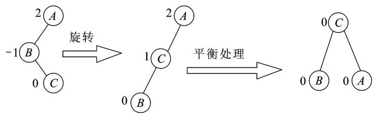
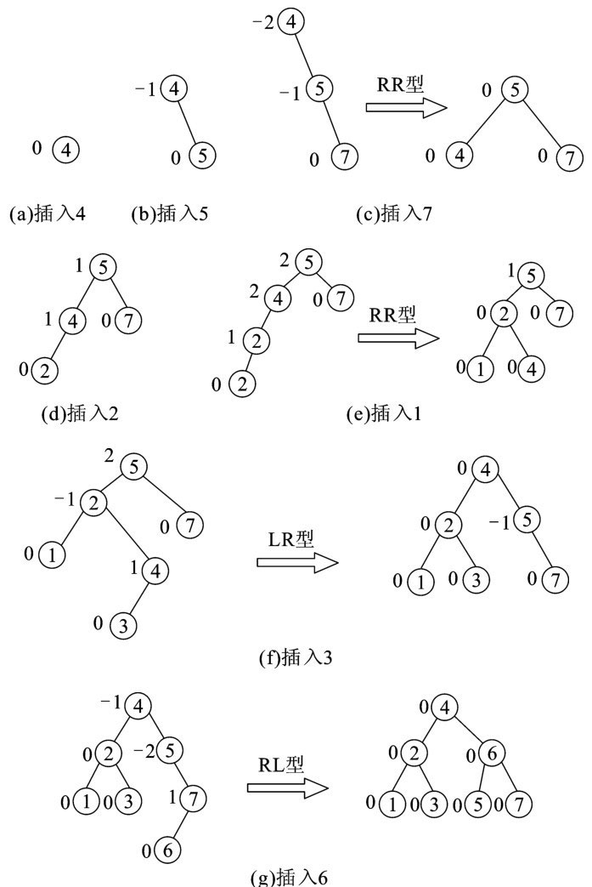

--**来源：《数据结构（韩桂华 程桂卿主编）》**--

# 查找

本章介绍查找的几种基本方法，并对各种算法的`性能`及`时间、空间复杂度`进行分析。

`查找表（search table）`是由同一类型的元素构成的数据集合，对数据元素间的关系未做限定。所谓查找即为在一个含有众多数据元素（或记录）的查找表中按照一定的要求找到特定的元素或记录。

查找表通常可以分为两类：`静态查找`和`动态查找`。`静态查找表（static search table）`仅作为查询和检索操作的查找表，不会改变表中的数据。常见的静态查找方式有`顺序查找`、`折半查找`、`分块查找`等。`动态查找表（dynamic search table）`除了对查找表进行查找操作外，还可能进行插入或删除表中数据元素的操作，即表中数据是动态变化的。动态查找方式包括`树型查找`、`散列查找`等。

## 顺序查找

在介绍顺序查找算法之前，首先介绍几个与查找有关的基本概念。

（1）`关键字（key）：`数据元素（或记录）中某个数据项的值，用它可以标识数据元素（或记录）。

（2）`主关键字（primary key）：`可以唯一地标识一个记录的关键字称为主关键字。

（3）`次关键字（secondary key）：`可以标识若干个记录的关键字称为次关键字。

（4）`查找（searching）：`在查找表中确定是否存在一个数据元素的关键字等于给定值的操作，称为查找（也称为检索）。若表中存在这样一个数据元素（或记录），则查找成功；否则查找失败。

（5）`内查找和外查找：`若整个查找过程全部在`内存`进行，则称为内查找；若在查找过程中还需要访问`外存`，则称为外查找。

（6）`平均查找长度（ASL）：`查找算法的效率，主要是看要查找的值与关键字的比较次数，通常采用平均查找长度来衡量。对一个含有`n`个数据元素的表，当查找成功时有：


其中，`pi`为找到表中第`i`个数据元素的概率，并且有：


`ci`为查找表中第`i`个数据元素所用到的比较次数。不同的查找方法有不同的`ci`。

查找是许多程序中最消耗时间的一部分。因而，一个好的查找方法会大大提高运行速度。

`查找的方法`取决于`查找表的结构`，在表的组织方式中，`顺序表`是最简单的一种，`顺序表`是指线性表的顺序存储结构。`根据元素之间是否有递增（特性）`，查找又分为三种情况：`简单顺序查找`、`二分查找`和`分块有序查找`。`顺序查找`也称为`线性查找`，是最简单的一类查找方法，顺序查找既适用于`线性表`，有适用于`链表`。

顺序查找对数据的特性没有特殊要求，其基本思想为：从表的一端开始，逐个把每条记录的`关键字`与给定值`k`进行比较，若某个记录关键字与给定值k相等，则查找成功，返回找到的记录位置；反之，若已查找到表的另一端，仍为找到关键字值与给定值相等的记录，则查找不成功。

对于有`n`个数据元素的顺序表，给定值`k`与表中第`i`个元素关键字相等，即定位第`i`个记录时，需进行`n-i+1`次关键字比较，即`ci=n-i+1`。在等概率查找的情况下，有


则查找成功时，顺序查找的平均查找长度为：


即查找成功时的比较次数约为表长的一半。若`k`值不在表中，则关键字的比较需要进行`n+1`次才能确定查找失败。算法中的基本工作就是关键字的比较，因此，查找长度的量级也即查找算法的时间复杂度，即`O(n)`。

顺序查找的`缺点`是当`n`很大时，平均查找长度较大，效率低；`优点`是对表中数据元素的存储结构没有要求，无论是用顺序表还是用链表存放记录，也无论记录是否按关键字有序存放均可适用，另外，对于线性链表，只能进行顺序查找。

## 折半查找

如果`查找表已经按关键字递增（减）有序`，则可以采用折半查找的方法。例如，在查辞典类的数据表时，很显然不会采取简单的顺序查找方法，这是因为辞典中的元素已经按照字母的顺序进行了排列。`折半查找`也称为`二分查找`，是一种效率较高的查找方法，但前提是表中元素必须`按关键字有序`（按关键字递增或递减）排列。

**1、折半查找的基本思想**

在按`从小到大`的有序表中，取中间元素作为比较对象，若给定值与中间元素的关键字相等，则查找成功；若给定值小于中间元素的关键字，则在中间元素的左半区继续查找；若给定值大于中间元素的关键字，则在中间元素的右半区继续查找。不断重复上述查找过程，直到查找成功；或者所查找的区域内无数据元素，则查找失败。

**2、折半查找的步骤**

假设用变量`low`和`high`分别表示当前查找区域的首尾下标，该区域的中间元素为`mid=(low+high)/2`。将关键字`k`与该元素进行比较，根据比较的结果分别进行处理。每通过一次关键字的比较，区域的长度就缩小一半，而区域的个数增加。如此不断进行下去，直到找到关键字为`k`的元素或当前的查找区域为空（表示查找失败）为止。

**3、折半查找性能分析**

从折半查找的过程来看，每次查找都是以`表的中点`为比较对象，并以中点将表分割为两个子表，对定位到的子表继续作同样的操作。所以，对表中每个数据元素的查找过程，可用二叉树来描述，可以`把当前查找区间的中间位置上的记录作为二叉树的根`，左子区和右子区中的记录分别作为根的左子树和右子树，由此得到的二叉树称为描述折半查找的`判定树`或`比较树`。

查找表中任一元素的过程，即为在`判定树`中`从根结点到该元素结点的路径上各结点关键字的比较次数`，也即该元素结点在树中的`层次数`。对于`n`个结点的判定树，树高为`k`，则有`2k-1-1<n≤2k-1`，即`k-1<lg(n+1)≤k（lg表示底数为2的对数）`，所以`k=lg(n+1)`。因此，折半查找在查找成功时，所进行的关键字比较次数至多为`lg(n+1)`。

下面以树高为`k`的`满二叉树（n=2k-1）`为例。假设表中每个元素的查找是等概率的，即`pi=1/n`，则树的第`i`层有`2i-1`个结点。折半查找的平均查找长度如下。


所以，二分查找的时间复杂度为`O(lgn)（lg是底为2的对数缩写）`。可见，与顺序查找相比，二叉查找的`优点`是查找速度快，效率高。二分查找的`缺点`如下。

（1）必须按关键字排序，而排序本身也很费时。

（2）只适用于顺序存储结构，不适合线性链表结构，所以其进行插入、删除操作时必须移动大量的结点。

二分查找适用于那种一经建立就很少改动，而又经常需要查找的线性表。对于那些经常需要改动的线性表，可以采用链表存储结构，进行顺序查找。

## 分块查找

`分块查找`又称`索引顺序查找`，是`顺序查找`和`折半查找`的一种结合。

**1、分块查找的基本思想**

将具有`n`个元素的`主表`分成`m`个块（也称为`子表`），`每块内的元素可以无序`，但要求`块与块之间必须有序`，并建立`索引表`。`索引表`包括两个字段：`关键字字段`（存放对应块中的`最大关键字值`）和`指针字段`（存放指向对应`块的首地址`）。

**2、分块查找步骤**

（1）在索引表中检测关键字字段，以确定待查找值`k`所处的分块（可用折半查找）位置。

（2）根据索引表指示的`首地址`，在该块内进行顺序查找。

**3、分块查找性能分析**

`分块查找`由`索引表查找`和`子表查找`两步完成。设`n`个数据元素的查找表分为`m`个子表，并且每个子表均有`t`个元素，则`t=n/m`。这样，分块查找的平均查找长度公式如下。


可见，平均查找长度不仅与表的总长度`n`有关，而且与所分的子表个数`m`有关。对于表长`n`确定的情况下，当`m`取`square_root(n)`时，`ASL=square_root(n)+1`达到最小值。

若用`折半法`查找确定`关键字所在块`时，则`分块查找`成功时的平均查找长度公式如下。


## 树型查找

从前面几个小节的讨论中可以看出，在`线性表的三种查找方法`中，`折半查找法`的查找效率最高，但它只适合于`顺序结构`，不能用于`链表`作存储结构。因此，`当表中元素的插入、删除操作比较频繁时`，为了保持表的有序性，需要移动表中的很多记录，因此会增加许多额外的时间开销，从而抵消`折半查找`在效率方面的优势，也就是说，折半查找仅适合于`静态的查找表`。如果要对`动态的查找表`进行高效率的查找，则要使用`几种特殊的二叉树或树`作为表的组织形式，在这里统称为`树表`，基于这种结果的查找方式称为`树型查找`。本节中将介绍在树表上进行的各种查找和修改操作方法。

#### 二叉排序树

##### 1、二叉排序树的定义

`二叉排序树（binary sort tree）`又称为`二叉查找树`，它既可能是一棵`空树`，也可能是`具有下列性质（以从左到右，从小到大的顺序）的二叉树`之一。

（1）若`左子树`不空，则左子树上所有结点的值均`小于`根结点的值。

（2）若`右子树`不空，则右子树上所有结点的值均`大于`根结点的值。

（3）左、右子树也都是`二叉排序树`。

`二叉排序树`的存储结构定义如下。

```go

// 定义二叉排序树中的结点类型
type BSNode struct {
    key KeyType             // 结点中的关键字
    lChild *BSNode      // 左孩子指针
    rChild *BSNode      // 右孩子指针
}

```

##### 2、二叉排序树的插入

**1、插入原则**

（1） 若二叉树为空，则插入结点为新的根结点。

（2）若二叉树非空且插入结点小于根结点，则在左子树上查找；若插入结点大于根结点，则在右子树上查找，直至某个结点的左、右子树为空为止。

（3）若二叉树非空且插入结点小于根结点时，则作为该结点的左孩子，否则作为该结点的右孩子。

**2、二叉排序树的构造过程**

一个`无序序列`可以通过构造二叉排序树而成为一个`有序序列`，每次插入新结点都是二叉排序树上新的叶子结点，不必移动其他结点，仅需改动某个结点指针，由空变为非空即可。

**3、生成二叉排序树的算法**

```go

// var root *BSNode

func buildLinkedBST(root, in *BSNode) (*BSNode, error) {

    if in == nil {
        return nil, errors.New("invalid input node")
    }

    if root == nil {
        root = in
        return root
    }

    if in.key <= root.key {
        return buildLinkedBST(root.lChild, in)
    } else {
        return buildLinkedBST(root.rChild, in)
    }

}

```

二叉树的生成，是从`空的二叉排序树`开始的。每插入一个记录数据，就调用一次插入算法，将它插入到当前已经生成的二叉排序树中。

###### 3、二叉排序树的删除操作

若要在二叉排序树中删除一个结点，并且删除之后的二叉排序树仍要保持二叉排序树的特性，这就需要考虑以下三种情况进行。

**1、删除的结点是叶子结点**

将与该结点相连接的父结点的指针设为NULL。如下图所示，要删除结点11,则只需将其父结点9的右指针设为NULL即可。


**2、删除的结点只有一棵子树**

将被删除结点的子树向上提升，用子树的根结点取代被删除结点。如下图，要删除结点9,则可以用结点11取代结点9。


**3、删除的结点有两棵子树**

当删除的结点有两棵子树时，可采用以下两种方法。

（1）`中序直接前驱法：`将被删除结点的`中序遍历`的`直接前驱结点`取代`被删除结点`。如下图，要删除结点20,则要将中序直接前驱结点19取代结点20。


（2）`中序直接后继法：`将被删除结点的`中序遍历`的`直接后继结点`取代`被删除结点`。下图中（该配图有偏差），要删除结点20,则要将中序直接后继结点25取代结点20来将19连接到25的左子树，而16的右子树根结点应该是28。


二叉排序树上删除结点的算法具体如下。

```go

func DelBSTNode(root *BSNode, key KeyType) {
    var deleted, deletedParent *BSNode
    // 查找到要删除的结点
    for deleted = root; deleted != nil && deleted.key != key; {
        deletedParent = deleted
        if deleted.key < key {
            deleted = deleted.lChild
        } else {
            deleted = deleted.rChild
        }
    }
    if deleted == nil { return }

    var left, leftParent *BSNode

    // 若左、右子树都不为空
    if deleted.lChild != nil && deleted.rChild != nil {
        leftParent = deleted.rChild
        // 查找右子树最左端结点
        for left = deleted.rChild; left.lChild != nil; {
            left = left.lChild    
        }
        left.lChild = deleted.lChild

        if deletedParent == nil {
            root = leftParent
        } else if deletedParent.lChild == deleted {
            deletedParent.lChild = leftParent
        } else if deletedParent.rChild == deleted {
            deletedParent.rChild = leftParent
        }

    } else {    // 若左、右子树至少有一个为空
        var child *BSNode
        if deleted.lChild != nil {
            child = deleted.lChild
        } else if deleted.rChild != nil {
            child = deleted.rChild
        }
        if deleted == deletedParent.lChild {
            deletedParent.lChild = child
        } else {
            deletedParent.rChild = child
        }

    }

}

```

若被删结点没有左子树，则用其右孩子结点代替它（注意，右孩子结点可以为空）。若被删结点有左子树，则在其左子树中找到中序遍历的最后一个结点r，把被删结点的右子树作为结点r的右子树，并用被删结点的左孩子结点代替被删结点。

注意：如果被删结点是根结点，同样适用上述方法，只不过要对根结点做调整，因为原根结点要被删除，所以把取代根结点的结点作为新的根结点。

**4、二叉排序树查找过程**

由二叉排序树的定义可得二叉排序树的查找过程如下。

步骤（1）：若查找树为空，则查找失败。

步骤（2）：若查找树非空，将给定值k与查找树的根结点关键字进行比较。

步骤（3）：若相等，则查找成功，结束查找过程，否则，转入如下步骤。

- 当给定值k小于根结点关键字，查找将在以左孩子为根的子树上继续进行，转步骤（1）。
- 当给定值k大于根结点关键字，查找将在以右孩子为根的子树上继续进行，转步骤（1）。

以二叉链表作为二叉排序树的存储结构，具体算法描述如下。

```go

// 二叉排序树的结点结构
type BSTNode struct {
    key KeyType         // 数据元素字段
    lChild *BSTNode     // 左指针字段
    rChild *BSTNode     // 右指针字段
}

```

二叉排序树的查找算法主要有以下两种。

（1）二叉排序树查找非递归算法。

```go

func SearchBST(root *BSTNode, key KeyType) *BSTNode {
    // 指针p指向根结点，搜索从根结点开始
    for p := root; p != nil; {
        if p.key == key {
            return p
        } else if p,key < key {
            p = p.lChild
        } else {
            p = p.rChild
        }
    }
    return nil
}

```

（2）二叉排序树查找递归算法。

```go

func SearchBST(cur *BSTNode, key KeyType) *BSTNode {
    if cur == nil { return cur }
    if cur.key == key {
        return cur
    } else if cur.key < key {
        return SearchBST(cur.lChild, key)
    } else {
        return SearchBST(cur.rChild, key)
    }
}

```

**5、二叉排序树的查找分析**

在二叉排序树上查找其关键字等于给定值结点的过程，恰是走了一条从根结点到该结点的路径的过程。由于含有n个结点的二叉树是不唯一的，那么如何来进行查找分析呢？

例如，下图所示两棵二叉排序树中结点的值都相同，但（a）的`深度`为3，而（b）的深度为6。其`等概率平均查找长度`分别为：`ASL<a> = (1*1 + 2*2 + 3*3)/6 = 14/6; ASL<b> = (1*1 + 2*1 + 3*1 + 4*1 + 5*1 + 6*1)/6 = 21/6`。


二叉排序树的平均查找长度和二叉树的形态有关。

（1）`在最好情况下`，二叉排序树在生成过程中，树的形态比较均匀，其最终得到的是一棵形态与`二叉查找的判定树`相似的二叉排序树，如上图（a）。显然，这种情况下`平均查找长度`与`lgn（lg是底为2的对数缩写）`成正比，时间复杂度为`O(lgn)`。

（2）`在最坏情况下`，二叉排序树是通过一个有序表的n个结点依次插入生成的，此时所得的二叉排序树蜕化为一棵`深度`为n的`单支树`，如上图（b）。它的平均查找长度和单链表的顺序查找相同，也是`(n+1)/2`，时间复杂度为`O(n)`。

对均匀的二叉排序树进行插入或删除结点操作后，应对其进行调整，使其依然保持均匀。同时为避免出现最坏情况下的`歪斜树`，应对其进行`平衡处理`，使其称为`平衡二叉树`。

#### 平衡二叉树

##### 1、平衡二叉树的概念

`平衡二叉树（balanced binary tree）`是由阿德尔森-威尔斯（Adelson-Velskii）和兰迪斯（Landis）于1962年首先提出的，所以又称为`AVL树`。

若`一棵二叉树`中`每个结点`的`左、右子树的深度之差`的`绝对值不超过1`，则称这样的二叉树为`平衡二叉树`。将该结点的`左子树深度减去右子树深度的值`，称为该结点的`平衡因子（balance factor）`。也就是说，一棵二叉排序树中，`所有结点的平衡因子只为0、1、-1时`，则该二叉排序树就是一棵`平衡二叉树`，否则就不是一棵平衡二叉树。也可以这样理解：平衡二叉树或者是一棵空树，或者是具有下列性质的二叉排序树。

（1）它的左子树和右子树高度之差的绝对值不超过1。

（2）它的左子树和右子树都是平衡二叉树。

下图中给出了两棵二叉排序树。


每个结点旁边所标注数字是`以该结点为根的树的左子树与右子树高度之差`，这个数字称为`结点的平衡因子`。由平衡二叉树定义可知，所有结点的平衡因子只能取-1、0和1三个值之一。若二叉排序树中存在这样的结点，其平衡因子的绝对值大于1,这棵树就不是平衡二叉树。上图中，（a）不是平衡二叉树，（b）是平衡二叉树。

我们希望`二叉排序树`都是`AVL树`，因为其`深度`和`lgn`是同数量级的，则`平均查找长度`也和`lgn`是同数量级的。

##### 2、非平衡二叉树的平衡处理

若一棵`二叉排序树`是`平衡二叉树`，则插入或删除某个结点后，可能会变成非平衡二叉树，这时，就可以对该二叉树进行`平衡处理`，使其变成一棵平衡二叉树。`处理的原则`应该是：处理`与插入点最近`的而`平衡因子又比1大或比-1小`的结点，既要满足平衡二叉树的要求，又要保持二叉排序树的性质。

下面分四种情况讨论平衡处理的方法。

**1、LL型的处理（单向左型）**

如下图所示，在A的左孩子结点B上插入一个左孩子结点C，使A的平衡因子由1变成了2,成为不平衡的二叉排序树。这时可对其进行平衡处理：将A顺时针旋转，成为B的右子树，而原来B的右子树则变成A的左子树，待插入结点C作为B的左子树。


注：图中结点旁边的数字表示该结点的平衡因子。

**2、LR型的处理（左右型）**

如下图所示，在A的左孩子结点B上插入一个右孩子结点C，使得A的平衡因子由1变成了2,成为不平衡的二叉排序树。这时可对其进行平衡处理：将C变到B与A之间，使之成为`LL型`，然后按`LL型`处理。



**3、RR型的处理（单向右型）**

如下图所示，在A的右孩子结点B上插入一个右孩子结点C，使A的平衡因子由-1变成-2,成为不平衡的二叉排序树。这时可对其进行平衡处理：将A逆时针旋转，成为B的左子树，而原来B的左子树则变成A的右子树，待插入结点C成为B的右子树。


**4、RL型的处理（右左型）**

如下图所示，在A的右孩子结点B上插入一个左孩子结点C，使A的平衡因子由-1变成-2,成为不平衡的二叉排序树。这时可对其进行平衡处理：将C变到A与B之间，使之变为`RR型`，然后按`RR型`处理。


示例：给定一个关键字序列4、5、7、2、1、3、6。试生成一棵平衡二叉树。
【分析】平衡二叉树实际上也是一棵二叉排序树，故可以按建立二叉排序树的思想建立一棵二叉树，在建立的过程中，若遇到不平衡，则进行相应的平衡处理，最后就可以变成一棵平衡二叉树。具体生成过程见下图。



**5、平衡二叉树的查找及性能分析**

`平衡二叉树`本身就是`一棵二叉排序树`，故它的查找与二叉排序树完全相同。但是其查找性能却优于二叉排序树，即不像二叉排序树那样，会出现最坏的时间复杂度`O(n)`，它的时间复杂度与二叉排序树的最好时间复杂度相同，均为`O(lgn)`。

对上例中给定的关键字序列4、5、7、2、1、3、6，试用二叉排序树和平衡二叉树两种方法查找，给出查找关键字6的次数及成功的平均查找长度。
【分析】由于关键字序列的顺序已经确定，故得到的二叉排序树和平衡二叉树都是唯一的。得到的平衡二叉树见上图，得到的二叉排序树见下图。


从上图所示的二叉排序树可知，查找到6需要4次，平均查找长度为：`ASL = (1 + 2 + 2 + 3 + 3 + 3 + 4)/7 = 18/7 ≈ 2.57`。而同样序列的平衡二叉树，查找到6需要2次，平均查找长度为：`ASL = (1 + 2 + 2 + 3 + 3 + 3 + 3)/7 = 17/7 ≈ 2.43`。

由以上示例结果可知，平衡二叉树的查找性能优于二叉排序树。

示例：给定关键字序列11、78、10、1、3、2、4、21,试分别用顺序查找、二分查找、二叉排序树查找、平衡二叉树查找来实现查找，试画出他们对应存储形式（顺序查找的顺序表，二分查找的判定树，二叉排序树查找的二叉排序树及平衡二叉树查找的平衡二叉树），并求出每一种查找的成功平均查找长度。

顺序查找的顺序表（一维数组）如下图。


由上图可以得到顺序查找的成功平均查找长度为：`ASL = (1 + 2 + 3 + 4 + 5 + 6 + 7 + 8)/8 ≈ 4.5`。

二分查找的判定树（中序序列为从小到大排列的有序序列），如下图。


由上图可以得到二分查找的成功平均查找长度为：`ASL = (1 + 2*2 + 3*4 + 4)/8 ≈ 2.625`。

二叉排序树（关键字顺序已确定，该二叉排序树应该是唯一的）如下图所示，平衡二叉树（关键字顺序已确定，该平衡二叉树也应该是唯一的）如下图所示。


由上图（a）可以得到二叉排序树查找的成功平均查找长度为：`ASL = (1 + 2*2 + 3*2 + 4 + 5*2)/8 ≈ 3.125`。
由上图（b）可以得到平衡二叉树的成功平均查找长度为：`ASL = (1 + 2*2 + 3*3 + 4*2) ≈ 2.75`。

#### B树

##### 1、定义

一棵`m阶的B-树`，或者为`空树`，或者为`满足以下特性`的`m叉树`。

（1）所有的`非终端结点`的结构如下。


其中：

- `k<1>`,`k<2>`,...,`k<n>`为`n`个按`从小到大`顺序排列的`关键字`；
- `p<0>`,`p<1>`,`p<2>`,...,`p<n>`为`(n+1)`个指针，用于指向该结点的`(n+1)`棵`子树`，`p<0>`所指向子树中的所有关键字的值均小于`k<1>`，`p<n>`所指向子树中的所有关键字的值均大于`k<n>`，`p<i>(1≤i≤n-1)`所指向子树中的所有关键字的值均大于`k<i>`且小于`k<i+1>`；
- `n(n≤m-1)`为`键`的个数，即子树个数为`(n+1)`。

（2）树中每个结点`至多`有`m`棵子树。

（3）除非`根结点`为叶子结点，否则`至少有两棵子树`。

（4）除`根结点`之外的所有`非终端结点`至少有`「m/2┐`棵子树。

（5）所有叶子结点在同一个层次上，并且`不含有任何信息`。

##### 2、说明

B-树的特点说明有以下几点。

（1）对于非根结点的所有分支结点，`n`的取值范围为：`「m/2┐≤n≤m-1`。

（2）对于根结点，`n`的取值范围为：`1≤n≤m-1`。

（3）对于叶子结点，其子树均为`空树`（即没有子结点），又规定不含有任何信息，所以可以把它看作不在树中的外部结点。

（4）B-树的阶`m`可以事先任意指定，但一旦指定后，就应固定不变。

下图是一棵由11个键生成的的四阶B-树的示意图，该树共有四层，所有叶子结点均在第四层上。


##### 3、B-树的查找

**1、查找方法**

由`B-树`的定义可知，在`B-树`上进行查找的过程与`二叉排序树`的查找类似。根据给定的键`k`，首先在`根结点`的`键的集合`中采用`顺序查找方法（当m较小时）`或`二分查找方法（当m较大时）`进行查找。若有`k=k<i>`，则查找成功，根据相应的指针即可取得记录；否则若`k`在`k<i>`和`k<i+1>`之间，则取指针`p<i>`所指的结点，重复这个查找过程，直到在某结点中查找成功，或者在某结点处出现`p<i>`为空，则查找失败。

**2、性能分析**

可以证明，在含有`n`个关键字的B-树上进行查找时，从`根结点`到待查找关键字，所在路径上涉及的结点数的范围为：


##### 4、B-树的插入

在B-树中插入一个键`k`，不是在树中添加一个叶子结点，而是`首先在最低层的某个非终端结点中添加一个键`。并且要使`插入的结点中的键的个数`小于等于`m-1`，否则将涉及结点的`分裂问题`。

具体的插入方法，入下图所示。


（1）首先要经历从树的`根结点`到`叶子结点`的查找过程。如果键`k`已在树中，则不用再进行其他操作；否则，先找出`插入位置`，然后再进行插入。

（2）对于`叶子结点`处于第`(h+1)`层的树，插入的位置总是在第`h`层。若`结点的键`的个数不超过`(m+1)`，则直接将`键`插入就可以了；否则，需要`把结点分裂为两个`。

（3）分裂的做法是：取一个`新结点`，把`原结点上的键`和`k`按`升序`排序后，从`中间位置`（即`「m/2┐`之处）把键（`不包括中间位置的键`）分为两部分，`左部分`所含键放在`旧结点`中，`右部分`所含键放在`新结点`中，`中间位置的键`连同`新结点的存储位置`插入到`父结点`中。如果`父结点的键`的个数也超过`(m+1)`，则需要继续分裂，再向上插入，反复操作直至`根结点`为止。

##### 5、B-树的删除

B-树的删除过程与插入过程类似，只是稍微复杂一些。应使删除后的结点中的键的个数`≥「m/2┐`，否则，就需要从其左（或右）兄弟结点借调`关键字`，若其左或右兄弟结点均无`关键字`可借（即结点中只有少量的`关键字`），则必须进行结点的`合并`。删除B-树中结点的具体流程如下图。


（1）`被删关键字`所在结点中关键字数目不小于`「m/2┐`，则只需从该结点中删去该关键字`k<i>`和相应指针`p<i>`，树的其他部分不变。

（2）`被删关键字`所在结点中关键字数目等于`「m/2┐-1`，而与该结点相邻的右兄弟（或左兄弟）结点中的关键字数目大于`「m/2┐-1`，则需将其兄弟结点中最小（最大）的关键字上移至双亲结点中，将双亲结点中小于（大于）且紧靠该上移关键字的关键字下移至被删关键字所在结点。

（3）被删关键字所在结点和其相邻的兄弟结点中的关键字数目均小于`「m/2┐-1`。假设该结点有右兄弟，并且右兄弟结点地址由双亲结点中的指针`p<i>`所指，则在删去关键字之后，它所在结点中剩余的关键字和指针加上双亲结点中的关键字`k<i>`一起，合并到`p<i>`所指结点中（若没有右兄弟，则合并到左兄弟结点中）。

（4）假设所删关键字为`非终端结点`中的`k<i>`，则可以用指针`p<i>`所指子树中的最小关键字`y`代替`k<i>`，然后在相应结点中删除`y`。

## 散列查找

以上讨论的查找方法，由于数据元素的存储位置与关键字之间不存在确定的关系，因此在查找时，需要进行一系列对关键字的查找比较，即`查找算法`是建立在比较的基础上的，`查找效率由进行比较一次后缩小的查找范围决定`。理想的情况是依据关键字直接得到其对应的数据元素位置，即要求关键字与数据元素间存在一一对应关系，通过这个关系，能很快地由关键字得到对应的数据元素位置，从而提高查找的效率。

### 散列表与散列函数

`散列表`又称`哈系表`，是除了`顺序表`、`链表`和`索引表`之外的又一种存储数据的存储结构。其基本思想是在记录的存储地址和其关键字之间建立一个确定的对应关系，这样不经过比较，一次存取就能得到所查找的元素。`散列函数`是在记录的`关键字`与`存储地址`之间建立的一种对应关系。该函数是从关键字空间到存储地址空间的一种映像，其函数可写成以下形式。

```

addr(a<i>) = h(k<i>)

```

其中，`a<i>`是表中的一个元素，`addr(a<i>)`是`a<i>`的存储地址，`k<i>`是`a<i>`的关键字。

应用散列函数，由记录的关键字确定记录在表中的地址，并将记录放入此地址中，这样构成的表就是散列表。利用散列函数进行查找的过程就是`散列查找`，又称为`哈希查找`。

例如，有11个元素的关键字分别为`18, 27, 1, 20, 22, 6, 10, 13, 41, 15, 25`。选取关键字与元素位置间的函数为`"h(k)=k%11"`；通过这个函数对11个元素建立的查找表如下图所示。


查找时，对给定值`k`通过这个函数计算出地址，再将`k`与该地址单元中元素的关键字进行比较，若相等则查找成功。

对于`n`个数据元素的集合，总能找到关键字与存储地址一一对应的函数。若最大关键字为`m`，则可以分配`m`个数据元素存放单元，选取函数`h(k)=k`即可，但这样会造成存储空间的浪费，甚至不可能分配这么大的存储空间。通常`关键字的集合`比`哈希地址的集合`大得多，因此经过`哈希函数`变换后，`可能将不同的关键字映射到同一个哈希地址上`，这种现象称为`冲突（collision）`。冲突不可能避免，只能尽可能减少。所以，哈希方法需要解决以下两个问题。

（1）构造好的哈希函数，可以采用以下两种方法。

- 所选函数应尽可能简单，以便提高转换速度。
- 所选函数对关键字所计算出的地址，应在哈希地址集合中，并且应大致均匀分布，以减少空间的浪费。

（2）制定解决冲突的方案。


### 散列函数的构造方法

根据`关键字的结构和分布`不同，可构造出许多不同的`散列函数`，这里主要介绍`几种常用的整数类型关键字的散列函数`的构造方法。

**1、直接定址法**

直接定址法构造散列函数如下。

```

h(k) = a*k + b

```

其中，`a`、`b`为常数。

直接定址法即取关键字的某个线性函数值为哈希地址，这类函数是一一对应函数，不会产生冲突，但要求地址集合与关键字集合的大小相同，因此，对于较大的关键字集合不适用。

例：关键字集合为`{20, 30, 50, 60, 80, 90}`，选取散列函数为`h(k)=k/10`，则具体存放如下图所示。


**2、除留余数法**

除留余数法构造散列函数如下。

```

h(k) = k % p

```

其中，`p`是一个整数。

除留余数法即取关键字除以`p`的余数作为哈希地址。使用除留余数法，选取合适的`p`很重要，若哈系表的表长为`m`，则要求`p≤m`，并且接近`m`或等于`m`。`p`一般选取`质数`，也可以是`不包含小于20质因子的合数`。

**3、平方取中法**

平方取中法即`对关键字平方后，按哈系表大小，取中间的若干位作为哈希地址`的方法。

例：若存储区域可存`100`个记录，关键字为`4731`，则`4731*4731=22382361`取地址`82`；若存储区域可存`10000`个记录，关键字为`14625`，则`14625*14625=213890625`取地址`8906`。

**4、折叠法**

折叠法将关键字`分割成位数相同的几部分`，然后`取这几部分的叠加和（舍去进位）`作为散列地址。

折叠法包括`移位叠加`和`间界叠加`两种。

（1）移位叠加：将分割后的每一部分的最低位对齐，然后相加。

（2）间界叠加：从一端向另一端沿分割界来回折叠，然后对齐相加。

折叠法适用于关键字位数很多，并且每一位上的数字分布大致均匀的情况。

例：关键字为`0442205864`，哈希地址位数为`4`，用折叠法求散列地址。使用`意为叠加法`求其散列地址如下图一所示，使用`间界叠加法`求其散列地址如下图二所示。

（图一）

（图二）

**5、数字分析法**

数字分析法通过对关键字进行分析，取关键字的若干位或其组合作为散列地址。

数字分析法`适用于关键字位数比哈希地址位数大`，并且可能出现的关键字事先知道的情况。

例：有80个记录，关键字为8位十进制数，散列地址为2位十进制数。
分析：例中记录如下图所示。其中，第①位均是8,第②位均是1,第③位也只有3、4,第⑧位只有2、7、5,因此这几位不能用，余下四位数字分布近乎随机，可作为哈希地址选用。故可取④⑤⑥⑦位中的任意两位或两位与另两位的叠加作为哈希地址。


### 冲突的处理方法

#### 1、开发定址法

所谓开放定址法，即是由关键字得到的散列地址一旦产生了冲突，则形成一个探查序列，沿此序列逐个地址探查，直到找到一个空位置（开发的地址），将发生的冲突记录到该地址中。也就是说，该地址若已经存放了数据元素，就去寻找下一个空的散列地址，只要散列表足够大，空的散列地址总能找到，并将数据元素存入。即：

```

h<i> = (h(k) + d<i>) % m; i=1,2,...,k(k≤m-1)

```

其中，`h(k)`--散列函数；`m`--散列表表长；`d<i>`--增量序列。

开放地址法处理冲突时主要分`线性探测法`、`二次探测法`和`双散列函数探测法`，下面分别进行介绍。

**1、线性探测法**

线性探测法的公式如下。

```

h<i> = (h(k) + d<i>) % m (1≤i<m)

```

其中：`h(k)`为散列函数；`m`为散列表长度；`d<i>=i (i=1,2,3,...,m-1)`。

例：
