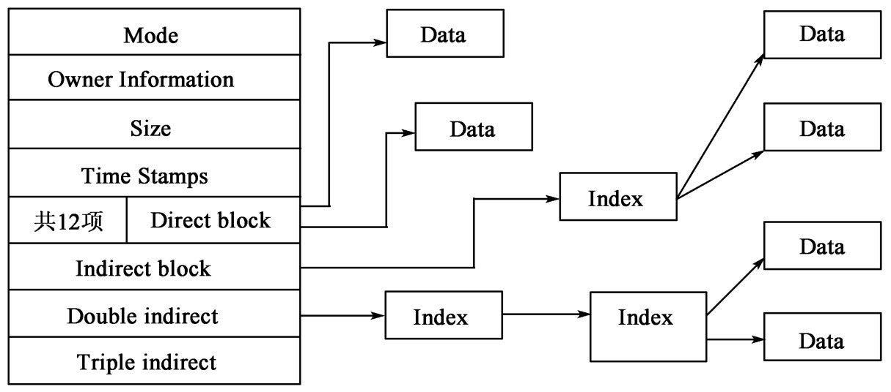
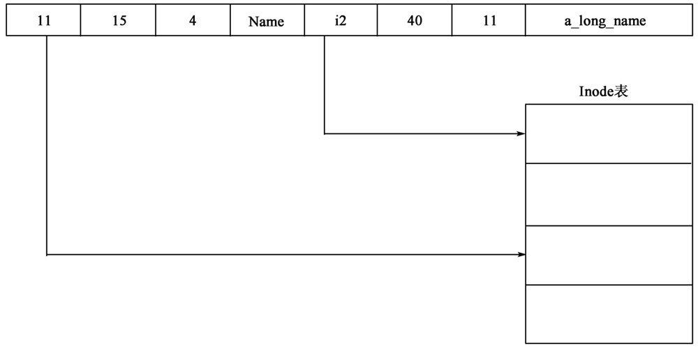
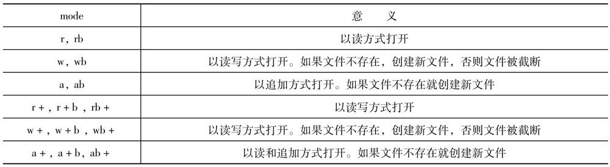
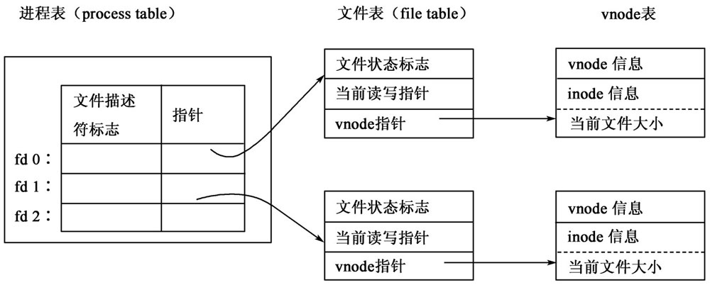
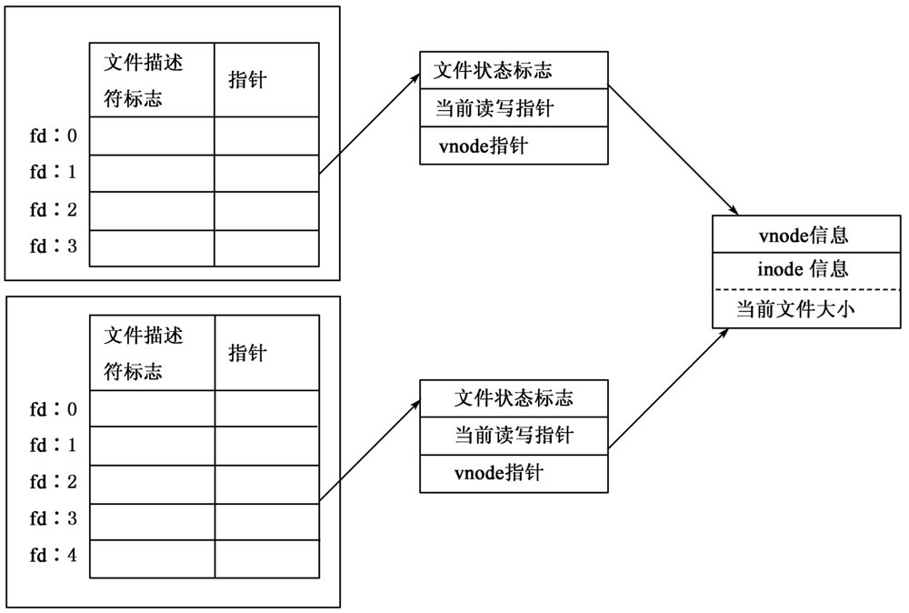
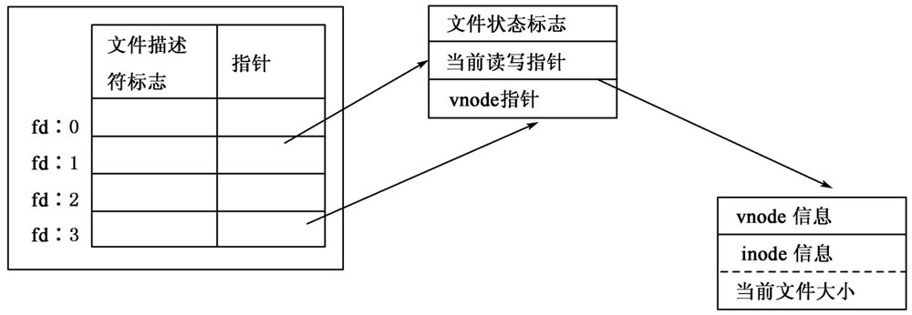
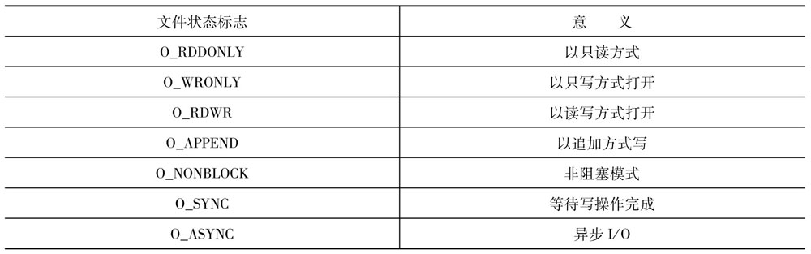
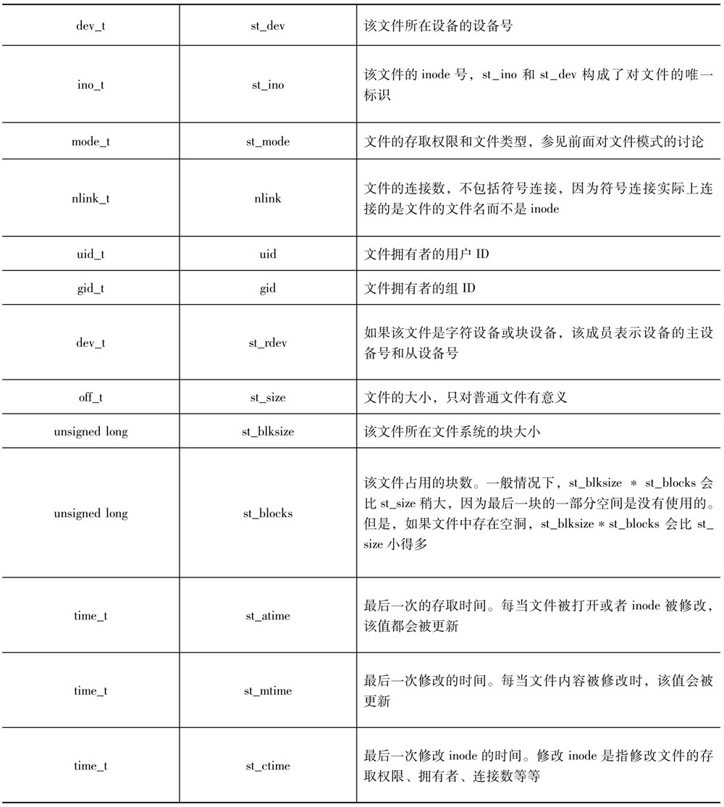
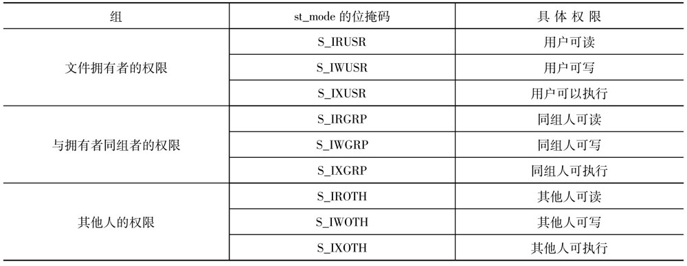

# 文件系统


## 文件系统简介

`文件`是Linux系统中最经常遇到的一个`抽象概念`。内存、磁盘、设备、IPC（Inter-Process Communication，进程间通信）等资源都被抽象成文件。通过提供这样一个统一的抽象接口，Linux大大减少了程序员需要掌握的编程接口。


### 概述

Linux中的文件可以描述以下这些资源：

**普通文件：** `普通文件`也就是大多数用户所认为的一般意义上的文件。`普通文件可以增长到任意大小并且可以随机存取`。Linux文件是`面向字节流的，应用程序必须自己处理数据的逻辑边界`。

**管道：** `管道`是Linux中最简单的`进程间通信机制`。一个进程管道中写入数据而另一个则从管道中读出数据。Shell就是通过管道实现I/O重定向的。很多程序使用管道向它们的子进程发送数据。管道又分两种：`无名管道`和`有名管道`。`无名管道`在需要时创建，并且一旦管道两端被关闭，该管道就不再存在。之所以称为无名管道是因为它们并不存在于文件系统中，即它们没有名字。由于在Linux的`/proc`文件系统中包含了系统中当前打开的每一个文件，`无名管道`是可以在`/proc`文件系统中看到的。不过它们仍然没有永久的文件名：一旦使用它们的进程结束，它们就消失了。`有名管道`有文件名，这样两个没有共享`文件描述符`的进程就可以通过`管道的文件名`来打开它，进而进行通信。由于管道中的数据是按照先进先出的顺序使用的，因此`管道`也称为`FIFO`。

**目录：** `目录`是由文件列表组成的`特殊文件`。老式的Unix实现中允许以读写普通文件的方式读写目录。为了提供更好的抽象，Linux提供了一套新的系统调用来实现目录存取。不过，`目录的打开和关闭操作和普通文件还是一样的`。

**设备：** 绝大多数物理设备都由文件来代表。有两种类型的设备文件：`块设备`和`字符设备`。`块设备`文件代表那些`不能`一次只读一个字节的硬件设备。这种设备`只能`以块为单位进行读写。在Linux中，内核对`块设备`有特殊的支持使得它们可以包含文件系统。`磁盘驱动器`，包括`CD-ROM`和`内存虚拟磁盘（RAM disk）`，是最常见的`块设备`。`字符设备`可以每次读取一个字符。`内核对这种设备不提供高速缓冲`。`调整解调器`、`终端`、`打印机`、`声卡`和`鼠标`都是字符设备。按照习惯，设备文件都存放在`/dev`目录下以方便用户进程使用。

**符号连接：** `符号连接`是一种`特殊文件`：文件内容是另一个文件的路径。当打开一个符号连接文件时，系统会读出其内容进而打开其引用的文件而不是它自身。

**套接字：** `套接字`和`管道`一样提供了`进程间通信的手段`。`它比管道更灵活`，可以`支持运行于不同机器上的进程之间的通信`。

在很多操作系统上，`文件`和`文件名`是一一对应的。每个文件有一个文件名，而每个文件名都映射到一个文件上。`Linux将这两个概念区分开来`，从而提供了更多的灵活性。

在Linux中`文件`的唯一标识是它的`inode`。文件的`inode`包含了文件的所有信息：`文件的存取权限`、`当前大小`、`拥有的文件名数量`等等。有两种类型的`inode`：`核心inode`和`盘上inode`，一般只关心`核心inode`。系统中每一个打开的文件都有一个`核心inode`。内核将`核心inode`保存在内核中，所有文件系统的`核心inode`都是一样的。文件系统中的每一个文件都有一个`盘上inode`，它们的结构依赖于其所在的文件系统。当一个文件被进程打开时，它的`盘上inode`就被读入内存并被转化为`核心inode`。当`核心inode`被修改时，它又被转化回`盘上inode`并写回文件系统。

`盘上inode`和`核心inode`包含的信息并不一致。例如：只有`核心inode`才会跟踪系统中使用该`inode`的进程。

由于`内核负责同步`这两种`inode`，大多数系统调用最后对两者都进行了更新。有一些文件（例如：`无名管道`）没有文件名（也就没有`盘上inode`），只有`核心inode`会被更新。

可以把`文件名`看成是指向`盘上inode`的指针。`盘上inode`包含了指向该`inode`的`文件名的数目`，即`连接数`。当删除一个文件时，系统首先将`连接数`减去`1`.如果`连接数`变成`0`并且当前没有进程打开了该文件，只有当最后一个使用它的进程结束后，文件才会被真正地删除。也就是说，在Linux中可以让多个进程存取一个在文件系统中不存在的文件（如：`无名管道`）；可以在一个进程中创建一个文件，删除它，然后在另一个进程中继续对它进行读写操作。


### 文件模式

每一个`文件`都有一个`文件类型`以及`存取权限`。这两个属性组合成一个`16`位的值就叫做`文件模式`。

文件模式的`低12位`代表其`存取权限`和`权限修饰符`。`权限修饰符`有很多作用，最重要的一个就是`允许文件被执行时改变其有效的用户ID和组ID`。

`文件模式`通常表示为一个`6`位的八进制数。`最低三位`是`存取权限`，紧接着的一位是`权限修饰符`，`最高两位`是`文件类型`。例如：如果一个文件的模式为`0041777`，那么它的`类型`为`04`，`权限修饰符`为`1`，`存取权限`为`0777`；而模式`0100755`表示`类型`为`010`，无`权限修饰符`，`存取权限`为`0755`。


#### 文件存取权限

上面提到`文件模式`中有`八进制位`表示文件的`存取权限`。它们的每一位都代表了一类用户的存取权限。从左到右，第一位代表文件所有者的权限；第二位代表同组者的权限；第三位代表其他人的权限。每一个`八进制位`都可以表示成`3个二进制位`。这三个二进制位每个又代表一种权限：最低位代表`执行权限`，最高位是`读权限`，中间一位是`写权限`。例如上面例子中的存取权限`0755`的真是意义就是：文件所有者--读、写、执行；同组者--读，执行；其他人--读、执行。

`目录`也有`存取权限`，只是具体含义略有不同。`目录`的`读权限`允许进程列出目录的内容，`写权限`允许在目录中创建和删除文件，`执行权限`允许进程进入该目录，即存取目录中的文件。


#### 权限修饰符

`权限修饰符`代表了`setuid`、`setgid`和`sticky`位。如果可执行程序设置了`setuid`位，那么当该程序执行时，进程的有效用户ID就变成了程序所有者的用户ID。`setuid`位对非可执行程序没有意义。如果可执行程序设置了`setgid`位，那么当改程序执行时，进程的有效组ID就变成了程序所有者的组ID。在Linux下，脚本文件的`setuid`和`setgid`位会被忽略，因为它们会带来一些安全上的漏洞。

`setuid`位`对目录没有意义`。如果`目录`被设置了`setgid`位，在该目录下创建的`新文件的组ID`将被设置成该目录的组ID。

在老式的Unix系统中，程序只有被完全调入内存中以后才可以开始运行。这样，大型应用程序的启动时间就比较长，为此引入了`sticky`位：如果一个程序的`sticky`位被设置，操作系统会在程序结束后尽可能地将程序保留在内存中，从而降低程序的启动时间。现代的Unix系统包括Linux都使用请求调入的方法来运行程序：程序是在需要的时候分片调入内存的。这样对普通文件而言，`sticky`位就毫无用处了。

但是对于目录而言，`sticky`位还是有用的。通常情况下，对目录有`写权限`的用户可以随意地删除目录中的文件，即使该文件不属他所有。而如果一个目录的`sticky`位被设置，只有文件的所有者和超级用户才能够删除该文件。`sticky`对于那些大量用户都可写的目录，例如：`/tmp`目录，是相当有用的。

`Go语言`的`syscall`包里定义的`存取权限`的符号常量：

```go

const (
    ... ...

    S_IREAD                          = 0x100
    S_IRGRP                          = 0x20     // 同组者可以读
    S_IROTH                          = 0x4      // 其他人可以读
    S_IRUSR                          = 0x100    // 所有者可以读
    S_IRWXG                          = 0x38     // 同组者可以读、写、执行
    S_IRWXO                          = 0x7      // 其他人可以读、写、执行
    S_IRWXU                          = 0x1c0    // 所有者可以读、写、执行
    S_ISGID                          = 0x400    // `setgid`位被设置
    S_ISUID                          = 0x800    // `setuid`位被设置
    S_ISVTX                          = 0x200    // `sticky`位被设置
    S_IWGRP                          = 0x10     // 同组者可以写
    S_IWOTH                          = 0x2      // 其他人可以写
    S_IWRITE                         = 0x80     
    S_IWUSR                          = 0x80     // 所有者可以写
    S_IXGRP                          = 0x8      // 同组者可以执行
    S_IXOTH                          = 0x1      // 其他人可以执行
    S_IXUSR                          = 0x40     // 所有者可以执行

    ... ...
)

```


#### 文件类型

`文件模式`的高`4`位指定了文件的类型。

`Go语言`的`syscall`包里定义了`文件类型`的相关常量：

```go

const (
    ... ...

    S_BLKSIZE                        = 0x200
    S_IEXEC                          = 0x40
    S_IFBLK                          = 0x6000   // 文件是`块设备`
    S_IFCHR                          = 0x2000   // 文件是`字符设备`
    S_IFDIR                          = 0x4000   // 文件是目录
    S_IFIFO                          = 0x1000   // 文件是管道
    S_IFLNK                          = 0xa000   // 文件是符号连接
    S_IFMT                           = 0xf000   // 该常量是一个屏蔽码，将它和文件模式进行`按位与`后，得到的值是下面的常量之一
    S_IFREG                          = 0x8000   // 文件是普通文件
    S_IFSOCK                         = 0xc000   // 文件是套接字

    ... ...
)

```


### 进程的`umask`

每一个进程都有一个`umask`，它代表了在`新创建的文件`中`需要去掉的`存取权限。进程的`umask`影响`open()`、`creat()`、`mkond()`和`mkdir()`系统调用。`被创建文件的实际存取权限`是在系统调用中指定的权限（`mode`）和`umask`共同作用的结果：`mode &~ umask`。

`Go语言`的`syscall`包里提供了`Umask()`函数。

```go

func Umask(mask int) (oldmask int) {
    ... ...
}

```

该函数会将进程的`umask`设置为传入的`mask`值，然后返回`oldmask`值。只有`读`、`写`和`执行权限`受到影响，`setuid`、`setgid`和`sticky`位是不受影响的。Shell中`umask命令`允许用户为shell的它的子进程设置`umask`。


## Linux文件系统简介

Linux的最重要特征之一就是`支持多种文件系统`，这样它更加灵活并可以和许多其他种类操作系统共存。Linux支持多种文件系统，如：`ext`、`ext2`、`ext3`、`ext4`、`ReiserFS`、`xia`、`minix`、`umsdos`、`msdos`、`vfat`、`proc`、`smb`、`ncp`、`iso9660`、`sysv`、`hpfs`、`affs`以及`ufs`。毫无疑问，今后支持的文件系统类型还会更多。

Linux和Unix一样并`不`使用`设备标识符`（如`设备号`或`驱动器名称`）来访问独立文件系统，而是通过将`整个文件系统`表示成`单一的层次树`来访问它。Linux每安装（`mount`）一个文件系统时都会将其加入到文件系统层次树中。不管是文件系统属于什么类型，都被连接到一个目录上，且此文件系统上的文件将`取代`此目录中已存在的文件。这个目录被称为`安装点`或者`安装目录`。`当卸载此文件系统时`这个安装目录中原有的文件将再次出现。

当磁盘初始化时（使用`fdisk`），磁盘中将添加一个描述物理磁盘逻辑构成的`分区结构`。每个分区可以拥有一个独立文件系统，如：EXT3。文件系统将文件组织成包含`目录`、`连接`等存在于物理块设备中的`逻辑`层次结构。包含文件系统的设备叫`块设备`。Linux文件系统认为这些`块设备`是简单的`线性块集合`，它并不关心或理解底层的物理磁盘结构。这个工作由`块设备驱动程序`来完成，由它将`对某个特定块的请求`映射到正确的设备上去；此块所在硬盘的对应磁道、扇区及柱面数都被保存起来。不管哪个设备持有这个块、文件系统都使用相同的方式来寻找并操纵此块。`Linux文件系统`不管（至少对系统用户来说）系统中有哪些不同的`控制器`控制着哪些不同的`物理介质`，也不管这些`物理介质`上有几个不同的`文件系统`。`文件系统`甚至还可以不在`本地系统`，而在通过网络连接的`远程磁盘`上。

第一个专门为Linux设计的文件系统被称为`扩展文件系统（Extended File System）或EXT`，是第一个使用`虚拟文件系统（VFS）`交换的文件系统，支持最大`2GB`的文件系统。它出现于1992年4月，虽然解决了一些问题但性能依旧不好。1993年`扩展文件系统第二版或EXT2`开始出现并添加到Linux中，它借鉴同期主流文件系统的优秀特性，可支持最大`2TB`的文件系统。重大的改进是`第三版扩展文件系统EXT3`，于2001年11月引入。`增加了日志概念`，以在系统突然停止时提高文件系统的可靠性，支持从使用`EXT2`的系统进行就地升级。2006年10月10日`EXT4`正式发布，在性能、伸缩性和可靠性方面进行了大量改进，支持`1EB`的文件系统。


### EXT2文件系统的结构

像很多文件系统一样，`EXT2`的文件被保存在大小相同的`数据块`中。这些`数据块的长度`在创建`EXT2`文件系统时设置。每个`文件`总是`占用整数个数据块`。这样，如果块大小为1024字节而文件大小为1025字节，该文件就将占据两个1024字节大小的数据块。平均来说，每个文件将浪费半个数据块的磁盘空间。数据块越小，磁盘的空间利用率就越高，浪费越少，但是内核需要进行的I/O操作的次数增多，运行速度会有所降低；而如果数据块变大，内核的运行速度倒是提高了，但是磁盘的空间利用率又降低了。因此，通常需要在`运行速度`和`磁盘空间利用`上进行折中。而大多数操作系统，包括Linux在内，为了提高速度而选择相对较低的磁盘空间利用率。同时，并不是磁盘中的每一块都包含数据，其中有些块被用来包含描述此`文件系统的结构`信息。`EXT2`通过一个`inode`结构来描述文件系统中的文件。`inode`结构描述文件中`数据占据哪些数据块`以及`文件的存取权限`、`文件修改时间`以及`文件类型`。`EXT2文件系统`中的每个文件用一个`inode`来表示，并且每个`inode`有唯一的标号。文件系统中所有的`inode`都被保存在`inode表`中。`EXT2目录`仅是一个包含`指向其目录入口指针`的`特殊文件`（也用`inode`表示）。


上图是`EXT2文件系统`的总体结构。对于`文件系统`而言，`文件`仅是一系列可读写的`数据块`。`文件系统`并不需要了解数据块应该放置到物理介质上什么位置，这些都是`设备驱动`的任务。无论何时只要`文件系统`需要从包含它的`块设备`中读取信息或数据，它将`请求`底层的`设备驱动`读取一个`基本块`大小`整数倍`的`数据块`。`EXT2`文件系统将它所使用的`逻辑分区`划分成`数据块组`。每个`数据块组`将那些对`文件系统完整性`最重要的信息复制出来。为了在`文件系统`崩溃时能够对文件系统进行修复，这些复制非常有必要。


### 超级块

`超级块`中包含了描述文件系统的一些重要信息。文件系统管理器利用它们来使用和维护文件系统。通常`安装文件系统时`只读取`数据块组0`中的`超级块`，但是为了防止文件系统被破坏，每个`数据块组`都包含了复制拷贝。`超级块`包含如下信息：

（1）`Magic Number`：文件系统安装软件用来检验是否是一个真正的`EXT2文件系统超级块`。当前`EXT2`版本中为`0xEF53`。

（2）`Revision Level`：这个`主从修订版本号`让安装代码能判断此文件系统是否支持只存在某个特定版本文件系统中的属性。同时它还是`特性兼容标识`以帮助安装代码判断`此文件系统的新特性`是否可以安全使用。

（3）`Maximum Mount Count`：最大安装数。

（4）`Mount Count`：系统使用它们来决定是否应对`此文件系统`进行全面检查。每次文件系统安装时此安装记数将递增，当它等于最大安装记数时系统将显示一条警告信息`maximal mount count reached, running e2fsck is recommended`。它的意思是：已经到大最大安装记数，建议运行`e2fsck`全面检查文件系统。

（5）`Block Group Number`：数据块组的数目。

（6）`Block Size`：文件系统块大小，以字节为单位。

（7）`Blocks per Group`：每个组中块数目。当文件系统创建时此块大小被固定下来。

（8）`Free Blocks`：文件系统中空闲块数。

（9）`Free Inodes`：文件系统中空闲`inode`数。

（10）`First Inode`：文件系统中第一个`inode号`。`EXT2根文件系统`中第一个`inode`将是指`向根目录的目录入口`。


### 组描述符

每个`数据块组`都拥有一个描述它的结构。像`超级块`一样，所有`数据块组`中的`组描述符`被复制到每个`数据块组`中以防止文件系统崩溃。每个`组描述符`包含一下信息：

（1）`Blocks Bitmap`：对应此`数据块组`的`块分配位图的块号`。在`块`分配和回收时使用。

（2）`Inode Bitmap`：对应此`数据块组`的`inode`分配`位图的块号`。在`inode`分配和回收时使用。

（3）`Inode Table`：对应`数据块组`的`inode表`的`起始块号`。

`组描述符`放置在一起形成了`组描述符表`。每个`数据块组`在`超级块拷贝`后包含整个`组描述符表`。`EXT2文件系统`仅使用第一个拷贝（在`数据块组0`中）。`其他拷贝`都像`超级块拷贝`一样用来防止`主拷贝`被破坏。


### inode

文件系统中的每个文件与目录由唯一的`inode`来描述。每个`数据组块`的`EXT2 inode`被保存在`inode表`中，同时还有一个`位图`被系统用来跟踪已分配和未分配的`inode`。下图给出了`EXT2 inode`的格式：



`EXT2 inode`包含一下几个`域`：
（1）`Mode`：它包含两类信息；`文件类型`以及`用户使用权限`。`EXT2`中的`inode`可以表示一个`文件`、`目录`、`符号连接`、`块设备`、`字符设备`或`FIFO`。

（2）`Owner Information`：表示此文件或目录`所有者`的用户和`组标识符`。文件系统根据它可以进行正确的存取控制。

（3）`Size`：文件长度、`以字节为单位`。

（4）`Timestamps`：文件创建的时间，最后一次存取文件的时间以及最后一次修改`inode`的时间。

（5）`Datablocks`：指向文件占用的数据块。`前12个指针`直接指向文件占用的`数据块`，`最后三个指针`包含多级`间接指针`。例如：`两级间接指针`指向一`数据块`，而`数据块`中的数据又是文件占用的`数据块的块号`。这意味着`访问文件的尺寸小于或等于12个数据块的文件`将比`访问大文件`快得多。

`inode`还可以描述`特殊设备文件`。`虽然它们不是真正的文件，但可以通过它们访问设备`。所有那些位于`/dev`中的`设备文件`可用来存取Linux设备。例如：`mount程序`可把`设备文件`作为参数。


### 目录结构

在`EXT2文件系统`中`目录`是用来创建和包含`文件系统`中`文件存取路径`的`特殊文件`。下图给出了`目录项`的结构。



`目录文件`是一组`目录项`的`链表`。每个`目录项`包含以下信息：

（1）`inode`：对应每个`目录入口`的`inode`。它被用来`索引`储存在`数据块组`的`inode表`中的`inode数组`。上面目录项的结构图`name文件`的`目录入口`中有一个对`inode号`11的引用。

（2）`name length`：目录项的长度，以`字节`为单位。

（3）`name`：目录名。

每个目录的`前两个`入口总是`.`和`..`，它们分别表示`当前目录`和`父目录`。


### EXT2磁盘空间的分配策略

`文件系统普遍存在的一个问题`是`文件碎片`。一个文件所包含的`数据块`遍布整个文件系统会使得对文件数据的顺序访问越来越慢。`EXT2文件系统`试图通过分配一个和当前文件数据块在物理位置上临接或者至少位于同一个`数据块组`中的`新块`来解决这个问题。只有在这种`分配策略`失败时才在其他`数据块组`中分配空间。

`当进程准备写某文件时`，Linux文件系统首先检查数据`是否已经超出`了文件`最后一个`被分配的`数据块`。如果是，则`必须`为此文件`分配一个新数据块`。进程将一直等待到此分配完成，然后才将其余数据写入此文件。`EXT2块分配过程`所做的`第一件事`是对此`文件系统的EXT2超级块`加锁。这是因为`块`分配和回收将导致`超级块`中某些`域`的改变，Linux文件系统`不能`在`同一时刻`为多个进程进行此类服务。如果另外一个进程需要分配更多的`数据块`时它`必须`等到此进程完成分配操作为止。在`超级块`上等待的进程将被挂起直到`超级块`的控制权被其当前使用者释放。对`超级块`的`访问遵循先来先服务的原则`，一旦进程取得了`超级块`的控制则它必须保持到操作结束为止。如果系统中`空闲块`不多则此分配将失败，进程会释放对文件系统超级块的控制。

如果`EXT2文件系统`支持预先分配数据块，则可以直接得到一个`预先分配的数据块`。`预先分配块`实际上是在`已分配块的位图`中`保留的数据块`。如果没有使用预先分配快或预先分配的数据块已经使用完了，则EXT2文件系统`必须`分配一个新数据块。它首先检查此文件最后一个数据块后的数据块是否空闲，这是让其顺序访问最快的分配策略。如果此数据块已被使用，它会在`理想块周围64个块`中选择一个。这个块虽然不是最理想但和此文件的其他数据块仍位于同一个数据块组中。

如果仍然找不到，进程将在所有其他`数据块组`中搜寻，直到找到一`空闲块`。块分配过程将在`某个数据块组`中寻找一个由`8个空闲数据块`组成的`簇`。`如果找不到这么多个连续的空闲块，它将取更小的尺寸`。如果使用了`块预先分配`，它将记录下预先分配的数据块以供下次使用。

找到`空闲块`后，`块分配程序`将更新`数据块组中的位图`并将`超级块`标记为`dirty`以表示它已被更新，最后`解锁`超级块。如果有进程在`等待`这个超级块，则`队列`中的第一个进程将得到运行并取得对超级块的独占控制。


### EXT3文件系统的改进

`EXT3`是一个日志文件系统，常用于Linux操作系统。它是很多Linux发行版的默认文件系统。虽然它的性能（速度）不如它的竞争对手，例如：`JFS2`、`ReiserFS`和`XFS`，但它具有重要的优势，那就是它允许在适当的时候从流行的`EXT2文件系统`升级，而无需备份和恢复数据；除此之外，它还具有比`ReiserFS`和`XFS`更低的CPU使用率。

`EXT3文件系统`增加的超越其前代的包括：

（1）`日志`；

（2）为目录`跨越多个块`提供`基于树`的`目录索引`；

（3）在线系统增长。

如果没有这些，`EXT3文件系统`也同时是个有效的`EXT2文件系统`。这样，经过良好测试的、成熟的文件系统工具，可以无需大的变动，就应用于`EXT3文件系统`。`EXT2`和`EXT3`文件系统共享相同的工具集，带有`fsck工具`的`e2fsprogs`。这种紧密的联系也将`两种文件系统之间进行转换`变得非常容易。

随着Linux系统在核心工业领域的普及，如何应对在系统突然停止时提高文件系统的可靠性（如断电故障后的快速恢复等），就成为改进要点。`EXT3文件系统`包括`3个级别的日志`：

（1）`日记`：（慢、但风险小）`元数据`和`文件内容`都在提交到`主文件系统`前写入。这样将提到稳定性但性能上有所损失，因为所有的数据都要写入`2次`。如果没有在`/etc/fstab`中加上这个选项，修改中的档案遇上`kernel panic`或`突然断电`的时候就可能发生损毁的情况，`当然，这还是得看软件是怎么写入档案的`。

（2）`顺序`：（中速，中等风险）`顺序`和`回写`类似，但在对应的`元数据`标记为`提交`前，强制写入文件内容。这是很多Linux发行版默认的方式。

（3）`回写`：（块，但风险最大；在某种感觉上和`EXT2`相当）这边会写入日志的只有`元数据`而已，`档案的内容`并不会跟着写入日志里面。这样的做法让整个效率快了不少，不过也同样造成了档案写入时不按顺序的结果。举例来说，档案在附加变大的同时发生了`crash`的情况，就可能造成下次挂载时档案后面就附加了一堆垃圾数据的情况。

尽管`EXT3`缺少一些当代文件系统的特点，比如`动态的inode`、`树状的资源储放结构`等等，都是被视作`EXT3`的缺点之一；不过在这些特点之外，`EXT3`在`文件系统恢复`上面就有了很好的表现。跟`树状结构的文件系统`相比，在`EXT3`上面`元数据`是放在固定的位置，而且在写入的同时会重复写入的一些资料让`EXT2/3`在面临资料损毁的情况下还有挽回的机会。

`EXT3`在写入日志时，并不做`校验和`。如果`barrier=1`没有作为加载参数（在文件`/etc/fstab`），并且如果`硬件`在`无次序地写入缓存`，在崩溃时会严重损坏文件系统（该选项在大多数流行的Linux发行版中都没有被启用，所以大多数发行版的处境可能都很危险）。

考虑下面的情况：如果`硬盘无序地做写入操作`（因为现在的`硬盘`都使用`缓存机制`以便`摊销写入速度`），那么有可能出现在写入处理的提交块时，其他的相关的块已经被写入了。如果电源掉电、内核panic出现在其他块写入前，系统将必须重启。在重启后，文件系统将按照正常方式`重演日志`，并且重演`"优胜者"`（具有提交块的处理，包括上面无效的但被标记为有效的提交块的处理）。于是，上面没有完成的磁盘写入将处理，但使用已经损坏的日志数据。文件系统在`重演日志`的时候，将错误的使用已经损坏的数据覆盖正常数据。如果使用`校验和`（如果`假的优胜者`处理被标记为`互斥的校验和`），文件系统会处理的更好，并且不会在磁盘上重演错误的数据。截止2007年6月24日，已经有补丁来修复这个问题。


### EXT4文件系统

`EXT4`从竞争对手那里借鉴了许多有用的概念。例如：在`JFS`中已经实现了使用`区段（extent）`来管理块。另一个与`块管理`相关的特性（`延迟分配`）已经在`XFS`和`Sun Microsystems`的`ZFS`中实现。

在`EXT4文件系统中`，有多种改进和创建。这些改进包括`新特性`（新功能）、`伸缩性`（打破当前文件系统的限制）和`可靠性`（应对故障），当然也包括`性能的改善`。


#### 功能

`EXT4`引入了大量新功能，但最重要的是与`EXT3`的向后和向前兼容性，以及在`时间戳上的改进`。这些改进立足于提高未来的Linux系统的性能。


#### 向后和向前兼容性

由于`EXT3`是Linux上最受欢迎的文件系统之一，因此应该能够轻松迁移到`EXT4`.为此`EXT4`被设计为在`extent`方面具有向后和向前兼容性，这样就可以将`EXT3文件系统`挂载为`EXT4文件系统`。为了充分利用`EXT4`的优势，必须是实现文件系统的迁移，以转换和利用新的`EXT4格式`。还可以将`EXT4`挂载为`EXT3`（向后兼容），但前提是`EXT4文件系统`不使用`区段`。

除了`兼容性特性`之外，还可以逐步地将`EXT3文件系统`迁移到`EXT4`.这意味着没有移动的旧文件可以保留`EXT3格式`，但`新的文件（或已被复制的旧文件）`将采用新的`EXT4数据结构`。


#### 提高时间戳分辨率和扩展范围

令人惊讶的是`EXT4`之前的`扩展文件系统的时间戳`都是`以秒为单位`的。这已经能够应付大多数设置，但随着处理器的速度和集成程度（多核处理器）不断提升，以及Linux开始向其他应用领域发展（比如高性能计算），基于秒的时间戳已经不够用。`EXT4`设计时间戳时考虑到未来的发展，它将时间戳的单位提升到纳秒。`EXT4`给时间范围`添加了两个位`，从而让时间寿命再延长500年。


#### 伸缩性

文件系统未来发展的一个重要方面就是伸缩性，即根据需求进行伸缩的能力。`EXT4`以多种方式实现了强大的伸缩性，它的伸缩性超越了`EXT3`，并且在文件系统`元数据管理`方面开辟了新领域。


#### 突破文件系统的限制

`EXT4`的一个明显差别就是它支持更大的文件系统、文件和子目录。`EXT4`支持的最大文件系统为`1EB（1000PB）`。虽然根据今天的标准这个文件系统已经非常巨大了，但存储空间的消费会不断增长，因此`EXT4`必须考虑到未来的发展。

最后，`EXT4`扩展了`子目录`的容量，将其从`32KB`扩展到无穷大。这是极端情况，还需要考虑文件系统的层次结构，因为它的最大存储容量为`1EB`。此外，`目录索引`也优化为类似于`散列B树结构`，因此尽管限制更加多，但`EXT4`支持更快的查找。


#### 区段

`EXT3`分配空间的方式是其主要缺点之一。`EXT3`使用`空闲空间位映射`来分配文件，这种方式不是很快，并且伸缩性不强。`EXT3`的格式对`小文件`而言是很高效的，但对于`大文件`则恰恰相反。`EXT4`使用区段取代`EXT3`的机制，从而改善了空间的分配，并且支持更加高效的存储结构。`区段`是一种表示一组`相邻块`的方式。使用`区段`减少了`元数据`，因为`区段`维护关于一组`相邻块`的存储位置的信息（从而`减少了总体元数据`），而不是`一个块`的存储位置的信息。

`EXT4`的`区段`采用`分层`的方法高效地表示`小文件`，并且使用`区段树`高效地表示`大文件`。例如：单个`EXT4 inode`有足够的空间来引用4个区段（每个区段表示一组相邻的块）。对于`大文件`（包括`片段文件`），一个`inode`能够引用一个`索引节点`，而每个`索引节点`能够引用一个`叶节点（引用多个区段）`。这种`持续的区段树`为`大文件`（尤其是`分散的文件`）提供丰富的表示方式。这些`节点`还包含`自主检查机制`，以阻止文件系统损坏带来威胁。


#### 文件级预分配

某些应用程序，如`数据库`或`内容流`，要求将文件存储在相邻的块上（利用`相邻块的读优化`和`最大化读的命令块比率`）。尽管`区段`能够将相邻块划分为`片段`，但`另一种更强大的方法`是`按照所需的大小预分配比较大的相邻块`（`XFS`以前就是采用这种方法）。`EXT4`通过一个`新的系统调用`来实现这个目的，这个调用`将按照特定的大小预分配并初始化文件`。然后，您就可以写入必要的数据，并为数据提供不错的`读性能`。


#### 延迟块分配

另一个基于文件大小的优化是`延迟分配`。这种性能优化`延迟磁盘上的物理块的分配`，直到`块`被刷入到磁盘时才进行分配。这种优化的关键是延迟物理块的分配，直到需要在磁盘上写这些物理块时才对其进行分配并写到相邻的块。这类似于`持久化预分配`，唯一的区别是文件系统会自动执行这项任务。不过`如果预先知道文件的大小时`，`持久化预分配`是更好的选择。


#### 多个块分配

这是最后一个与`相邻块`相关的优化，即针对`EXT4`的`块分配器`。在`EXT3`中，`块分配器`的工作方式是每次分配一个块。当需要分配多个块时，`非相邻块`中可能存在`相邻的数据`。`EXT4`使用`块分配器`修复了这个问题，`它能够在磁盘上一次分配多个块`。与前面其他优化一样，这个优化在磁盘上收集相关的数据，以实现`相邻读优化`。

`多个块分配`的另一个方面是分配块时需要的处理量。记住，`EXT3`一次只分配一个块。在最简单的情况下，每个块的分配都要有一个调用。如果一次分配多个块，对`块分配器`的调用就会大大减少，从而加快分配并减少处理量。


#### 执行文件系统日志校验和

和`EXT3`一样，`EXT4`也是一个`日志文件系统`。`日志记录`就是通过`日记（磁盘上相邻区域的专门循环记录）`记录文件系统的变更的过程。因此，根据`日志`对`物理存储`执行`实际变更`更加可靠，并且能够确保一致性，即使在操作期间出现系统崩溃或电源中断。这样做可以减少文件系统损坏的几率。

但是即使进行`日志记录`，如果`日志出现错误`仍然会导致文件系统损坏。为了解决这个问题，`EXT4`对`日志`执行`校验和`，确保`有效变更`能够在底层文件系统上正确完成。

`EXT4`支持根据用户需求采用`多种模式`的`日志记录`。例如：`EXT4`支持`Writeback模式`，它仅记录`元数据`，但`写为元数据的数据`是从日志中写入的；或`Journal模式（最可靠的模式）`，它同时记录`元数据`和`数据`。注意，虽然`Journal模式`是确保文件系统一致的`最佳选择`，但它也是`最慢的`，因为所有数据都要经过日志。

今天Linux系统已经快速普及。特别是在`数据核心`应用领域。作为最重要的文件系统，`Linux系统是当今支持最多种文件系统的平台`，可根据具体商业应用的需要选择合适的文件系统。


## 基本文件操作

### 文件描述符和流

`文件描述符`是一个`非负整数`，`Linux内核`用它来`跟踪打开的文件`。`当打开一个已有的文件或者创建一个新文件时`，内核就会给出一个`文件描述符`。以后`对该文件的读写操作`都需要用该描述符来指定文件。有`三个文件描述符`有特定的意义：`0`代表进程的标准输入，`1`代表标准输出，`2`代表标准错误。实际上，`Linux内核`并没有这样的规定，这只是`Shell`和许多程序的`约定`。在`POSIX标准`中定义了`三个常量`来指代这三个文件描述符。它们分别是：`STDIN_FILENO`、`STDOUT_FILENO`和`STDERR_FIENO`。

`Go语言`的`syscall`包中定义了`这三个文件描述符`：

```go

var (
    Stdin = 0
    Stdout = 1
    Stderr = 2
)

```

`流`是`标准C语言I/O库`提出的概念。`它屏蔽了文件描述符`，以更抽象的概念取而代之。当用`标准I/O库函数`打开或创建文件时，实际上是将`文件`和`流`关联起来。库函数会返回一个指向`FILE结构`的指针，该结构中包含了`I/O库`操作文件所需的所有信息：`文件描述符`、`流缓冲区的地址`、`缓冲区的大小`、`错误标识`等等。有`三个预定义的流`与`三个预定义的文件描述符`相对应，它们分别是`stdin`--标准输入，`stdout`--标准输出，`stderr`--标准错误。

这样对于文件操作而言实际上有两类函数：`以文件描述符为参数的Linux系统调用`和`以流为参数的标准C语言库函数`。

`Go语言`也承用了`流`机制。在`os`包中定义了`文件的结构`：

```go

// `File`代表一个打开的文件描述符

type File struct {
    *file  // 根据具体的操作系统来实现
}

```

其中，对`Linux/Unix`的`file`结构体实现（源文件`src/os/file_unix.go`）如下：

```go
/*
    `file`是`*File`的实际表述。
    该额外的`间接层`保证了没有操作系统的用户能重写该数据；`重写数据`可能会导致`清理器`关闭错误的文件描述符。
*/

type file struct {
    pfd poll.FD
    name string
    dirinfo *dirInfo    // 除非是`目录`，否则为空
    nonblock bool       // 是否设置了`非阻塞模式`
    stdoutOrErr bool    // 是否是标准输出或标准错误
    appendMode bool     // 是否文件是为了`追加`打开的
}

```

`os`包内定义了`三个预定义的流`：

```go

// `Stdin`，`Stdout`和`Stderr`是打开的`文件`，指向`标准输入`，`标准输出`和`标准错误`文件描述符。

// 请注意，`Go的运行时`会写入标准错误，以防发生宕机和崩溃；关闭`Stderr`可能会使这些消息写到其他地方，甚至可能写到之后打开的文件中。

var (
    Stdin = NewFile(uintptr(syscall.Stdin), "/dev/stdin")
    Stdout = NewFile(uintptr(syscall.Stdout), "/dev/stdout")
    Stderr = NewFile(uintptr(syscall.Stderr), "/dev/stderr")
)

```
`Go语言`中对文件操作的函数也响应类似地有两类，之后进行详述。


### 打开关闭文件


#### 系统调用

```c

int open(const char *pathname, int flag);
int open(const char *pathname, int flag, mode_t mode);
int creat(const char *pathname, mode_t mode);
int close(int fd);

```

对比地，`Go语言`的系统调用`syscall`包里封装了更实用的函数：

```go

func Open(path string, mode int, perm uint32) (fd int, err error)
func Openat(dirfd int, path string, flags int, mode uint32) (fd int, err error)
func Creat(path string, mode uint32) (fd int, err error)
func Close(fd int) (err error)

```

`path参数`指定要打开或创建的文件。

`flag参数`指定打开方式，可以是下面这些值的`位或`：

（1）`O_RDONLY`：以只读方式打开。

（2）`O_WRONLY`：以只写方式打开。

（3）`O_RDWR`：以读写方式打开。
（4）`O_APPEND`：只能在文件末尾追加。
（5）`O_CREAT`：如果文件不存在，就创建该文件。如果指定了该标识，就要指定第三个参数`mode`。
（6）`O_EXCL`：如果指定了`O_CREAT`并且文件已经存在就返回错误。`注意：测试文件是否存在和创建文件是一个原子操作`。
（7）`O_TRUNC`：如果`文件存在并且是以写的方式打开的`，就将其`截断`（长度变成`0`）。
（8）`O_NOCTTY`：如果`path参数`是`终端设备`，即使进程没有控制终端也`不要`把该文件变成`进程的控制终端`。
（9）`O_NONBLOCK`、`O_NDELAY`：文件以`非阻塞模式`打开。正常文件由于位于本地硬盘，完成读写操作的时间是可以预见的，因此对其的操作总是阻塞的。但是某些特殊文件，其完成操作的时间是不确定的。例如：如果进程希望从一个没有任何数据的`FIFO`中读取数据，它将被阻塞直到有进程向`FIFO`中写入数据。而如果指定了`O_NONBLOCK`，读操作就会立即返回而不是被阻塞。
（10）`O_SYNC`：通常情况下，内核会对文件的读写进行缓冲。这种处理会大幅地提高性能，但是有可能造成数据丢失（在两次写之间掉电或系统崩溃）。如果指定了`O_SYNC`，对文件的任何修改会在控制返回进程之前反映到磁盘上。对于某些应用程序而言，这是非常重要的。例如：数据库系统必须清楚地知道数据更新是否已经反映到文件中。
（11）`O_NOFOLLOW`：如果`path参数`是一个`符号连接文件`，`open()函数`返回一个错误。该标识适用于`2.1.126以上版本`的内核。
（12）`O_DIRECTORY`：如果`path参数`不是一个目录，`open()函数`返回错误，该标识是Linux特有的，适用于`2.1.126以上版本`的内核。

`Go语言`的`syscall`包内的相关定义如下：

```go

const (
    ... ...

    O_ACCMODE                        = 0x3
    O_APPEND                         = 0x400
    O_ASYNC                          = 0x2000
    O_CLOEXEC                        = 0x80000
    O_CREAT                          = 0x40
    O_DIRECT                         = 0x4000
    O_DIRECTORY                      = 0x10000
    O_DSYNC                          = 0x1000
    O_EXCL                           = 0x80
    O_FSYNC                          = 0x101000
    O_LARGEFILE                      = 0x0
    O_NDELAY                         = 0x800
    O_NOATIME                        = 0x40000
    O_NOCTTY                         = 0x100
    O_NOFOLLOW                       = 0x20000
    O_NONBLOCK                       = 0x800
    O_RDONLY                         = 0x0
    O_RDWR                           = 0x2
    O_RSYNC                          = 0x101000
    O_SYNC                           = 0x101000
    O_TRUNC                          = 0x200
    O_WRONLY                         = 0x1

    ... ...
)

```

`mode参数`只有在指定了`O_CREAT`标识时才需要。它指定了`新文件`的存取权限，它和进程的`umask`一起决定了文件的最终权限：`mode &~ umask`。`Go语言`中的`Open函数`的`perm参数（permission）`与之一致。


#### C语言的I/O库函数

下面是C语言中的库函数：

```c

FILE *fopen(const char *pathname, const char *mode);
FILE *fdopen(int filedes, const char *mode);
FILE *freopen(const char *path, const char *mode, FILE *fp);
int fclose(FILE *fp);

```

`fopen()`就是打开指定文件。
`freopen()`在指定`流（fp参数）`上打开`文件（path参数）`，如果流已经被打开，它将首先被关闭。该函数一般用来在`预定义的流`上打开文件，即实现`I/O重定向`。
`fdopen()`将一个指定的`文件描述符（filedes参数）`和一个`流（返回值）`关联在一起，`文件描述符（filedes参数）`通常是从创建`管道`或`网络套接字`的函数得到。由于这些`特殊类型的文件`是无法用`fopen()`函数打开的，`只能`先获取其文件描述符然后再和流关联起来。
上面函数中的`mode参数`类似于`系统调用open()函数`的`flag参数`。`ANSI C`为该参数规定了如下`15个值`，如下图：



如果文件被创建，那么其存取权限为`(S_IRUSR | S_IWUSR | S_IRGRP | S_IWGRP | S_IROTH | S_IWOTH) &~ umask(0666 &~ umask)`。`mode参数`中的`b`是用来区分`文本文件`和`二进制文件`的。实际上，`Linux内核`是不区分它们的，这一点和`DOS/Windows`不同。如果调用`fdopen()函数`，其`mode参数`必需和文件描述符已有的打开方式相匹配。同时如果指定了`w`方式，并不会导致文件被截断。

如果文件以读写方式打开，必需注意下面两点：（1）如果在对文件进行了`写操作`后马上想`读文件`，必须在读写之间插入这几个函数之一：`fflush`、`fseek`、`fsetpos`、`rewind`；（2）同样如果对文件进行了`读操作`后也不能马上`写文件`，必须在读写之间插入这几个函数之一：`fseek`、`fsetpos`、`rewind`，但是如果此时已经在文件末尾则不需要。

对比地，`Go语言`的`os`包对文件操作进行了更实用的函数封装：

```go

/*
    `Create`将`创建或截断`指名的文件。如果该文件已经存在，它将被截断。如果该文件不存在，则使用模式`0666`（在`umask`之前）创建该文件。如果成功，所返回的`File`上的方法可以被用于`I/O操作`。关联的`文件描述符的模式`为`O_RDWR`。如果有报错，则使用`*PathError`类型。
*/
func Create(name string) (*File, error)

/*
    `NewFile`返回一个使用给定文件描述符和名称的新`File`。如果`fd`不是有效的文件描述符，则返回的值为`nil`。在Unix系统上，如果文件描述符处于`非阻塞模式`，则`NewFile`将尝试返回`可轮询`的`File`（`SetDeadline`方法可用于该`File`）。
*/
func NewFile(fd uintptr, name string) *File

/*
    `Open`打开指名的文件`以供读取`。如果成功，则返回的`File`上的方法可用来进行读取；关联的文件描述符的模式为`O_RDONLY`。如果有宝座，则使用`*PathError`类型。
*/
func Open(name string) (*File, error)

/*
    `OpenFile`是广义的`open调用`；大多数用户取而代之地使用`Open`或`Create`。 它打开带有`指定标识（O_RDONLY等）`的指名文件。如果文件不存在，并且传递了`O_CREATE标识`，则使用`模式perm（在umask之前）`创建文件。如果成功，则返回的`File`上的方法可用于`I/O操作`。如果有报错，则使用`*PathError`类型。
*/
func OpenFile(name string, flag int, perm FileMode) (*File, error)

```


### 文件共享


#### 相关数据结构

Linux支持在不同进程之间共享被打开的文件。在讨论共享的具体函数之前，需要介绍一下内核对共享的支持。

内核使用了`三个数据结构`，它们之间的关系决定了两个进程在文件共享上的关系。

（1）每个进程在`系统的进程表（process table）`中都有对应的一项。在该项中包含了一张`文件描述符表`，每个`文件描述符`占用其中的一项。而每一项中又包含了下面这两项内容：`文件描述符标识`、指向`文件表（file table）入口`的`指针`。

（2）内核维护了一张`文件表`。该表为`每一个打开的文件`维护下面的信息：

- `文件状态标识`：读、写、追加、同步、阻塞等等。
- `当前读写的指针`。
- 指向`vnode表`中与本文件相对应的项。

（3）`每一个打开的文件`都有一个相对应的`vnode结构`。`vnode`中包含了`文件类型信息`以及`对该文件进行各种操作的函数指针`。这些信息是在文件被打开时从磁盘读入的。

**注意：** `文件描述符标识`和`文件状态标识`是不同的。前者仅对一个进程的某一个文件有效，而后者对所有打开该文件的进程都有效。然后会看到使用`fcntl()函数`啦读取和设置`文件描述符标识`和`文件状态标识`。



上图显示了在一个打开了两个文件的进程中这`三种数据结构的关系`。这种数据结构的设计对不同进程共享同一个打开的文件是至关重要的。

如果两个进程打开同一个文件，情况会变成什么样呢？假设第一个进程使用文件描述符`3`打开该文件，而第二个进程使用文件描述符`4`打开同一个文件。这两个进程各自在`文件表（file table）`占用了一项，但是`vnode表`中与该文件对应的却只有项。`每个进程拥有自己的文件表`是因为只有这样两个进程才能有自己的`读写指针`。下图显示了在这种情况下三种数据结构的关系：



下面从这些数据结构的角度来讨论一下某些I/O操作的影响：

（1）在`write()`操作结束以后，`文件表`中的`当前读写指针`会被更新。如果`当前读写指针`的大小超过了`文件的当前大小`，`vnode中的当前文件`大小会被修改，即文件变大了。

（2）如果文件打开时指定了`O_APPEND标识`，`文件表中的文件状态标识`的相应位也会被置位，那么以后对它的执行`写操作`时，系统会首先将文件的`读写指针`设置成`vnode表`中的当前文件的大小。这样就保证每次对文件的`写操作`总是在`文件的结尾`。

（3）`lseek()函数`仅仅改变`文件表`中的当前`读写指针`。

（4）如果使用`lseek()函数`将`读写指针`定位到`文件末尾`，系统实际上是将`文件表的读写指针`设置为`vnode表中的当前文件大小`。


#### dup和dup2

可以使用下面这两个函数来`复制`已有的`文件描述符`。`所得到的文件描述符`可以传递给其他程序，从而`实现文件共享`。

```c

#include <unistd.h>

int dup(int filedes);
int dup2(int filedes, int filedes2);

```

`dup()函数`保证`所返回的文件描述符`是当前`没有打开`的`数值最小`的描述符。如果该描述符已经打开，内核会首先关闭它。如果`filedes2`和`filedes`相等，`dup2()`直接返回。`所返回的文件描述符`和`filedes`共享同一个`文件表的入口`。

假设一个进程在它刚刚被运行时执行了下面这条语句：

```c

newfd = dup(1);

```

由于刚刚开始运行时，文件描述符`0`、`1`、`2`是有`shell自动替它打开的`，因此下一个可用的文件描述符将是`3`。下面显示了执行完`dup(1)`以后，内核数据结构的状态：



由于两个描述符都指向同一个`文件表的入口`，因此它们有相同的`文件状态标识（读、写、追加）`和`文件读写指针`。但是，每一个文件描述符都有它自己的`文件描述符标识`。并且，`dup()函数`总是清除了新返回的文件描述符的`close-on-exec标识`。

`复制文件描述符的另外一中方法`是使用`fcntl()函数`。实际上，函数调用`dup(filedes)`就等价于`fcntl(filedes, F_DUPFD, 0)`。而函数调用`dup2(filedes, filedes2)`与下面的代码相当：

```c

close(filedes2);
fcntl(filedes, F_DUPFD, filedes2);

```

但是这两者还是有所不同：

（1）`dup2()函数`是个`原子操作`。而`close()+fcntl()`则不是。由于它涉及两个函数调用，因此有可能在两次调用之间中断。

（2）`dup2()`和`fcntl()`在出错时返回的报错有所不同。


对比地，`Go语言`的`syscall`包提供了如下函数：

```go

func Dup(oldfd int) (fd int, err error)
func Dup2(oldfd int, newfd int) (err error)
func Dup3(oldfd int, newfd int, flags int) (err error)

/*
    `FcntlFlock`对`F_GETLK`，`F_SETLK`或`F_SETLKW`命令执行`fcntl系统调用`。
*/
func FcntlFlock(fd uintptr, cmd int, lk *Flock_t) error

```

其中，`FcntlFlock`是一个封装函数，由其代码实现可知，如果想要使用其他相关`系统调用`可以调用`syscall`包的`Syscall`或`Syscall6`两个函数来实现。


### 顺序文件读写


#### 系统调用

最简单的`文件读写函数`是下面这一对：

```c

#include <unistd.h>

int read(int fd, void *buf, size_t length);
int write(int fd, const void *buf, size_t length);

```

其中`buf参数`是指向`缓冲区`的指针，`length参数`是`缓冲区的大小`。`read()函数`从文件中读取`length`个`字节`的数据到`buf`指向的`缓冲区`中并返回实际写入的字节数。如果读写过程中遇到错误，两个函数都会返回`-1`。

对比地，`Go语言`的`syscall`包内定义的函数如下：

```go

func Read(fd int, p []byte) (n int, err error)
func Write(fd int, p []byte) (n int, err error)

```

**1、I/O函数**

`C语言的I/O库`中文件读写的函数比较丰富，基本上可以分成以下三类：

- 以`字符`为单位的读写。
- 以`行`为单位的读写。
- `直接读写`。

**2、面向字符的I/O函数**

```c

#include <stdio.h>

int getc(FILE *fp);
int fgetc(FILE *fp);
int getchar(void);

```

`getchar()函数`等价于`getc(stdin)`。而`getc()`和`fgetc()`的区别在于具体实现上：`getc()`可以被实现为`宏`，而`fgetc()`只能被实现成`函数`。因此，可以取`fgetc()函数`的地址。这就是说可以将`fgetc()函数`的地址作为参数传递给其他函数，但是对`getc()`则不能这样做。这三个函数都将`下一个字符`读入，并将其作为`unsigned char`转换成`int类型`返回。之所以作为`unsigned char类型`是因为如果所读入字符的最高位是`1`，转化成`int类型`也不会变成负数。而将`int`作为返回值就可以保证所有可能的字符都可以被返回，同时还可以表示是否出错或者文件是否到达末尾。当遇到文件末尾时，它们都返回`EOF`。该常量的值一般是`-1`。这就意味着不能将它们的返回值放在一个`字符变量`中，然后再把该`字符变量`和`EOF`比较看是否到达文件末尾。

```c

#include <stdio.h>

int ungetc(int c, FILE *fp);

```

该函数将一个已经读取的字符`放回`流中。这样`下一个被读取的字符`就是`该被回退的字符`。被回退的字符并不一定是以前从该文件中读到的。回退一个`EOF`是`不允许`的，但是在已经到达文件末尾后`仍然可以`回退一个字符。这样`下一次读取`会返回该字符，`再下一次`则返回`EOF`。

`注意：`虽然`ANSI C`支持无限制的`连续回退`，但是它仅要求实现`一个字符的回退`。因此，`不能`通过连续调用`ungetc()`来实现`多次回退`。

当要`将输入流分割成一个个的单词`时，有时需要往前看一个字符以决定如何处理当前字符。这时候`ungetc()函数`就很有用。只需要将`往前看的字符`重新`放回到流中`以供`下一次读取`。`如果没有该函数`，就必须自己`将该字符保存起来`，同时还需要设置一个`标识`以决定在需要新字符时调用`getc()函数`还是利用`保存下来的字符`。

```c

#include <stdio.h>

int putc(int c, FILE *fp);
int fputc(int c, FILE *fp);
int putchar(int c);

```

和`getchar()`类似，`putchar(c)`等价于`putc(c, stdout)`。`putc()`可以被实现为`宏`而`fputc()`则必须是`函数`。

**3、面向行的I/O函数**

```c

#include <stdio.h>

char *fgets(char *buf, int n, FILE *fp);
char *gets(char *buf);

```

`fgets()函数`的`n参数`是`缓冲区`的大小。该函数不断地从文件中读取字符直到遇到换行符或者已经读入`n-1`个字符。如果一行的长度大于`n-1`，那么只有前`n-1`个字符被读入，函数保证`缓冲区`以`空字符`结尾。下一次调用`fgets()`会返回行的剩余部分。

`gets()函数`从标准输入读入一行到`buf`中。由于调用者无法指定`缓冲区的大小`，当所读入的行比缓冲区大时就会造成`缓冲区溢出`。因此最好不要使用该函数。

`gets()`和`fgets()`的另一个区别就是`gets()`不会把所读入的`换行符`放入缓冲区中，而`fgets()`则会。

```c

#include <stdio.h>

int fputs(const char *buf, FILE *fp);
int puts(const char *buf);

```

`fputs()`将`buf`所指向的以`空字符`结尾的字符串写入`fp`所指定的文件中，字符串结尾的空字符`不被写入`。函数不会在输出自动加上一个`换行符`。`puts()`和`fputs()`函数类似，唯一的不同在于`puts()`会在所输出的内容后面自动加一个`换行符`。为了方便起见，最好避免调用`puts()`。这样就不必担心输出会不会自己多出一个换行符来。

**4、直接I/O函数**

应用程序很多时候处理的`二进制文件`都是`有结构的`，经常需要一次读写一个完整的结构。要使用`getc()`或`fgetc()`函数来完成这一功能，必须一次读写一个字符，这样的效率是很低的。但是又不能调用`gets()`或`fgets()`，因为它们在遇到`空字符`就会停止，而在`结构`中是很可能出现`空字符`的。为此，`ANSI C`提供了下面一对`直接I/O函数`来解决这一问题：

```c

#include <stdio.h>

size_t fread(void *buf, size_t size, size_t num, FILE *fp);
size_t fwrite(const void *buf, size_t size, size_t num, FILE *fp);

```

`size参数`是每个`数据块的大小`，而`num`则指定需要读写的`数据块数量`。两个函数都返回`实际读写的数据块数目`。对于`读操作`而言，返回值有可能会比`num`小。出现这种情况有`可能`是在读过程中遇到错误也`可能`是已经到达文件末尾，需要调用`ferror()`或`feof()`函数来区分这两种情况。对于`写操作`而言，返回值比`num`小`一定`是发生了错误。

`直接I/O函数`有一个很大的问题就是它们`只能`读取在`同类型系统`所产生的文件。所谓`同类型`是指系统在下面这两个方面一样：

（1）`结构内的成员`在该结构内的`偏移`是相同的。结构成员在结构中的`偏移`会受到`编译器`和`系统`的影响（不同的内存对齐要求）。很多编译器都可以让程序员选择结构在内存中如何分布：如果为了节省内存，可以让各个成员一个接一个排列，中间没有间隔。这样使运行的速度减低。也可以让各个成员相对`系统的字边界`对齐，这样运行更快，只是会多占用内存。由于这个原因，即使在`同一个系统`产生的`同样结构的二进制文件`也会有所不同。

（2）数的高低字节在内存中的位置必需相同。假设一个整数占用两个字节，有的系统会把`低字节`放在内存的`低地址`处，`高字节`放在内存的`高地址`处；而有的系统正好相反。例如：同一个整数`0xff00`，在第一种系统中的内存布局如下图：


而在第二种系统中的布局则是：


至此，介绍了`C语言`对`文件的I/O操作`的函数。

对比地，`Go语言`因为`模块化设计`比较优秀，所以其对`文件的I/O操作`函数设计上相较于`C语言`有所不同；`Go`的`os`包内定义和实现了`文件及其基础的读写操作`；而文件结构`os.File`只实现了`io`包内设计的部分`流接口`。`bufio`包实现了`io`包内绝大部分的`流接口`，支持`缓冲读写`，所以想要实现类似如上所述的`C语言`对文件的各种`缓冲读写操作`，需要使用`bufio`包。


### 随机文件读写

上面介绍的函数有一个共同的特点：它们只能从文件的开头顺序地读取文件的内容。如果希望跳过文件的某些部分（例如开头的200字节）不读而直接读取后面的部分，只能先读200字节，将其丢弃，再往后读，这是很不方便的而且效率也比较低。为此`Linux内核`和`ANSI C`的`I/O库`都提供了`随机存取的功能`：即可以读取文件任意位置的数据。

但是并不是所有的文件都支持随机存取：`块设备`和`普通文件`支持而`FIFO`和`套接字（socket）`就不支持。由于`FIFO`不支持随机存取，因此对它的`读操作`一定在文件开头而对其`写操作`一定在文件末尾。

对于那些`支持随机存取的文件`而言，系统都会为其维护一个被称为`读写指针`的属性。它表示下次读写数据的位置，也将该位置称为`文件的当前位置`。每次对文件的读写都发生在`文件的当前位置`上，系统会在读写完成以后自动更新`读写指针`。当文件被打开时，`读写指针`是指向文件开头的。如果`文件指针`已经指向文件末尾而应用程序又试图从文件中读取更多的数据时，`read()`会返回`0`而不是错误。每一个`文件描述符`都有一个独立的`读写指针`（它并不被保存在`inode`中），因此如果一个文件被同时打开多次，通过一个`文件描述符`进行的读写并不会影响另一个的`读写指针`。当然，在没有任何保护的情况下，对同一个文件的多次写是有可能使文件遭到破坏的。对使用`O_APPEND标识`打开的文件，情况稍有不同。`Linux核心`在对这样的文件进行`写操作`之前会先把`写指针`移到文件末尾，在`写操作`完成以后会再次把`文件指针`移到文件的新末尾。

```c

#include <unistd.h>

int lseek(int fd, off_t offset, int whence);

```

函数`lseek()`将文件的`读写指针`（即下次读写数据的位置）相对`whence`移动`offset`个字节。`whence`可以是下面这三个值之一：

- `SEEK_SET`：相对文件开头；
- `SEEK_CUR`：相对文件`读写指针`的当前位置。
- `SEEK_END`：相对文件末尾。

如果`whence`是`SEEK_CUR`或`SEEK_END`，`offset`就可以是`负数`。在这种情况下，文件的`读写指针`会向文件的开头移动而不是向后移动。例如下面的代码会把`文件指针`向前移动10个字节：`lseek(fd, -10, SEEK_CUR)`。

`lseek()`在成功时返回`文件指针`相对于开头的位置。于是获取文件长度的一个简单办法就是：`fileLen = lseek(fd, 0, SEEK_END)`。

对比地，`Go语言`的`syscall`包提供的函数如下：

```go

func Seek(fd int, offset int64, whence int) (off int64, err error)

```

在`ANSI C`的函数库中也有一组这方面的函数：

```c

#include <stdio.h>

int fseek(FILE *fp, long offset, int whence);
long ftell(FILE *fp);
void rewind(FILE *fp);
int fgetpos(FILE *fp, fpos_t *pos);
int fsetpos(FILE *fp, const fpos_t *pos);

```

`ftell()`返回`文件读写指针`的当前位置。`rewind()`函数则将`文件的读写指针`指向文件的开头。`fgetpos()`和`fsetpos()`是`ANSI C`中新增加的函数。它们使用了一个新的数据类型：`fpos_t`。在`非UNIX系统`中，该类型可以`被定义得尽可能大`以支持大文件。

在`大多数UNIX系统`都允许将`文件指针`移到超过文件大小的位置。在这种情况下，文件的大小变大，但是对那些从来没有被写过的部分，系统并不为其分配空间。这部分文件就叫做`空洞`。这种文件的逻辑大小要比文件的物理大小大。在Shell里就可以创建一个这样的文件：

```

# dd if=/dev/zero of=test1 bs=1k count=10
10+0 records in
10+0 records out
# ls -l test1
-rw-rw-r--1 root root 10240 Dec 26 15:00 test1
（10240是文件的逻辑大小）
# du test1

```

`du`报告的是文件实际占用的硬盘空间（以`K字节`为单位），即物理大小。

```

# dd if=/dev/zero of=test2 bs=1k count=1 seek=9
1+0 records in
1+0 records out
# ls -l test2
-rw-rw-r-- root root 10240 Dec 26 15:00 test2
# du test2
1 test2

```

`test1`是一个正常文件，其`逻辑大小`等于`物理大小`。而`test2`则有一个`空洞`，逻辑大小10K而物理大小则只有1K。

对比地，`Go语言`的`os`包内定义的函数如下：

```go

/*
    `Seek`将下一次在文件上读取或写入的偏移量设置为`offset`，根据`whence`进行解释：`0`表示相对于文件原点，`1`表示相对于当前偏移量，`2`表示相对于末尾。它返回新的偏移量和一个错误（如果有）。使用`O_APPEND`打开的文件上的`Seek`行为还没有被指定。

    如果`f`是目录，则`Seek`的行为因操作系统而异；您可以在`类似Unix的操作系统`上找到目录的开头，但不能在Windows上找到。
*/
func (f *File) Seek(offset int64, whence int) (ret int64, err error)

```

另外地，`io`包里还有一个`SectionReader`结构体实现了`Seeker`接口：

```go

/*
    `Seeker`包装了基本`Seek`方法的接口。

    `Seek`将下一次读取或写入的偏移量设置为`offset`，其是根据`whence`进行解释的：`SeekStart`表示相对于文件开头的位置，`SeekCurrent`表示相对于当前偏移量的位置，`SeekEnd`表示相对于文件结尾的位置。`Seek`返回相对于文件开头的新偏移量，并返回错误（如果有）。

    在文件开始之前寻找偏移量是一个错误。寻求任何正偏移都是合法的，但是`对基础对象的后续I/O操作的行为`取决于实现。
*/
type Seeker interface {
    Seek(offset int64, whence int) (int64, error)
}

/*
    `SectionReader`在基础`ReaderAt`的一部分上实现`Read`，`Seek`和`ReadAt`。
*/
type SectionReader struct {
    r ReaderAt
    base int64
    off int64
    limit int64
}

func (s *SectionReader) Seek(offset int64, whence int) (int64, error)

```

还有，`bytes`包里的`Reader`结构体也实现了`io.Seeker`接口：

```go

/*
    `Reader`通过读取字节片来实现`io.Reader`，`io.ReaderAt`，`io.WriterTo`，`io.Seeker`，`io.ByteScanner`和`io.RuneScanner`接口。与`Buffer`不同，`Reader`是`只读的`，并`支持查找`。`Reader`的`零值`的操作类似于`空切片的Reader`。
*/
type Reader struct {
    s []byte
    l int64         // 当前读取的索引
    prevRune int    // 前一个`文字符号（rune）`的索引；或者`<0`
}

/*
    `Seek`实现了`io.Seeker`接口。
*/
func (r *Reader) Seek(offset int64, whence int) (int64, error)

```

### 其他文件操作


#### 缩短文件长度

可以使用下面的函数将一个文件从某个位置截断：

```c

#include <unistd.h>

int truncate(const char *pathname, size_t length);
int ftruncate(int fd, size_t length);

```

指定文件的大小将变成`length`。如果`length`比文件的现有长度大，那么文件将会变大（有可能会形成`空洞`）。但是`POSIX`并不保证这种情况下函数的正确性，因此`可移植的程序不应该靠这种情况`。

对比地，`Go语言`的`syscall`包内定义了函数：

```go

func Ftruncate(fd int, length int64) (err error)
func Truncate(path string, length int64) (err error)

```


#### 删除文件和更改文件名

删除文件可以使用下面这个函数：

```c

#include <unistd.h>

int unlink(const char *pathname);

```

该函数递减`文件的连接数`。如果文件的连接数变成`0`并且当前没有进程打开它，则系统删除该文件。要删除一个文件，进程需要有对文件所在目录的`写权限`和`执行权限`。并且，如果目录被设置了`sticky`位，进程还必需是文件的拥有者或超级用户。`注意：`如果`pathname`是一个`符号连接`，`unlink()`删除的是`符号连接`本身而不是它所引用的文件。在`ANSI C`的`I/O函数库`中有一个相似的函数：

```c

#include <stdio.h>

int remove(const char *pathname)

```

`rename()函数`可以对文件或目录改名：

```c

#include <stdio.h>

int rename(const char *oldname, const char *newname)

```

根据`oldname`所指的是文件还是目录，`rename()`执行不同的操作：

（1）如果`oldname`是一个普通文件，就是对文件改名。这时如果`newname`已经存在并且不是目录，`newname`将被删除，然后`oldname`被重命名为`newname`。如果`newname`已经存在并且是目录，`rename()`返回错误。要实现这些操作，需要有对`oldname`所在目录和`newname`所在目录的`写权限`。

（2）如果`oldname`是一个目录，那实际上是移动一个目录。这时如果`newname`已经存在，它必需是一个空目录，否则返回错误。如果`newname`是一个空目录，它会首先被删除，然后`oldname`被改名为`newname`。另外，在对目录改名时，`newname`中不能以`oldname`作为前缀。例如：不能把目录`/foo/bar`改名为`/foo/bar/test`。

（3）如果`oldname`和`newname`指向同一个文件，函数什么都不改变立即返回。

对比地，`Go语言`的`syscall`包定义的函数如下：

```go

func Rmdir(path string) error
func Unlink(path string) error
func Unlinkat(dirfd int, path string) error

func Rename(oldpath string, newpath string) (err error)
func Renameat(olddirdf int, oldpath string, newdirfd int, newpath string) (err error)

```

还有`os`包内提供了如下函数：

```go

/*
    `Rename`将`oldpath`重命名（移动）为`newpath`。如果`newpath`已经存在并且不是目录，则`Rename`会替换已有项。 当`oldpath`和`newpath`位于不同目录中时，可能会应用特定于操作系统的限制。如果有错误，则是`*LinkError`类型。
*/
func Rename(oldpath, newpath string) error

```


#### 格式化I/O

除了上述`输入输出函数`以外，`C的I/O库`还提供了下面这些`格式化的输入输出函数`，以方便使用：

```c

#include <stdio.h>

int printf(const char *format, ...);
int fprintf(FILE *fp, const char *format, ...);
int sprintf(char *buf, const char *format, ...);

#include <stdio.h>
#include <stdarg.h>

int vprintf(const char *format, va_list arg);
int vfprintf(const char*, const char *format, va_list arg);
int vsprintf(char *buf, const char *format, va_list arg);

#include <stdio.h>

int scanf(const char *format, ...);
int fscanf(FILE *fp, const char *format, ...);
int sscanf(const char *buf, const char *format, ...);

```

这些函数的详细用法请参阅`Linux的在线手册`。

对比地，`Go语言`的`fmt`包提供了更实用方便的函数和相关接口，具体请参阅`fmt`包源码。


#### 缓冲与无缓冲

`缓冲`有`三种类型`：

（1）完全缓冲。`标准C库函数`对磁盘上的文件一般都是完全缓冲的。在这种情况下，只有当`I/O缓冲区`被填满（`写操作`）或为空（`读操作`）时，`内核`才会进行`真正的磁盘I/O操作`。内核一般是在对一个`流`进行`第一次I/O操作`时调用`malloc()一类的函数`分配`I/O缓冲区`。

（2）`行缓冲`。当文件实际上是一个`终端`时，一般使用`行缓冲`。采用`行缓冲`后，只有在遇到`换行符`时才进行`真正的输入或输出操作`。关于`行缓冲`还有`两点需要说明`。首先，由于`I/O库`中用于缓冲的缓冲区大小是有限的，因此如果一行很长的话，`I/O函数`可能会在`遇到换行符之前`就已经进行`I/O操作`了。其次，当程序向一个`无缓冲的输入流`请求数据或者向一个`行缓冲的输入流`请求数据并且该请求只有向`内核`请求数据才能得到满足时，所有`行缓冲的输出流`中缓冲区的数据会马上被输出。

（3）`无缓冲`。我们输出的任何信息都会立即反映到文件中。一般`标准错误`都是无缓冲的，这样任何错误信息都会立即显示出来。

`ANSI C`要求`标准错误`不允许是`完全缓冲的`，而`标准输入`和`标准输出`是`完全缓冲的`当且仅当它们不是一个`交互式终端`时。但是`ANSI C`并未规定`标准错误`是否可以是`行缓冲`或`无缓冲`的，它也未说明在`标准输入`和`标准输出`是`交互式终端`的情况下，它们是否可以是`行缓冲`或`无缓冲`的。

可以使用下面的函数改变一个`流的缓冲类型`。这些函数`必须`在`流被打开以后`和`进行任何其他操作以前`被调用：

```c

#include <stdio.h>

void setbuf(FILE *fp, char *buf);
int setvbuf(FILE *fp, char *buf, int mode, size_t size);

```

`setbuf()函数`中的`buf参数`是`NULL`，`流`就成为`无缓冲的`。要允许缓冲，`buf`必需指向一个长度至少为`BUFSIZE`（定义在<stdio.h>中）的缓冲区。如果该流是一个`终端`，那么它被设置为`行缓冲`，否则就是`完全缓冲`。

使用`setvbuf()函数`可以通过`mode参数`指定所希望的缓冲类型。当`mode`是`_IONBF`时，`buf`和`size`参数被忽略，`流`被设置为`无缓冲`；如果`mode`是`_IOFBF（完全缓冲）`或`_IOLBF（行缓冲）`时，`size`指定`buf`所指缓冲区的大小。而如果`buf`是`NULL`，`I/O库函数`会根据`stat`结构中的`st_blksize`成员自动分配一个缓冲区。如果系统无法决定该值，例如：该流是一个`设备`或一个`管道`时，缓冲区的大小就是`BUFSIZE`。

`注意：`如果用上述函数给一个`流`指定了缓冲区，程序必须保证在该流的使用过程中该缓冲区一直存在且有效。

另外，无论流的缓冲类型是什么，在任何时候都可以强制`流`输出当前缓冲区中的内容，该操作一般称作`flush`：

```c

#include <stdio.h>

int fflush(FILE *fp);

```
如果`fp`是NULL，系统会`flush`所有`被打开的流`。

对比地，`Go语言`的`bufio`包里提供了`Reader（缓冲读取器）`和`Writer（缓冲写入器）`来将`指定的输入和输出流`装饰成`缓冲流`。详细可查阅源码。


#### fcntl和ioctl

**1、fcntl函数**

`fcntl()函数`可以改变一个已经被打开的文件的属性。

```c

#include <sys/types.h>
#include <unistd.h>
#include <fcntl.h>

int fcntl(int filedes, int cmd);
int fcntl(int filedes, int cmd, long arg);
int fcntl(int filedes, int cmd, struct flock *lock);

```

`fcntl()函数`可以下面`5种`功能：

- `复制文件描述符`（`cmd=F_DUPFD`）。
- 获取和设置`文件描述符标识`（`cmd=F_GETFD/F_SETFD`）。
- 获取和设置`文件状态标识`（`cmd=F_GETFL/F_SETFL`）。
- 获取和设置`异步I/O所有者`（`cmd=F_GETOWN/F_SETOWN`）。
- 获取和设置`记录锁`（`cmd=F_GETLK/F_SETLK/F_SETLKW`）。

具体含义如下：

- `F_DUPFD`：复制文件描述符`filedes`。所返回的`新文件描述符`是当前`没有被打开的`、数值大于等于`arg`的描述符中最`小的一个`。该文件描述符和`filedes`共享`同一个文件表的入口`（参见之前的`dup`和`dup2`的讨论）。但是`新的文件描述符`有自己的`文件描述符标识`，并且其`FD_CLOEXEC`标识已经被去掉（这就保证该文件描述符在进程执行`exec()`以后仍然是被打开的，从而实现文件的共享）。
- `F_GETFD`：返回文件`filedes`的文件描述符标识。当前只有一个文件描述符被定义：`FD_CLOEXEC`。如果设置了该标识，那么在进程执行了`exec()函数`以后，内核将关闭该文件描述符。
- `F_SETFD`：将文件`filedes`的文件描述符标识设置为`arg`。
- `F_GETFL`：返回文件`filedes`的`文件状态标识`。文件状态标识就是`open()函数`的第二个参数。`文件状态标识`如下图所述：



`注意：``O_RDONLY`、`O_WRONLY`和`O_RDWR`并不在标识中占用单独的一位（通常情况下，它们的值一般是`0`、`1`、`2`）。因此，要测试这三个标识，必需首先用`位掩码O_ACCMODE`和返回的标识`相与`，然后将得到的结果和这三个值相比较。

- `F_SETFL`：将`文件状态标识`设置成`arg`。`注意：`并不是上面的七个标识都可以修改，只有后四个可以：`O_APPEND`、`O_NONBLOCK`、`O_SYNC`和`O_ASYNC`。
- `F_GETOWN`：返回当前获取`SIGIO`和`SIGURG`信号的`进程ID`或者`进程组ID`。`进程组ID`将以`负数`返回。
- `F_SETOWN`：设置当前获取`SIGIO`和`SIGURG`信号的`进程ID`或者`进程组ID`。如果`arg`是`正数`就表示`进程ID`；如果是`负数`就表示`进程组ID`。

该函数正确的返回值会因不同的命令而不同，但是在出错时总是返回`-1`。

对比地，`Go语言`的`syscall`包提供的函数如下：

```go

// `FcntlFlock`对`F_GETLK`，`F_SETLK`或`F_SETLKW`命令执行`fcntl`系统调用。
func FcntlFlock(fd uintptr, cmd int, lk *Flock_t) error

type Flock_t struct {
    Type int16
    Whence int16
    Pad_cgo_0 [4]byte
    Start int64
    Len int64
    Pid int32
    Pad_cgo_1 [4]byte
}

```

**2、ioctl函数**

`ioctl()函数`的功能包罗万象。凡是其他函数不能完成的I/O操作一般都由它来完成。该函数有很大一部分功能是`用于终端I/O`的。

```c

#include <unistd.h>
#include <sys/ioctl.h>

int ioctl(int filedes, int request, ...)

```

其中，`filedes`指定文件描述符，`request`指定要对该文件描述符进行何种操作。根据操作的不同，第三个参数也不相同。

`ioctl()`的主要功能如下表所示：


`ioctl()`还可以用来获取和设置`EXT2文件系统`的扩展属性。


#### 杂项函数

```c

#include <stdio.h>

int ferror(FILE *fp);
int feof(FILE *fp);
void clearerr(FILE *fp);

```

`ferror()函数`返回`非0值`如果`文件的错误标识`被设置（即文件的上一次操作有错误）。`feof()函数`则告诉应用程序是否已经到达文件末尾。`clearerr()`则清除`文件的错误标识`和已到达文件末尾标记。

```c

#include <stdio.h>

int fileno(FILE *fp);

```

在前面曾经提到每一个`流`都和一个`文件描述符`相关联。`fileno()函数`可以用来获取一个`流的文件描述符`。

对比地，`Go语言`的`os`包的`File`结构体提供了`Fd()方法`可以获取`文件流的文件描述符`。

```c

#include <stdio.h>

char *tmpnam(char *ptr);
char *tempnam(const char *dir, const char *prefix);
FILE *tmpfile(void);

```

`tmpnam()函数`返回一个字符串，它保证是一个合法的路径名并且和当前系统中所有的文件名都不相同。每次被调用它都会返回一个不同的路径名，直到它被调用了`TMP_MAX`次。如果`ptr参数`是`NULL`，所产生的文件名将保存在一个`静态缓冲区`中，函数返回指向它的指针。以后对该函数的调用将会覆盖该缓冲区，因此程序如果希望保存文件名的话，应该将它拷贝到另外的地方。如果`ptr参数`不是`NULL`，函数会假设它所指向的缓冲区至少有`L_tmpnam`个字节长。

`tempnam()`与`tmpnam()`函数类似，只是它允许调用者指定所产生的路经名中的目录部分和文件名的前缀。如果`prefix参数`不是`NULL`，它应该是一个`最大长度不超过5`的字符串。函数将它作为所产生的文件名的前缀。至于路径名的目录部分，该函数依次考虑下面这四种情况：

- 如果定义了环境变量`TMPDIR`，使用它作为路径名的目录部分。
- 如果`dir`不是`NULL`，将`dir`作为路径名的目录部分。
- 把`头文件<stdio.h>`中定义的字符串`P_tmpdir`作为路径名的目录部分。
- 把一个本地目录，通常是`/tmp`作为路径名的目录部分。

函数`tempnam()`与`tmpnam()`不同的另一个地方是：它返回的缓冲区是利用`malloc()`分配的，因此程序可以自由地使用。在使用完后要调用`free()函数`将其释放。

`tmpfile()函数`创建一个`临时的二进制文件（类型为wb+）`。该文件在被关闭时或程序退出时会被自动删除。

实际上，`tmpfile()函数`内部是首先调用`tmpnam()函数`获取一个唯一的文件名，然后创建该文件，紧接着马上调用`unlink()`删除它。`unlink`一个文件并不会马上删除它，系统只有在没有程序使用它时才会真正删除它。这样，无论程序是否正常结束，临时文件保证会被删除。

对比地，`Go语言`的`io/ioutil`包里提供了很方便地产出`临时目录或文件`的函数：

```go

/*
    `TempDir`在目录`dir`中创建一个新的临时目录。目录名称是通过采用`pattern`并在末尾使用一个随机字符串来生成。如果`pattern`包含`*`，则随机字符串将替换最后的`*`字符。`TempDir`返回新目录的名称。如果`dir`是空字符串，则`TempDir`使用默认目录存储临时文件（请参见`os.TempDir`）。同时调用`TempDir`的多个程序将不会选择同一目录。不再需要该目录时，调用方有责任删除它。
*/
func TempDir(dir, pattern string) (name string, err error)

/*
    `TempFile`在目录`dir`中创建一个新的临时文件，打开该文件进行读取和写入，并返回生成的`*os.File`。通过采用`pattern`并在末尾添加随机字符串来生成文件名。如果pattern包含`*`，则随机字符串将替换最后的`*`字符。如果`dir`是空字符串，则`TempFile`使用默认目录存储临时文件（请参见`os.TempDir`）。同时调用`TempFile`的多个程序将不会选择同一文件。调用者可以使用`f.Name()`找到文件的路径名。不再需要该文件时，调用方有责任删除它。
*/
func TempFile(dir, pattern string) (f *os.File, err error)

```

还有，`os`包内提供了如下函数：

```go

/*
    `TempDir`返回用于临时文件的默认目录。

    在Unix系统上，会返回`$TMPDIR`（如果非空），否则返回`/tmp`。在Windows上，它使用`GetTempPath`，从`％TMP％`，`％TEMP％`，`％USERPROFILE％`或`Windows目录`返回第一个非空值。在Plan 9中，它返回`/tmp`。

    该目录既不能保证存在也不具有访问权限。
*/
func TempDir() string

```


## inode的操作


### 查询inode信息


`inode`是Linux`跟踪文件状态`的数据结构。在很多情况下，应用程序需要了解有关文件的一些信息，为此Linux提供了一组读取`inode`的函数。

```c

#include <sys/stat.h>
#include <sys/types.h>

int stat(const char *pathname, struct stat *buf);
int lstat(const char *pathname, struct stat *buf);
int fstat(int fd, struct stat *buf);

```

`stat()函数`返回由`pathname`指定的文件的`inode`信息。对于`符号连接`，它返回的是`符号连接`实际指向的文件的`inode`信息。如果希望查询`符号连接`本身的一些信息（比如：查询一个文件是否为`符号连接`），可以使用`lstat()函数`。最后一个函数`fstat()`返回由一个打开的`文件描述符`指定的文件的`inode`信息。

这三个函数都在`buf参数`指向的`stat结构`中返回`inode`的信息。`stat结构`的成员如下表：



对比地，`Go语言`包的`syscall`包里提供如下函数：

```go

func Stat(path string, stat *Stat_t) (err error)
func Statfs(path string, buf *Statfs_t) (err error)

func Fstat(fd int, stat *Stat_t) (err error)
func Fstatfs(fd int, buf *Statfs_t) (err error)

func Lstat(path string, stat *Stat_t) (err error)

func Ustat(dev int, ubuf *Ustat_t) (err error)

type Stat_t struct {
    Dev uint64
    Ino uint64
    Nlink uint64
    Mode      uint32
    Uid       uint32
    Gid       uint32
    X__pad0   int32
    Rdev      uint64
    Size      int64
    Blksize   int64
    Blocks    int64
    Atim      Timespec
    Mtim      Timespec
    Ctim      Timespec
    X__unused [3]int64
}

type Statfs_t struct {
    Type    int64
    Bsize   int64
    Blocks  uint64
    Bfree   uint64
    Bavail  uint64
    Files   uint64
    Ffree   uint64
    Fsid    Fsid
    Namelen int64
    Frsize  int64
    Flags   int64
    Spare   [4]int64
}

type Ustat_t struct {
    Tfree     int32
    Pad_cgo_0 [4]byte
    Tinode    uint64
    Fname     [6]int8
    Fpack     [6]int8
    Pad_cgo_1 [4]byte
}

```

下面这个例子说明了如何使用`lstat()函数`和`stat结构`中的成员。

```go

package main

import (
    "fmt"
    "os"
    "syscall"
    "time"
)

func Time2String(tmspec syscall.Timespec) string {

    lctm := time.Unix(tmspec.Unix())
    return lctm.String()

}

func ShowFileInfo(filepath string) {

    var stat syscall.Stat_t
    if err := syscall.Lstat(filepath, &stat); err != nil {
        panic(err)
    }

    fmt.Fprintf(os.Stdout, "File: %s\n", filepath)
    fmt.Fprintf(os.Stdout, "On device (major/minor): %d, inode number: %d\n", stat.Dev, stat.Ino)
    fmt.Fprintf(os.Stdout, "Size: %d\t type: %x\t permission:%o\n", stat.Size, stat.Mode & syscall.S_IFMT, stat.Mode &^ (syscall.S_IFMT))
    fmt.Fprintf(os.Stdout, "Owner id: %d\t group id: %d\t number of hard links: %d\n", stat.Uid, stat.Gid, stat.Nlink)
    fmt.Fprintf(os.Stdout, "last access: %s\n", Time2String(stat.Atim))
    fmt.Fprintf(os.Stdout, "last modify: %s\n", Time2String(stat.Mtim))
    fmt.Fprintf(os.Stdout, "last modify inode: %s\n", Time2String(stat.Ctim))

}

func main() {
    for i := 1; i < len(os.Args); i ++ {
        ShowFileInfo(os.Args[i])
        fmt.Fprintln(os.Stdout)
    }
}

```

还有，`os`包内提供了如下函数：

```go

/*
    `Lstat`返回描述指名文件的`FileInfo`。如果文件是`符号连接`，则返回的`FileInfo`将描述`符号连接`。`Lstat`不会尝试遵循该连接。如果有错误，则是`*PathError`类型。
*/
func Lstat(name string) (FileInfo, error)

// `Stat`返回一个描述指名文件的`FileInfo`。如果有错误，则是`*PathError`类型。
func Stat(name string) (FileInfo, error)

// `FileInfo`描述一个文件并被`Stat`和`Lstat`返回。
type FileInfo interface {
    Name() string       // 文件的基名
    Size() int64        // 普通文件的字节长度；其他文件依赖于系统。
    Mode() FileMode     // 文件模式的位
    ModTime() time.Time // 修改时间
    IsDir() bool        // Mode().IsDir()的缩写
    Sys() interface{}   //底层数据源（可以返回nil）
}

/*
    `FileMode`代表文件的模式和权限位。这些`位`在所有系统上都具有相同的定义，因此有关文件的信息可以从一个系统移动到另一个系统。并非所有`位`都适用于所有系统。唯一需要的`位`是目录的`ModeDir`。
*/
type FileMode uint32

/*
    定义的`文件模式位`是`FileMode`的最高有效位。这`9个最低有效位`是`标准的Unix rwxrwxrwx权限`。这些`位`的值应被视为公共API的一部分，可以在有`线协议`或`磁盘表述`中使用：尽管可以添加新的位，但不得更改它们。
*/
const (
    // The single letters are the abbreviations used by the String method's formatting.
    ModeDir        FileMode = 1 << (32 - 1 - iota) // d: is a directory
    ModeAppend                                     // a: append-only
    ModeExclusive                                  // l: exclusive use
    ModeTemporary                                  // T: temporary file; Plan 9 only
    ModeSymlink                                    // L: symbolic link
    ModeDevice                                     // D: device file
    ModeNamedPipe                                  // p: named pipe (FIFO)
    ModeSocket                                     // S: Unix domain socket
    ModeSetuid                                     // u: setuid
    ModeSetgid                                     // g: setgid
    ModeCharDevice                                 // c: Unix character device, when ModeDevice is set
    ModeSticky                                     // t: sticky
    ModeIrregular                                  // ?: non-regular file; nothing else is known about this file

    // Mask for the type bits. For regular files, none will be set.
    ModeType = ModeDir | ModeSymlink | ModeNamedPipe | ModeSocket | ModeDevice | ModeCharDevice | ModeIrregular

    ModePerm FileMode = 0777 // Unix permission bits
)

```


### 存取权限

`stat`结构中的`st_mode`成员包含了`文件的存取权限`。`不仅是普通文件，所有的文件都有存取权限`。每个文件有`9种`存取权限，它们被分成`3组`，具体解释如下表：



存取权限对很多函数都有影响。下面是存取权限对一些函数的影响的总结：

- 当通过文件路径名打开文件时，必须拥有路径中每个目录的执行权限。`如果隐含为当前目录`，对当前目录的执行权限同样需要。同时，根据打开文件的方式（只读方式或读写方式），还需要有对该文件进行相关操作的权限。例如：以读写方式打开文件`/usr/bin/a`，需要的权限为对目录`/`、`/usr`、`/usr/bin`的执行权限，以及对文件`a`的读写权限。如果当前目录是`/usr/bin`，需要对`/usr/bin`的执行权限。

- 如果在`open()`中指定`O_TRUNC`标识，那么必须有`该文件的写权限`。
- 要想在目录中创建新文件，必须有`该目录的写权限和执行权限`。
- 要删除文件，需要有该`文件所在目录的写权限和执行权限`，`不需要`该`文件自身的读权限或写权限`。
- 要想通过`exec`一类的函数执行某个文件，必须有`该文件的执行权限`。

每当进程打开、创建或删除文件时，内核就会执行上述权限检查。该检查涉及下面这些因素：文件的存取权限、文件的拥有者、文件的组、进程的用户ID和进程的组ID。

- 如果进程的`有效用户ID`是`0`（即超级用户），任何操作都允许。
- 如果进程的`有效用户ID`等于`文件用户ID`（即该进程拥有该文件），根据`该文件的用户存取权限`来判断是否允许执行希望的操作。
- 如果进程的`有效组ID`等于`文件的组ID`，根据`该文件的组存取权限`来判断是否允许执行希望的操作。
- 根据`文件的其他存取权限`来判断操作是否允许。

以上`4步`依次执行，任何一步的条件满足都不再考虑下面的情况。

除了使用`stat()函数`以外，还可以使用`access()函数`来判断是否可以对文件进行某种操作。

```c

#include <unistd.h>

int access(const char *pathname, int mode);

```

`mode参数`是一个`掩码`，可以是下面这些值的`位或`：

- `F_OK`：文件是否存在。
- `R_OK`：进程可以读文件。
- `W_OK`：进程可以写文件。
- `X_OK`：进程可以执行该文件。如果`pathname`是目录，就表示可以搜索该目录。

如果指定的操作允许，`access()`返回`0`，否则返回`-1`，同时`errno`被设置为`EACCES`。

对比地，`Go语言`的`syscall`包里提供的函数如下：

```go

func Access(path string, mode uint32) (err error)

```

要改变文件的存取权限，可以使用下面的函数：

```c

#include <sys/stat.h>

int chmod(const char *pathname, mode_t mode);
int fchmod(int fd, mod_t mode)

```

`mode参数`可以是上表中的任意多个值的`位或`。如果有多个文件连接到`pathname`上，那么对`pathname`权限的修改会同时反映到其他连接上。只有超级用户和文件的拥有者才有权改变文件的存取权限，否则会得到一个`EPERM`的错误。

对比地，`Go语言`的`syscall`包内提供的函数如下：

```go

func Chmod(path string, mode uint32) (err error)
func Fchmod(fd int, mode uint32) (err error)
func Fchmodat(dirfd int, path string, mode uint32, flags int) (err error)

```

还有`os`包内提供的函数如下：

```go

// `Chmod`改变文件的存取权限为`mode`。如果有报错，则是`*PathError`类型。
func (f *File) Chmod(mode FileMode) error

```


### 文件所有权

和`文件的存取权限`一样，文件的用户ID和组ID也保存在`inode`中，因此所有`对该文件的硬连接`都有同样的用户ID和组ID。可以使用下面的函数改变文件的所有者：

```c

#include <unistd.h>

int chown(const char *pathname, uid_t owner, gid_t group);
int fchown(int fd, uid_t owner, gid_t group);

```

`owner`和`group`参数分别指定文件新的用户ID和组ID。如果为`-1`，就表示`不改变`。`只有超级用户`才有权改变一个文件的所有者。出于安全考虑，当文件的所有者被改变或对文件执行了写操作以后，系统会自动清除文件的`setuid`位。`只有超级用户和文件的所有者`才能改变`文件的组ID`，但是`必须`保证文件的拥有者是该组的一个成员。同样出于安全考虑，如果组成员有对该文件的执行权，那么它的`setgid`位会同时被清除。

对比地，`Go语言`的`syscall`包提供了如下函数：

```go

func Chown(path string, uid int, gid int) (err error)
func Fchown(fd int, uid int, gid int) (err error)
func Fchownat(dirfd int, path string, uid int, gid int, flags int) (err error)

```


#### 时间属性

`文件的拥有者`可以任意改变文件的修改时间和存取时间。而只要文件的修改时间或存取时间被修改，`inode`的修改时间也会自动更新。

有两种方法改变文件的时间属性：`utime()`和`utimes()`。`utime()`来自于`System V`，并被`POSIX`采纳；`utimes()`则是`BSD`引入的。两者的`功能相同`，只是在`时间的表示上有所不同`。

```c

#include <utime.h>

int utime(const char *pathname, struct utimebuf *buf);

#include <sys/time.h>

int utimes(const char *pathname, struct timeval *tvp);

// `utimebuf`的结构定义如下：
struct utimbuf {
    time_t actime;
    time_t modtime;
}

// `timeval`结构定义如下：
struct timeval {
    long tv_sec;
    long tv_usec;
}

```

`timeval`的`tv_sec`成员指定新的存取时间，而`tv_usec`成员指定新的修改时间。两者所指定的时间都是相对`1970年1月1日0点`所经过的`秒`。

如果`第二个参数`是`NULL`，两个函数都将存取时间和修改时间设置为系统当前时间。

对比地，`Go语言`的`syscall`包内提供了如下函数：

```go

func Utime(path string, buf *Utimbuf) (err error)

func Utimes(path string, tv []Timeval) (err error)
func UtimesNano(path string, ts []Timespec) (err error)
func Futimes(fd int, tv []Timeval) (err error)
func Futimesat(dirfd int, path string, tv []Timeval) (err error)

type Timeval struct {
    Sec int64
    Usec int64
}

type Utimbuf struct {
    Actime int64
    Modtime int64
}

type Timespec struct {
    Sec int64
    Nsec int64
}

```


### EXT2扩展属性

略


## 特殊文件


### 硬连接和符号连接

当文件系统中`多个文件`实际上`指向同一个inode`时，这些文件被称作`硬连接`。所有这些文件都`必须`位于同一个文件系统内（一般情况下，它们`也必须`位于同一个物理设备上）。当文件有多个硬连接时，所有这些连接`都是平等的`--无法区分到底哪一个是最开始的`文件名`。删除一个文件仅仅是减少它的`连接数`，只有其`连接数`等于`0`时系统才会`真正删除`该文件。`link()`系统调用可以将一个`新文件名`连接到`已有的inode`上。

```c

#include <unistd.h>

int link(const char *origFile, const char *linkName);

```

`linkName`是新连接的文件名，而`origFile`是`inode`对应的文件名。要创建硬连接，用户需要有以下权限：

- 对`origFile`指向文件的读权限。
- 对`linkName`所在目录的写权限。
- 对`origFile`所在目录的执行权限。

`只有超级用户`有权限创建`对目录的硬连接`。但是很多应用程序并不能很好地处理对目录的硬连接。

`符号连接`比`硬连接`更加灵活。它可以连接到位于`另外一个文件系统`上的文件。`几乎所有与文件相关的系统调用`都会`自动引用`符号连接所指向的文件。但是`chown()`、`lstat()`、`readlink()`、`rename()`、`unlink()`这些调用是例外。

系统调用`symlink()`可以创建`符号连接`：

```c

#include <unistd.h>

int symlink(const char *origPath, const char *linkName);

```

如果调用成功，文件`linkName`将成为一个指向`origPath`的符号连接。

要确定`符号连接所指向的目标`可以使用下面这个函数：

```c

int readlink(const char *linkName, char *buf, size_t bufSize);

```

函数会在`buf`所指向的缓冲区中返回`符号连接`所指向的目标文件，成功时函数返回文件名的长度，失败时返回`-1`。但是有一点要注意：`buf`中的字符串不是一个合法的`C风格`的字符串，因为它不是以`\0`结尾的。程序需要根据`readlink()函数`返回值在字符串后面添加一个`\0`。下面是一段使用`readlink()函数`的代码：

```c

char buf [PATH_MAX+1];
int bytes;

if ((bytes = readlink(pathname, buf, sizeof(buf)-1))<0) {
    perror("error in readlink");
} else {
    buf[bytes] = \0;
}

```

对比地，`Go语言`的`syscall`包里提供了如下函数：

```go

func Link(oldpath string, newpath string) (err error)

func Symlink(oldpath string, newpath string) (err error)

func Readlink(path string, buf []byte) (n int, err error)

```

还有，`os`包内提供了如下函数：

```go

// `Link`创建`newname`作为指向`oldname`的硬连接。如果有错误，则是`*LinkError`类型。
func Link(oldname, newname string) error

// `Symlink`创建`newname`作为指向`oldname`的符号链接。如果有错误，则是`*LinkError`类型。
func Symlink(oldname, newname string) error

```


### 创建设备文件和管道

```c

#include <sys/types.h>
#include <sys/stat.h>
#include <fcntl.h>
#include <unistd.h>

int mknod(const char *pathname, mode_t mode, dev_t dev);

```

`mknod()函数`可以用来创建`特殊文件`。包括`有名管道`、`字符设备`、`块设备`等。`pathname参数`指定该设备的名字。`mode`指定`文件的类型`和`存取权限`，其中`文件类型`可以是：`S_IFIFO`、`S_IFBLK`、`S_IFCHR`。如果文件类型是`S_IFIFO`（有名管道），系统忽略第三个参数`dev`。如果文件类型是`S_IFBLK`或者`S_IFCHR`，那么`dev参数`指定新创建设备的`主设备号和从设备号`。`主设备号`使内核可以知道由哪个`驱动程序`来负责该设备的操作，`从设备号`由设备驱动程序内部使用以区分不同的设备。`只有超级用户`才有权创建新的设备，但是`所有的用户`都可以创建`有名管道`。

头文件<sys/sysmacro.h>提供了三个操纵`dev_t`类型的`宏`。宏`makedev()`以`主设备号`和`从设备号`作为其第一和第二个参数，返回一个`dev_t`类型的值。宏`major()`和`minor()`则以`dev_t`类型的值作为参数，它们分别返回设备的主设备号和从设备号。

```c

#include <unistd.h>

int pipe(int fds[2]);

```

`pipe()函数`可以用来创建`无名管道`。`无名管道`唯一的用处就是用于`父进程和子进程或兄弟进程间`的`通道`。该函数在`fds`中返回两个文件描述符，第一个（`fds[0]`）是只读的而另一个（`fds[1]`）是只写的。Shell经常使用`无名管道`来实现诸如`ls -l | more`的命令。

对比地，`Go语言`的`syscall`包内提供的函数如下：

```go

func Mknod(path string, mode uint32, dev int) (err error)
func Mknodat(dirdf int, path string, mode uint32, dev int) (err error)

func Pipe(p []int) (err error)
func Pipe2(p []int, flags int) (err error)

```


### /dev/fd

如果在shell中执行`ls -l /dev/fd`，该目录下的文件名都是用数字命名的。事实上，它们都是`文件描述符`。打开文件`/dev/fd/n`相当于`复制`了文件描述符`n`（如果文件描述符`n`已经被打开的话）。
