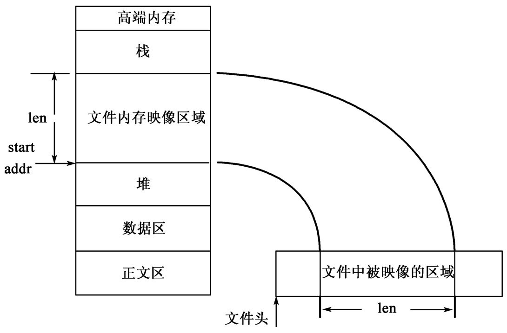
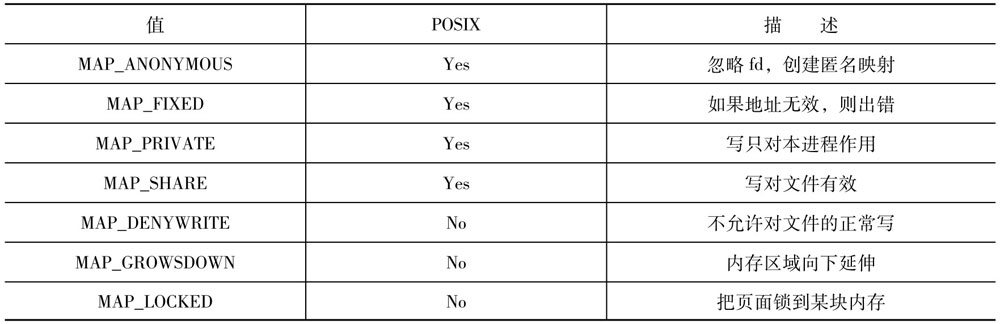

# 高级I/O操作

`在Linux系统中`，`文件`不仅代表普通的存放在永久性存储介质中的数据，而且还可通过`socket`表示网络，通过`设备文件`表示设备。对于文件的多种不同的应用导致了许多处理文件的不同的方法。`本篇主要介绍非常规的文件操作`，包括`非阻塞I/O`、`多个I/O的同时进行`（用`select`或`poll`）、`在系统中映射文件`、`文件加锁`、`非连续区域读写`（`readv`和`writev`）。


## 同时进行多个I/O操作（I/O复用）

在很多`client/server`的应用中，需要同时`从多个文件描述符读`、`向多个文件描述符写`。例如：Web浏览器同时打开很多网络连接，同时下载一个页面中的多个图像，以此降低Web页的装入时间。正如图形终端使用很多文件描述符来连接`X Server`，浏览器也必须同时使用多个文件描述符。


### 轮询方式

处理这多个文件的最简单的方法是，浏览器`轮流读和处理这些文件`，只要socket中还有数据（用于网络连接的系统调用`read`返回当前有效的数据，没有数据时阻塞）。这种方法在所有的连接较为平均地传送数据时是有效的，但如果有一个连接速度较慢，则会出现当浏览器从这个连接中读取数据时，由于`read`的阻塞而停止，而别的连接，即使有可用的数据，也无法被读到。

下面是一个简单的例子。首先，通过`mknod函数`创建两个`命名管道文件``p0`、`p1`，然后在两个终端上运行`cat > p0`和`cat > p1`，在第三个终端上运行示例程序。注意，`cat命令`在一行结束后才向管道中写数据。从结果可以看出，当轮到读`p0`的时候，如果`p0`中没有数据，则即使`p1`有新的输入，也无法被读进来。

```go

package main

import (
    "fmt"
    "syscall"
)

// 使用`syscall.Mknod`创建两个命名通道文件
func main() {

    err := syscall.Mknod("./p0", syscall.S_IFIFO|syscall.S_IRUSR|syscall.S_IWUSR, -1)
    if err != nil {
        panic(err)
    }
    err = syscall.Mknod("./p1", syscall.S_IFIFO|syscall.S_IRUSR|syscall.S_IWUSR, -1)
    if err != nil {
        panic(err)
    }

    fmt.Println("Create FIFO successfully.")

}

```

```go

package main

import (
    "fmt"
    "os"
    "syscall"
)

func main() {

    fds := [2]int{}
    fd := 0
    buf := make([]byte, 10)

    p0fd, err := syscall.Open("p0", syscall.S_IFIFO|syscall.O_RDONLY, 0)
    if err != nil {
        panic(err)
    }
    defer syscall.Close(p0fd)
    fds[0] = p0fd

    p1fd, err := syscall.Open("p1", syscall.S_IFIFO|syscall.O_RDONLY, 0)
    if err != nil {
        panic(err)
    }
    defer syscall.Close(p1fd)
    fds[1] = p1fd

    for {

        n, err := syscall.Read(fds[fd], buf)
        if n < 0 || err != nil  {
            panic(err)
        } else if n == 0 {
            fmt.Fprintf(os.Stderr, "Pipe closed %d.\n", fd)
            return
        } else if n > 0 {
            fmt.Fprintf(os.Stdout, "Read from [%d]: %s\n", fd, buf)
        }

        fd = (fd+1)%2

    }

}

```


### 使用非阻塞I/O

`系统调用`可以分为两类，快速和慢速。`慢速的系统调用`是指有`可能使进程无限期等待`的系统调用。`读文件的进程在文件数据不存在时`（管道、网络设备、终端设备）被阻塞，`向这些文件写数据`，如果不被接受也被阻塞。

读写`被加了强制锁的文件`会被阻塞。

当`某些事件没有发生`时，进程会等待。如一个终端设备等待与它相连的modem应答，或打开一个只写管道的进程等待其他的进程打开读管道。

`进程间通信`也有可能使进程阻塞。

`非阻塞的I/O`使I/O操作`open`、`read`、`write`不会永远阻塞。如果在调用时不能完成操作，系统调用立刻返回，并设置错误信息。

有`两种`方法使用`非阻塞I/O`，一是调用`open`得到文件描述符的时候，使用标识`O_NONBLOCK`，二是对于已打开的文件描述符，调用`fcntl`打开文件状态字`O_NONBLOCK`。

对于`非阻塞I/O`，`read`系统调用总是很快返回。有数据时它读到数据返回；没有数据时，它简单地返回`0`。通过这两种方式提供了一种`复用`的方法。

对比地，`Go语言`的`syscall`包提供了如下函数来设置`非阻塞I/O`：

```go

func SetNonblock(fd int, nonblocking bool) (err error)

```

下面是上一小节中程序的一个改进版本：

```go

package main

import (
    "fmt"
    "os"
    "syscall"
)

func main() {

    fds := [2]int{}
    fd := 0
    buf := make([]byte, 10)

    p0fd, err := syscall.Open("p0", syscall.S_IFIFO|syscall.O_RDONLY, 0)
    if err != nil {
        panic(err)
    }
    defer syscall.Close(p0fd)

    err = syscall.SetNonblock(p0fd, true)
    if err != nil {
        panic(err)
    }
    fds[0] = p0fd

    p1fd, err := syscall.Open("p1", syscall.S_IFIFO|syscall.O_RDONLY, 0)
    if err != nil {
        panic(err)
    }

    err = syscall.SetNonblock(p1fd, true)
    if err != nil {
        panic(err)
    }
    defer syscall.Close(p1fd)
    fds[1] = p1fd

    for {

        n, err := syscall.Read(fds[fd], buf)
        if n < 0 && err != syscall.EAGAIN  {
            panic(err)
        } else if n == 0 {
            fmt.Fprintf(os.Stderr, "Pipe closed %d.\n", fd)
            return
        } else if n > 0 {
        	fmt.Fprintf(os.Stdout, "Read from [%d]: %s\n", fd, buf)
        }

        fd = (fd+1)%2

    }

}

```

如果一个管道没有写者，则`非阻塞read`返回0个字节，如果有写者，但当前没有数据，`非阻塞read`返回`EAGAIN`。

尽管`非阻塞I/O`允许当没有`I/O事件`时，可以马上访问另一个文件描述符，但是由于程序必须不停地试图对两个文件描述符进行操作，它的效率也不高。这样的程序对系统的性能有很大的影响，因为操作系统无法让这个进程睡眠。


### 效率较高的I/O复用

从上文中可以看到，当进程必须同时处理两个文件描述符时，不是容易阻塞就是会影响系统性能。为了提高系统效率，`一种方法是`产生一个子进程，父进程和子进程各处理一个文件描述符，这样一个进程的阻塞不会干扰另一个。

`另一种方法是`使用`异步I/O`。要求核心在文件描述符准备好进行`I/O操作`之后，通知用户。这样需要使用系统调用`select`和`poll`。建立一个文件描述符组，调用者等待其中的一个文件描述符准备好了`I/O操作`。

系统调用`select`允许进程同时在多个文件描述符上睡眠，而不是不停地检查每个文件。当一个或多个文件的I/O操作准备好，则`select`返回，应用程序可以读写这些文件而不用担心阻塞。当处理就绪的文件后，进程再次调用`select`等待新的I/O操作就绪。

`select函数`如下：

```c

#include <sys/time.h>
#include <sys/types.h>
#include <unistd.h>

int select(int n, fd_set *readfds, fd_set *writefds, fd_set *exceptfds, struct timeval *timeout)

```

中间的三个参数`readfds`、`writefds`和`exceptfds`，规定了应该检查哪一个文件描述符。每个参数是指向`fd_set`的指针。`fd_set`是一个允许进程包括任意数目的文件描述符的数据结构，它通过下面的`宏`来操作：

- `FD_CLR(int fd, fd_set *set)`：从`set`中移去`fd`。
- `FD_ISSET(int fd, fd_set *set)`：如果`set`中包括`fd`，返回`TRUE`。
- `FD_SET(int fd, fd_set *set)`：向`set`中加入`fd`。
- `FD_ZERO(fd_set *set)`：清空`set`，使它不包括任何文件描述符。

`select`的第一个文件描述符集`readfds`，包含了一组文件描述符，当它们可以被（从管道或socket中）读的时候，`select`返回。当`writefds`中的任一个文件描述符可以被写的时候，`select`返回。`exceptfds`包含了需要观察是否发生例外的文件描述符，在`Linux（和多数Unix系统中）`，这只会在网络连接中`带外数据（Out-of-Band,OOB）`到来时才会发生。如果对这些事件不感兴趣，可以把这些文件描述符集置为`NULL`。

最后一个参数`timeout`，规定了`select`的调用应该等待多长时间。它是指向结构`struct timeval`的指针。

```c

#include <sys/time.h>

struct timeval {
    int tv_set;     // 秒
    int tv_usec;    // 毫秒
}

```

当`timeout`为`NULL`时，`select`会一直阻塞，直到等待的事件发生。如果`timeout`的两个成员都是`0`，`select`不会阻塞，它更新文件描述符集，表示那些文件已经准备好了被读写，然后马上返回。

`select`的第一个参数`n`，规定了从`0`开始，有多少个文件描述符可以被`fd_set`包含。`Linux`一般允许每个进程最多拥有`1024`个文件描述符，适当减少`n`可以使核心不用对每个`fd_set`去检查那么多的描述符，从而增加了系统的性能。

`select`返回的时候，`3`个`fd_set`分别包含了`可以被读`，`可以被写`和`处于例外状态`的文件描述符。而函数的返回值是这`3`个`fd_set`中的文件描述符的总的个数；如果是因为超时，则返回`0`；发生错误返回`-1`。系统对于处于多于一个的`fd_set`中的文件描述符只统计一次，因此，只用判断`select`的返回值是否大于`0`就可以知道是否有令人感兴趣的事件发生。注意，当`select`的返回值为`-1`时，各个`fd_set`是没有意义的。

对比地，`Go语言`的`syscall`包内提供了如下函数：

```go

func Select(nfd int, r *FdSet, w *FdSet, e *FdSet, timeout *Timeval) (n int, err error)

type FdSet struct {
    Bits [16]int64
}

type Timeval struct {
    Sec int64
    Usec int64
}

```

下面是一个使用`select`进行`管道的复用`的例子。

```go

package main

import (
    "fmt"
    "os"
    "syscall"
)

// FdSet的Bits字段的每个整数的每一位对应一个文件描述符
func FD_SET(fd int, fdSet *syscall.FdSet) {
	i := fd/64
	fdSet.Bits[i] = fdSet.Bits[i] | 1<<fd
}

func FD_ISSET(fd int, fdSet *syscall.FdSet) bool {
    i := fd/64
	return fdSet.Bits[i] & (1<<fd) != 0
}

func FD_CLR(fd int, fdSet *syscall.FdSet) {
	i := fd/64
    if FD_ISSET(fd, fdSet) {
    	fdSet.Bits[i] = fdSet.Bits[i] &^ (1<<fd)
    }
}

func FD_ZERO(fdSet *syscall.FdSet) {
	fdSet.Bits = [16]int64{}
}

func main() {

    fds := [2]int{}
    buf := make([]byte, 256)
    var watchSet syscall.FdSet

    p0fd, err := syscall.Open("p0", syscall.S_IFIFO|syscall.O_RDONLY, 0)
    if err != nil {
        panic(err)
    }
    fds[0] = p0fd
    FD_SET(fds[0], &watchSet)

    p1fd, err := syscall.Open("p1", syscall.S_IFIFO|syscall.O_RDONLY, 0)
    if err != nil {
        panic(err)
    }
    fds[1] = p1fd
    FD_SET(fds[1], &watchSet)

    maxfd := 0
    if fds[0] > fds[1] {
    	maxfd = fds[0]
    } else {
    	maxfd = fds[1]
    }

	//fmt.Println(watchSet.Bits)

    for FD_ISSET(fds[0], &watchSet) || FD_ISSET(fds[1], &watchSet) {

    	inSet := watchSet  //

        nfd, err := syscall.Select(maxfd+1, &inSet, nil, nil, nil)
        if nfd < 0 || err != nil {
            panic(err)
        }
        //fmt.Println(nfd)

        for i := 0; i < 2; i ++ {

        	if FD_ISSET(fds[i], &inSet) {

		    	n, err := syscall.Read(fds[i], buf)
			    if n < 0 || err != nil {
			        panic(err)
			    } else if n == 0 {
                    fmt.Println("clearing", fds[i])
			        syscall.Close(fds[i])
			        FD_CLR(fds[i], &watchSet)
			    } else {
			        fmt.Fprintf(os.Stdout, "Read file [%d]: %s", i, buf)
			    }

	    	}

	    }
    }

}

```

在这个程序中，不再轮流检查每个文件描述符，而是使用`select`同时等待两个文件，当`select`返回，文件描述符集中只含有已经准备好被读的文件描述符，因此对文件的I/O操作不可能阻塞。

可以通过设置`sigaction结构`中的`sa_flags`使系统调用在被信号中断后重启，但`select`不会重启。


### 系统调用poll

系统调用`poll`的功能类似`select`，只是用户接口不一样。

```c

#include <sys/poll.h>

int poll(struct pollfd *ufds, unsigned int nfds, int timeout);

struct pollfd
{
    int fd;             // 想查询的文件描述符
    short int events;   // fd上，感兴趣的事件
    short int revents;  // 实际发生的事件的类型
}

```

在`select`中，给各种条件（`可读`、`可写`、`例外操作`）建立了一个文件描述符集；而在`poll`中，使用一个`pollfd`的结构数组，数组中的每一项表示一个`文件描述符`，以及`对该文件描述符感兴趣的那些条件`。`events`向核心通报哪些问题令人感兴趣的，它是下表的一个或多个值的`位或`在返回的时候，`revent`被核心设置，表示对于该文件描述符，有哪些事件发生。


注意：`poll`不改变`events`，这一点和`select`不同。

表中`最前面的四行`是用来做`读检测`的，`中间三行`用来作`写检测`，`最后的三行`表示`例外事件`。`最后的三行数据`只能被核心设置，在`revent`中返回，不能用于`event`中。

当一个`文件描述符挂起`的时候，`不能`向它`写数据`，但还`可以`从中`读数据`。

`poll`的`最后一个参数`表示想等待多久。它同`select`一样，也有三种情况。

- `timeout=INFTIME`：永远等待。只有当某一感兴趣的事件发生或捕获到一信号时，才返回。如果是由于被信号中断返回，`poll`的返回值是`-1`，`errno`被设为`EINTR`。
- `timeout=0`：不等待。检查所有的文件描述符，立即返回。这是一种查询系统得到多个文件描述符状态的方法。
- `timeout>0`：等待`timeout`毫秒。当经过这么长的时间或文件描述符上有事件发生，则返回。如果在任何一个文件描述符准备好之前，就由于时间到期返回，`poll`的返回值是`0`。

注意，`遇到文件的结尾`和`终端挂起`不一样。如果通过终端输入数据，当敲入文件结尾符时，`POLLIN`出现在`revent`中，因此可以读到文件结尾的标识符（`read`返回`0`），这种情况下`POLLHUP`不会在`revent`中出现。如果等待从`modem`中读，当连接挂起时，收到一个`POLLHUP`的通知。

如果`poll`成功，返回值是一个正数，表示结构数组`pollfd`中`revents``非0`的个数，即有几个文件描述符上有令人感兴趣的事件发生。


## 内存映像

Linux允许进程把文件`映像到`它的地址空间。这种映像在文件数据和内存之间形成了`一一对应关系`，它可以应用到以下一些方面。

- 高速文件访问。`普通的I/O机制`，如`read`、`write`，让内核把数据从`核心的缓冲区`拷到`用户进程空间`中，而`不是`直接从文件中拷来。内存映像`去掉了`中间的缓冲，`省掉了`内存中的拷贝时间。
- 可执行的文件被映像到内存中，这使得一个程序能够`动态地加载可执行部分`。
- 可以通过映像到`/dev/zero`（一种`全0`的设备）或`匿名映像`，分配新的内存。
- 新分配的内存可以通过`内存映像`填充机器指令，然后执行。常用于实时编译器。
- `文件可以像内存一样被对待`，通过指针而不是系统调用来读写。这样可以不必使用`read`、`write`和`seek`等系统调用，从而大大地简化了程序设计。
- 内存映像允许进程共享内存区域，内存的内容储存在`映像文件`中，与任何进程独立。

当一个文件被映像到一块内存区之后，当从该区域读取数据时，文件中相应的数据被访问，同样地，当向该区域写时，这些数据`自动地`写到了文件中。


### 分配页面

系统的内存被分为很多块，称为`页`。在Intel和SPARC机器中，每个页的大小是4096字节（4KB），在Alpha中，页的大小是8KB。`getpagesize函数`返回一页的大小，用字节表示。

```c

#include <unistd.h>

size_t getpagesize(void);

```

对于系统中的每一页，`核心`规定了每一个进程可以怎样地访问它（`读`、`写`、`执行`或`没有任何权限`）。当一个进程想用核心不允许的方式去访问页时，会出现`分页错误`（产生信号`SIGSEGV`），这个信号`通常终止进程`。

一块内存被称为`页面对齐`的，是指它的起始地址`刚好在一页的开始处`，`即起始地址是页面大小的整数倍`。

对比地，`Go语言`的`syscall`包提供了如下函数：

```go

func Getpagesize() int

```


### 建立内存映像

可以通过系统调用`mmap`建立新的内存映像，如下图：



```c

#include <unistd.h>
#include <sys/mman.h>
#ifdef_POSIX_MAPPEND_FILES

void* mmap(void* start, size_t length, int prot, int flags, int fd, off_t offset);
int munmap(void* start, size_t length);

#endif

```

（1）`start参数`确定了从内存中的哪一个位置开始映像文件，一般把它设为`NULL`，表示起始地址由核心去决定。如果地址不为`NULL`，它必须是页对齐的并且没有被别的映像使用，否则`mmap`会出错。

（2）`fd参数`，要映像的文件描述符，在调用`mmap`之前必须把它打开。

（3）`length参数`，表示要映像多大的内存空间。可以要求映像比文件本身更大的空间，但映像太大的空间有可能造成`段出错`（`SIGSEGV`）。

（4）`protection参数`决定新的内存的访问权限。它应该是下表中的某个值或几个值的`位或（OR）`。一个文件映像的访问类型不能和文件打开时的访问类型冲突。例如，一个以`O_RDONLY`的方式打开的文件不能被映像为`PROT_WRITE`。


很多`机器的硬件结构`不允许对一块区域没有读的权限，但能运行它里面的代码。在这样的机器中，把一个区域用`PROT_EXEC`映像相当于用`PROT_EXEC|PROT_READ`映像。

（5）`flags参数`表示映像区域的其他特征，如下表：



注意：对于`mmap`的调用，`flags参数`必须有`MAP_PRIVATE`或`MAP_SHARED`，而其他的是可选的。

常量的说明：

- `MAP_ANONYMOUS`：匿名映像，不涉及物理的文件。不能和其他的进程共享，也不会自动地存到一个文件中，实际上是进程分配私用的内存。在这种用法中，`fd`被忽略了。
- `MAP_FIXED`：如果不能映像到要求的地址`start`，`mmap`失败。如果没有使用这个标志位，核心会试图以`start`为起始地址创建映像，但如果不能成功，可以把文件映像到别的地方。
- `MAP_PRIVATE`：只有本进程才有权改变映像的内存区，其他进程（除了本进程`fork`的子进程以外）不能改变这个文件的映像，对映像的改变也不能写到物理文件本身。对`mmap`的调用中，`MAP_SHARED`或`MAP_PRIVATE`必须被使用。如果在内存区不可写的情况下，可以任意使用这两个参数中的一个。
- `MAP_SHARED`：对内存区的改变被写回到文件中，如果其他的进程也映像和共享了同一个文件。必需使用`PROT_WRITE`标识，否则内存不能写。
- `MAP_DENYWRITE`：通常文件调用（如`write`）能够改变被映像的文件。如果映像区是可执行的，可能会出现问题。使用这个标识，可以使对`write`的调用返回`ETXTBSY`。
- `MAP_GROWSDOWN`：试图访问在被映像的内存区之前的内存，很可能会造成`SIGSEGV`。这个标识告诉核心，在本次分配的区域之前分配新的内存区。这样，可以使`进程栈`自动增长。对`MAP_GROWSDOWN`的仅有的限制是栈的大小。如果没有限制，核心会采用自己认为最有利的方式。当然，不能越过其他已经分配的内存。
- `MAP_LOCKED`：这个区域锁到了内存中，不会被交换出去。这对于实时的应用非常有用。但这只能被`root`使用，普通用户不能把内存锁定。
- `fd参数`为文件描述符，表示要映像的文件。如果使用`MAP_ANONYMOUS`，这个参数忽略。

（6）最后一个`offset参数`，表示从文件的哪一点开始映像，它必须是页大小的整数倍。

`mmap`返回一个表示地址的指针，如果有错误，返回`-1`.为了判断它是否正确，应该把`-1`强制转换成`caddr_t`，而不是把返回的地址强制转换成`int`，只有这样，才能保证不管指针和整数占了多少字节，比较的结果都正确。

对比的，`Go语言`的`syscall`包提供了如下函数：

```go

func Mmap(fd int, offset int64, length int, prot int, flags int) (data []byte, err error)

func Munmap(b []byte) (err error)

```

下面是一个类似`cat命令`的例子。

```go

package main

import (
    "fmt"
    "os"
    "syscall"
)

func main() {

 	filepath := ""
 	if argslen := len(os.Args); argslen == 2 {
 		filepath = os.Args[1]
 	} else {
 		panic(fmt.Errorf("传入参数数量过多，或没有传入适当参数: %d", argslen))
 	}

 	fd, err := syscall.Open(filepath, syscall.S_IFREG|syscall.O_RDONLY, 0)
 	if err != nil {
 		panic(err)
 	}

 	var stat syscall.Stat_t
 	err = syscall.Fstat(fd, &stat)
 	if err != nil {
 		panic(err)
 	}

 	region, err := syscall.Mmap(fd, 0, int(stat.Size), syscall.PROT_READ, syscall.MAP_SHARED)
 	if err != nil {
 		panic(err)
 	}

 	err = syscall.Close(fd)
 	if err != nil {
 		panic(err)
 	}

 	n, err := syscall.Write(syscall.Stdout, region)
 	if err != nil {
 		panic(err)
 	}

 	if n != int(stat.Size) {
 		fmt.Fprintln(os.Stderr, "n != int(stat.Size())")
 	} else {
 		fmt.Fprintln(os.Stdout, "Every thing is OK!")
 	}

    err = syscall.Munmap(region)
	if err != nil {
		panic(err)
	}

}

```

当进程不再使用内存映像时，可以用`munmap`释放映像。当以后访问映像区域时，产生`SIGSEGV`。当进程结束或通过`exec`加载一个新的程序，所有的内存映像被释放。

在`munmap`中，`start`表示要释放的映像的`起始地址`，`length`表示要释放的内存区域的大小。一般情况下，每一个映像区域被一个`munmap`释放。Linux也可以释放部分映像区域，但不推荐这种用法。


### 内存与磁盘的同步

如果内存映像用来写一个文件，`改变后的内存`和`实际的物理文件`会不一样。如果想立即把页面写到磁盘上，`保持内存与磁盘的同步`，用`msync`。

```c

#include <unistd.h>
#include <sys/mman.h>
#ifdef_POSIX_MAPPEND_FILES
#ifdef_POSIX_SYNCHRONIZED_IO

int msync(const void* start, size_t length, int flags);

#endif
#endif

```

参数`start`和`length`，表示用来同步的映像区域。`flags`表示内存和磁盘同步的方法，它可以包含下面值的一个或多个的`位或（OR）`。

- `MS_ASYNC`：`msync`返回后，尽可能地在以后的某个时刻同步映像区域。
- `MS_SYNC`：映像区域在`msync`返回之前同步。它与`MS_ASYNC`不能同时使用。
- `MS_INVALIDATE`：由核心决定对内存映像区的改变是否应该写到磁盘去。


## 给内存区加锁

在Linux和许多别的现代操作系统中，当内存不足的时候，内存页被交换到磁盘上去。`对时间敏感的程序`，当需要使用目前不在内存中的页的时候，会由于`内外存的交换`而大大地耽误时间，从而导致不可预料的后果。为了增加这些程序的健壮性，Linux允许进程把某些页面`锁在内存中`。由于安全问题，`只有以root方式运行的进程才有权锁住内存`。否则的话，任何人都可以把内存耗尽，使系统崩溃。被锁住的内存总量不得超过`_POSIX_MEMLOCK_RANGE`。

下面的系统调用用来对内存区加锁和解锁。

```c

#include <sys/mman.h>

int mlock(caddr_t addr, size_t length);
int mlockall(int flags);
int munlock(caddr_t addr, size_t length);
int munlockall(void);

```

`mlock`锁定从`addr`开始的`length`字节，每次必须锁定整数个页。如果`length`不是页面大小的整数倍，则包含加锁的内存的末尾的那个页全部被锁住。当`mlock`返回，所有相关的页全都加了锁。

如果进程想锁住整个地址空间，用`mlockall`。`flags参数`是下面的`两个常数`之一或两个的`位或（OR）`。

- `MCL_CURRENT`：本进程的地址空间的所有页都锁入内存。当`mlockall`返回时，它们都已经被锁定。
- `MCL_FUTURE`：以后加入进程的地址空间也被所在内存中。

当进程不再需要锁定任何地址空间，用`munlockall`。而`munlock`解开所要求的区域，参数及含义与`mlock`相同。

对`一个页`加`很多次`锁与加`一次`锁的`效果相同`。


## 文件加锁

有两种文件加锁的方法，最常见是`建议锁`（advisory locking），规定了所有的进程访问该文件所要`遵循的规则`；另一种是`强制锁`（mandatory locking），当加了这样的锁之后，其他进程对该文件的`读写请求会挂起`，直到锁被释放。

对文件加锁，有`两种粒度`，`文件锁`和`记录锁`。


### 文件锁

`文件锁`是最简单的文件加锁的方法，每个需要`加锁的数据文件`与一个`加锁文件`相联系，当`加锁文件存在`的时候，`数据文件`被认为是加了锁，其他的进程不能访问。当`加锁文件不存在`时，进程`创建`加锁文件，然后访问数据文件。只要`创建加锁文件的过程`是`原子操作`，就可以`保证`在某一时刻`只有`一个进程拥有加锁文件，这样就可以保证在一个时刻`只有`一个进程能够访问数据文件。

当进程想访问一个文件时，用以下的方法给文件加锁。

```go

package main

import (
    "fmt"
    "os"
    "syscall"
)

func main() {

    fd, err := syscall.Open("filename.lck", syscall.O_RDONLY, 0644)
    if err != nil {
        fmt.Fprintln(os.Stderr, err)
        fd, err = syscall.Open("filename.lck", syscall.O_CREAT|syscall.O_WRONLY, 0644)
        if err != nil {
            panic(err)
        }
        fmt.Println("Create a new file.", fd)
    } else {
        fmt.Println("The file is existing.", fd)
    }

    err = syscall.Close(fd)
    if err != nil {
        panic(err)
    }

    err = syscall.Unlink("filename.lck")
	if err != nil {
		panic(err)
	}
	fmt.Println("The file has been unlinked!")

}

```

当进程不再使用文件时，调用`unlink函数`去掉`加锁文件`的引用。

上面的程序对于加锁是正确的，但它无法阻止多个进程同时锁住一个文件。如果一个进程`检查加锁文件`，发现它`不存在`，`然后被核心中断`让其他的进程运行，而`新的进程`可以在`原来的进程`创建加锁文件`之前`锁住文件。

以上的程序可以如下修改：

```go

package main

import (
    "fmt"
    "os"
    "syscall"
)

func main() {

    fd, err := syscall.Open("filename.lck", syscall.O_CREAT|syscall.O_EXCL, 0644)
    if err == syscall.EEXIST {
        fmt.Fprintln(os.Stderr, "[ERROR]The file is existing.")
    } else if err != nil {
        panic(err)
    } else {
    	fmt.Fprintln(os.Stdout, "Create a new file successfully.", fd)
    }

    err = syscall.Unlink("filename.lck")
	if err != nil {
		panic(err)
	}

}

```

如果`open函数`中使用`O_EXCL标识`，当文件已经存在时，返回并置`errno`为`EEXIST`。这样就保证了加锁的过程不会被其他的进程中断。

这种对文件的加锁的方法有`广泛的用途`，可用于`加锁Linux标准文件`、`串行端口`、`口令文件`等。它们一般工作很好，但也有如下的一些`缺点`：

- 一个锁在某一时刻`只能`被一个进程拥有，这样就`无法`让多个进程同时读一个文件。如果`文件的更新`是`原子操作`，`读这个文件的进程`可以`不必理会加锁`，但`原子的更新`对于复杂的文件结构很难保证完全正确。
- `O_EXCL`标识`只在本地文件系统中是安全的`，被Linux支持的网络文件系统不允许多个机器使用`O_EXCL`锁住一个文件。
- 如果保留文件锁的进程非正常退出（`没有删除加锁文件`），加锁文件仍然存在，仍然可以限制其他的进程访问数据文件。对于这种情况，可以在加锁文件中储存`进程的pid`，别的进程`检查pid`，判断拥有锁的进程是否存在，如果进程`不存在则把加锁文件删除`。但是，在很多系统中，pid是可以被重用的，因此，这种方法没有解决所有的问题。


### 记录锁

当两个用户同时修改一个文件时，会出现什么情况？在大多数操作系统中，这样做是允许的，文件的最后状态取决于最后写它的那个进程。然而，有些应用，如`数据库系统`，必须使进程能够判断它此时是否能够`安全地写文件`，这促使了`记录锁`的出现。

`记录锁`在`UNIX SYSTEM V`和`BSD4.3`中出现，通过使用系统调用`flock`来实现。而`POSIX`为`记录锁`定义了新的机制，使用系统调用`fcntl`。本节仅介绍`POSIX`的记录锁，它得到了现在大多数`UNIX系统`的支持，`lockf`仅是`fcntl`的一个接口。

`记录锁`和`文件锁`有两个最主要的区别。

- `记录锁`锁住文件中的某一部分。例如，进程A锁住文件的50~100字节，进程B锁住200~300字节，这两个锁不会造成冲突。当多个进程想同时修改一个文件时，这种`细粒度的锁`是很有用的。
- `记录锁`由`核心`而不是`文件系统`控制，当进程终止时，它`所有的锁都被释放`，`避免了`上文中`非正常退出导致的问题`。

`记录锁`有`读锁`和`写锁`两种。`读锁`又叫`共享锁`，因为多个进程可以同时拥有它，然后读某个数据。当进程需要写文件时，`必须`有`写锁`（独占锁），`只有一个进程`可以拥有写锁。`当写锁存在时，它控制的区域不能有读锁`。

当`设置或释放文件上的锁`时，系统会`自动地``合并和分离邻近的区域`。同一个进程拥有的多个锁不会发生冲突。例如，如果某进程有一个`读锁`在200~250字节，而又想得到一个200~225字节的`写锁`，它会成功。同时`原有的读锁被释放`，产生了一个在226~250字节的`新的读锁`。`这个规则`使进程不会自己陷入`死锁`（注意，加锁的过程是`原子操作`，`不会`出现在某一时刻没有上锁的情况）。如果给100~199字节加了锁，然后释放掉150上的锁，`核心`会产生两个锁，一个是100~149，另一个是150~199。

`POSIX`的记录锁通过`fcntl`系统调用来实现。

```c

#include <fcntl.h>

int fcntl(int fd, int command, logn arg);

struct flock
{
    short l_type;       // 锁的类型
    short l_whence;     // 所得起始
    off_t l_start;      // 锁的起始偏移，与l_whence相关
    off_t l_len;        // 锁住多少字节
    pid_t l_pid;        // 拥有锁的进程pid
}

```

调用`fcntl`进行加锁的操作时，`arg参数`是指向结构`flock`的`指针`。

`l_type`表示`加锁的类型`，它可以是以下值：

- `F_RDLCK`：读锁（共享锁）；
- `F_WRLCK`：写锁（独占锁）；
- `F_UNLCK`：释放锁。

参数`l_whence`和`l_start`表示`锁的起始地址`，含义与`lseek`中同名的参数相同。`l_whence`为以下的`三个值`之一：

- `SEEK_SET`：从文件开始计算；
- `SEEK_CUR`：从当前计算；
- `SEEK_END`：从文件末尾计算。

`l_len参数`表示锁的长度是多少字节，如果它为`0`，则表示锁一致延伸到文件的末尾。

`l_pid`，仅在查询锁的时候才用，它是这个`锁的拥有者的pid`。

`fcntl`有三个命令和加锁有关。操作通过`command参数`来传递，它可以是以下的三个值之一：

- `F_SETLK`：按照`arg`进行加锁和解锁的处理。如果因为冲突不能上锁，立刻返回并且`errno`被设为`EAGAIN`。如果`l_type`是`F_UNLCK`，已存在的锁被释放。
- `F_SETLKW`：相当于阻塞的`F_SETLK`（`W`的含义是`wait`）。如果要上锁的区域被其他进程锁住，使申请不能马上成功，则进程进入睡眠，等待原来的锁被释放，在上锁成功后返回。如果在进程阻塞时有信号发生，返回并且`errno`被设为`EAGAIN`。
- `F_GETLK`：检查是否可以申请由`arg`决定的锁。如果不和别的进程已经存在的锁发生冲突，`arg`指向的结构`flock`的`l_type`被赋值为`F_UNLCK`，其余的成员不变。如果不能给予锁，`l_pid`被赋为`发生冲突的进程的pid`。这两种情况下，函数都返回`0`.

下面是一些关于记录锁的规则：

- 锁可以延伸到文件目前的结尾之后，但`不能`扩展到文件之前，也不能从文件头之前开始。
- 如果`l_len`是`0`，`锁得到最大限度的延展`，这时就能够从文件中的任何地方开始，向后锁住所有的文件数据，并锁住以后添加到文件末尾的数据，不管到底增加了多少数据。
- 要`锁住整个文件`，设`l_start`为`0`，`l_whence`为`SEEK_SET`，`l_len`为`0`。
- 如果`一块区域`被`一个进程`加了`读锁`，则`另外的进程`可以在给它加上`读锁`，但`不能`加上`写锁`；如果`一块区域`被`一个进程`加了`写锁`，则它`不能`被`另外的进程`加上`读锁或写锁`，如下表所示。


尽管`F_GETLK`允许进程判断它是否可以申请锁，但先用`F_GETLK`检查，然后再用`F_SETLK`或`F_SETLKW`申请锁，并不是`原子操作`。因此，在以下的代码中，`不能保证`在两个`fcntl`之间，没有其他的进程获得锁。用第二个`fcntl`申请锁，还是有可能失败，在它返回后，必须处理`errno`。

```c

fcntl(fd, F_GETLK, &lockinfo);
if (lockinfo.l_type != F_UNLCK)
{
    fprintf(stderr, "lock conflict\n");
    return;
}

lockinfo.l_type = F_RDLCK;
fcntl(fd, F_SETLK, &lockinfo);

```

对比地，`Go语言`的`syscall`包提供了如下函数：

```go

func FcntlFlock(fd uintptr, cmd int, lk *Flock_t) error

type Flock_t struct {
    Type int16
    Whence int16
    Pad_cgo_0 [4]byte
    Start int64
    Len int64
    Pid int32
    Pad_cgo_1 [4]byte
}

```

下面的例子显示了一个进程打开一个文件，获取、释放读锁，得到写锁，释放写锁的操作过程。如果冲突，打印出发生冲突的进程的pid。可以在两个终端上同时运行这个程序。

```go

package main

import (
    "fmt"
    "os"
    "syscall"
)

func waituser(msg string) {

	fmt.Fprintf(os.Stdout, "%s\n", msg)
	input := ""
	fmt.Scanln(&input)

}

func getlock(fd int, flockType int16) {

	var flock syscall.Flock_t
	flock.Whence = 0	// 从头开始
	flock.Start = 0
	flock.Len = 0

	for {

		flock.Type = flockType

		err := syscall.FcntlFlock(uintptr(fd), syscall.F_SETLK, &flock)

		if err != nil {

			fmt.Fprintln(os.Stdout, err)
			waituser("\npress RETURN\n")
			//continue

			err = syscall.FcntlFlock(uintptr(fd), syscall.F_GETLK, &flock)

			if err != nil {

				fmt.Fprintln(os.Stderr, err)
				waituser("\npress RETURN\n")
				//continue

			}

		}

		// 有可能在两个fcntl之间，有锁被释放
		if flock.Type == syscall.F_RDLCK {
			fmt.Fprintln(os.Stdout, "got read lock")
			break
		} else if flock.Type == syscall.F_UNLCK {
			fmt.Fprintln(os.Stdout, "released lock")
			break
		} else {
			fmt.Fprintln(os.Stdout, "got write lock")
			break
		}

	}

}

func main() {

	fd, err := syscall.Open("testlockfile", syscall.O_RDWR|syscall.O_CREAT, 0666)
	if err != nil {
		panic(err)
	}

	fmt.Fprintln(os.Stdout, "getting read lock")
	getlock(fd, syscall.F_RDLCK)
	waituser("press RETURN\n")

	// 打开两个进程，测试锁的占用情况。
	fmt.Fprintln(os.Stdout, "releasing lock")
	getlock(fd, syscall.F_UNLCK)
	waituser("press RETURN\n")

	fmt.Fprintln(os.Stdout, "getting write lock")
	getlock(fd, syscall.F_WRLCK)
	waituser("press RETURN\n")

}

```


### 死锁

当两个进程`都等待`对方占有的资源时，会产生`死锁`。此时双方都无法执行，它们将永远挂起，`除非`有一个进程`被强制`释放资源。当一个进程拥有了一个锁，然后试图申请另一个锁的时候被阻塞，就有可能造成死锁。

当死锁被检测到，核心`必须`使一个进程接收到错误并退出。


### 锁的继承与释放

（1）锁与一个进程（pid）和一个文件（inode）相连。这有两个含义。第一，当进程终止时，它所有的锁都被释放；第二，当文件描述符关闭时，在这个进程中，加在该文件描述符上的所有锁被释放。举例说明如下。

按照下面的步骤：

```c

fd1 = open(filename);    // 打开一个文件
fcntl(fd1, F_SETLK, F_RDLCK ......);    // 设一个读锁
fd2 = open(filename);   // 打开同一个文件
close(fd2)              // 关闭fd2

```

在`close(fd2)`之后，加在`fd1`上的锁也被释放了。当用`dup函数`代替`open`，结果相同。

```c

fd1 = open(filename);    // 打开一个文件
fcntl(fd1, F_SETLK, F_RDLCK ......);    // 设一个读锁
fd2 = dup(fd1)  // 打开同一个文件
close(fd2)      // 关闭fd2

```

（2）在`fork`之后，`父进程`保留它的文件锁。但通过`fork`产生的`子进程`，`不能继承`父进程的锁。因为如果让`子进程`继承锁，则有可能造成两个进程对同一块区域拥有`写锁`，而这正好是文件锁想要避免的。

（3）执行`exec`运行一个新程序，文件锁得到继承。`POSIX`没有规定必须这样，但`大多数UNIX系统`都具有这一特征。


### 建议锁与强制锁

设想有一个数据库，它拥有一组操作函数。如果所有的这些函数用一致的方法处理`记录锁`，而所有的进程都只使用这些函数访问数据库，那么，这些函数可以使用`建议锁`。然而，`建议锁`不能阻止某些对数据库具有写权限的进程对它任意地写入。这些进程，能够使用这些操作函数以外的方法来访问数据库。

`强制锁`使核心检查每一个`read`、`write`和`open`的调用，看它们是否违犯了对文件的加锁。

`Linux`和`系统V`都提供了`强制锁`，`强制锁`和`建议锁`一样，都使用`fcntl`来建立和释放。当被锁的文件的`setgid`（`组运行设置比特`）被设置，但它的`组运行比特`没有被设置，对它的加锁是`强制的`；否则锁是`非强制的`。因为对于一个文件，它的`组运行设置比特`被设置，而`组运行比特`没有被设置，是无意义的，所以用它来表示对此文件使用`强制锁`。

当一个进程试图读写一个规定要使用`强制锁`的文件，而要读写的部分被另一个进程加了锁，会出现什么情况呢？结果依赖于文件被加了`读锁`还是`写锁`，要读写的文件描述符是阻塞的还是非阻塞的，以及相对文件进行的是什么操作。下表显示了在不同情况下读写加了强制锁文件的可能性。


如果`read`和`write`与锁冲突，而且`描述符是阻塞的`，进程会阻塞，直到锁被释放；如果`描述符是非阻塞的`，在冲突时调用立刻返回，`errno`被设为`EAGAIN`。

`强制锁`对系统调用`open`也有影响。在正常情况下，对被另一进程设置了`强制锁`的文件调用`open`，能够成功，以后是否能对它进行`read`和`write`操作如上表。但是，如果在`open`中使用了`O_TRUNC`、`O_CREAT`，不管该`强制锁`是`读锁`还是`写锁`，也不管在`open`中是否使用了`O_NONBLOCK`，`open`都会立即返回，并设置`errno`为`EAGAIN`。（不能使用`O_TRUNC`是因为对别的进程加了`强制锁`的文件，不能把它截断。）

`强制记录锁`比起一般的锁，对系统性能的影响更大，因为每一个`read`和`write`都必须检查是否发生冲突。它也不像`POSIX规范`中的`非强制锁`那样可移植，大多数应用程序没有使用它。


## 非连续区域读写

应用程序有时需要把`不同类型的数据`写到`一个文件的连续区域`中，这可以通过多个`read`和`write`实现，按这种操作不是原始的。应用程序也可以先把数据移到`连续的内存`中，然后再`一次写入文件`，但这会造成很多内存操作。

`Linux`提供了系统调用`readv`和`writev`，它们实现了`scatter/gather读写`。它们被称为`scatter`和`gatter`是因为`readv`把数据`分散`写到内存中，`writev`从不同的内存区域中取得数据。同`read`和`write`不一样，它们的参数`不是`只有一个指针和一个缓冲区大小，`而是`一组结构，其中每个结构表示一个缓冲区，根据`缓冲区数组`的次序，依次读/写缓冲区。每一个缓冲区用结构`iovec`表示。

```c

#include <sys/uio.h>

struct iovec {
    void* iov_base  // 指向缓冲区的地址
    size_t iov_len  // 缓冲区的字符数
}

int readv(int fd, const struct iovec *vector, size_t count);
int writev(int fd, const struct iovec *vector, size_t count);

```
