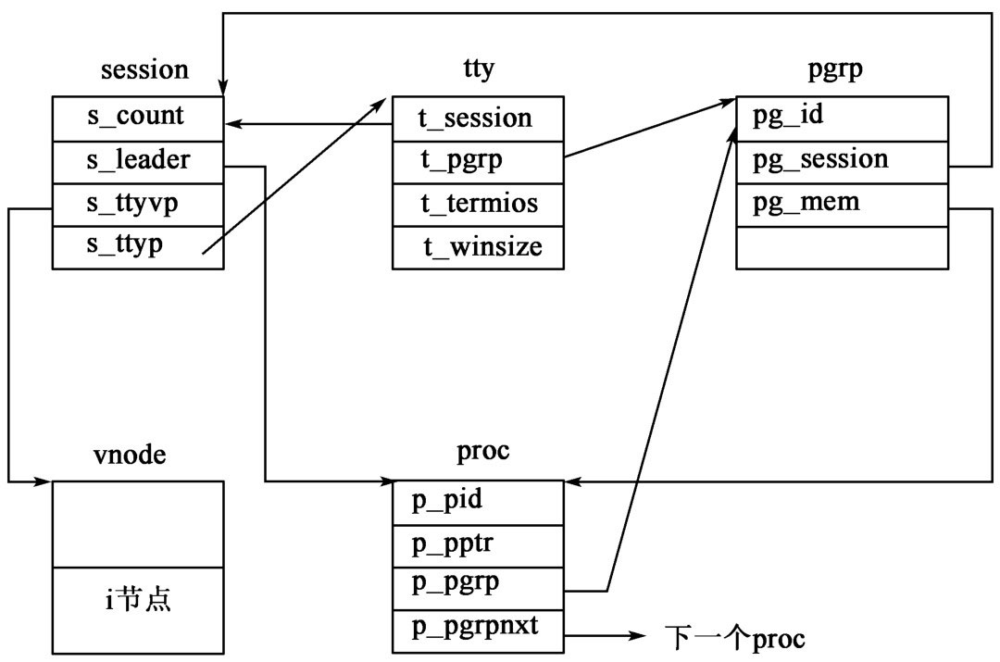

# 进程模型与进程关系


## 进程

一个`进程`是一个`程序`的执行，所以它应该是一个`动态的概念`。进程是由`一系列有格式的字节`组成的，包括`机器指令`（习惯上称为`正文`）、`数据`和`栈`。对于标准的`UNIX操作系统`，每个`进程`是`内核调度的基本单位`，`只有`进程才能被调度至CPU运行，对于每一个进程，内核将记录以下的信息：

- 当前所执行到的机器代码（`正文`）；
- 进程所访问的所有文件；
- 进程的权限；
- 对应程序所在的目录；
- 进程运行所在内存空间以及内存的分配信息。


## 线程

为了`进一步提高CPU的利用率`，许多操作系统都提出了`线程`的概念。线程可以视为一个进程的某一个子任务。一个进程可以由多个线程来协同完成，所以可以使该进程在其`虚存空间`的`不同地点`都在`同时执行`（不像以前，同一时刻只能在`虚存空间`的一点执行），从而一个进程可以并发地执行。`线程`和`进程`的最大区别在于，`线程驻留于进程的虚拟空间中`，同一进程中包含多个线程，而且它们共享地址空间和所有处理器资源。反之，多个进程之间的虚拟空间则是完全独立的。显而易见，内核`调度线程的开销`要远低于`调度进程的开销`。

`许多UNIX系统`都支持线程，内核将`线程`视为`调度单位`。`Linux系统`给程序员提供了一个灵活的方案。`在Linux中`，一个`进程`是一个`被调度单位`，当一个进程生成其子进程时，系统调用`clone()`可以让程序员确定哪些资源可以共享。


## 启动例程

`进程`是UNIX编程所需要知道的核心概念，因此，首先应该对一个进程运行时所处的环境有一个整体的认识，下面将通过C语言所编写的程序介绍一系列与之相关的概念。一个C语言的执行是从名为`main的函数`开始的，`main函数`的原型为：

```c

int main(int agrc, char* argv[])

```

其中`argc`是将记录程序运行时所用的命令行中的参数个数（包括可执行程序的程序名），`argv`以字符串数组的形式记录了所有的命令行参数，当一个C程序被内核启动时，一个专门的启动例程将首先被调用，可执行文件将以这个启动例程作为自己的运行时的起始地址。这个启动例程通过操作系统内核获得命令行参数和环境变量，并进行相应的赋值操作，从而使得`main函数`可以正常地被调用并执行。

对比地，`Go语言`的启动例程函数如下：

```go

func main() {
	// TODO
}

```


## 终止进程

在Linux/UNIX环境下有五种情况使得进程终止：

- 进程正常终止：
	- 从`main函数`返回；
	- 调用`exit函数`；
	- 调用`_exit函数`。
- 进程非正常终止：
	- 调用`abort函数`；
	- 被一个`信号`终止。

对于启动例程，如果`main函数`返回，`exit`将会立刻自动被调用。

`exit`和`_exit`函数都可用于进程的正常终止。它们的区别在于`exit`将执行一系列相应的收尾工作（包括关闭该进程已经打开的所有文件，将缓冲区的数据写回磁盘文件等），然后再返回到操作系统内核，而`_exit`则立即返回到操作系统内核。它们的原型为：

```c

#include <stdlib.h>

void exit(int status);

#include <unistd.h>

void _exit(int status);

```

之后还会讨论这两个函数对被终止进程的父子进程的影响，下图表示了一个C程序是如何运行和终止的。


可见，`exit`函数最终还是在做完收尾工作后调用了`_exit`函数返回到内核的，所以可以说对`exit`函数的调用是间接调用了`_exit`函数。`exit`和`_exit`都需要一个整型的参数`status`来反映该进程的终止状态，这样该进程的父进程可以获取该进程终止时的状态，这对于复杂的应用程序的维护是很有用的机制。

对比地，`Go语言`的`os`包内提供了如下函数：

```go

/*
	`Exit`使当前程序以给定的状态码退出。按照惯例，0表示成功，非0表示错误。调用该函数程序会立即终止，延迟的函数不会运行。

	处于可移植性的考虑，状态码应在[0，125]范围内。
*/
func Exit(code int)

```


## atexit函数

`ANSI C`定义了一个可以同时注册至多32个调用后自动执行`exit`返回的函数的机制，被称为`exit句柄`，这些句柄是通过调用`atexit`注册的。`atexit`函数的原型为：

```c

#include <stdlib.h>

int atexit(void (*func) (void));

返回值：成功--0，不成功-非0。

```

`atexit`的参数就是被注册的函数的首地址，但是被注册的函数的原型应该遵循以下格式：

```c

void 函数名(void)

```

当通过调用`atexit`注册若干函数后，程序`正常退出时`将由`exit`函数按照注册时的逆序来调用这些被注册的函数。`atexit`函数的工作原理如下图：


对比地，`Go语言`提供了`defer`语句。当调用`os`包内的`Exit`函数来进行非正常退出时，`defer`注册的函数不会被执行。如果是发生`panic`，`defer`注册的函数仍然会被执行。


## 命令行参数

当一个程序执行时，通过调用`exec`函数生成一个新进程时可以将命令行参数传递给这个新的进程。在Unix shell下，许多应用程序都需要在运行时附加一些命令行参数来获得相应的服务。命令行参数的数据结构实际上是一个字符串数组，首地址为`argv`，数组的元素共有`argc`个。

对比地，`Go语言`的`os`包内提供了`Args`变量：

```go

var Args []string

```


## 环境变量列表

在Linux/Unix系统下，每个进程执行时都需要在一个`确定的系统环境下`完成，以便获得所需要的资源，这个环境是由`用户定义的`。例如，该进程可能需要知道当前的终端类型，那么它就可以通过读取环境变量`TERM`来获取相应的信息。定义环境变量的通用形式为：`name=value`。一个系统环境是由若干环境变量组成的环境变量列表记录的，该列表的数据结构是一个以字符型指针为元素的数组，数组的长度为所有环境变量的个数。Linux/Unix下的shell就要用到许多环境变量，如果用的是`C shell`，那么在系统的`/etc`目录下打开`.cshrc`文件，你可以看到一些环境变量的定义。这些定义将在成功登录后由系统设置，从而构成`C shell`的基本环境。例如，敲入`echo MAILPATH`，将得知系统将在哪个目录下读取email。

按照习惯，大多数与定义的环境变量名都是大写字母来表示。以前，许多UNIX系统为main函数提供了第三个参数，这个参数是环境变量列表的首地址：

```c

int main(int argc, char** arg, char** envp)

```

现在`POSIX`定义一个全局变量`environ`来代替`envp`参数。下图给出了一个环境变量列表的示意图：


可以通过访问`environ`来获取当前所有的环境变量的定义，也可通过调用`getenv`函数来获取某个环境变量的定义。

对比地，`Go语言`的`os`包内提供了如下内容：

```go

func Environ() []string

func Getenv(key string) string

```


## C程序在内存中的分布

下图给出典型的`C程序在内存中的逻辑上的存储方式`。


实际上的分布可能会根据不同版本的系统而有所不同，但从程序员的角度而言，知道逻辑上的分布就可以了。从图中可以看出，一个C程序可以看作由以下几个部分构成。

（1）正文段（Text Segment）：它存放着由CPU执行的机器码，考虑到效率，一个应用程序的正文段通常是可共享的。在内存中只需一个副本（copy）即可，（如vi，cc等应用程序），可见`正文段是只读的`。

（2）初始化的数据段（Initialized Data Segment），也称为数据段。其中存放着那些在程序中由程序员`显式初始化了的全局变量`（定义处在任何函数之外的变量），例如：`int a = 0;`。这样变量的生命期和该程序相同，并且可以被程序中所有的过程访问。

（3）未初始化的数据段（Uninitialized Data Segment）：也称为`BSS段（Block Started by Symbol）`。它用来存放那些`未显式初始化的全局变量`（如：`int a;`）。这些变量将被内核在程序执行时初始化为`0`或`NULL`。

（4）栈（stack）：用来存放每个函数被调用后用到的局部变量，以及该函数的返回地址，传入的参数等。当该函数返回时，所占用的栈空间也将随之被内核释放，这就是为什么局部变量的作用域和生命期都有限制的原因。

（5）堆（heap）：程序执行时`动态分配的内存空间`都是从堆中获取的，堆可以使用当前`堆顶`和`栈顶`之间的所有内存空间。利用命令`size`，可查看可执行程序所占的大小。


## 共享库

实际上，用C语言所写的程序中会使用到许多标准库函数（如printf函数），正常链接时编译器将会把对应的标准库附加到应用程序上，使之成为该程序的一部分。Linux系统支持共享库，系统为许多进程所共同引用的库函数维护`单一副本`，这样可以减少内存开销。但当一个程序运行时或某个共享的库函数`第一次被调用时`，会引入维护所带来的开销。使用共享库的另一个好处在于当`升级某个库时无需重新链接`每一个使用该库的程序。


## 内存分配机制

ANSI C为内存的动态分配提供了三个函数，它们的原型为：

```c

#include <stdlib.h>

void *malloc(size_t size);
void *calloc(size_t nobj, size_t size);
void *realloc(void *ptr, size_t newsize);

返回值：成功--非NULL，失败--NULL。
```

（1）`malloc`：分配大小为`size`个字节（byte）的内存空间，`所有的初值是不确定的`。

（2）`calloc`：分配`nobj`个大小为`size`个字节的内存空间，`初值为0`。

（3）`realloc`：改变先前分配的内存空间大小为`newsize`。当空间增加时，可能会引起先前分配的内存块整块复制到其他地方，并从尾部增加多要的空间，同时新增空间中的初始值也是不定的。这里应注意一下`realloc`函数中的`newsize`是指全新分配后整个内存块的大小，而不是增加或减少的大小。`realloc(NULL, newsize)`等价于`malloc(newsize)`。

这`三个函数`将`保证内存分配中的字对齐`的要求。例如，对于double型的数，其起始地址必须能被8整除。请注意这三个函数的返回值均为`void*型`，这表明如果声明`#include <stdlib.h>`，无需显式地将函数调用返回值强制转换为其他类型的指针。`void*`是一个普适型的指针。`ANSI C`还提供了一个`free`函数来动态释放分配的内存空间，其原型为：

```c

void free(void *ptr);

```

`free`函数会将以`ptr`为首址的内存块标注为`空闲块`，并将其放回`空闲块池`中。

从具体的实现方式上讲，这`三个函数`通常是由系统调用`sbrk`来实现的。`sbrk`可增加或减少一个进程的堆的大小。尽管`sbrk`会改变一个进程的堆的大小，但调用`malloc`和`free`函数时不会减少该进程所占的内存空间，因为被释放的空间并没有被内核接管，而是放入该进程的空闲空间池中以供下一次的`malloc`调用时使用。

在实际编程中，对于`动态的内存分配`时应注意以下`两点`：

（1）操作系统在分配一个内存块（大小为`size`）时，由于内存管理的需要，会使用`额外的一些空间来记录用于内存管理的关键信息（如空闲位、内存块链表的指针等）`。故实际上分配的内存块的大小将会稍大于`size`，这对于用户是不可见的。同时，由于C语言没有提供`内存块的越界检查机制`，故使用指针时一定不能想当然地利用加或减操作进行`越块操作`，否则很有可能会破坏一些内存管理的关键信息，导致运行时会引起灾难性的并且很难发现的错误。

（2）调用`free`函数时如果其参数为`一块已经释放了的内存块的首地址`或`该指针不是通过调用三个分配内存的函数之一而获得的`，也将会导致`致命的错误`。在某个函数中调用`malloc`函数后忘记在该函数返回前调用`free`函数来释放内存，系统将会认为这块内存仍然`未空闲`，就造成所谓的`内存泄漏`。对于较大的应用程序，内存泄漏将会导致令人困惑的错误。

形式上，`calloc`函数和`malloc`函数相同，但其分配的内存块是从`进程的堆栈段`中获得的，这意味着当调用`calloc`函数的函数返回时，由`calloc`获得的内存块将会随着`该函数的堆栈段空间`被一起释放，`不会`产生`内存泄漏`现象。

对比地，`Go语言`的`builtin`包提供了如下内容：

```go

func new(Type) *Type
func make(t Type, size ...IntergerType) Type

```

`Go语言`拥有垃圾回收器来进行内存的回收，具体原理不在这里叙述。


## 环境变量的访问与修改

一些应用程序需要在执行时访问某个环境变量或者需要设置某个环境变量。甚至有时需要修改一个已经存在的环境变量或者添加一个新的环境变量。Linux和许多UNIX系统提供了以下`三个函数`对环境变量进行操作。应该注意到的是一个进程`只能`修改自身以及它的子进程的环境变量，而`无法影响`其父进程的环境变量。这三个函数的原型为：

```c

#include <stdlib.h>

int putenv(const char* str);
int setenv(const char* name, const char* value, int rewrite);
返回值：成功-0，失败-非0
void unsetenv(const char* name)

```

（1）`putenv`函数将形如`name=value`的字符串放入环境变量列表中，如果环境变量名`name`原先已经存在，则`新的值value`将覆盖原来的值。

（2）`setenv`函数将环境变量`name`的值设置为`value`。如果`name`已经存在，则应视`rewrite`的值而定。若`rewrite`的值为`非0`，则`name`的值将被修改为`value`；若`rewrite`的值为`0`，则`name`的值不变，并且函数正常返回，也就是说`rewrite`为零时，`setenv`相当于一条空语句。

（3）`unsetenv`函数将环境变量`name`的值赋为空，若`name`不存在，函数仍将正常返回。

系统还提供了访问环境变量的`getenv`函数，其原型为：

```c

#include <stdlib.h>

char* getenv(const char* name);
返回值：name存在，name的值为首地址；name不存在，则为NULL。

```

`getenv`函数在环境列表中查找环境变量`name`的值，若`name`不存在，返回值将为NULL。

对比地，`Go语言`的`os`包提供了如下内容：

```go

func LookupEnv(key string) (string, bool)
func Setenv(key, value string) error
func Unsetenv(key string) error
func Getenv(key string) string

```

这些函数是通过调用`syscall`包内提供的系统调用函数来实现的，具体实现可查看源码。


## 使用局部变量的问题

从`C程序的内存分布`以及`其内存管理的机制`可以看出，`栈`是用来`维护过程（函数、方法或控制语句块）调用`的`核心结构`。由于一个过程返回之后，它对应的栈区所占的内存也将被释放给内核，而这个过程的局部变量又是存放在栈区的。因此，当一个过程返回之后，在它内部声明的局部变量将不能再被引用（除非它作为参数传出这个过程），否则会发生致命错误。

如下示例代码：

```c

#include <stdio.h>

float* get_data(void);

int main(void)
{
	float* va;
	va = get_data();
	printf("The value is %f", * va)
	exit(0);
}

float* get_data(void)
{
	float* pf;
	float f = 1.0;
	* pf = f;
	return (pf);
}

```

这个示例程序的结果为：segmentation fault。这是因为在函数`get_data`返回到`main`函数时，进程的内存分布如下图所示：


从上面的例子可以看出，解决方案有两种，第一种是将`f`声明为全局变量或静态变量，第二种是用`malloc`函数动态地为`f`来申请所需空间。这两种方法的实质就是将函数`get_data`中的变量`f`的内容存放在堆区中或者存放在进程的数据段中。


## getrlimit和setrlimit函数

为了避免进程的异常行导致系统运行异常，Linux/UNIX系统为每个进程都建立了一系列系统资源的限制，用户和系统管理员可以修改对于进程的系统资源的限制。现介绍两个用来查询和修改这些限制的函数，他们的原型为：

```c

#include <sys/time.h>
#include <sys/resource.h>

int getrlimit(int resource, struct rlimit* rptr);
int setrlimit(int resource, struct rlimit* rptr);
返回值：成功-0，失败-非0。

```

其中`rlimit结构`的定义如下：

```c

struct rlimit {
	rlimit_t rlim_cur; // 当前的可用资源的值
	rlimit_t rlim_max; // 可用资源的上限值
}

```

如果系统`没有设置限制`，则用常数`RLIM_INFINITY`来表示。

修改资源限制应遵守以下规则：

（1）当前可用资源的值（`rlimcur`）可以被修改为小于或等于它的上限值（`rlim_max`）的任何值。

（2）`rlim_max`的值可以减少为大于或等于`rlim_cur`的任何值，但是对于普通用户，`rlim_max`的值减少后就不能再增加了。

（3）只有超级用户才有权限增大`rlim_cur`的值。

这两个函数中的第一个参数的`resource`的值为以下系统定义的`宏`之一，如下表所示：


资源限制的修改将会被该进程的子进程所继承。在`Bourne shell`和`Korn shell`中可用命令`ulimit`来直接修改资源限制。在`C shell`中可用`limit`命令来完成。

对比地，`Go语言`的`syscall`包内提供了如下内容：

```go

func Getrlimit(resource int, rlim *Rlimit) (err error)
func Setrlimit(resource int, rlim *Rlimit) (err error)

type Rlimit struct {
	Cur uint64
	Max uint64
}

```

下面示例打印出了当前系统中部分的资源限制。

```go

package main

import (
	"fmt"
	"os"
	"syscall"
)

func printlimits(name string, resource int) {

	var rlimit syscall.Rlimit
	err := syscall.Getrlimit(resource, &rlimit)
	if err != nil {
		panic("syscall.Getrlimit err!\n")
		os.Exit(-1)
	}

	fmt.Fprintf(os.Stdout, "%s\t", name)
	fmt.Fprintf(os.Stdout, "%d\t", rlimit.Cur)
	fmt.Fprintf(os.Stdout, "%d\n", rlimit.Max)

}

func main() {

	printlimits("RLIMIT_CPU", syscall.RLIMIT_CPU)
	printlimits("RLIMIT_CORE", syscall.RLIMIT_CORE)
	printlimits("RLIMIT_DATA", syscall.RLIMIT_DATA)
	printlimits("RLIMIT_FSIZE", syscall.RLIMIT_FSIZE)

}

```


## getrusage函数

Linux/Unix系统的内核跟踪并记录了进程使用系统资源的情况，虽然仅仅是一部分系统资源被内核所跟踪，这些记录对于程序员和系统管理员是很有用处的。系统提供了`getusage`函数来`获取资源记录`，其原型如下：

```c

#include <sys/resource.h>

int getusage(int who, struct rusage* usage);
返回值：成功-0，失败-非0。

```

函数中的第一个参数的`who`值为以下表所示的系统定义的宏之一。


第二个参数在调用返回后将存放对应的资源记录的值，`rusage结构`的定义如下：

```c

struct rusage {

	struct timeval ru_utime;
	struct timeval ru_stime;
	long int ru_maxrss;
	long int ru_ixrss;
	long int ru_idrss;
	long int ru_isrss;
	long int ru_minflt;
	long int ru_majflt;
	long int ru_nswap;
	long int ru_inblock;
	long int ru_oublock;
	long int ru_msgsnd;
	long int ru_msgrcv;
	long int ru_nsignals;
	long int ru_nvcsw;
	long int ru_nivcsw;

}

```

这里，`timeval结构`的定义如下：

```c

struct timeval {
	int tv_sec;  // 以秒为单位
	int tv_usec;  // 以微妙为单位
}

```

下表列出了当前Linux所支持的`rusage`的一些域：


对比地，`Go语言`的`syscall`包内提供了如下内容：

```go

func Getrusage(who int, rusage *Rusage) (err error)

type Rusage struct {
	Utime Timeval
	Stime Timeval
	Maxrss int64
	Ixrss int64
	Idress int64
	Isrss int64
	Minflt int64
	Majflt int64
	Nswap int64
	Inblock int64
	Oublock int64
	Msgsnd int64
	Msgrcv int64
	Nsignals int64
	Nvcsw int64
	Nivcsw int64
}

type Timeval struct {

	Sec int64
	Usec int64

}

```


## 终端登录

来看一下用户登录之后Linux/Unix系统将会执行哪些程序。在早期的系统上，用户通常是通过`哑终端`利用`RS_232协议标准`与主机相连后登录的（直接用电线连接或者通过调制解调器（modem）连接）。这时，登录将要启动内核中的终端设备驱动程序，主机允许接入的终端设备的数目是固定的，也就是说通过终端登录的用户数有一个上限。


### 4.3+BSD终端登录

在`4.3+BSD版本`的UNIX系统下，系统管理员定义了一个文件`/etc/ttys`，这个文本中的每一行定义了一个终端设备。当系统自举后，内核将生成进程号为`1`的`init进程`，`init进程`会将系统设置为用户状态并读取`/etc/ttys`文件并为每一个终端设备做初始化工作，对于每一个终端设备，`init进程`将会调用`fork`和`exec`函数载入`getty`进程，使其等待用户的登录，这个过程如下图所示：


图中的所有进程的`真正用户ID`和`有效用户ID`均为`0`（意味着它们拥有超`级用户的权限`）。并且`getty`进程的环境变量列表为空。`getty`进程将启动一个终端来读或写信息，同时标准输入、标准输出和标准错误输出也将赋给这个终端设备。接下来，`getty`将在终端上打印出`"login:"`，等待用户登录。若用户键入用户名，`getty`将调用`exec`函数载入登录程序：`execle("/usr/bin/login", "login", "-p", username, (char*)0, envp)`。

选项`-p`表示，保留`envp`所指的环境变量列表。下图给出了调用程序的过程。


图中的`所有进程`同样都有`超级用户的权限`。载入`login`将进行许多初始化工作。它将利用`username`来获取文件`/etc/password`中对应的记录项，从而调用`getpass`函数来在终端上显示`password:`，等待用户键入口令。得到用户口令后，`login`调用`crypt`函数对用户键入的口令进行`加密编码`，将加密后的口令和文件`/etc/password`中记录的加密口令比较。若不匹配，则执行`exit(1)`，它的父进程`init`将得到它结束的信息（调用`wait`函数）后，将重新调用`fork`和`exec`函数来载入`getty`进程对这个终端进行重新初始化。若口令正确，`login`调用`chdir`来设置用户的`home目录`，调用`chown`来设置`用户主`和`用户组`，从而`终端设备的读写权限`也被设置，允许用户（组）读、写数据。`login`调用`setgid`和`initgroup`函数来设置用户组ID，利用`envp`所指的`环境变量列表`为用户设置进程运行环境。最后，`login`调用`setuid`来改变用户ID，然后执行`execl("/bin/sh", "-sh", (char*)0)`来启动shell，`-sh`表明这个shell是登录时启动的。另外，`login`还要检查用户是否有新邮件等许多其他工作。

由于`login`是以`超级用户身份`运行的，它调用`setuid`和`setgid`函数将会使`用户的真正用户ID/真正用户组ID`，`有效用户ID/有效用户组ID`，`set-user-ID`和`set-group-ID`都改变。由于`init`进程是父进程，shell退出后，`init`进程又将重新启动这个终端设备，下图描述了这一过程。


对比地，`Go语言`的`syscall`包内提供了如下内容：

```go

// fork和exec的结合函数，线程不安全
func ForkExec(argv0 string, argv []string, attr *ProcAttr) (pid int, err error)

type ProcAttr struct {

	Dir string       // 当前工作目录
	Env []string     // 环境变量
	Files []uintptr  // 文件描述符
	Sys *SysProcAttr

}

type SysProcAttr struct {

	Chroot string						// 修改根目录
	Credential *Credential				// 凭证，证书
	// `Ptrace`告知子进程调用`ptrace(PTRACE_TRACEME)`。
	// 在启动使用该设置的进程之前，调用`runtime.LockOSThread`，
	// PtraceSyscall调用完成之前不能调用`UnlockOSThread`。
	Ptrace bool
	Setsid bool							// 创建会话
	Setpgid bool						// 设置进程组ID为`Pgid`；如果`Pgid==0`，则设为新的`pid`。
	Setctty bool						// 设置控制终端为文件描述符`Ctty`（只在设置了`Setsid`时有效）
	Noctty bool							// 从控制终端分离文件描述符`0`。（即后台执行）
	Ctty int							// 控制终端的文件描述符
	Foreground bool						// 将子进程组放到前台。（意味着设置了`Setpgid`。使用`Ctty`为控制终端的文件描述符。）
	Pgid int							// 如果设置了`Setpgid`，则指明子进程组ID。
	Pdeathsig Signal					// 当进程的父进程终止，该进程将收到的信号。（只适用于Linux）
	Cloneflags uintptr					// clone调用的标识符（只适用于Linux）
	Unshareflags uintptr				// unshare调用的标识符（只适用于Linux）
	UidMappings []SysProcIDMap			// 用户命名空间的用户ID键值对
	GidMappings []SysProcIDMap			// 用户命名空间的组ID键值对
	// `GidMappingsEnableSetgroups`启用`setgroups`系统调用。
	// 如果为false，那么`setgroups`系统调用将对子进程无效。
	// 如果`GidMappings == nil`，则该参数无效。
	// 另外，对于无权限的用户，要让键值对有效，该参数应该被设置为false。
	GidMappingsEnableSetgroups bool		
	AmbientCaps []uintptr				// 环境功能（只适用于Linux）

}

// `Credential`持有用户和组标识符，以供`StartProcess`开启的子进程使用。
type Credential struct {
	Uid uint32			// 用户ID
	Gid uint32			// 组ID
	Groups []uint32		// 补充的组ID
	NoSetGroups bool	// 如果为true，则不设置补充组。
}

// `Signal`是一个描述进程信号的数值。其实现了`os.Signal`接口。
type Signal int

// `SysProcIDMap`持有`容器ID（Container ID）`指向`主机ID（Host ID）`的映射，以供Linux系统上的用户命名空间使用。请查看`user_namespaces(7)`。
type SysProcIDMap struct {
	ContainerID int  // 容器ID
	HostID int 		 // 主机ID
	Size int 		 // 大小
}

// `StartProcess`为`os`包将`ForkExec`函数进行了包装。
func StartProcess(argv0 string, argv []string, attr *ProcAttr) (pid int, handle uintptr, err error)

```

`Go语言`的`os`包内对进程的使用提供了如下内容：

```go

type ProcAttr struct {
	/*
		如果`Dir`非空，子进程会在创建进程之前切换到该目录。
	*/
	Dir string
	/*
		如果`Env`非空，将会给新进程使用指定的环境变量，该环境变量切片的元素使用`Environ`函数返回值使用的格式。
		如果`Env`为空，将会给新进程使用`Environ`函数返回的环境变量。
	*/
	Env []string
	/*
		`Files`指明被新进程继承的打开的文件。前三项对应为标准输入、标准输出和标准错误输出。
		具体实现根据底层操作系统可能支持额外的文件项。对应文件如果为空项，则表示在进程开始时该文件被关闭。
	*/
	Files []*File
	/*
		操作系统指定的进程创建属性。注意设置该字段意味着您的程序可能在其他操作系统上不能正确地执行或编译。
	*/
	Sys *syscall.SysProcAttr
}

// `Process`储存着`StartProcess`创建的进程的信息。
type Process struct {
	Pid int
	handle uintptr		// 在Windows系统上，handle被访问时是原子性的。
	isdone uint32		// 进程已经成功执行；如果为true，则为非0。
	sigMu sync.RWMutex  // 避免等待和信号之间的竞争。
}

// `FindProcess`通过`pid`来查找一个运行的进程。
// 返回的`Process`可以被用来获取底层操作系统进程的信息。
// 在Unix系统上，不管进程是否存在，`FindProcess`总是成功并且返回给定`pid`的一个进程。
func FindProcess(pid int) (*Process, error)

/*
	`StartProcess`使用`name`、`argv`和`attr`参数指明的`程序`、`参数`和`属性`来打开一个新进程。在新进程中`argv`切片可能是`os.Args`，通常新进程用程序名来打开。

	如果调用的goroutine用`runtime.LockOSThread`将操作系统的线程锁住，并修改了任何可继承的系统级别的线程状态（例如Linux或Plan 9命名空间），那么新进程将继承调用者的线程状态。

	`StartProcess`是一个低级的接口。`os/exec`包内提供了更高级的接口。

	如果有报错，则会是`*PathError`类型的。
*/
func StartProcess(name string, argv []string, attr *ProcAttr) (*Process, error)

// `Kill`会导致进程立即退出。`Kill`不会等待进程完成。`Kill`只能杀死进程本身，而不会杀死其打开的其他进程。
func (p *Process) Kill() error

// `Release`会释放进程有关的所有资源，这些资源在之后不能重用。`Release`仅能在没使用`Wait`前调用。
func (p *Process) Release() error

// `Signal`给进程发送一个信号。在Windows系统上发送干扰（Interrupt）信号没有实现。
func (p *Process) Signal() error

// `Wait`等待进程结束，并返回一个描述其状态的`ProcessState`以及一个报错（如果有的话）。`Wait`释放所有与进程有关的资源。在大部分操作系统中，进程必须为当前进程的子进程或返回一个报错。
func (p *Process) Wait() (*ProcessState, error)

// `ProcessState`储存了`Wait`函数报告的进程信息。
type ProcessState struct {
	pid int						
	status syscall.WaitStatus	// 进程ID
	rusage *syscall.Rusage		// 依赖系统的状态信息。
}

// `ExitCode`返回结束进程的结束码，如果进程没有结束或被一个信号终止则返回-1。
func (p *ProcessState) ExitCode() int

// `Exited`报告进程是否结束。
func (p *ProcessState) Exited() bool

// `Pid`返回结束进程的进程ID
func (p *ProcessState) Pid() int

func (p *ProcessState) String() string

// `Success`报告进程是否成功结束，例如在Unix上为结束状态0。
func (p *ProcessState) Success() bool

// `Sys`返回进程依赖系统的结束信息。将其转换为适当的底层类型，例如在Unix上的`syscall.WaitStatus`来访问结束信息的内容。
func (p *ProcessState) Sys() interface{}

// `SysUsage`返回已经结束的进程的依赖系统的资源使用信息。将其转换为适当的底层类型，例如Unix系统上的`*syscall.Rusage`来访问其内容。（在Unix系统上，`*syscall.Rusage`与`getrusage(2)手册页`中定义的`rusage`结构体相匹配。）
func (p *ProcessState) SysUsage() interface{}

// `SystemTime`返回已结束进程及其子进程的系统CPU时间。
func (p *ProcessState) SystemTime() time.Duration

// `UserTime`返回已结束进程及其子进程的用户CPU时间。
func (p *ProcessState) UserTime() time.Duration

// `Signal`表示操作系统信号。通常底层实现是依赖操作系统的：在Unix系统上为`syscall.Signal`。
type Signal interface {
	String() string
	Signal() 			// 用来与其他Stringer进行区别。
}

/*
	确保在所有系统上的`os`包中存在的仅有的信号值有`os.Interrupt`（向进程发送中断）和`os.Kill`（迫使进程退出）。在Windows系统上，未实现通过`os.Process.Signal`将`os.Interrupt`发送到进程，它会返回错误而不是发送信号。
*/
var (
	Interrupt Signal = syscall.SIGINT
	Kill Signal = syscall.SIGKILL
)

```


### SVR4终端登录

`SVR4版UNIX`支持两种终端登录：

- 4.3+BSD那样`getty`登录方式。
- `ttymon`登录方式。

一般而言，`getty`主要针对控制台设备，而`ttymon`则针对其他终端设备。`getty`和`ttymon`之间的差别在于：在`ttymon`登录方式下，`init`进程变成了`SAC（Service Access Controller）`的父进程。系统进入多用户状态时，SAC将调用`fork`和`exec`函数载入`ttymon`进程。`ttymon`进程将监听所有被定义的终端设备所对应的端口，当键入用户名时，它将调用`fork`函数生成子进程并载入`login`进程。因此，`getty`方式下，shell的父进程为`init`而在`ttymon`方式下shell的父进程是`ttymon`。


### 4.3+BSD网络登录

对于终端登录，`init`为每个终端设备生成一个`getty`进程，当通过`网络登录`时，所有的登录将要用`网卡驱动程序`，而且事先无法知道会有多少登录发生。与终端登录不同，无法对每个可能的网络登录预先准备一个服务进程`getty`，所以必须利用网络超级服务器（Internet Superserver）`inetd`进程来等待并处理所有可能的网络登录。

系统启动后，`init`进程还要执行在`/etc/rc*`中定义的shell脚本，其中一个被定义的守护进程就是`inetd`。`inetd`将监听通过`TCP/IP协议`连接到主机的请求，当一个请求到达后，它将调用`fork`和`exec`函数来载入对应的服务程序。

假设远程用户通过互联网发来一个`远程登录（telnet）`请求，主机将启动一个`telnetd`进程。下图给出了这个过程。


`telnetd`进程会打开一个`伪终端（可以视其为一个双向管道）`并调用`fork`函数生成一个子进程。父进程`telnetd`将负责通过网络通信，子进程则调用`exec`函数载入`login`进程，父子进程之间利用`伪终端`来通信。子进程在载入`login`前会将标准输入、标准输出、标准错误输出重定向给这个伪终端。若登录正确，`login`将按如同终端登录的方式运行。应有这样的概念：无论是通过终端还是通过网络登录，`登录后的shell`都会将它的标准输出、标准输入、标准错误输出与`终端`或`伪终端`相连。


## 进程组

一个进程组就是一个或多个进程的集合。和`进程ID`相似，每个进程组有一个唯一的组ID。函数`getpgrp`可以用来获取进程所在的`进程组的组ID`。其原型如下：

```c

#include <sys/types.h>
#include <unistd.h>

pid_t getpgrp(void);
返回值：调用过程的组标识号

```

每个进程组都有一个`组长进程`，`组长进程的进程ID`和`组ID`是相同的，若组长进程结束时，进程组内还有其他进程，则进程组还会存在。当进程组内的`最后一个`进程结束或变成其他进程组的成员时，这个进程组就将消失。

一个进程可以通过调用`setpgid`函数来加入一个进程组或创建一个新的进程组。`setpgid`函数原型如下：

```c

#include <sys/types.h>
#include <unistd.h>

int setpgid(pid_t pid, pid_t pgid);
返回值：成功：0，失败：-1。

```

`setpgid`函数将进程ID为`pid`的进程所在的进程组的组ID设置为`pgid`，若`pgid`和`pid`相同，则该进程将成为这个进程组的组长进程。但一个进程只能设置其自身或它的子进程所在的进程组的组ID。此外，若它的一个子进程调用`exec`函数，它将无法修改这个子进程所在的进程组ID。若`pid`为`0`，则`setpgid`会将调用者自身的进程ID作为`pid`的值（也就是`pid`参数的实际值永远不会是`0`）。同样若`pgid`为`0`，`setpgid`将调用者的所在的组ID作为`pgid`的值，若系统不支持`作业控制（Job Control）`，调用`setpgid`将失败，`errno`将会被置为`ENOSYS`。在大多数支持作业控制的系统中，`setpgid`函数往往在调用`fork`函数返回后被调用，使得父进程将设置子进程的进程组ID，并让子进程自己也设置组ID。尽管其中的一次调用是多余的，但是这样不管父子进程的执行顺序如何都可以保证将子进程放入这个进程组中（避免了竞争条件）。

对比地，`Go语言`的`syscall`包内提供了如下函数：

```go

func Getpgrp() (pid int)

func Setpgid(pid int, pgid int) (err error)

```


## 会话

`会话`是一个或多个进程组的集合。每次登录进入一个shell就为一个典型的会话。在shell下，进程组内的进程往往都是通过管道而结合在一起。若执行：

```sh

$ proc1 | proc2 &
$ proc3 | proc4 | proc5

```

在这个会话中有三个进程组。下图给出了这个会话的组成：


一个进程可以调用`setsid`函数来建立一个会话，函数原型如下：

```c

#include <sys/types.h>
#include <unistd.h>

pid_t setsid(void);
返回值：成功调用者所在的进程组的标识号，失败：-1。

```

若调用`setsid`函数的进程并不是所在进程组的组长进程，则将引发下列结果：

- 这个进程成为这个会话的`首领进程`（首领进程就是`创建会话的进程`），这个新的会话仅有这一个进程。
- 这个进程成为新的进程组的组长进程，新的进程组ID等于该进程的进程ID。
- 这个进程不会有控制终端，即使它在调用`setsid`函数之前有控制终端，它也会失去这个控制终端。

若这个进程是所在进程组的`组长进程`，则调用`setsid`将失败。为避免这个情况，通常的方法是在调用`fork`函数之后，父进程自身终止，从而只留下子进程。由于子进程的进程ID是不可能等于它从父进程继承的进程组ID（因为从上一节中可以知道，此时子进程没有权力将进程组ID设置为自己的进程ID），所以子进程不可能是组长进程。

对比地，`Go语言`的`syscall`包内提供了如下函数：

```go

func Setsid() (pid int, err error)

```


## 控制终端

`进程组`和`会话`还具有以下一些性质，如下图所示：


（1）一个`会话`可以有一个`控制终端`。`控制终端`通常就是指登录时用的终端设备或伪终端设备。

（2）与控制终端相连的会话的`首领进程`也被称作`控制进程`。

（3）一个会话中的进程组可以分成`一个`前台进程组和`若干个`后台进程组。若一个会话有控制终端，它将有一个前台进程组，其他的进程组均为后台进程组。

（4）当键入中断键（Ctrl+c）或退出键（Ctrl+d）时，引起的中断信号或退出信号将会发至前台进程组。

（5）若`modem`断开时，挂起信号将会发至控制进程。

有时，不管标准输入输出是否被重定向，进程会需要直接访问控制终端。进程可以通过打开`/dev/tty`文件来确保访问控制终端。这个文件对于内核而言等于控制终端。若进程没有控制终端，访问`/dev/tty`将失败。


## tcgetpgrp和tcsetpgrp

为了使内核知道哪个进程组是前台进程组，从而使终端设备驱动程序知道向哪里发送终端产生的信号以及该从哪里接受终端输入，需要用到`tcgetpgrp`和`tcsetpgrp`函数，它们的原型为：

```c

#include <sys/types.h>
#include <unistd.h>

pid_t tcgetpgrp(int fd);
返回值：成功：前台进程组的组标识号，失败：-1。

int tcsetpgrp(int fd, pid_t pgid);
返回值：成功：0，失败：-1。

```

`tcgetpgrp`函数将返回对应于终端的设备文件描述符`fd`的进程组ID。若一个终端有控制终端，该进程可调用`tcsetpgrp`函数来将前台进程组的组ID设置为`pgid`。`pgid`的值必须是会话中的某一个进程组的组ID，`fd`必须是控制终端的设备文件描述符。若系统不支持作业控制，则调用将失败。


## 作业控制

1980年，`Berkeley版本的UNIX`加入了`作业控制`的概念，它允许从一个终端中同时启动多个作业（`作业`可视为`进程组`）。这些作业中有一个为前台作业，其他的则设置为后台运行。为了实现作业控制，应有三个条件：

- 支持作业控制的shell。
- 内核的终端驱动程序支持作业控制。
- 系统提供与作业控制相关的信号的定义。

从用户角度而言，作业控制就是启动一个作业，将其置于前台或后台。当启动一个后台作业时，shell会给其`分配一个作业号`并打印出`作业号`和`进程号`。

按下三种特殊的键将会使终端驱动程序发出相应的信号并将其送到前端进程组里的所有进程，这三个键为：

（1）中断键（Ctrl+c），将产生`SIGINT`信号。

（2）退出键（Ctrl+d），将产生`SIGQUIT`信号。

（3）暂停键（Ctrl+z），将产生`SIGTSTP`信号。

另外，当启动了一个前台作业和多个后台作业时，只有前台作业接收终端的输入。当一个后台作业要从终端读取数据时，终端驱动程序将发现这种情况并向这个后台作业发送`SIGTTIN`信号。这将会使这个后台作业阻塞，并且内核将这个状态打印在终端之上来通知用户。这时，用户可以使用`fg`命令将这个后台作业切换成前台作业，让其从终端读取数据。

用户可以使用`stty`命令来允许或不允许后台作业的输出。


## 程序在shell下的运行

现在来说明shell是如何执行应用程序，并且将这个过程与进程组，控制终端和会话的概念融合在一起。由于Linux支持作业控制，而考查的对象是那些支持作业控制的shell（如C shell）。例如：

```sh

$ ps -xj

```

可以类似看到：

```

 PPID   PID  PGID   SID  TTY   TPGID STAT   UID   TIME  COMMAND
 ... ...
 1		3202 3202	3202  1	   3476  5      1012  0:00  -csh
 ... ...
 3202   3476 3476   3202  p3   3476  R      1012  0:00  ps -xj 	

```

这里没有将某些列的输出结果写出来。C shell为前台作业（`ps`）建立了一个进程组。`ps`进程是这个进程组的组长进程（因为它的`PID`、`PGID`的值为`3476`），并且`ps`进程是这个进程组里的唯一的一个进程。另外，`前台作业拥有控制终端`（因为`TPGID`等于`3476`）。`登录的shell`这时成为`后台作业`，但是，这两个作业却属于同一个会话（它们的`SID`都等于`3202`）。这时再键入：

```sh

$ ps -xj &

```

类似输出为：

```

PPID   PID  PGID   SID  TTY   TPGID STAT   UID   TIME  COMMAND
... ...
1	   3449 3449   3449 1     3449  S      1012  0:00  -csh
... ...
3449   3478 3478   3449 p3	  3449  R      1012  0:00  ps -xj

```

这时的情况与前一种情况的不同之处在于`shell成为前台进程`。因为这时`TPGID`与C shell的`PGID`相同，C shell拥有控制终端。再执行：

```sh

$ ps -xj | cat

```

类似输出为：

```

PPID   PID  PGID   SID  TTY   TPGID STAT   UID   TIME  COMMAND
... ...
1	   3499 3499   3499 1     3510  S      1012  0:00  -csh
... ...
3499   3510 3510   3499 p3	  3510  R      1012  0:00  ps -xj
3499   3511 3510   3499 p3    3510  R      1012  0:00  -cat

```

进程`ps`和进程`cat`被放入了一个进程组（`PGID`等于`3510`），这个进程组是前台进程组（或者前台作业），所以它拥有控制终端。并且这两个进程的父进程均为shell。但是如果执行：

```sh

$ ps -xj | cat &

```

将类似得到：

```

PPID   PID  PGID   SID  TTY   TPGID STAT   UID   TIME  COMMAND
... ...
1	   3499 3499   3499 1     3499  S      1012  0:00  -csh
... ...
3499   3512 3512   3499 p3	  3499  R      1012  0:00  ps -xj
3499   3513 3513   3499 p3    3499  R      1012  0:00  -cat

```

这时，进程`cat`和`ps`属于同一个后台进程组，shell属于前台进程组，且拥有控制中断。


## 孤儿进程组

当一个`进程的父进程先于这个进程结束`时，这个进程被成为`孤儿进程`，并且`init`进程将成为它的父进程将。若在`子进程挂起期间`父进程结束，那么子进程如果恢复执行，它又是否能知道它已成为孤儿进程？下述代码就给出了一个例子。

```go

// 略

```


## 4.3+BSD对进程关系实现

还应该了解系统是如何实现进程、进程组、会话和控制终端的多种性质的。以`4.3+BSD版的UNIX系统`为实例。下图给出了4.3+BSD实现所有的主要的数据结构。



先看`session结构`：

- `s_count`代表会话中进程组的个数，它等于`0`时，这个结构的实例将被释放。
- `s_leader`是指向记录会话中领导进程的`proc`结构的实例的指针。
- `s_ttyvp`是指向控制终端对应的结构的实例的指针。
- `s_ttyp`是指向控制终端对应的`tty结构`的实例的指针。

当调用`setsid`函数时，内核生成一个`session结构`的实例，`s_count`的值被置为`1`，`s_leader`指向调用进程的`proc结构`，`s_ttyvp`和`s_ttyp`均被置为`NULL`（因为新的会话没有控制终端）。

再看`tty结构`，它对于终端和伪终端都很重要：

- `t_session`指向拥有这个控制终端的会话，它将被用来从终端将挂起信号发给会话的首领进程。
- `t_pgrp`指向前台进程组的`pgrp结构`的实例。它将被终端驱动程序用来向前台进程组发特殊信号（如退出信号）。
- `t_termios`记录了这个终端所有的特殊字符和对应的消息。
- `t_winsize`是`winsize结构`的实例，它记录了当前终端窗口的大小，当终端窗口大小变化时，会将`SIGWINCH`信号发给前台进程组。

为了找出某个会话的前台进程组，内核要从`session结构`开始，通过`s_ttyp`找到控制终端的`tty结构`然后根据`t_pgrp`得到前台进程组的`pgrp结构`，`pgrp结构`的主要定义如下：

- `pg_id`指进程组的标识号。
- `pg_session`指向进程组所在的会话的`session结构`的实例。
- `pg_mem`指向了进程组中第一个进程的`proc结构`的实例。

`proc结构`记录了进程的信息，具体如下：

- `p_pid`指进程的标识号。
- `p_pptr`指向其父进程的`proc结构`的实例。
- `p_pgrp`指向该进程所在的进程组的`gprp结构`的实例。
- `p_pgrpnext`指向组中的下一个进程的`proc结构`，进程组中的最后一个进程的`proc结构`中的`p_pgrpnext`的值为`NULL`，表示`proc结构`的列表结束。

当控制终端被打开时，内核为其分配一个`vnode结构`的实例，进程访问`/dev/tty`文件都要通过`vnode结构`来访问`/dev/tty`的实际的`i节点`。
