# 进程控制


## 进程标识

Linux/Unix系统为每一个进程赋予了一个`唯一的非负整数`作为这个`进程的标识号（ID）`。因此区分两个进程的最直接的方法，就是比较这两个进程的ID号。系统为一些`特殊的进程`分配了专用且`不可变的ID号`。`进程号0`被赋予了`调度进程`（成为`swapper`） ，这个进程实现了Linux/Unix系统的进程调度算法。`进程号1`被赋予了`初始化进程init`，这个进程在`机器自举（boot）`成功之后对系统进行必要的初始化工作，从而启动一个可以正常运行的操作系统，`init进程`将一直运行（除非操作系统自身崩溃）。在一些`支持虚存的UNIX系统`之中`进程号2`被赋予`调页守护进程pagedaemon`，这个进程实现了虚存中的页机制。`pagedaemon`和`swapper`都不是用户进程，而是系统核心的一部分。

除了`进程号`，系统还为每个进程设置了`其他的标识号`，用以下的函数可以获取相应的标识号：

```c

#include <sys/types.h>
#include <unistd.h>

pid_t getpid(void);  返回：调用进程的进程ID
pid_t getppid(void); 返回：调用进程的父进程的进程ID
uid_t getuid(void);  返回：调用进程的实际用户ID
uid_t geteuid(void); 返回：调用进程的有效用户ID
gid_t getgid(void);  返回：调用进程的实际进程组ID
gid_t getegid(void); 返回：调用进程的有效进程组ID

```


## fork函数

除了前面提到的`swapper`和`pagedaemon`进程（它们是由系统创建时跟随系统核心生成的），如果想要在系统之中生成一个新的进程，唯一的方法就是利用一个`已存在的进程`通过调用`fork函数`来实现。`fork函数`的原型如下：

```c

#include <sys/types.h>
#include <unistd.h>

pid_t fork(void);
返回值：对于子进程：0；对于父进程：子进程的进程号；失败：-1

```

父子进程的关系如下图：

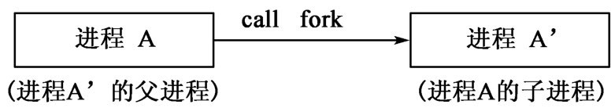

`fork函数`的特殊之处在于它被调用一次，但是会返回两个值，对于上图中，`进程A`调用`fork函数`之后，`fork`调用结束后将返回`0`给`子进程A'`，并且将`进程A'的进程号`返回给`进程A`。一个进程可以同时拥有多个子进程，但是一个进程只能有一个父进程，它可以通过调用`getppid`函数来获得其父进程的进程号。在调用`fork函数`之后，父子进程都将从位于`fork函数`调用点之后的指令处开始执行，但是`执行先后次序是不定的`。

通过调用`fork函数`生成的子进程可视为`其父进程的拷贝`。子进程将拥有父进程的数据段，堆区和栈区的拷贝，`若正文段是只读的`，则父子进程将共享正文段。为了减少调用`fork函数`的系统开销，许多系统（如Linux）使用了`用时拷贝（copy-on-write(COW)）技术`。也就是在调用`fork函数`时并没有真正地执行数据段，堆区、栈区在内存中的拷贝，内核只是将这些内容设置为只读状态，当父进程或子进程试图修改某些内容时，核心才将被修改的部分在修改之前进行拷贝。

一般情况下，无法知道父进程先执行还是子进程限制性，这取决于`操作系统核心的调度算法`。若需要父子进程进行某种同步，则应加入`进程间的通信原语`来实现。虽然通过将父进程睡眠的方式可以使得子进程先执行，但理论上这样做无法完全保证子进程先执行。

调用`fork函数`时，父进程的所有打开的文件描述符都将原封不动地给子进程复制一份，就像调用`dup函数`来拷贝文件描述符一样。因此`父子进程将共享每一个已打开的文件描述符所对应的文件`。例如，假设一个进程打开了三个文件：标准输出、标准输入、标准错误输出，当调用`fork函数`成功返回之后，该进程和它的子进程所使用的文件列表如下图：

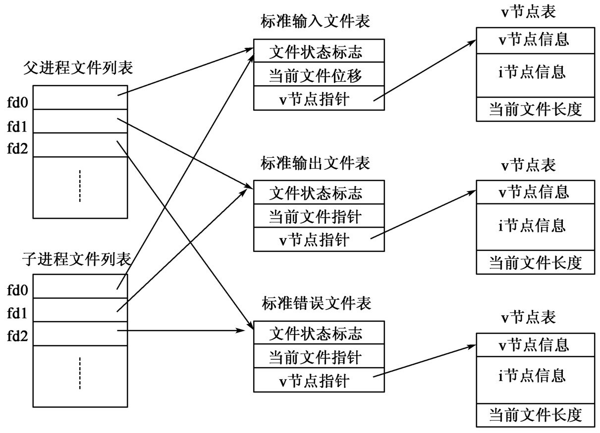

图中说明了一个重要的信息：就是父子进程`共享同一个文件偏移量`。这意味着若子进程先写一个文件，然后父进程再写时，父进程所写的内容将会添加在子进程先前所写的内容之后。当父子进程同时向标准输出写信息而不加任何`同步`，这时输出信息将会搅混在一起。假设一个文件在调用`fork函数`之前打开，那么只有当父进程调用`close函数`关闭该文件，同时子进程也进行同样的操作时，该文件才真正地被关闭了。除了文件描述符，父进程下列属性也会被子进程所继承：

- 真正用户ID、真正组ID、有效用户ID、有效组ID。
- 附加的组ID。
- 进程组ID。
- 会话ID。
- 控制终端。
- `set-user-ID`标识和`set-group-ID`标识。
- 当前工作目录。
- 根目录。
- 创建文件时的掩码。
- 信号掩码和信号处理的回调函数。
- 所有打开文件的`close-on-exec`标识。
- 环境变量列表。
- 连接的共享内存段。
- 资源限制。

当前，父子进程也非完全相同，它们之间有下列不同之处：

- 调用`fork`函数的返回值。
- 进程ID。
- 父进程ID。
- 子进程ID。
- 父进程给文件加的锁，子进程不继承。
- 子进程的未处理的警告被清空。
- 子进程的未处理的信号集将置为空集。
- 子进程的`tms_utime`、`tms_stime`、`tms_cutime`、`tms_ustime`被置为`0`。

`fork函数`调用失败有两个原因：一是系统中的进程数目太多，超过了系统设定的上限；二是对于该用户而言，它所创建的进程数目太多，超过了系统对它的限制。

`fork函数`的主要用途也有两个：一是一个进程想要`并发地`执行其`正文段`的`不同的部分`，那么它就可以通过调用`fork函数`生成一个子进程，然后父子进程同时执行。`Linux/Unix系统基于TCP/IP的网络服务器守护进程`就是当一个请求到达时，调用`fork函数`生成一个子进程，用子进程来处理请求；二是一个进程需要执行其他程序，这时子进程在调用`fork函数`返回后再调用`exec函数`来`载入其他可执行程序`。

另外，一些UNIX系统还提供了`vfork函数`，由于在Linux系统里，`vfork函数`完全等价于`fork函数`，故这里就不再对`vfork函数`进行讨论了。


## exit函数

一个进程可能在`三种情况`下`正常结束`，在`两种情况`下`非正常结束`。不管进程如何结束，内核终将执行以下操作：关闭所有打开的文件，释放该进程所使用的内存等。一个进程可以告诉其父进程自己是以何种状态结束的。对于`exit`和`_exit`函数，父进程可以获得子进程调用`exit`和`_exit`函数时的参数`status`。万一进程`非正常结束`，内核也会产生一个`结束状态字`来表明非正常结束的原因。因此，该进程的父进程总可以通过调用`wait`和`waitpid`函数来获取该进程结束时的状态。下表给出了几个宏，父进程可以利用它们来检查某个子进程结束时的状态。

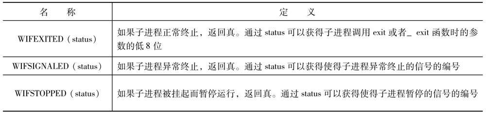

进程可以将自己的结束状态返回给它的父进程，`那么如果其父进程比它先结束呢？`这时，`init进程`将成为这个进程的父进程。因为当一个进程结束时，内核会检查其他的进程，找出这个结束进程的子进程，然后将这个进程的子进程的`父进程ID`置为`1`（`init进程`的进程号）。

`当一个进程先于它的父进程结束时`，内核将释放它使用的内存并关闭其打开的文件。但这个进程的一些残留信息还将由内核保存，以使这个进程的父进程将来查看这个进程是否结束了。这些`残留信息`包括：进程ID、进程结束状态字、进程所占用的CPU时间。这里称那些已经结束的但其父进程`还没有`检查其结束状态的进程为`僵尸进程`。

```go

package main

import (
	"os"
)

func main() {

	var procAttr os.ProcAttr
	newProc, err := os.StartProcess(os.Args[0], os.Args, &procAttr)
	if err != nil {
		panic(err)
	}
	err = newProc.Kill()
	if err != nil {
		panic(err)
	}
	for {}

}

```

上述示例代码运行后，其中创建的子进程会变成僵尸进程。

那么，如果`init`的子进程结束之后，会不会变成僵尸进程呢？不用担心，当`init`的子进程结束时，`init`会主动调用`wait/waitpid函数`来获取这个子进程的结束状态。


## wait和waitpid函数

父进程可以通过调用`wait`和`waitpid`函数来获取它的子进程的结束状态。这里介绍一下`wait`和`waitpid`函数，它们的原型如下：

```c

#include <sys/types.h>
#include <sys/wait.h>

pid_t wait(int* status);
pid_t waitpid(pid_t pid, int* status, int option);
返回值：成功：子进程ID；失败：-1。

```

对于`waitpid`，若`option`的值置为`WNOHANG`且进程号为`pid`的子进程还没有结束，将返回`0`。

调用`wait`和`waitpid`会出现下列三种情况之一：

- 若所有的子进程都没结束，则父进程在调用处阻塞（block）。
- 若有一个子进程结束，则立即返回。
- 若没有子进程存在，则调用失败，返回`-1`。

不管一个进程正常或非正常地结束，它的父进程都会收到一个由内核发给它的`SIGCHLD`信号，父进程可以忽略或定义一个回调函数去处理这个信号产生的事件。因此若在处理`SIGCHLD`的回调函数中调用`wait`函数，则`wait`函数将立即返回。`wait`和`waitpid`函数的不同之处在于：

- `wait`函数是完全阻塞式的，而`waitpid`函数可以通过设置第三个参数`option`来设置为非阻塞式的。
- `waitpid`函数可以指定等待某一个子进程，`wait`函数则等待任何一个子进程。

若函数调用成功返回，父进程可以通过返回值知道哪一个子进程结束了。调用时的参数`status`是一个整数型指针，当`status`为`非NULL`时，结束的子进程的`结束状态码`将存放在`status`所指的内存单元中；若`status`为`NULL`时，表明父进程并不关心子进程的结束状态。具体的结束状态是由设置`status`所指内存单元的某个位（bit）来体现的。通过调用`POSIX`定义的如下表所示的三个宏，父进程可以方便地得到某个子进程的结束状态。

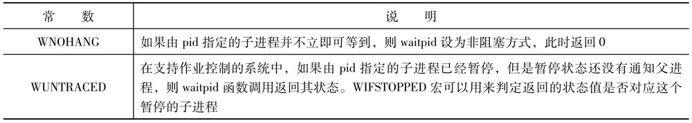

对于`wait`函数，还应做一些补充说明。当某个进程由多个子进程，而它又想要检查其中某一个特定的子进程是否结束时，应该使用`waitpid`函数。`waitpid`的第三个参数`option`的定义如上表所示。

它的第一个参数`pid`的语义依赖于`pid`的值，如下表所示。

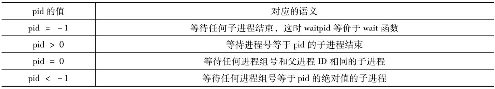

如果`waitpid`所指定的子进程或进程组并不存在，则调用将会失败返回。


## wait3和wait4函数

`4.3+BSD版`的UNIX提供了另外两个和`wait`相关的函数：`wait3`和`wait4`函数，它们的原型如下：

```c

#include <sys/types.h>
#include <sys/wait.h>
#include <sys/time.h>
#include <sys/resource.h>

pid_t wait3(int *status, int option, struct rusage *ruptr);
pid_t wait4(pid_t pid, int* status, int option, struct rusage *ruptr);
返回值：与wait和waitpid函数相同。

```

完全可以将`wait3`视为`wait`的增强版，`wait4`为`waitpid`的增强版。它们新增了由内核给出的`结束的子进程`的`系统资源的使用信息`。这些信息包括：用户CPU时间，系统CPU时间，页中断次数，接收的信号个数等。

对比地，`Go语言`的`syscall`包提供了如下内容：

```go

func Wait4(pid int, wstatus *WaitStatus, options int, rusage *Rusage) (wpid int, err error)

type WaitStatus uint32

func (w WaitStatus) Continued() bool
func (w WaitStatus) CoreDump() bool
func (w WaitStatus) ExitStatus() int
func (w WaitStatus) Exited() bool
func (w WaitStatus) Signal() Signal
func (w WaitStatus) Signaled() bool
func (w WaitStatus) StopSignal() Signal
func (w WaitStatus) Stopped() bool
func (w WaitStatus) TrapCause() int

// `Signal`是描述进程信号的数值。它实现了`os.Signal`接口。
type Signal int

func (s Signal) Signal()
func (s Signal) String() string

type Rusage struct {
    Utime Timeval
    Stime Timeval
    Maxrss int64
    Ixrss int64
    Idrss int64
    Isrss int64
    Minflt int64
    Majflt int64
    Nswap int64
    Inblock int64
    Oublock int64
    Msgsnd int64
    Msgrcv int64
    Nsignals int64
    Nvcsw int64
    Nivcsw int64
}

```


## 竞争条件

当`多个进程`对于`某些共享数据`进行操作，而且`最终的结果与这些进程执行时的次序有关`时，就称为`发生了竞争条件`。例如，利用调用`fork`函数生成的子进程和它的父进程若都向标准输出写信息，则输出结果和父子进程的执行次序有关。然而，父子进程的执行次序是由当时`系统的负载程度`以及`内核的进程调度算法`决定的，不是人为地可预测的。即使调用`sleep`函数让某一个进程推迟执行，也无法绝对保证父子进程按特定的顺序执行。`产生竞争条件是很危险的`，因为程序的错误是在某个特定条件下才发生的，是不可再现的，所以排错十分费时费力。完全消除竞争条件的`唯一方法`就是`通过进程间通信`来同步各进程的执行。


## exec函数

产生一个新的进程并且希望这个进程执行新的应用程序时，可以通过条用`fork函数`后再由子进程调用`exec函数`来载入新的程序。当一个进程调用`exec函数`时，这个进程的上下文（数据段、正文段、堆区、栈区）都将被新程序的上下文所覆盖，并且从`新程序的main函数`的入口处开始执行。`不变的只是`这个进程的进程ID。Linux/Unix系统提供了`6个不同形式`的`exec函数`，这些函数连同`fork`、`wait`、`waitpid`函数构成了进程控制基本且完备的原语集。这6个函数的原型如下：

```c

#include <unistd.h>

int execl(const char* pathname, const char* arg1, ..., (char*)0);
int execv(const char* pathname, const char** argv);
int execle(const char* pathname, const char* arg0, ..., (char*)0, const char** envp);
int execve(const char* pathname, const char** argv, const char** envp);
int execlp(const char* filename, const char* arg0, ..., (char*)0);
int execvp(const char* filename, const char** argv);
返回值：成功：不返回；失败：-1。

```

前四个`exec`函数使用带路径的文件名，而后两个`exec`函数则用不带路径的文件名。使用后两个`exec`函数时，系统会在`环境变量PATH`所定义的缺省路径中查找这个文件。当调用`execlp`或`execvp`函数找到了指定的文件时，若该文件不是`二进制映像文件`，则系统将视之为`shell脚本文件`，并调用`/bin/sh`来解释这个文件。

调用`execl`、`execlp`、`execle`函数时要求分别传递所有的`命令行参数`，并以一个空指针（`(char*)0`）做为`终结符`。而调用`execv`、`execvp`、`execve`函数时则要求将`命令行参数`包装在一个`字符型指针的数组`之中。还应注意以下两点：

- 第一个命令行参数应该是可执行文件的文件名。
- 若以`0`为空指针时，应该强制转换为`char*`类型，若想改变新程序运行时的环境变量，除了使用`setenv`和`putenv`函数，还可以利用`execle`和`execve`来传递一个新的环境变量列表。

这6个`exec函数`看上去似乎有些难记，其实还是可以找到一些记忆规律的：`字母p`表示执行文件名不带路径，`字母l`标识命令行参数要以独立的形式传递，而`字母v`表示命令行参数要以数组形式来传递，`字母e`表示将传递环境变量列表。

调用`exec函数`后产生的新进程体除了继承调用进程的进程ID，还继承了如下属性：

- 父进程号。
- 实际的用户标号和组标号。
- 附加组标号。
- 进程组标号。
- 会话标号。
- 控制终端。
- 闹钟剩余的时间。
- 当前工作目录。
- 根目录。
- 创建文件时的掩码。
- 文件的锁。
- 信号掩码。
- 未处理的信号。
- 资源限制。
- tms_utime、tms_stime、tms_cutime、tms_ustime的值。

对于`已经打开的文件`，新程序的处理方式将依赖于`该文件描述符fd`的`close-on-exec`（或`FD_CLOEXEC`）位的设置。若`close-on-exec`位为`1`，则执行`exec`后将会关闭该文件。除非调用`fcntl`函数来设置`close-on-exec`位的值，缺省情况下调用`exec`函数返回之后文件还将继续打开（也就是文件描述符fd不变）。但是对于`已经打开的目录`，调用`exec`函数返回后会将其关闭。虽然实际用户ID和实际组ID在调用`exec`函数返回后的值不变，但若新程序的`set-user-ID`位被置为`1`，则它的`有效用户ID`将会被置为`程序文件主（owner）`的`实际用户ID`。否则`有效用户标号`将不变。同理，该程序`有效组ID`的值也根据`set-group-ID`位是否被置为`1`而定。


系统并没有将这6个函数一一都实现，而只实现了`execve`函数，其余5个函数最终都会调用`execve`函数，因此，下图给出这6个`exec函数`的关系。

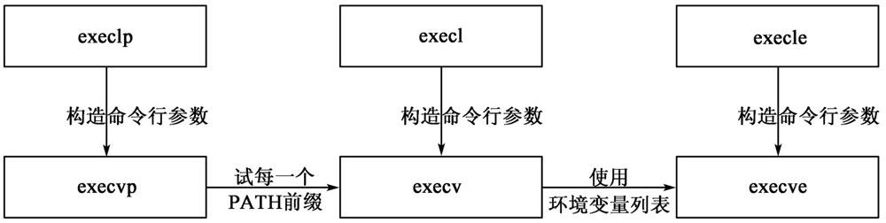

对比地，`Go语言`的`syscall`包提供了如下内容：

```go

func CloseOnExec(fd int)

// `Exec`调用了`execve(2)`的系统调用。
func Exec(argv0 string, argv []string, envv []string) (err error)

func ForkExec(argv0 string, argv []string, attr *ProcAttr) (pid int, err error)


```

`os`和`os/exec`包内封装了更多实用的API，详细请查看源码文档。


## setuid和setgid函数

内核将`四个`用户标识号与一个进程相关联。它们分别为`真正用户标识号（real user ID）`和有`效用户标识号（effective user ID）`。真正用户标识号负责标识运行进程的用户，有效用户标识号用于给新创建的文件赋予一定的权限，检查文件的存取权限，以及检查处理`软中断`信号的权限。同样，还有`真正组标识号（real group ID）`和`有效组标识号（effective group ID）`。为了修改这些ID的值，系统提供了`setuid`和`setgid`函数，它们的原型为：

```c

#include <sys/types.h>
#include <unistd.h>

int setuid(uid_t uid);
int setgid(gid_t gid);
返回值：成功：0；失败：-1。

```

对于用户标识号（组标识号亦然），修改用户标识号应遵守以下规则：

（1） 若`进程有超级用户的权限`，则可将`真正用户标识号`、`有效用户标识号`以及`保存的set-user-ID`均置为`uid`。
（2） 否则，若`uid`等于`真正用户标识号`或`保存的set-user-ID`，`setuid`函数仅仅将`有效用户标识号`设为`uid`。
（3） 其余情况下，调用失败，`errno`将被置为`EPERM`。

`保存的set-user-ID`只是由调用`exec`函数时从`有效用户ID`拷贝的。如果`进程的set-user-ID位`没有被置为`1`，在调用`exec`后，`有效用户ID`将保持不变。可以利用`setuid`函数将`有效用户ID`置为`真正用户ID`或`保存的set-user-ID`两者之一。下表总结了三种用户标识号在`setuid`作用下的变化规则。`进程的真正用户标识号`是在`login`时确定的，只能由`超级用户`利用`setuid`函数来修改它。只能通过`getuid`和`geteuid`函数来获取`真正用户标识号`和`有效用户标识号`，无法获取`当前的set-user-ID`。

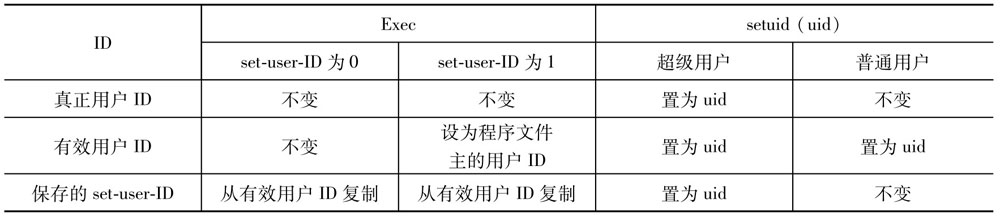

现在应该来说明`保存的set-user-ID`的用途了。Linux中`cu命令`时用来连接远程系统的命令。当`cu`使用`调制解调器（modem）`时，将要访问一些相关的设备文件。这些设备文件被名为`uucp`的用户共享。查看`/usr/bin/`目录下的`cu`，可以知道它的文件主是`UUCP`，并且`set-user-ID`位也被置为`1`。当调用`exec`函数载入`cu`时：

- 真正用户ID=当前用户ID。
- 有效用户ID=uucp。
- 保存的set-user-ID=uucp。

由于此时`有效用户ID`为`uucp`，进程有权来访问那些设备文件，`cu`也将访问这些文件。接着`cu`调用`setuid(getuid())`，由于`真正用户`不是`root`，依见前面规则（2），仅仅`有效用户ID`被改为`真正用户ID`。这时，进程只有`一般用户的权限`，而没有`uucp的权限`。当退出`cu`时，`cu`又执行了`setuid(uucpid)`，根据规则（2），`有效用户ID`变为`uucp`，这时`cu`又有了访问那些设备文件的权限，从而进行收尾工作。因此，正因为有了`保存的set-user-ID`。一个进程可以在起始和结束时获得额外的权限，这样就保证了进程执行时的系统的安全性。

对比地，`Go语言`的`syscall`包内提供了如下函数：

```go

func Setuid(uid int) (err error)
func Setgid(gid int) (err error)

```


## setreuid和setregid函数

Linux/Unix系统还提供了用于交换`真正用户（或组）ID`和`有效用户（或组）ID`的`setreuid`和`setregid`函数，它们的原型如下：

```c

#include <sys/types.h>
#include <unistd.h>

int setreuid(uid_t ruid, uid_t euid);
int setregid(gid_t rgid, gid_t egid);
返回值：成功：0；失败：-1。

```

使用`setreuid`可以方便地实现前面一节中`cu`命令所要求的权限之间的转换。但是有一点应当注意，由于`cu`的`set-user-ID位`被置为`1`，所以若`cu`使用`setreuid`将`真正用户ID`变为`uucp`时，`cu`若想再加载其他程序（利用调用`fork`和`exec`函数），一定要在调用`exec`函数之前将`真正用户ID`改为`普通用户的ID`，否则被加载的程序会以`uucp权限`执行，将可能引起安全问题。

对比地，`Go语言`的`syscall`包内提供了如下函数：

```go

func Setreuid(ruid int, euid int) (err error)
func Setregid(rgid int, egid int) (err error)

```


## seteuid和setegid函数

Linux/Unix系统也提供了`仅仅`修改`有效用户（或组）ID`的`seteuid`和`setegid`函数，它们的原型如下：

```c

#include <sys/types.h>
#include <unistd.h>

int seteuid(uid_t uid);
int setegid(gid_t gid);
返回值：成功：0；失败：-1。

```

`普通用户`可以将`有效用户ID`设为`真正用户ID`或`保存的set-user-ID`，`超级用户`可将`有效用户ID`设置位`uid`。不同于`setuid`，`seteuid`只能修改`有效用户ID`，下表展示了前面给出的几个函数修改用户ID的关系图。

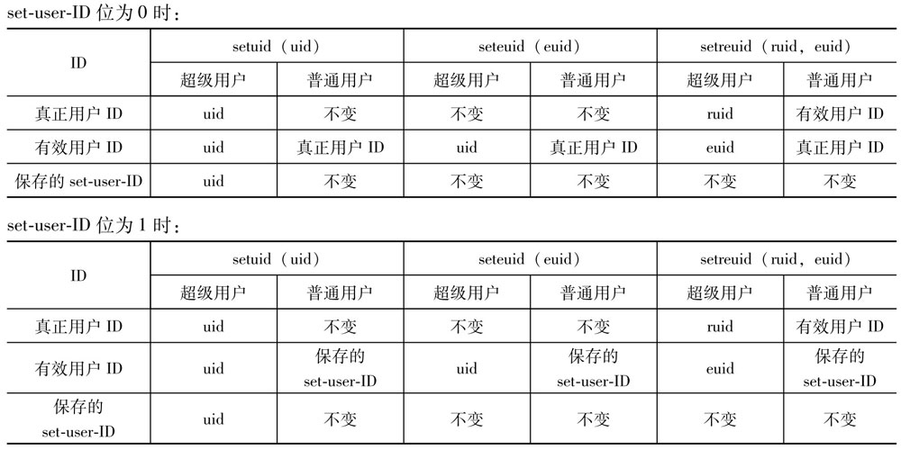


## system函数

`ANSI C`定义了`system`函数，利用它可以方便地在程序内部执行一个`shell命令`，其原型如下：

```c

#include <stdlib.h>

int system(const char* commandString);
返回值：（详见下文）

```

Linux/Unix系统都支持`system`函数，它实际上是通过调用`fork`、`exec`和`waitpid`这三个函数来实现的，故`system`的返回值的情况比较复杂：

（1）若`commandString`为`NULL`或者若`shell解释程序（如/bin/sh）`不存在时，函数的返回值为`0`。

（2）若调用`fork`函数失败或者调用`waitpid`函数失败时，调用失败，函数返回`-1`，并且将设置`errno`指出失败的原因。

（3）若调用`exec`函数失败（也就是`shell解释程序`无法执行），调用失败，返回值为`127`。

（4）当调用`fork`、`exec`和`waitpid`函数都成功时，将返回`shell程序`执行结束时的状态字。

程序`system.c`给出了`system`大致的实现方法，不过它还应加上对中断的处理。

```c

// system.c

#include <sys/types.h>
#include <sys/wait.h>
#include <errno.h>
#include <unistd.h>

int system(const char* cmdstring)
{
	pid_t pid;
	int status;
	if (cmdstring == NULL)
		return (1);
	if ((pid=fork()) < 0)
	{
		status = -1;
	} else if (pid == 0) {
		execl("/bin/sh", "sh", "-c", cmdstring, (char*)0);
		_exit(127); // 如果execl调用正常，这条语句将永远部执行
	} else {
		while (waitpid(pid, &status, 0) < 0) // 父进程等待子进程结束
			if (errno != EINTR) {
				status = -1;
				break;
			}
	}
	return (status);
}

```

执行`/bin/sh`时使用了选项`-c`，则`/bin/sh`将视`-c`后面的命令行参数为输入的命令，而不是标准输入，进而解释并执行该命令。如果直接利用shell来执行命令，则实现起来将会困难许多。要利用`execlp`来加入环境变量列表，同时又得对命令行进行语法分析。另外，shell提供的通配符也无法使用。注意到子进程出错退出调用的是`_exit`函数而不是`exit`函数，这是为了防止进程调用`exit`函数时将父进程的`I/O缓冲区`给刷新了。

利用`system`函数而不是调用`fork`和`exec`函数的主要好处在于`system`的实现中做了许多必要对`错误码（errno）`以及`信号`的处理。`waitpid`函数也为`system`函数的实现提供了强有力的支持。在较早的系统中并没有提供`waitpid`函数，故父进程等待某一个子进程时，通常用下面的语句实现：

```c

while((lastpid=wait(&status)) != pid && lastpid != -1);

```

若父进程在执行`system`函数之前就生成了若干个子进程，那么在执行`system`函数时，如果先前的子进程结束了，则这些子进程的`结束状态字`都会因为上面的`while语句`而丢失。

`system`函数存在一个安全漏洞。当在一个`set-user-ID位`被置为`1`的应用程序A中调用`system`函数运行程序B时，程序B将以程序A的权限运行。如果程序A的`真实用户ID`是`root`，这意味着程序B运行中可能会拥有过高的权限。造成这个现象的原因是`system`函数在调用`fork`函数返回之后，并且在调用`exec`函数之前没有将生成子进程的权限置为普通用户权。因此，`system`函数不能用于`set-user-ID`和`set-group-ID位`被置为`1`的程序。

对比地，`Go语言`的`syscall`包内提供了如下函数：

```go

// `fork`和`exec`的合并，线程不安全。
func FOrkExec(argv0 string, argv []string, attr *ProcAttr) (pid int, err error)

// `StartProcess`为`os`包对`ForkExec`函数进行了包装。
func StartProcess(argv0 string, argv []string, attr *ProcAttr) (pid int, handle uintptr, err error)

```

`os`包和`os/exec`包内提供了更多相关的实用API。详见Go源码文档。


## getlogin函数

每个过程都可以获取`真正用户ID`、`有效用户ID`和`组ID`。一个用户可以拥有多个登录用户名并且使用相同的用户ID，虽然查看环境变量`LOGNAME`可以获取登录名，但由于用户可以修改环境变量，所以这个方法不可靠。`Linux/Unix系统`提供了`getlogin`函数来获得登录名，函数原型如下：

```c

#include <unistd.h>
char* getlogin(void);
返回值：成功：用户名字符串的首地址；失败：NULL。

```

若进程没有指派给用户登录所用的终端时（如后台守护进程），调用会失败。有了登录用户名，就可以通过访问文件`/etc/password`来获取这个`用户登录的信息`（如`shell类型`，`home目录`等）。


## times函数

一个进程可以获得该进程运行时的`墙上时间（实际运行时间）`，`用户CPU时间`，`系统CPU时间`。通过调用`times函数组`可以达到这个目的，该函数地原型为：

```c

#include <sys/types.h>

clock_t times(struct tms *tmsptr);
返回：成功：运行地墙上时间；失败：-1。

```

`tms结构`地定义如下：

```c

struct tms {
    clock_t tms_utime;  // 用户CPU时间
    clock_t tms_stime;  // 系统CPU时间
    clock_t tms_cutime; // 结束了的子进程的用户CPU时间
    clock_t tms_cstime; // 结束了的子进程的系统CPU时间
}

```

由于返回的`墙上时间`并不精确（因为计时的起始点本身就不精确），故应该通过先后两次调用`times`函数，然后求两者的时间差，这个差值才能当作`精确的`进程运行的墙上时间。若父进程调用`wait/waitpid`函数等待它的子进程结束，则子进程结束后，父进程可以获得`子进程的用户CPU时间`和`系统CPU时间`。

对比地，`Go语言`的`syscall`包内提供了如下内容：

```go

func Times(tms *Tms) (ticks uintptr, err error)

type Tms struct {
    Utime int64
    Stime int64
    Cutime int64
    Cstime int64
}

```


## 守护进程


### 守护进程的特点

守护进程都是有很长的生命期（一般和系统同时存在）。它们在系统启动时就被载入运行，随着系统关闭（shutdown）而结束。它们都是在后台运行，并且都没有控制终端。守护进程都是用来完成系统例行的管理功能。

如果运行：

```sh

$ ps -axj

```

可以类似看到：

```

PPID  PID  PGID  SID  TTY  TPGID  STAT  UID  TIME  COMMAND
0     1    0     0    ?    -1     S     0    0:02  init
1     13   13    13   ?    -1     S     0    0:02  /sbin/update
1     73   46    46   ?    -1     S     0    0:00  /usr/sbin/rpc.mountd
1     77   46    46   ?    -1     S     0    0:00  /usr/sbin/crond-l10
1     61   61    61   ?    -1     S     0    0:07  /usr/sbin/syslogd
1     64   64    64   ?    -1     S     0    0:00  /usr/sbin/klogd
1     68   68    68   ?    -1     S     0    0:00  /usr/sbin/inetd
68    2912 68    68   ?    -1     S     0    0:00  in.telnetd
1     70   70    70   ?    -1     S     0    0:00  /usr/sbin/lpd
1     75   75    75   ?    -1     S     0    0:00  /usr/sbin/rpc.nfsd
1     83   83    83   ?    -1     S     0    0:00  sendmail: accepting connecting
1     3494 3494  3494 3    3494   S     0    0:00  /sbin/agetty 38400 tty3 Linux
1     3496 3496  3496 1    3496   S     0    0:00  /sbin/agetty 38400 tty1 Linux
1     3499 3499  3499 2    3524   S     1012 0:00  -csh
3499  3524 3524  3499 2    3524   R     1012 0:00  ps -axj   

```

这里删掉了若干不关心的列的信息。显示的各列从左向右依次表示：`父进程ID`、`进程ID`、`进程组ID`、`会话ID`、`终端名称`、`终端进程组ID（也就是前台进程组ID）`、`用户ID`和`命令名`。进程号为`0`、`1`、`2`的三个专门的进程分别是`swapper`、`init`和`pagedeamon`进程。它们没有父进程，没有进程组标识号，也没有会话标识号。`syslogd`守护进程用来给应用程序记录相关的系统日志（以便于系统的维护），日志信息可以写入一个文件或输出到控制台。`sendmail`是标准邮件守护进程。`update`守护进程将在一定时间段内将磁盘缓冲区的内容写回对应的磁盘空间上去。`cron`守护进程将在特定的时间执行一些特定的程序，对系统进行例行的基本管理措施。`inetd`守护进程用来监听由网络传输来的请求。`lpd`守护进程用来处理打印请求。

`所有`的`守护进程的用户ID`均为`0`，它们都以`超级用户的权限运行`。它们都没有控制终端（因为`TPGID`的值均为`-1`），除了`update`进程，其余守护进程都是`会话的领导进程`，也是`进程组的组长进程`，并且这些会话和进程组中只有它自身一个进程。`update`进程所在的进程组的组长进程此时已经结束了，所以看不到它。`这些守护进程的父进程`均为`init`进程。


### 守护进程的例子

编写守护进程的一些基本原则：

（1）首先要做的事是调用`fork函数`，然后让父进程结束。由于这个程序从shell中启动，它将拥有控制终端。当父进程结束时，shell将认为命令结束了，子进程的父进程将变为`init进程`，同时子进程成为`孤儿进程组`的一员。这时子进程将不可能是它的进程组的组长进程，从而满足了调用`setsid`的条件。

（2）调用`setsid`函数来建立一个`新的会话`。这时子进程将成为新会话的首领进程和新的进程组的组长进程，并且失去了控制终端（如果原来有的话）。

（3）将当前目录改编为`根目录`（或其他特定的目录），如果守护进程对应的程序位于一个`文件卷`上，要保证这个文件卷可以被装上。

（4）将文件建立时的`掩码`设为`0`，这样守护进程建立文件时的缺省的存取权限不会受到它继承原来父进程的文件掩码的影响。

（5）`关闭无用的文件描述符`，这样可以避免守护进程对原先父进程所打开的文件进行误操作。


### syslog函数

由于守护进程没有控制终端，它无法对标准输入、标准输出、标准错误操作。它如何处理错误信息呢？不希望有的守护进程把错误写到控制台，也不希望所有守护进程把错误不加分类地写到不同的文件中去，因为这样对于系统意外错误的管理和查询造成了许多麻烦。因此需要一个集中的对守护进程的错误信息管理的机制。

Linux/Unix系统中提供了`syslog`函数来实现这一机制。函数原型如下：

```c

#include <syslog.h>

void openlog(char* ident, int option, int facility);
void syslog(int priority, char* format, ...);
void closelog(void);

```

可以看出有三种情况可以产生日志信息：

- 内核调用`log函数`将信息记录在`/dev/klog`文件中，进程可以打开`/dev/klog`文件来读取这些信息。
- 多数守护进程调用`syslog`函数，将日志信息写到Unix域的数据报嵌套字`/dev/log`中。
- 主机上的进程或通过`TCP/IP协议`从网络登录的进程可以向`UDP`的`514`号端口写日志信息，这需要通过网络编程实现。

`syslogd`守护进程在启动时读取`/etc/syslog.conf`文件进行初始化，从而确定各类的日志信息该如何输出。若调用`syslog`之前没有调用`openlog`函数，那么系统将自动地调用`openlog`函数。同样，显式调用`closelog`函数也不是必需的。`openlog`中的参数`ident`指明了产生日志信息的程序（如`cron`、`inetd`等），下表给出了四个可能的`option`的值。

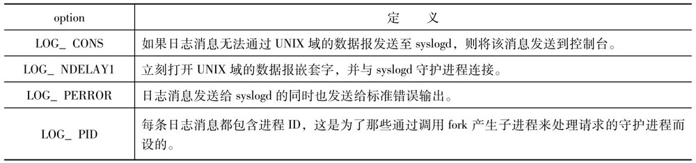

下表列出`facility`参数的值，它主要用来区分各类日志信息，从而对其进行不同的处理。

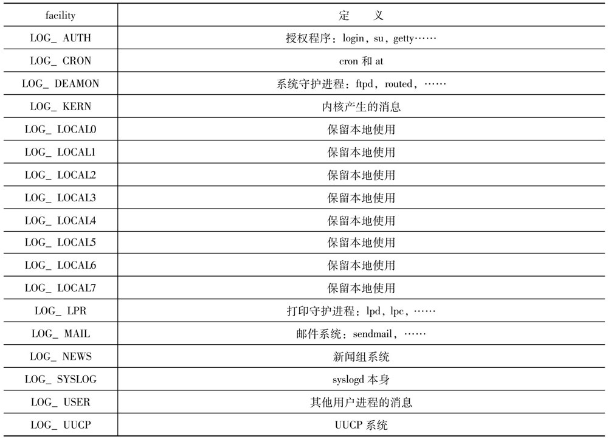

`syslog`函数中的`priority`参数是`facility`的值和下表中的`level`的值的结合，`level`是用来区分日志信息的优先级的，下表列出了`level`的定义。

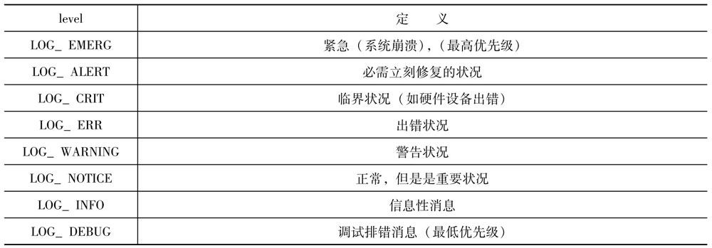

`format`参数基本上等同于`printf`函数中的`format`参数，但当其中出现`%m`时，表示系统将调用`strerron(erron)`将`errno`对应的错误的文件描述信息打印出来。请看下面这条语句：

```c

syslog(LOG_ERR|LOG_LPR, "open error for %s %m", filename);

```

将输出`lpr`守护进程意外出错时产生的日志信息。
