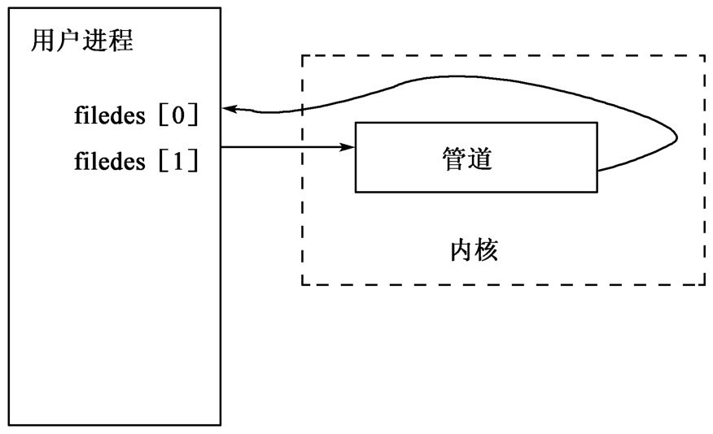
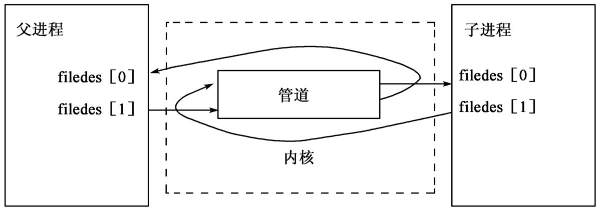
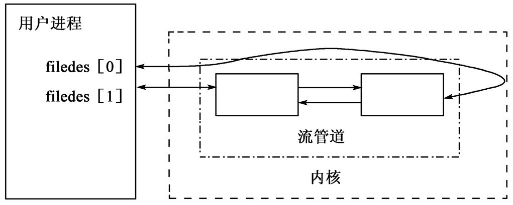
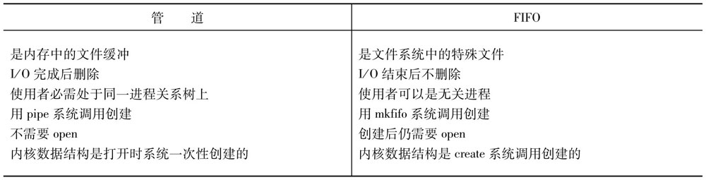
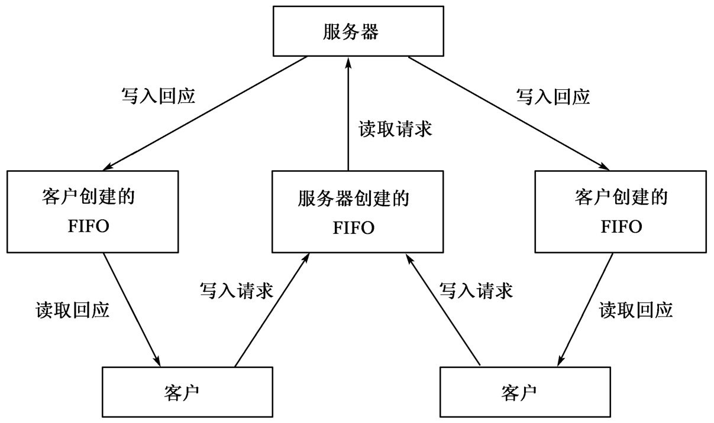
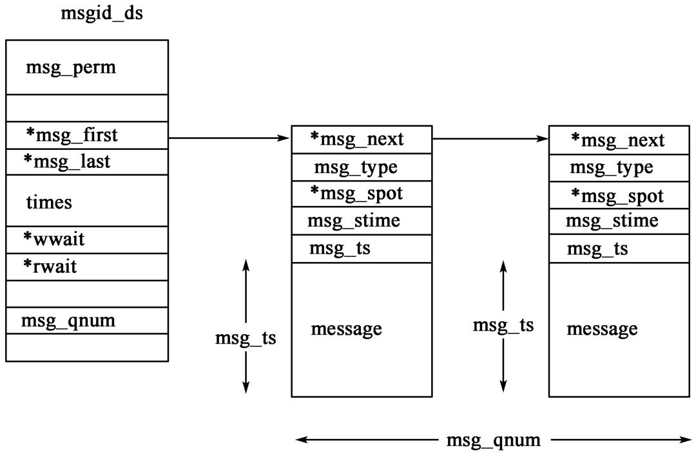
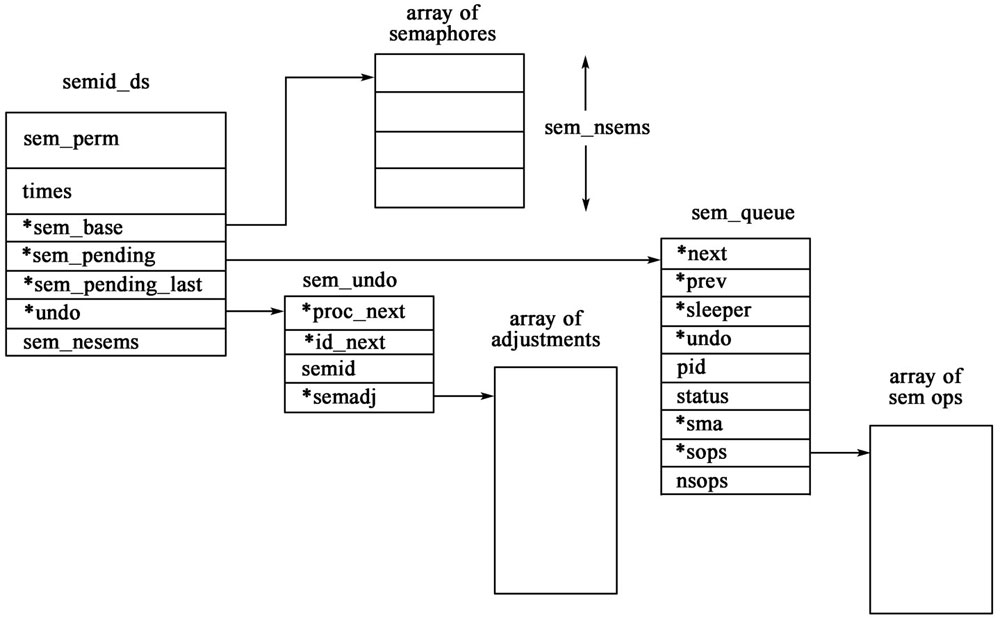
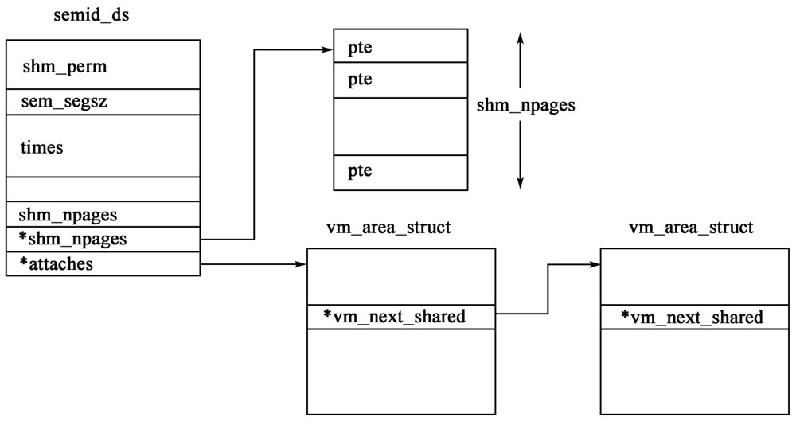
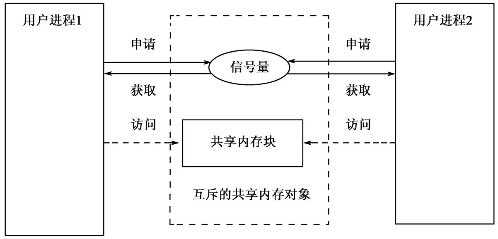

# 进程间通信（Inter-Process Communication）

上一章讲述了关于`进程控制的系统调用`以及`操作多个进程的方法`，但是关于`进程之间如何交互以及传送信息`，只涉及了通过`文件系统`，`靠对已知文件的I/O操作进行通信`和`依靠exec系统调用的命令行参数传递`。这一章将探讨更深入、更有效的`进程间通信机制`，包括`管道`、`命名管道`和`System V通信机制`。

实际上Unix`进程间通信（IPC）`除了以上所说的各种方式以外，还有`信号`和`套接管Socket`。`Socket`是可以在不同主机进程间进行通信的方式，而`Unix域Socket`则是同一主机进程间通信的常用手段。关于信号处理将有专门的章节进行论述，`Socket`操作也将独立地在网络编程一章中阐述。本章只讨论`管道（pipe）`、`命名管道（FIFO）`、`消息队列`、`信号量`和`共享内存`。

Linux对上述`五种`进程间通信方式都有充分的支持。这些通信机制也同样被`SVR4`、`BSD`、`AIX`等Unix系统所支持。


## 管道和命名管道


### 管道

管道是`很基本的`Unix IPC方式。管道的概念十分契合`Unix的泛文件思想`，任何一个熟悉Unix Shell命令的用户都了解管道的用法。例如，使用如下命令：

```sh

who | sort

```

来对所有已经登录到系统中来的用户按字母顺序排序并打印到屏幕。这里的`管道符号（|）`表示把`who`命令的输出作为`sort`的输入。具体的实现由Shell程序代劳。Shell程序创建了这两个进程并在其中建立管道连接。通过这个例子，可以看出管道具有以下两个特性：

（1）管道连接两个进程，数据从一端流向另一端，因此它是`单向的`，`半双工`的字节流。

（2）管道连接两个有`共同祖先`的进程。通常都是祖先进程创建管道，调用`fork`函数分支出子进程，子进程继承并使用管道。不在一条进程链上的进程不能使用管道。


### 管道的基本操作

管道以特殊的系统调用`pipe`来创建，然后以一般的文件操作对管道进行读取，`pipe`调用的原型是：

```c

#include <unistd.h>

int pipe(int filedes[2]);

```

`filedes`是包含两个文件描述符的数组。当`pipe`返回的时候，`filedes[0]`以读方式打开，`filedes[1]`以写方式打开，`filedes[1]`的输出就是`filedes[0]`的输入。下图是执行了操作`pipe(filedes[2])`后进程的状态：



在同一个进程中使用管道是没有意义的，通常在创建管道后进程要调用`fork`，然后在父进程和子进程之间通过管道进行通信。

下图是程序执行到`fork()`语句之后父子进程的状态：



如果父进程想从子进程接收数据，它应该关闭`fd[1]`，子进程应该关闭`fd[0]`。如果父进程想向子进程发送数据，它应该关闭`fd[0]`，子进程应该关闭`fd[1]`。因为管道始终是父子进程共享的，而文件描述符是双方各有一份，所以关闭不需要的文件描述符不会引起任何问题。

实质上`管道是存储在内核中的一片文件缓冲`，一旦建立，系统以普通文件的读写方式对待它。同一管道可供多个进程读或写。管道中数据容量的大小是有限制的，在不同系统中不尽相同。在Linux系统中管道容量大小定义在`/usr/include/linux/limits.h`文件中：

```c

#define PIPE_BUF        4096	/* # bytes in atomic write to a pipe */


```

该值的大小表明了`任一时刻``管道中数据量`不能超过`4096字节`，否则`write`操作将堵塞或者返回`0`（在非堵塞情况下），在POSIX.2标准里，`PIPE_BUF`为`512`。

一旦创建管道，其文件描述符被系统以普通文件描述符的形式处理。下面列出了各种文件操作在管道的作用：

（1）`read`：数据按先入先出的顺序从管道中读出并且只能读出一次。一旦读出以后，数据就从管道中永久删除。一般情况下，如果管道为空，`read`将堵塞直到有至少一个字节的数据可读。如果写入端关闭了管道并且`read`读到了管道的末尾，将返回`0`，这标志着管道不再有数据写入，因此读取端也可以放弃使用该官到了。`read`调用的第三个参数是希望读取的字节数，它并不保证实际也读取了这么多字节，因此程序员要时时检查`read`的返回值以了解实际读取的字节数，处理各种意外情况。如果管道的`O_NDELAY`标识位被设置，`read`遇到管道末尾则返回`-1`，并将`errno`置为`EAGAIN`。非堵塞情况下管道为空的返回和堵塞情况下管道结束的返回是一样的，这就要求读取端进程明了管道的状态。

（2）`write`：数据`按时间顺序`写入管道。因为`文件I/O`的系统调用是`不可重入的`，因此即使是多个写入者也不会发生数据块中断和错位的情况。一般情况下，`write`在管道满的情况下堵塞，直到某个`read`操作移走了老数据。如果管道的`O_NDELAY`标识位被设置，`write`遇到管道满的情况立即返回`0`。如果所有读取端进程都关闭了管道而`write`仍试图写入数据，将会产生了一个`致命信号SIGPIPE`，并返回`错误号EPIPE`。

（3）`close`：`close`不仅回收了该文件描述符，而且标记了一个管道的末尾。这也是唯一标记管道末尾的方法。

（4）`fcntl`：设置或者清除管道的`O_NDELAY`标识位。其他对普通文件有效的标识位对管道无效。

（5）`fstat`：在`fstat`返回的`stat结构`中，`st_size`表明了当前管道中数据的字节数。`st_ulink`的值为`0`，这是管道区别于其他文件的地方，因为管道的文件描述符不连接到任何一个目录下。这个区别对于某些要区别特殊文件的I/O例程有特别的用处。其他所有`stat结构`成员的值都是`0`。

（6）`dup`：`dup`复制一个文件描述符，返回一个新的文件描述符，这个文件描述符的值是该进程可用的文件描述符的最小值。这`两`个`文件描述符`共享同`一`个`文件指针`。例如当某进程关闭文件描述符`0`并且调用`dup(pfd)`，则返回的文件描述符必定是`0`，然后该管道可以作为标准输入。

（7）`dup2`:`dup2`把一个文件描述符复制到指定的值。`dup2`通常与`close`连用，在`dup2`成功的情况下，被复制的文件描述符关闭。`dup2`并不能保证复制总是成功，程序要检查`dup2`的返回值是否与第二个参数相同，然后再决定是否调用`close`，否则就可能不可挽回地丢失掉唯一的文件描述符。通常`dup2`的第一个参数是`STDIN_FILENO`成`STDOUT_FILENO`，表示把管道复制为标准输入或输出。

（8）`open`：`open`操作对管道无效，因为管道只由`pipe`操作打开。

（9）`create`：无效，原因同上。

（10）`lseek`：无效。显然，如果能在管道中使用`lseek`就违反了管道数据先入先出的原则。除非先读出管道前面的数据，否则不能对其后的数据进行访问。

对比地，`Go语言`的`syscall`包内提供了如下函数：

```go

func Pipe(p []int) (err error)

func Pipe2(p []int, flags int) (err error)

```

`os`包内还封装了更实用的函数：

```go

// `Pipe`返回一个连接成对的文件对象，从`w`中写入，从`r`中读取。
// 返回值为两个文件和报错（如果有的话）。
func Pipe() (r *File, w *File, err error)

```


### 集成的调用popen、pclose

编程时经常出现的一种编程形式是，`调用现有程序，让它作为本身进程的输入输出`。作为一种套路，它的程序代码中必然要做以下几步工作：

（1）创建管道。
（2）调用`fork`，创建子进程。
（3）在子进程中把`管道文件描述符`复制到标准输入或输出文件号，并`关闭多余的`文件描述符。
（4）子进程`exec`其他应用程序。
（5）父进程也`关闭一个多余的`管道文件描述符。
（6）父子进程读写管道。
（7）父进程等待子进程终止。

C语言的标准类库提供了代劳上述工作的库函数`popen`和`pclose`，它们能帮助简化代码，减少工作量：

```c

#include <stdio.h>

FILE* popen(const char* cmdstring, const char* type);

#include <stdio.h>

int pclose(FILE* fp);

```

`popen`帮助您`fork`当前进程，执行`cmdstring`所指向的程序，返回一个标准`I/O`文件指针。如果`type`字符串中的第一个字符是`r`，该文件指针被连接到被调用程序的标准输出。如果`type`字符串的第一个字符是`w`，则该文件指针连接到被调用程序的标准输入。下面是`popen`函数的几个例子：

```c

popen("ls -l", "r");
popen("sort > /tmp/foo", "w");
popen("sort | more", "w");

```

`pclose`关闭`popen`返回的I/O文件指针，等待被调用程序的执行结束，最后返回该程序的结束状态。

有的用户根据编写Unix Shell脚本的经验，可能`错误地`把管道理解为只是实现`标准输入输出重定向`的一种机制，实际上`管道`是`通用的进程间通信机制`，使用方法很广。

对比地，`Go语言`的`os/exec`包内提供了同样功能的API，从源码注释可知，其进行了非常实用的封装，值得一提的是，其封装里已经应用了管道。详见`os.Cmd`结构的注释文档以及源码。

下面示例程序中，将文件给排序程序sort。根据`os/exec`的源码注释文档可知，将文件传给子进程是没有应用到管道的，而是将文件直接与子进程进行连接。详见源码文档。

```go

package main

import (
	"fmt"
	"os"
	"os/exec"
)

func main() {

	sort := exec.Command("sort")
	mainFile, err := os.Open("main.go")
	if err != nil {
		panic(err)
	}
	sort.Stdin = mainFile
	res, err := sort.Output()
	if err != nil {
		panic(err)
	}
	fmt.Fprintf(os.Stdout, "%s\n", res)

}

```


### 流管道

上一节介绍的管道，它的特点是数据从一端写入，从另一端读出。这一种管道称为`半双工管道`。`SVR3.2`以上的Unix系统还支持一种`双向的全双工管道`，管道的每一端都可以读和写。这样管道又称为`流管道（stream pipe）`。创建流管道的系统调用也是`pipe`。其使用与一般意义的管道没有区别。下图是创建流管道后的进程状态。



值得注意的是，从`fd[0]`端写入的数据只有从`fd[1]`端读出来，反之依然。这样的实现类似于`BSD Socket连接`。上图显示了`SVR4系统`下的流管道构造。

`BSD系统`使用`socketpair`系统调用也可以实现流管道。但`Linux系统不支持流管道`。`任何不支持流管道的Unix系统`都可以用`两条`普通管道来达到`双向通信的目的`，只是要多用一个文件描述符。


### FIFO

`FIFO`又称为命名管道，它`同时具备文件和管道的特征`，首先，它像文件一样`具有一个在文件系统中唯一的名字`，每个具有相应权限的进程都可以对其打开访问。因此`两个彼此没有亲属关系的进程`也可以通过`FIFO的文件名`来引用它，而`不像`管道那样`必须`通过继承关系来实现。其次，在读写`FIFO`的时候它表现得更像管道，数据也`遵循先入先出的原则`，也`只能读出一次`。最后，`FIFO`被所有`进程关闭后继续存留在文件系统中，但其中的数据都被清空`。




#### FIFO的基本操作

创建一个`FIFO`类似于创建文件，实质上`FIFO`也是一种类型的文件，`文件i节点`的`st_mode结构`中的`st_mode字段`有一标识位指明了该文件是否是`FIFO文件`。程序员也可以用`S_ISFIFO`宏判断文件是否像一个`FIFO文件`。

系统调用`mkfifo`用于创建一个`FIFO文件`：

```c

#include <sys/types.h>
#include <sys/stat.h>

int mkfifo(const char* pathname, mode_t mode);

```

`参数mode`指定`FIFO文件`的访问权限，`pathname`指定`FIFO`的路径，这个系统调用的形式类似于文件的`create`函数。用`mknod`函数也能创建管道，例如下面两行代码创建了同样一个`FIFO`：

```c

mkfifo("test_fifo", S_IRUSR|S_IRGRP|S_IWGRP);
mknod("test_fifo", S_IFIO|S_IRUSR|S_IRGRP|S_IWGRP, 0);

```

系统命令`mkfifo`也可以创建`FIFO文件`，如：

```sh

$ mkfifo -m 0420 test_fifo

```

在命令行中也可以使用`FIFO文件`，下面的例子通过`FIFO文件`在两个系统命令之间建立了连接：

```sh

$ mkfifo -m 0660 fifo1
$ sort < fifo1 &
$ ls -l > fifo1
$ rm fifo1

```

其输出结果和

```sh

ls -l | sort

```

是一样的。

创建`FIFO文件`后，要用`open`函数打开，其他文件I/O函数（`close`、`read`、`write`、`unlink`等）也都适用于`FIFO`。在`open`系统调用中，如果`oflag参数`不指定`O_NONBLOCK`标识位，读方式的`open`调用会堵塞，直到某个进程以写方式打开这个`FIFO文件`为止。同样，以写方式打开`FIFO`也会堵塞，直到某个进程以读方式打开这个`FIFO`。如果`oflag参数`指定了`O_NONBLOCK`标识，读方式的`open`调用会立即返回，而写方式的`open`调用在没有进程以读方式打开此`FIFO文件`的情况下会返回错误，`errno`为`ENXIO`。下面这段代码创建了一个任何人可读写的`FIFO文件`并以读方式打开，注意`fopen`系统调用会堵塞，直到某个进程以写方式打开`myfifo`：

```c

char* fifoname = "myfifo";
FILE* fp;
if (mkfifo(fifoname, 0666) == -1) perror("mkfifo");
else fp = fopen(fifoname, "r");

```

`write`调用如果发生在没有进程以读方式打开该FIFO的情况下就会产生`SIGPIPE`信号。`FIFO文件`的所有写者进程都关闭了该FIFO后，文件尾就会产生，读者进程读到文件尾后返回`-1`，错误号为`E_AGAIN`。所有操作FIFO文件的系统调用的使用细节都类似管道，仅有的一个区别是FIFO需要`open`，而管道不必。

`FIFO文件`的最大容量也是常量`PIPE_BUF`。如果有多个进程同时写入`FIFO`，只要每次写入的数据量不超过`PIPE_BUF`，它们就不会交错。注意：在`NFS系统`中不能使用`FIFO文件`。

对比地，`Go语言`的`syscall`包提供了如下内容：

```go

func Mkfifo(path string, mode uint32) (err error)

func Mknod(path string, mode uint32, dev int) (err error)

```


### FIFO实例应用

`FIFO通信机制`使得两个程序只要认可一个FIFO文件名就能进行通信，不需要它们之间有继承关系，这一特点适用于`客户/服务器结构的应用程序`。解决客户/服务器通信的`关键是`处理好服务器对客户的应答：在有多个客户的情况下，如何使得特定的客户才能接收到特定的消息，`每个客户有单独的消息通道`。`这时使用管道是不恰当的`，因为客户进程和服务器进程之间`没有继承关系`，甚至它们可能不是同一个人员或组织开发的。使用`FIFO`可以解决此问题，以下是一种解决思路。

服务器程序创建一个`FIFO管道`作为输入，所有客户都通过这个`FIFO管道`向服务器发送信息。客户向服务器请求连接时先`创建一个以自己的进程ID号为名的FIFO管道`，这个`FIFO管道`即为服务器到客户的通信渠道，它显然是`系统全局唯一`的。然后客户向服务器`发送附带自己进程ID号的请求消息`，服务器接收到请求后就知道了`客户FIFO管道的文件名`，双方以此进行通信。通信结束后`客户负责删除它的FIFO管道`。下图是这种通信方式的模型。



因为上图中所有FIFO管道都只有一个读者，所以判断客户和服务器程序是否已崩溃非常容易。如果客户或服务器程序崩溃，它的FIFO管道就没有读者，向这个管道写入就会捕捉到`SIGPIPE`信号，这时可以认为客户或服务器程序异常中止了。

下面是这种`客户/服务器模型`的一个例子，服务器提供的服务很简单，只是告知客户自身的pid。客户取得服务器的pid并把它打印出来。

```go

// 服务器
package main

import (
	"fmt"
	"os"
	"syscall"
)

func main() {

	// 打开服务器FIFO管道
	serveFd, err := syscall.Open("SFIFO", syscall.S_IFIFO|syscall.O_RDWR, 0)
	if err != nil {

		if err == syscall.ENOENT {

			// 创建服务器FIFO管道
			err = syscall.Mkfifo("SFIFO", 0660)
			if err != nil {
				panic(err)
			}
			serveFd, err = syscall.Open("SFIFO", syscall.S_IFIFO|syscall.O_RDWR, 0)
			if err != nil {
				panic(err)
			}
		} else {
			panic(err)
		}

	}
	defer syscall.Close(serveFd)

	// 获取服务器进程的pid
	spid := syscall.Getpid()
	fmt.Fprintf(os.Stdout, "Serving at pid: %d\n", spid)

	buf := make([]byte, 10)  // 注意：此处必须声明缓冲的大小
	for {
		// 读取客户进程的pid并生成客户FIFO文件名
		// 阻塞，直到客户进程写入
		_, err := syscall.Read(serveFd, buf)
		if err != nil {
			panic(err)
		}
		// 解析出客户FIFO文件名
		// 请注意：这里用strings.TrimSpace等函数处理字符串无效。具体原因可查看源码的处理。
		valids := make([]byte, 0)
		for _, n := range buf {
			if n != 0x00 {
				valids = append(valids, n)
			}
		}

		cFifoName := fmt.Sprintf("C%s", valids)
		fmt.Fprintf(os.Stdout, "Get client fifo: %s\n", cFifoName)
		clientFd, err := syscall.Open(cFifoName, syscall.S_IFIFO|syscall.O_WRONLY, 0)
		if err != nil {
			fmt.Fprintf(os.Stderr, "%s\t", err.Error())
			fmt.Fprintf(os.Stderr, "%d\n", len(cFifoName))
			continue
		}
		_, err = syscall.Write(clientFd, []byte(fmt.Sprint(spid)))
		if err != nil {
			panic(err)
		}
		err = syscall.Close(clientFd)
		if err != nil {
			panic(err)
		}

	}

}

```

```go

// 客户端
package main

import (
	"fmt"
	"os"
	"syscall"
)

func main() {

	// 打开服务器FIFO管道
	serveFd, err := syscall.Open("SFIFO", syscall.S_IFIFO|syscall.O_WRONLY, 0)
	if err != nil {
		panic(err)
	}
	defer syscall.Close(serveFd)

	// 创建并打开客户FIFO管道
	cpid := syscall.Getpid()

	cFifoName := fmt.Sprintf("C%d", cpid)
	fmt.Println(cFifoName)
	err = syscall.Mkfifo(cFifoName, 0660)
	if err != nil {
		panic(err)
	}
	clientFd, err := syscall.Open(cFifoName, syscall.S_IFIFO|syscall.O_RDWR, 0)
	if err != nil {
		panic(err)
	}

	//写入自身pid，读出服务器pid
	_, err = syscall.Write(serveFd, []byte(fmt.Sprint(cpid)))
	if err != nil {
		panic(err)
	}
	buf := make([]byte, 10)  // 注意：此处必须声明缓冲的大小
	_, err = syscall.Read(clientFd, buf)
	if err != nil {
		panic(err)
	}
	fmt.Fprintf(os.Stdout, "Client: Get server pid: %s\n", buf)

	err = syscall.Close(clientFd)
	if err != nil {
		panic(err)
	}

	err = syscall.Unlink(cFifoName)
	if err != nil {
		panic(err)
	}

}

```

注意服务器程序和客户程序都是`以读写方式`打开`自己的`FIFO管道。这是因为，如果`以只读方式`打开的话，进程将在这个`open`语句处阻塞；如果`以只读加非阻塞模式`打开的话，后面的`read`语句就不能正常地阻塞。这两种情况都是不可行地。以读写方式打开是解决这个问题地技巧，尽管后面只使用了读操作。


## System V IPC

早在1970年，一种叫`Columbus Unix`的`Unix变体`引入了三种进程间通信模式，其后，`System V`也引入了这`三种IPC模式`--`消息队列`、`信号量`、`共享内存`，因此它们被共称为`System V IPC`。Linux也支持`System V IPC`，尽管它们并`不包含`在`POSIX标准`中（但包含在`Spec1170`规范中）。


### System V IPC访问方式

`System V IPC`对象可以通过系统命令`ipcs`获得它们的状态。单独的`ipcs`命令向标准输出写入当前存在于系统中的所有活动的IPC对象的信息。一次典型的`ipcs`命令的输出如：

```

------ Message Queues --------
key   msqid      owner      perms      used-bytes   messages    
      0          root        660         5             1       

------ Shared Memory Segments --------
key   shmid      owner      perms      bytes      nattch     status      

------ Semaphore Arrays --------
key   semid      owner      perms      nsems     

```

这表示当前系统中有一个消息队列，其ID号是`0`，所有者是`root`，使用权限是`660：-rw-rw----`，队列中仅有一个消息，而且它的总长度是`5`个字节。使用`ipcs`命令可以有效地监控系统中IPC对象的状态，帮助理解IPC通信的机制。

系统命令`ipcrm`的作用是手工删除一个`IPC对象`，其使用方式是：

```sh

ipcrm [msg|sem|shm] <ID>

```

使用时要说明是删除`哪种`IPC对象，然后指定它的`ID号`。


#### 标识符和关键字

每个IPC对象（`消息队列`、`信号量集`和`共享内存段`）都被内核赋予一个`全局唯一``的非负整数`标识符。这个标识符是内核`动态地生成`并返回到`创建IPC对象的进程`中的。在System V IPC系统调用中，这个标识符分别是函数`msgget`、`semget`和`shmget`的返回值。`其他的IPC操作函数`都以此标识符作为它们的参数来唯一地确定IPC对象。

`不同类型`的`System V IPC对象`可以有`相同值的标识符`，也就是说，允许某个`消息队列`的标识符等于某`信号量组`的标识符，但两者属于不同的`命名空间`。

考虑`两个无联系的进程`，它们之间想要使用`System V IPC方式`进行通信，这样它们`必须`使用`同一个IPC对象`。而因为`标识符是动态创建的`，`非创建进程`无从得知该IPC对象的标识符，所以通信双方势必要使用一个`双方同意`的`静态值`来`标识该IPC对象`。这个静态值在System V IPC方式中称为关键字`key`，通常是四字节的长整数，数据类型是`key_t`，定义在头文件`sys/types.h`中。内核接收到关键字值后，把它`映射`到标识符，`不同的关键字值对应不同的标识符`。


#### 创建IPC对象

针对三种IPC结构，有三个不同的系统调用来创建（或者获取）一个IPC对象，它们是：

```c

#include <sys/types.h>
#include <sys/ipc.h>
#include <sys/msg.h>
imt msgget(key_t key, int flag);

#include <sys/types.h>
#include <sys/ipc.h>
#include <sys/sem.h>
int semget(key_t key, int nsems, int flag);

#include <sys/types.h>
#include <sys/ipc.h>
#include <sys/shm.h>
int shmget(key_t key, int size, int flag);

```

这三个函数的具体用法将在相关章节中介绍，下面仅阐述参数`key`和`flag`的含义。

参数`key`是指`IPC对象的关键字`。如果两个`xxxget`函数使用相同的关键字，则它们将得到同一个ipc对象的标识符。

参数`flag`有两方面的含义，它的`低9位`指定对`该IPC对象的访问权限`，这部分内容在之后会论述。除此之外，它还可以设置以下几个具有特殊含义的标识位。

（1）`IPC_PRIVATE`：如果设置此标识位，`xxxget`函数将创建一个唯一的IPC对象。该IPC对象是完全由系统定义的，另一个输入参数`key`将被忽略。它的标识符也不再关联任何关键字，其他进程也不能再关联任何关键字，其他进程也不能再通过`xxxget`系统调用方式访问它。其他进程要访问该IPC对象，只有通过管道或共享文件等方法先获取其标识符。从这个意义上来说，该IPC对象`仿佛是`其创建进程私有的。

（2）`IPC_CREAT`：此标识位ie指示系统再如果没有此IPC对象的情况下为调用进程创建一个新的IPC对象。如果该IPC对象已存在，函数只是直接返回该IPC对象的标识符。如果不设置`IPC_CREAT`标识位，在所求IPC对象不存在的情况下，函数返回出错，错误码为`ENOENT`。通常一个进程组的所有进程都可以调用设置了`IPC_CREAT`的`xxxget`函数，只有第一个调用该函数的进程实际地创建了新IPC对象，其他进程都自动地得到了该IPC对象地标识符。如果一定要指定某一进程为创建IPC对象地服务方，则将它设置`IPC_CREAT`而其他进程都不设置。

（3）`IPC_EXCL`：此标识位指示在IPC对象已存在的情况下返回出错，错误号为`EEXIST`。如果与`IPC_CREAT`联用，则表示只创建新IPC对象。如果不设置`IPC_EXCL`位且所求IPC对象已存在，则`IPC_CREAT`标识位被忽略，函数返回它的标识符。`IPC_EXCL`通常有这样的用法：如果一个程序全程使用某IPC对象，当它调用设置了`IPC_CREAT`和`IPC_EXCL`的`xxxget`函数而系统返回错误号`EEXIST`后，可以解释为该程序已有另一个副本正在运行。


#### ftok函数

两种不同进程访问相同IPC对象的方法如下：

（1）服务方用`IPC_PRIVATE`标识符创建新IPC对象并`通过某种通信渠道`把它的标识符传递给其他进程。这种方法的缺点是依赖于其他某种通信方式，通常是文件系统的操作，这样`降低了程序效率`，`也增加了代码的复杂度`。当然也可以通过父子进程的继承关系得到，但是这种方法显然不符合客户/服务器模式的程序结构，也限制了软件开发方法的灵活性。

（2）双方使用相同的关键字来访问IPC对象。这个关键字可以定义在一个公用的头文件里。这种方法的缺点是可能导致关键字的重名。如果发生了这样的情况，服务器方或者无法创建新的IPC对象或者错误地连接到一个已经存在地IPC对象上去，这取决于服务器方是否使用`IPC_EXCL`标识位。如果是前者，服务器方程序要处理这个错误，如果是后者，应用程序可能崩溃。

由于关键字是四字节地长整数，发生重名地几率是相当低的。但是因为程序员在编程中，都倾向于使用简短而有含义的数值，所以重名的几率增大了。对于这个问题，通过使用函数`ftok`可以得到很好的解决。

```c

#include <sys/types.h>
#include <sys/ipc.h>
key_t ftok(char* pathname, char proj);

```

`ftok`有两个参数，第一个参数`pathname`是文件系统中某文件或目录的路径，第二个参数`proj`是`0`到`255`之间的任意整数。只要`pathname`指定的文件或目录确实存在，那么这一对参数就能保证函数的返回值是唯一的。`ftok`函数本身可以有不同的实现策略，读者也可以看出它与文件系统的关联，下面简述Linux中`ftok`的实现方法：

`32位`长整数关键字的`高8位`由参数`proj`决定，这个参数可以任意指定，通常一个工程指定一个`proj`值，所以这个参数也可成为工程号。余下的`24位`取决于`pathname`路径，其中`8位`是包含此路经的文件系统子设备号，`另16位`是文件（或目录）的`i节点号`的`低16位`。

该实现方法有两个潜在的危险：一是如果在几个进程调用`ftok`函数的时间段里`pathname`指定的文件（或目录）被删除又重新创建，文件系统会赋予这个以文件（或目录）`新的i节点标号`，这样这几个`ftok`都能正常返回而得到的关键字并不唯一。这样的情况是有可能的，例如某些编辑器在进行编辑里只修改原文件的拷贝，在存盘的时候删除原文件，并把编辑过的拷贝命名为原文件，这样该文件的`i节点`就被更新了。程序设计的时候应该考虑这一点，不要使用有潜在危险的文件或者干脆直接指定关键字。二是这种方法也可能有命名冲突，尽管可能性非常小。

`ftok`的使用方法是很灵活的，`pathname`参数的指定也有一些技巧。通常人们都使用与应用相关的文件路径作为参数，例如服务器程序的路径，应用程序配置文件的路径，服务器程序生成的临时文件的路径，等等。如果服务器与客户都运行在同一个目录底下，可以考虑使用当前路径`"."`。下面是几个使用`ftok`的例子：

```c

ftok(".", 1);
ftok("/etc/app1/conf", 'a');

```

最后要指出的是，`ftok`也并不能保证绝对无关键字重名，它只是大大降低重名发生的可能性。


#### 访问权限

内核为每一个IPC对象分配一个结构，每个IPC结构又包含一个`ipc_perm结构`，这个结构定义了该IPC对象的访问权限及所有者：

```c

struct ipc_perm {
	uid_t uid;	 // 所有者的用户id
	gid_t gid;	 // 所有者的用户组id
	uid_t cuid;  // 创建者的用户id
	gid_t cgid;  // 创建者的用户组id
	mode_t mode; // 访问权限
	ushort seq;  // 顺序号
	key_t key;	 // 关键字
}

```

除了`seg`以外`ipc_perm`的所有字段都是在IPC对象创建时由系统填充的。IPC对象被创建的时候，`uid`和`cuid`被赋值为`其创建进程的用户id`，`gid`和`cgid`被赋值为`创建进程的组id`，`mode`被赋值为参数`flag`的`低9位`。`mode`字段的含义和`文件的存取方式`是一致的，不同的是`3个执行位`是`无效`的，因为IPC对象不可能被执行。

`uid`、`gid`和`mode`字段在创建后可以通过`msgctl`、`semctl`和`shmctl`函数更改，前提是调用`xxxctl`函数的进程的用户`必须`是`该IPC对象的所有者`或`创建者`或者是`系统的超级用户`。更改`uid`、`gid`和`mode`类似于对文件执行`chown`和`chmod`操作。


### 消息队列


#### 消息队列的内核数据结构

`System V Unix`或`Linux`系统为`消息队列通信方式`维护一个`消息队列数组msgque`，数组的元素类型是指向`msqid_ds结构`的指针，该指针管理着一个消息队列。一旦创建一个消息队列，系统将从系统内存中分配一个`msqid_ds结构`，同时将其插入到数组中，如下图所示。



```c

// 一个msqid_ds结构对应一个消息队列
struct msqid_ds {
	struct ipc_perm msg_perm;
	struct msg* msg_first;		// 队列的第一个消息
	struct msg* msg_last;		// 队列的最后一个消息
	time_t msg_stime;			// 最后一次发送消息的时间
	time_t msg_rtime;			// 最后一次接收消息的时间
	time_t msg_ctime;			// 最后一次修改的时间
	struct wait_queue* wwait
	struct wait_queue* rwait
	ushort msg_cbytes;			// 当前队列中消息的字节数
	ushort msg_qnum;			// 当前队列中消息的个数
	ushort msg_qbytes; 			// 队列中消息的最大字节数
	ushort msg_lspid;			// 最后一个发送消息的进程的pid
	ushort msg_lrpid;			// 最后一个接收消息的进程的pid
}

// 一个msg结构对应一个消息
struct msg {
	struct msg* msg_next;		// 队列的下一个消息
	long msg_type;				// 消息的类型
	char* msg_spot;				// 消息正文的地址
	time_t msg_stime;			// 消息的发送时间
	short msg_ts;				// 消息的正文的大小
}

```

每个`msqid_ds结构`包含一个`ipc_perm结构`和指向已经进入此队列消息的指针`msg_first`。另外，Linux保留有关队列修改时间信息，如上次系统向队列中写入的时间等。创建消息队列时系统初始化各个字段：`ipc_perm结构`以之前叙述的方式填充。`msg_gnum`、`msg_spid`、`msg_lrpid`、`msg_stime`、`msg_rtime`都赋为`0`，`msg_ctime`设为当前时间，`msg_gbyte`设为系统上限`MSGMNB`。

下面是Linux内核中的几个与编程有关的系统常量：

```c

#define MSGMNI 128		// 系统中消息队列的最大个数
#define MSGMAX 4056		// 一个消息的最大字节数
#define MSGMNB 16384	// 消息队列的缺省最大字节数

```


#### 消息队列的操作

消息的创建或打开使用`msgget`函数，这在之前已讲述。消息一经创建，用户进程就可以对其进行属性的修改，读写该队列上的消息，最后删除它。修改属性和删除操作都是通过系统调用`msgctl`来实现：

```c

#include <sys/types.h>
#include <sys/ipc.h>
#include <sys/msg.h>

int msgctl(int msgid, int cmd, struct msgid_ds* buf);

```

`msgid参数`表示被操作消息队列的标识符，`cmd`表示操作的类型。`msgctl函数`一共支持三种操作：读取消息队列的属性，设置消息队列的属性，删除队列。`buf`指针指向一个`msgid_ds结构`，在删除队列的操作中该参数被忽略。`msgctl`支持的三种操作是：

（1）`IPC_STAT`：读取队列的属性，把存放在操作系统内核中的描述消息队列的结构拷贝到`buf`指向的用户存储区中来。`msgid_ds`中的`wwait`和`rwait`两项对用户来说是没有意义的，它们是在内核空间里的指针。

（2）`IPC_SET`：设置队列的属性，但是仅有`msg_perm.uid`、`msg_perm.gid`、`msg_perm.mode`和`msg_qbytes`这几项是可更改的。也就是说，系统把`buf`指向的`msgid_ds`结构中的这几个字段的值赋给内核`msgid_ds`结构的相应字段。`msg_qbytes`的含义要特别一点，它是队列中消息的最大字节数。我们知道内核的空间是有限的，每个消息队列有它能容纳的消息的总字节数的限制。如果有进程向消息队列发送消息而超过了`msg_qbytes`规定的字节数上限，那它就会挂起，直至有其他进程读取了消息而为该进程腾出了内核空间。考虑到应用程序的性能，这个最大值`应该能被用户自行设置`以保证配置的灵活性。然而`只有``超级用户`才能`增大`这个最大值，其他用户，包括`所有者`和`创建者`，所做的`只能`是减小这个最大值。设`置队列属性的操作`只能由队列的`所有者`、`创建者`或者`超级用户`来执行，否则函数将返回非零值，错误号设为`EPERM`。

（3）`IPC_EMID`：该操作删除`msgid`指定的消息队列，系统为此销毁内核中的队列的`msgid_ds结构`并把此`msgid`的值置为未被使用。此外，系统会保证这个ID值在今后较长的一段时间内不被使用，以防别的仍然使用这个`msgid`进行读取，发送消息的进程错误地引用了别的消息队列。在一个消息队列被删除后，所有堵塞在这个消息队列上地进程都被激活，它们所调用地`msgsnd`或`msgrcv`函数返回错误，错误码设为`EIDRM`。删除操作同样只能由队列的所有者、创建者或超级用户执行。通常，应用程序在退出前有一小段消除代码用于删除它所使用的IPC对象，但是如果程序异常中止，IPC对象就仍然保留在系统中。为了防止这种情况，应用程序可以附带一个程序专门用于在异常退出的情况下清除IPC对象。


#### 发送和接收消息

往消息队列发送消息和从队列中接收消息是消息队列最重要的功能，两者分别由系统调用`msgsnd`和`msgrcv`实现。

```c

#include <sys/types.h>
#include <sys/ipc.h>
#include <sys/msg.h>
int msgsnd(int msqid, const struct msgbuf* ptr, size_t nbytes, int flag);

#include <sys/types.h>
#include <sys/ipc.h>
#include <sys/msg.h>
int msgrcv(int msqid, void* ptr, size_t nbytes, long type, int flag);

```

`msqid`是由`msgget`得到的消息队列的标识符，`ptr`是指向消息缓冲区的指针，`nbytes`是消息数据的大小（以字节计），`flag`是一系列可选操作标识位构成的一个整型数，`type`表示消息的类型。

`msgsnd`和`msgrcv`的作用是在进程间传递数据，这些成块的数据在消息队列中被称为消息。`消息是无结构的`，`系统只认为它们是二进制数据块`。数据的真实含义由通信的双方任何。在进行消息通信的时候，内核把数据拷贝到一块独立的内核存储空间，把这块存储空间链到消息队列的末尾。当有进程检取这个消息的时候，系统先将这个消息移出队列，再把它的内容拷贝到进程指定的位置。

消息缓冲区有特定的结构，它必然是一个表示消息类型的长整数，后面跟消息的数据块。它的格式应该是：

```c

struct msgbuf {
	long type;
	char data[nbytes];
}

```

`type`的值必须由程序员给出，如果应用程序并不使用消息类型，可以指定`type`为一个任意的正常数，系统并不关心。事实上消息类型可以用来构建许多特别的应用，在某些场合特别有用。

`nbytes`在`msgsnd`函数中指定消息数据块的长度，它的要求是不超过系统上限`MSGMAX`，在`msgrcv`中情况有点复杂。`msgrcv`首先要检查接收进程缓冲区的大小是否足够容纳消息数据。如果缓冲区够大，`msgrcv`将成功执行，消息数据被拷贝到缓冲区中，如果不够大，消息数据根本不被复制，`msfrtv`将返回错误，错误号是`E2BIG`。在`flag`中设置`MSG_NOERROR`标识位可以避免`msgrcv`返回错误，过长的消息在这种情况下将被截断，前`nbytes`个字节的数据被填充到缓冲区而超出的部分被抛弃。这种方式可以满足一些特定需求。然而不幸的是`msgrcv`不报告是否发生了数据截断，接收进程不知道它是否收到了一个完整的信息，因而无法对消息进行相应的处理。

有一种程序设计技巧可以部分地解决消息过大地难题，那就是在消息数据中包括数据块大小、消息发送者、发送时间等信息，接收进程可以通过这些信息处理收到地消息，至少可以直到消息是否完整可靠。在一些复杂地设计思路中，接收进程如果收到不完整信息，还会要求发送进程重发。

采用这些方法解决消息过大问题地代价太大，最好、最简单地办法是双方使用定长地结构来进行消息通信是一个很好的办法。

下面的例子函数简单地封装了发送和接收消息的过程。

```c

struct mymsgbuf {
	long msgtype;
	char databuf[DATA_LENGTH];
}

int sendmessage(int msqid, struct mymsgbuf* qbuf)
{
	int length;
	length = sizeof(struct mymsgbuf) - sizeof(long);
	return msgsnd(msqid, qbuf, length, 0);
}

int readmessage(int msqid, long type, struct mymsgbuf* qbuf)
{
	int result, length;
	length = sizeof(struct mymsgbuf) - sizeof(long);
	return msgrcv(msqid, qbuf, length, type, 0);
}

```

`msgsnd`会在系统分配空间不足的情况下挂起，直到某进程读取了一个消息为它腾出了空间。同样`msgrcv`在没有指定类型消息可读的情况下挂起，直到该类型消息到达。在另两种情况下，`msgsnd`、`msgrcv`也会返回，那就是：

- 消息队列被删除（返回错误号`EIDRM`）；
- 捕捉到信号并返回信号句柄（返回错误号`EINTR`）。

如果在`flag`参数中设置`IPC_NOWAIT`标识位，这个标识位使得每`msgsnd`在系统分配空间不够的情况下，立即返回错误号`EAGAIN`，使`msgrcv`在无指定消息可读的情况下立即返回错误号`ENOMSG`。如果收到`EAGAIN`错误和`ENOMSG`错误，程序本身要决定何时重发或重收消息。


#### 消息的类型

`消息的类型化`是`System V消息通信`的重要特点，藉此系统实现了某种不完全先进先出的灵活性。

上一小节提到的`type参数`在`msgsnd`中一定要指定为某一正整数，在`msgrcv`中它可以有三种类型。

（1）`正整数`：表示读取消息队列中消息类型正好为`type`的第一个消息。

（2）`0`：消息队列中的任何消息，类型不限。

（3）`负整数`：读取队列中消息类型的值最小并且小于`type`的绝对值的第一个消息。例如`type=-3`时，如果队列中有类型为`1`的消息，`msgrcv`返回它们中的第一个。如果没有，`msgrcv`查找类型为`2`的消息并返回它们中的第一个。如果还是没有，`msgrcv`就返回错误号`ENOMSG`（设置了`IPC_NOWAIT`）或堵塞调用进程。

利用`msgrcv`函数的这个功能，可以轻易地实现消息地优先级。如果应用程序希望优先级高地消息先处理，优先级低地消息稍后处理，则它可以指定优先级`1`到`n`，`n`是任意正整数。`type=1`表示最高优先级，`type=n`表示应用程序定义地最低优先级。假设`n=10`，程序段：

```c

while(msgrcv(qid, &msgbuf, msgsize, 10, IPC_NOWAIT) != ERROR)
{
	// handle message
}

if (errno != ENOMSG)
{
	// handle error
}

```

`必然按优先级次序`逐个读出消息，整个`消息队列`表现出了与`管道`和`FIFO`不同地传输特性。

设想如果几个进程往消息队列读取类型不同地信息，`消息队列`表现得就像几个`互不相关`的`消息通道`的`总和`，每个通道传送特定类型的消息，通道之间互不干涉。将消息通道的概念应用到`客户/服务器结构的应用程序`上，可以简单地保证服务器地`每个客户有独立的通信信道`，消息不会错误地分发：

（1）客户向服务器发送的消息使用类型值`1`，在消息的数据内容中定义适当的格式，将自己的进程ID报告给服务器，可以让服务器知道消息的来源是哪个进程。

（2）服务器向指定的客户发送消息时使用客户进程的pid作为消息的类型值，客户只读取类型是本身进程pid的消息。

这种实现策略只使用一个消息队列，占用很少的系统开销，缺点是消息队列的容量有限，当并发程度高或数据通信量大的时候进程可能时常在消息队列上等待。特别是服务器发给客户的消息可能因为客户异常退出或响应速度跟不上而迟迟不能被读出，长时间占用了消息队列的空间配额。对于这种情况，一个健壮的服务器程序应该周期性地检查自己发出地消息是否已被取出，否则，有服务器负责删除此垃圾消息。


### 信号量


#### 信号量地系统内部实现

`信号量`实质上是一个`保护共享数据对象`的`计数器`，它提供对数据对象的访问权限，但并不在进程间传递数据。因此，它是IPC的一个特例。

常规的信号量操作如下：

（1）进程访问共享资源前先测试监控此资源的信号量。

（2）如果信号量的值`大于0`，则将其`减1`。这表示进程将使用一个单位的资源。

（3）如果信号量的值`小于等于0`，进程`堵塞在这个信号量上`直到某一时刻其值变得`大于0`，这时进程被唤醒，重复步骤（1）。

（4）进程使用完共享资源后再将信号量值`加1`，这表示释放了一个单位的资源。

`测试`信号量，对信号值`加1`或`减1`都必须是`原子操作`，这是`信号量机制的前提`。因此，信号量`只能`在内核实现。

`System V的信号量`与`常规信号量`没有本质区别，但功能有所扩充：一次可以对一组信号量进行操作，并且可以对信号量值加减任意整数。

每个`System V IPC信号量集对象`对应一个信号量数组，Linux使用`semid_ds结构`来表示。系统中所有的`semid_ds结构`由一组`semary指针`来指示。在每个`信号量数组`中有一个`sem_nsems`，它表示一个由`sem_base`指向的`sem结构`的个数，如下图所示。



```c

// 每个信号量集有一个semid_ds结构
struct semid_ds {
	struct ipc_perm sem_perm;
	time_t sem_otime;						// 最后一次操作的时间
	time_t sem_ctime;						// 最后一次修改的时间
	struct sem* sem_base					// 指向数组第一个信号量的指针
	struct sem_queue* sem_pending;			// 挂起的操作
	struct sem_queue** sem_pending_last		// 最后一个挂起的操作
	struct sem_undo* undo;					// undo请求的数组
	ushort sem_nsems;						// 信号量数组中元素的个数
}

// 每个信号量集对应一个sem_queue结构
struct sem_queue {
	struct sem_queue* next;					// 队列的下一个入口
	struct sem_queue** prev;				// 队列的前一个入口：* (q->prev)==q
	struct wait_queue* sleeper;				// 等待进程
	struct sem_undo* undo;					// undo结构
	int pid;								// 请求进程的pid
	int status;								// 操作的完成状态
	struct semid_ds* sma;					// 信号量数组
	struct sembuf* sops;					// 挂起操作的数组
	int nsops;								// 操作的个数
}

// 每个进程关于信号量集都可以有一组undo请求，在进程终止时undo请求被自动执行
struct sem_undo {
	struct sem_undo* proc_next;				// 进程的下一个入口
	struct sem_undo* id_next;				// 信号量集的下一个入口
	int semid;								// 信号量集的标识符
	short* semadj;							// 调整值的数组
}

```

下面是几个关于信号量的Linux系统常量：

```c

#define SEMMNI 128						// 系统中信号量集的最大个数
#define SEMMSL 32						// 每个信号量集中信号量个数的最大值
#define SEMMNS (SEMMNI*SEMMSL)			// 系统中信号量的最大个数
#define SEMOPM 32						// 一次semop调用中ops的最大值
#define SEMVMX 32767					// 信号量的最大值

```


#### 信号量操作

创建或得到信号量id的系统调用是`semget`，值得注意的是`semget`创建或得到的不是一个单个的信号量而是一个信号量集。`nsems参数`指的就是信号量集中信号量的个数。如果能确信调用`semget`的时候信号量集已经存在，即使指定`nsems`等于`0`，`semget`也能返回正确的`id`。

```c

#include <sys/types.h>
#include <sys/ipc.h>
#include <sys/sem.h>

int semget(key_t key, int nsems, int flag);

```

例如，下面的这个函数`open_sem`执行了打开一个信号量id的功能：

```c

int open_sem(key_t semkey, int numsems)
{
	int semid;

	if (numsems <= 0) return (-1);

	if ((semid=semget(semkey, numsems, IPC_CREAT|0660)) == -1) return (-1);

	return (semid);
}

```

内核为每个信号量集分配一个`semid_ds结构`。每创建一个信号量集，它的`semid_ds结构`的`ipc_perm域`以之前讲述过的方式赋初值，`sem_otime`赋值为`0`，`sem_ctime`赋值为当前系统时间，`sem_nsems`赋值为`nsems`。

另一个系统调用`semctl`则具有相当复杂的调用形式：

```c

#include <sys/types.h>
#include <sys/ipc.h>
#include <sys/sem.h>
int semctl(int semid, int semnum, int cmd, union semun arg);

```

`semid`显然指的是用`semget`打开的`信号量集id`。`semnum`指示`信号量数组`的索引，它的取值范围是`0`到`nsems-1`。`arg`的类型是一个`联合`，它的定义是：

```c

union semun {
	int val;
	struct semid_ds* buf;
	ushort* array;
}

```

具体的函数中使用`arg`的哪个域，取决于第三个参数`cmd`，它表示`semctl`实际执行的操作。下面分别列出`cmd`代表的`10种操作`。

- `IPC_STAT`：读取信号量集的属性，并把它存到`arg.buf`指向的`semid_ds结构`。
- `IPC_SET`：设置信号量集的属性。与消息队列类似，只有`sem_perm.uid`、`sem_perm.gid`和`sem_perm.mode`这三项是可以更改的。该操作也只有信号量的创建者、所有者和超级用户可以执行。
- `IPC_RMID`：删除该信号量集，这个操作是即时完成的，任何进程再想访问这个被删除了的信号量集都会出错，错误号是`EIDRM`。这项操作也只能由信号量的创建者、所有者和超级用户执行。使用这个操作，参数`arg`无效，被系统忽略。
- `GETVAL`：返回信号量集中第`semnum`个信号量的值`semval`。这个操作也不使用`arg参数`。
- `SETVAL`：把信号量集中第`semnum`个信号量的值`semval`设为`arg.val`。
- `GETPID`：返回第`semnum`个信号的`sempid`，即最后一次从哦呵做进行者的pid。`arg参数`在`GETPID`操作中无效。
- `GETNCNT`：返回第`semnum`个信号量的`semncnt`值，即等待信号量值变大的进程个数。
- `GETZCNT`：返回第`semnum`个信号量的`semecnt`值，即等待信号量值变为`0`的进程个数。
- `GETALL`：获取所有信号量的值，其结果存放在由`arg.array`指向的长度为信号量个数的短整数数组中。
- `SETALL`：设置所有信号量的值，是`GETALL`的逆操作。

例如，函数`init_sem`执行了初始化一个信号量集对象的功能：

```c

int init_sem(int semid, int semnum, int initval)
{
	union semun semopts;
	semopts.val = initval;
	return semctl(semid, semnum, SETVAL, semopts);
}

```

而函数`delete_sem`删除了一个信号量集对象：

```c

int delete_sem(int semid)
{
	return semctl(semid, 0, IPC_RMID, NULL);
}

```

系统调用`semop`有关如何使用信号量进行进程通信：

```c

#include <sys/types.h>
#include <sys/ipc.h>
#include <sys/sem.h>
int semop(int semid, struct sembuf semop array[], size_t nops);

```

其中，`sembuf`结构定义为：

```c

struct sembuf {
	ushort sem_num;		// 信号量的序号
	short sem_op;		// 操作方式
	short sem_flg;		// 操作标识位
}

```

`nops参数`指示`semoparray数组`的元素个数，显然，它的值不能大于信号量集的元素个数。

`semoparray数组`的每个元素表示对单个信号量的一次操作，`sem_num`的值表明应用于信号量集中的第几个信号量，它的取值范围是`0`到`nsems-1`。`sem_op`的取值有三种情况，分别是`正数`、`负数`和`0`：

（1） 如果`sem_op`取正数，表示进程返还若干单位的资源，系统简单地把该信号量地值加上`sem_op`。如果同时在`sem_flg`参数中设置了`SEMUNDO`标识位，系统还要把`该信号的调整值`（即`semadj`）减去`sem_op`。`调整值`的含义和作用在下面还会继续提到。

（2）如果`sem_op`是负数，表明进程向系统申请相当数量的资源。这个数量就是`sem_op`的绝对值。如果信号量值大于或等于`sem_op`的绝对值，资源分配可以进行，信号量将减去`sem_op`的绝对值，`semop函数`正常返回。这时如果设置了`SEM_UNDO`标识位的话，该信号量的调整值将会加上`sem_op`的绝对值。如果信号量的值小于`sem_op`的绝对值，表明资源数量不足以分配，这时系统将根据下面两种情况对调用进程进行处理。

- 设置了`IPC_NOWAIT`标识位，`semop`函数返回错误号`EAGAIN`。
- `IPC_NOWAIT`标识位未被设置，系统将该信号量内核数据结构的`semncnt`值加上`1`，将调用进程挂在`该信号量的等待队列`上。直到有下面三种情况发生时，调用进程才被唤醒：
	- 其他进程调用了`带正sem_op值`的`semop函数`，释放了该中资源或者使用了`semctl函数`的`SETVAL`或`SETALL`操作增加了资源的数量或者系统对该信号作了调整使信号量值大于或等于`sem_op`的绝对值。这时该信号量上排队等待的进程都被唤醒，重新竞争使用此资源。
	- 该信号量被删除，所有等待进程被唤醒，`semop`返回错误号`EIDRM`。
	- 该进程捕捉到信号且返回。信号量的`semncnt`值`减1`，`semop函数`返回错误号`EINTR`。

（3）如果`sem_op`是`0`，表明调用进程等待信号量的值变为`0`。如果当前信号量的值为`0`，`semop`函数立即返回，否则系统根据下面两种情况对调用进程进行处理。
	- 设置了`IPC_NOWAIT`标识位：`semop`函数返回错误号`EAGAIN`。
	- `IPC_NOWAIT`标识位未被设置：系统将该信号量内核数据结构的`semzcnt`值`加1`，将调用进程挂在该信号量的等待队列上。直到有下面三种情况发生时，调用进程才被唤醒，重新竞争使用此资源。
		- 该信号量的值变为`0`。
		- 该信号量被删除，所有等待进程被唤醒，`semop`返回错误号`EIDRM`。
		- 该进程捕捉到信号且返回。信号量的`semncnt`值`减1`，`semop`函数返回错误号`EINTR`。

`semop`调用成功后返回`0`，如果不成功则返回`-1`。

`最常用的信号量操作`是`给信号量加锁和解锁`。

下面简要介绍一下`SEM_UNDO`标识位在信号量操作中的作用。IPC对象是以标识符引用的，它本身不关心使用它的进程的状态。如果使用进程没有以设想的正确方式使用IPC对象或者是在运行时异常退出，IPC对象没有任何补救措施。这种处理方式是基于进程不正确使用IPC对象不会对其他进程造成严重影响这一前提的。对于消息队列和共享内存，这一前提是存在的。但是对于信号量机制，这种方式是有问题的。设想一个进程通过一个信号量得到了一定数量的资源，在还没有释放这些资源就被异常终止，这样该信号量永远不会再恢复到应有的数量，其他要求使用该资源的进程有可能在这个信号量上永久等待。引入`SEM_UNDO`标识位就是为了解决这个问题。如果进程使用了`SEM_UNDO`标识位，系统会记下该进程通过这个信号量申请了多少资源（即`sem_op`的绝对值）。这些记录存放在信号量数据结构的`sem_undo`结构链表上。从`sembuf`结构的定义上可以看出，对于某一信号量集，有两条`struct sem_undo`链表。一个链头在进程PCB的`sem_undo`，由`proc_next`链接，针对同一进程使用的不同信号量，另一个链表的链头在信号量集`semid_ds结构`的`undo`，由`id_next`链接，针对同一信号量集。`sem_undo`的`semadj字段`指向一个`调整偏移量的数组`，数组的每一个元素都是`短整数`，表示一个进程对某信号量的`UNDO调整值`。

如果进程在某一时刻终止，无论是正常还非正常，系统总遍历`undo链表`，检查该进程是否有需要调整的信号量。如果有，就对该信号量进行调整。这样就能看出`SEM_UNDO`标识位的含义，它能在进程非正常使用信号量的情况下自动对信号量进行恢复，使应用程序更加健壮和安全。

如果信号量被`semctl函数`的`SETVAL`或`SETALL`操作强制赋值，则所有进程对该信号量的调整值都被清`0`，这表明先前指定的恢复操作都被取消。


### 共享内存


#### 共享内存的系统内部表示

`共享内存机制`允许几个进程`共享一块指定的内存区域`。因为它是`直接用虚拟地址访问内存中的数据`，`不需要`数据从`内核`到`客户进程`的`相互拷贝`，所以它的`通信效率`是几种进程间通信方式中`最高的`。


进程`以访问常规内存的方式`访问共享内存，即通过`页目录`和`页表`，将`虚拟地址`翻译成`物理地址`后，才可读写内存。每个新创建的共享内存区域由一个`shmid_ds`数据结构来表示。它们被保存在`shm_segs`数组中。`shmid_ds`数据结构描述`共享内存的大小`，`进程如何使用`以及`共享内存映射到其各自地址空间的方式`。由`共享内存创建者`控制对此`内存的存取权限`以及其`控制键`是公有还是私有。如果它有足够权限，它还可以将此共享内存加载到物理内存中。

共享内存的内核数据结构定义如下：

```c

// 每块共享内存有一个shmid_ds结构
struct shmid_ds {
	struct ipc_perm shm_perm;
	int shm_segsz;						// 共享内存块的字节数
	time_t shm_atime;					// 最后一次连接的时间
	time_t shm_dtime;					// 最后一次断连的时间
	time_t shm_ctime;					// 最后一次修改的时间
	unsigned short shm_cpid;			// 创建者的pid
	unsigned short shm_lpid;			// 最后一个操作者的pid
	short shm_nattch;					// 当前的连接数
	unsigned short shm_npages;			// 每页的大小
	unsigned long* shm_pages;			// 帧数组
	struct vm_area_struct* attaches；	// 关于连接的描述
}

```

`System V IPC共享内存`如下图所示。




#### 共享内存操作

与`消息队列`和`信号量集`类似，`共享内存`也有`shmget`和`shmctl`操作。`shmget`函数返回共享内存对象的标识符，`size参数`指示请求分配的共享内存的大小：

```c

#include <sys/types.h>
#include <sys/ipc.h>
#include <sys/shm.h>
int shmget(key_t key, int size, int flag);

```

在实际执行时，分配的共享内存的大小可以大于`size`的值。如果确信`shmget`是要打开一个已经存在的共享内存对象，可以指定`size`的值为`0`，`flag参数`的用法与前两种IPC机制是一样的。

系统为新建的共享内存对象分配一块`shmid_ds`数据结构，并对其中一些字段进行初始化。`ipc_perm`的成员根据`flag参数`赋初值，`shm_lpid`、`shm_nattach`、`shm_atime`、`shm_dtime`赋值为`0`，`shm_ctime`赋值为当前时间。

```c

#include <sys/types.h>
#include <sys/ipc.h>
#include <sys/shm.h>
int shmctl(int shmid, int cmd, struct shmid_ds* buf);

```

`shmctl`系统调用为共享内存对象的用户提供了以下几种操作，以`cmd参数`识别：

- `IPC_STAT`：读取共享内存对象的内核`shmid_ds结构`，存放到`buf`指向的`shmid_ds结构`。
- `IPC_SET`：设置共享内存对象的`shmid_perm.uid`、`shm_perm.gid`、`shm_perm.mode`三项属性，系统把`buf`指向的`shmid_ds结构`的相应字段拷贝到内核中。这项操作仅能由共享内存对象的创建者、所有者和超级用户执行。
- `IPC_RMID`：删除共享内存对象。系统所做的操作并不删除实际的共享内存页面，只是删除该对象的标识符。删除后任何进程都不能在通过这个标识符对共享内存对象作任何操作，相当于该共享内存段已经对外界不可见。然而先前已经连接到该共享内存段的进程还能继续使用它。`共享内存对象本身有一个引用计数器`，即`shmid_ds结构`的`shm_nattch字段`。当`shm_nattch`等于`0`的时候，系统会自动删除共享内存段。删除操作和设置操作一样，也只能由创建者、所有者或超级用户执行。
- `SHM_LOCK`：锁住这块共享内存，这项操作只能由超级用户执行。
- `SHM_UNLOCK`：为这块共享内存解锁，这项操作只能由超级用户执行。

#### 访问共享内存

进程访问一块共享内存之前，`必须`通过系统调用`shmat`来把该共享内存块连接到自己的地址空间。

```c

#include <sys/types.h>
#include <sys/ipc.h>
#include <sys/shm.h>
void* shmat(int shmid, void* addr, int flag);

```

`shmat`函数的返回值如果是`-1`就代表出错，否则就是连接成功的共享内存块的首地址。系统根据`addr参数`和`flag参数`的取值执行不同的连接策略。

（1）如果`addr`等于`0`，该共享内存块就会连接到`系统自动选择`的一个合适的地址上，这是推荐的使用方式。

（2）如果`addr`为`非0`，而且`flag参数`里没有设置`SHM_RND`标识位，则系统把共享内存块连接到`addr`这个地址上。使用这种方式，用户要保证`addr`是`进程当前不可用的地址空间`，它`既不在`代码段，`也不在`数据段和堆栈段。通常`addr`的值要比这些进程正在使用的段地址大。这种连接方式有下面两个出错可能：

- 程序使用的内存空间相当大，与`addr`的值相互重叠。这种情况下，系统返回错误号`EINVAL`。
- 一般系统都有单个进程使用的最大内存空间的限制，这个值是可以由系统管理员调整的。程序员编码的时候无法确知这个上限值，有可能使`addr`越界。在这种情况下，系统返回错误号`ENOMEM`。
- 如果`addr`为`非0`，而且`flag参数`中设置了`SHM_RND`标识位，系统会把共享内存块连接到小于`addr`的一个最大标准内存边界上。`shmat`系统调用为用户规定了一个标准内存块大小`SHMLBA`，其值是`2的幂`。系统把共享内存地址对齐到`SHMLBA`的整数倍上，其确切的返回值是`addr-(addr%SHMLBA)`。`SHM_RND`代表单词`round`，即取整的意思。因为也是用户指定地址，这种方式也有返回`EINVAL`和`ENOMEM`错误的可能。

`flag参数`还可能设置标识位`SHM_RDONLY`，表明以只读方式连接共享内存。

进程不再需要使用共享内存以后，要通过系统调用`shmdt`申请脱离连接，`addr参数`就是`shmat`系统调用返回的值：

```c

#include <sys/types.h>
#include <sys/ipc.h>
#include <sys/shm.h>
int shmdt(void* addr);

```

`shmdt`给共享内存段的引用计数`减1`，但它并不删除对象的标识符。删除它的标识符只有调用`shmctl`函数的`IPC_RMID`操作。


#### 共享内存和信号量的结合使用实例

前面已经提到共享内存是几种IPC方法中效率最高的一种。但是当某个进程正在使用一段共享内存时，其他进程必须等待该操作结束才能使用。这种协调机制自然而然地可以用信号量来实现。下图是用信号量实现同步共享内存地示意图。



下面试用共享内存和信号量解决`生产者/消费者`问题。经典的`生产者/消费者`问题描述为：若干个生产者和消费者共享一个缓冲区，`生产者`产生数据，将它填充到`缓冲区`中，`消费者`从缓冲区中读取数据。要求缓冲区中由数据时不能再写入，为空时不能读出数据。任意两个进程不能同时对缓冲区进行操作，而且不能轮询得到缓冲区的状态。解决这个问题需要`三个信号量`，其中一个`用于控制对缓冲区的访问同步`，一个`标识缓冲区为空的状态`，一个`标识缓冲区为满的状态`。用`共享内存`实现缓冲区，把`控制访问同步的信号量`和这个`共享内存`一起封装成结构体及与之相关的函数，然后用两个独立的信号量实现对缓冲区状态的控制。

代码有待以后实现，计划用`Go语言`实现。关于`生产者/消费者`模型的go代码实现，可以学习[github.com/nsqio/go-nsq](https://github.com/nsqio/go-nsq)。


### System V IPC使用总结

使用`System V IPC`的`最大问题`是`IPC对象`没有引用`计数`，又是`系统全局范围的`，本身`不保留使用进程的信息`，因此它的创建和删除都成了问题。创建IPC对象的时候应该有额外的代码处理`关键字命名冲突`，删除IPC对象的时候更要保证它已不再被其他进程使用。更糟糕的是，如果一组进程使用完了IPC对象又忘了对其执行删除操作，该IPC对象会一直保留再系统内存中直到管理员使用`ipcrm`命令删除此IPC对象或系统重启。这是一种因编码问题而危害操作系统性能的现象，是应用程序最忌讳的。而这种现象对于`管道`和`FIFO`来说是不存在的。`管道`总是随着使用进程的终止而消亡，`FIFO`在没有被显式删除的情况下也只是在文件系统中留下一个空文件。

`System V IPC`的`另一个问题`是它与文件系统的不兼容。为此系统引用了许多额外的系统调用函数和系统命令来使用`System V IPC`。并且它`不`支持`多路等待的功能`，没有类似于文件系统`select`和`poll`的系统调用。一个进程如果想同时等待两个`System V IPC`事件，比如说，两个消息队列里的消息，只有靠轮询。

尽管`System V IPC`有这样的缺点，它仍然不失为一种方便、高校、可靠的通信机制。它提供了一些由文件系统无法完成的功能，特别符合一些应用问题的解决思路，而且应用场合广泛，使用方法简单。总而言之，`System V IPC`和`文件系统通信`各有所长。只要通过完善的编码，就可以弥补`System V IPC`使用问题多的缺陷。在现代操作系统中，`System V IPC`及类似的进程间通信机制已经成为不可缺少的组成部分。
