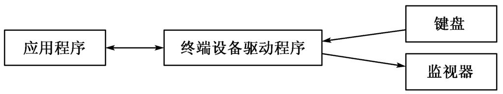
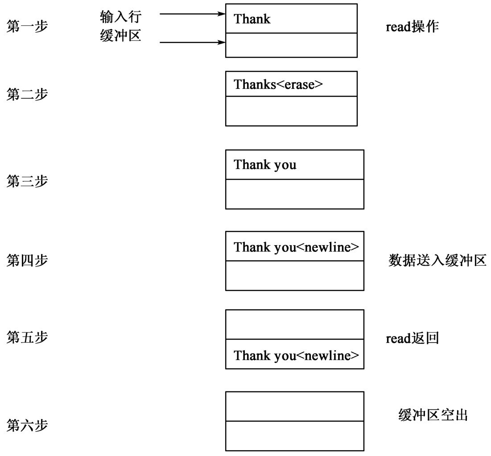
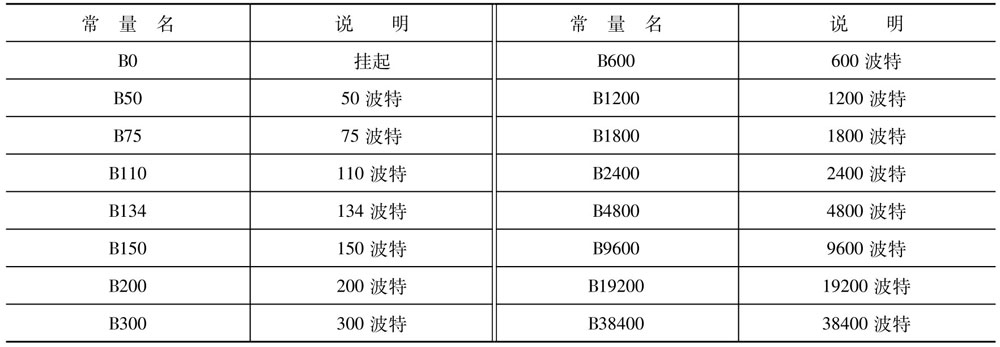
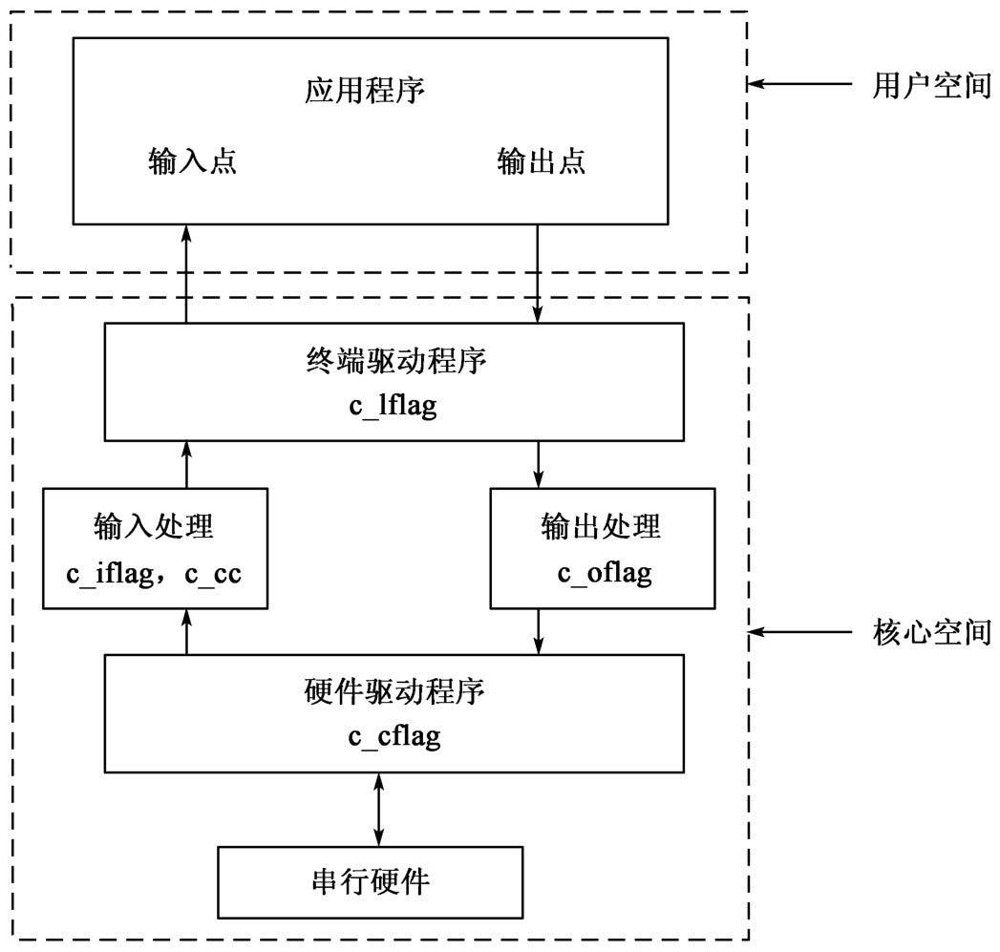

# 终端及伪终端编程


## 引言


### 终端

早期的大型机`分时系统`往往由`一个大型主机`和`若干终端`组成。终端只有一个`键盘`和一个`监视器`，通过`串行线`与主机相连。用户在键盘上进行输入，对主机进行操作，运行自己的应用程序，并可以从监视器上看到操作的输出结果。


### 终端驱动程序

用户通过终端进行输入并得到输出，与应用程序发生交互作用。当`应用程序`向`终端设备`写一个字符串时，首先由`终端设备驱动程序（Terminal Device Driver）`对这个字符串进行处理。根据系统内某个`状态标识`的值，该字符串可能会被原封不动地传送，也可能被驱动程序按某种方式进行修改（一种最常见地修改是加入`回车符`和`换行符`，以确保每个字符行总是从终端屏幕的左边开始）。另一方面，应用程序从终端设备读取字符串时，字符串也要首先从终端设备被送往`终端设备驱动程序`，然后根据情况进行修改后再送往应用程序。终端设备驱动程序是系统内核的一部分。

终端设备驱动程序对字符串进行的修改是十分简单的，只是在一行的范围内，截获某些与编辑功能有关的字符，对字符串进行编辑。例如，在Unix系统中，终端设备驱动程序通常允许用户用`ERASE`字符和`KILL`字符来修改一个输入行中的错误。`ERASE`字符能删除当前输入的最后一个字符，而`KILL`字符则删除当前输入行的内容。只有用户对当前行的内容满意了，并按下`回车键`之后，终端驱动程序才把该行的内容传送给应用程序。

在向终端输出时，一旦输出的字符串到达终端，终端的硬件就可以直接显示这个字符串或者是把它作为屏幕控制用的`ESC`序列命令来解释。


### 系统与终端之间的关系

现在来讨论`系统`与`终端`之间的关系。下图给出了`Unix系统`与`终端`之间的联系，其中包括`应用程序`、`终端设备驱动程序`和`终端（监视器和键盘）`。



下面分别介绍图中的各个部分。


#### 应用程序

`应用程序`产生输出`字符序列`，解释并处理输入`字符序列`。它使用系统调用和例行程序库中的`库函数`与`终端`发生交互关系。当然，最终`所有的I/O操作`都要通过系统调用`read`和`write`来实现。


#### 终端设备驱动程序

`终端设备驱动程序`包括在`内核`中，`驱动程序的主要部分`实现与`硬件`的`接口`，这些`硬件`负责`主机`与`终端`之间的数据传递。有些系统还可能要求`驱动程序`能支持`多种类型的硬件`。这种`建立在低层的软件`能保证`终端驱动程序`所支持的`基本特性`是`通用`的，而且与`硬件`无关。

`终端设备驱动程序`的主要功能是把数据`从应用程序传送到外部设备`，以及`从外部设备传送到应用程序`。除了`基本的传送功能`外，`终端驱动程序`还能完成一些`输入和输出数据的编辑处理`，把一个字符串序列映射到另一个字符串序列。另外，它还能提供一些支持用户端的功能，例如对输入行的编辑、向应用程序发送一个信号等。这些处理的具体完成，必需根据系统内保存的每个终端口的状态标识来进行。程序员可以用系统调用`ioctl`来设置它们。

在有的资料中还有另外一种说法：`终端设备驱动程序`又被细分成了`两个模块`，一个是`终端设备驱动程序`，但它只负责实现与硬件的接口；另一个是`线路规程（line discipline）模块`，负责对输入输出的字符串进行简单的编辑处理和信号传递。这里把它们都看成是同属于一个`终端设备驱动程序模块`。


#### 终端

`终端`包括`监视器`和`键盘`，`键盘`是`输入源`，`监视器`是`输出点`。但是，应用程序只要一个`终端描述符（在Linux/Unix中，其实就是一个文件描述符）`，就能对终端作`输入访问`和`输出访问`，还能对`终端的某些状态`进行设置。为了实现这一点，`终端驱动程序`要为每个`终端`设置一个`字符输入队列`和一个`字符输出队列`。


### 版本

由于Unix自身版本众多，所以Unix终端系统的版本也无法统一。`System III`的`终端I/O`继承了`System V`的风格，而`Version 7`则采用了`BSD的标准`。但它们大都支持`POSIX.1标准`，因此在本章中尽量按照`POSIX.1标准`对终端进行介绍。


## Unix/Linux中的终端


### 概述

`在Unix/Linux中`，`外部设备`可以标识为`特殊文件`，所以，`Unix/Linux`中的`终端`可以用`特殊文件`来表示。由于`终端的特性`，系统把它作为`字符设备`来处理。

`在Unix/Linux中`，根据`数据传输方式`的不同，`外部设备`可以分为`字符设备`和`块设备`两类。对于`字符设备`，数据是`以字符为单位`进行传输的，传输效率稍`低`，但设备只要一进行发送，数据马上就能送出，接收也同样；`块设备`则以`块（Block）`作为数据传输的单位，设备发出或要接收的数据缺省情况下将被暂存在`缓冲区`中，存满一`块`之后再进行发送或接收。`块设备`的实时性稍差，但传输效率较高。`终端`是`典型的字符设备`，`硬盘`则是`典型的块设备`。

用户或程序员可以通过目录`/dev`内的`文件名`来访问`终端`（更确切地讲，应该是`终端口`），典型的终端名如下：

```txt

/dev/console
/dev/tty01
/dev/tty02
/dev/tty03

```

`在Unix中`常用`tty(Teletype terminal)`来表示终端。

由于`Unix文件概念`的普遍性，所有的设备都被当成文件来管理，因此可用像`read`和`write`这样的系统调用来访问终端。`终端的文件权限`也保持其通常的意义，用于控制对系统内终端的访问。为了使权限安排得更合理，当用户登录进入系统后，系统会改变终端的所有权，使登录用户拥有其正在使用的终端。

通常，一个进程`不必打开`终端文件，就能使用它与用户发生交互，这时因为它的标准输入和标准输出（标准输入输出被重定向了的情况除外）已被连到终端上。因此，下列语句就可以导致向监视器输出数据。

```c

#define FD_STDOUT 1
write(FD_STDOUT, mybuffer, somesize);

```

在系统启动时，`进程管理程序init`首先打开了`登录终端文件`，把`终端文件描述符`传给了`init的子进程`，最终`每个用户的shell进程`都继承`三个`与`用户终端`有关的`文件描述符`（`0`、`1`和`2`），它们是`shell的标准输入`、`标准输出`和`标准错误`。这三个文件描述符又`被shell启动的其他进程`继承。


### 控制终端

在通常情况下，某个进程通过`标准文件描述符`与一个`终端`联系起来，用户可以通过该`终端`对这个进程进行控制。这个`终端`就是`该进程及其所属进程组`的`控制终端（control terminal）`。`控制终端`是`进程的一个重要属性`，它确定`键盘`发生的`中断处理`。例如，如果用户按了一个终端的`中断键`，那么，以此`终端`为`控制终端`的所有进程，都会接收到信号`SIGINT`。`控制终端`这一属性跟其他进程属性一样，也能通过`fork`调用被子进程继承。如果某进程组还没有`控制终端`，那么当它的`根进程（即最早的进程，该组中所有其他进程都由它派生出来）`打开一个还没有作为其他进程组的`控制终端`的`终端`时，该`终端`就成为`这个进程组`的`控制终端`。进程可以用系统调用`setpgrp`来改变它所属的进程组，从而切断它与`原控制终端`的关系。

`控制终端`可以是`本地计算机上的控制台`，也可以是一个映射的`X窗口`，还可以通过`网络连接`来建立。

系统调用`ctermid`可以被用来获取`当前的控制终端名`。

进程可以直接用文件名`/dev/tty`来访问它的`控制终端`，而`不用`知道该`终端的确切文件名`。它永远被解释为`进程的当前控制终端`。


### 数据传输


#### 输入与输出

`终端设备驱动程序的基本任务`是在`应用程序`与`终端设备`之间`传输数据`。实际上，这是一件复杂的工作，因为用户会随时输入字符，甚至在输出期间也可能会输入字符。再回顾一下上一张图，并想象从键盘到终端驱动程序和从驱动程序到监视器同时传输数据。要注意的是，图中的应用程序在某一时刻只能发出一个`read`或`write`请求。

`应用程序`要管理这两个`同时存在`的`字符流`，但每一时刻`又只能`处理其中的一个，就只能依靠`驱动程序`的帮助了。`设备驱动程序`会把输入数据和输出数据存放在其`内部缓冲区`中。当应用程序发出`read`请求时，就将输入数据传输给它。当`内核的缓冲区`满了或者`字符数超过了系统规定的最大值`，那么输入数据会`丢失`。这种字符数的限制常为`256`，由于终端的输入一般是考手工键盘输入，速度较慢，因此在一般情况下缓冲区设为`256`是足够的了，基本上不会发生数据丢失。但是，`一旦发生数据丢失，没有任何方法能检测出来`。`系统`会把`多出的`字符`无条件地抛弃`。

在输出时，情况则简单一些，应用程序执行`write`系统调用时，会将要对终端输出的字符放入`输出队列`中。如果输出队列已满，则这个`write`将会被阻塞，直到输出队列空出足够的空间为止。


#### 回送和超前输入

因为`终端`一般被用于`用户`与`计算机程序`之间的`会话`，所以`Unix的终端驱动程序`提供了`大量的附加性能`，以使这种`会话`更为简单。

这些`附加性能`中最基本的是`字符的回送`。当用户从键盘输入一字符时，这一性能`可以使用户在监视器上看到当前输入的这一字符`。`Unix系统中的终端`通常都工作在`全双工（fullduplex）模式`下，这意味着`字符的回送`是`Unix系统的响应`，而不是`终端的响应`。`用户输入的字符`首先被`终端`传送给`Unix系统`，当它被系统接收时，`终端驱动程序`立即把该字符`复制`到`该终端的输出队列`中，然后它在终端监视器上被显示出来。在回顾一下上一张图：一个字符首先沿着路径从`键盘`到`驱动程序`，然后立即沿着路径从`驱动程序`返回到`监视器`。这一切完全可能发生在`应用程序`准备`读字符`之前。当`应用程序`正在对`监视器`进行输出时，`用户如果按了键`，则会出现`一种有趣的现象`，即输入的回送内容会夹在输出的内容当中。在另外一些系统中，在应用程序准备读字符之前，是禁止回送输入内容的。


### 正则模式和非正则模式

终端具有多种`工作模式`，应用程序可以根据自身的需要，把终端定义成相应的模式。常见的模式有`正则模式（Canonical mode）`和`非正则模式（Nocanocical mode）`两种。比如，`屏幕编辑程序`希望能`对屏幕有尽可能多的控制`，所以它把终端定义成`非正则模式`。在这种模式下，`终端驱动程序`只是把字符传送给指定的`应用程序`，而不作任何处理。`非正则模式`也被称为`原始模式（Raw mode）`。但是显然，不可能要求所有的应用程序都要涉及终端控制的细节。因此，`Unix的终端驱动程序`提供了一种`专门的终端模式`，这种模式适合于`面向行`的交互作用，这里称它为`正则模式`，它被广泛用于`ed`编辑程序及类似的应用程序中。

`正则模式`是通常情况下的终端工作模式。


### 正则模式下的编辑键

有这么一些键，在`正则模式`下的作用与其他普通键不同。当用户按下它时，`终端驱动程序`就`不`把它当作字符传送给`应用程序`，而是完成`专门的动作`，这些动作中有不少与`行编辑功能`有关。当终端在`正则模式`下工作时，应用程序得到的输入是一个完整的行。这些键被称为`编辑键`。

`正则模式`提供的最常用的`编辑键`是`ERASE`符，按这个键可以删去当前`行内`的前一个字符。

用户可以将`ERASE`符设置成`ASCII`符中的任何一个。通常它被设置为`backspace（退格符）`，这也是系统默认的`ERASE`符。

`正则模式`中还有其他一些`具有特殊意义的编辑键`，下面给出它们的具体描述。除了被特别说明的之外，这些字符具体对应着`终端键盘`上的哪个键`可以由用户、程序员或系统管理员设定`。

- `KILL`：它能使当前输入行中的全部字符均被删除。`KILL`符的系统默认值为`@`，通常选用`Ctrl+x`或`Ctrl+u`。
- `INTR`：这是中断符，如果用户输入了这个字符，信号`SIGINT`就会被发送给正在从该终端读信息的应用程序，以及所有把该终端作为控制终端的进程。shell程序能相当灵敏地捕捉此信号，它接收到`SIGINT`信号的默认动作是终止应用程序，因此中断符往往能使一个应用程序中断运行，退出到shell。`INTR`符的系统默认值为`ASCII符delete（也称DEL）`，通常也选用`Ctrl+c`。
- `QUIT`：如果用户输入了这个字符，会导致操作系统向该终端所关联的进程组中的每个进程发送`SIGQUIT`信号。对这种信号的处理通常是进行`核心转贮`，即把应用程序的内部映像写入磁盘文件，并终止应用程序的执行，给出`Quit-core dumped`信号。通常`QUIT`符为`ASCII符FS，即Ctrl+\`。
- `EOF`：这个字符被用来作为来自终端的输入流的结束标识，它可用来强制退出登录。它的默认值为`ASCII符EOT，即Ctrl+d`，也经常可以选用`Ctrl+z`（但是在Linux下，`Ctrl+z`的意义是使前台进程被挂起）。
- `NL`：它是正常行的分界符，其值总是`ASCII符line-feed（换行）`，即C语言中用的`"\n"(newline)字符`。用户不能改变其值。在发送`回车符`而不是`换行符`的终端上，`NL`的字符仅仅是使光标移动到屏幕的最左端，但仍然位于同一行上。用户或程序员可以`设置终端驱动程序`把`回车符`映射为`换行符`。
- `EOL`：这是另外一个行分界符，它的作用类似于`NL`，但一般不使用它。其默认值为`ASCII符NUL`。
- `STOP`：它被用来暂停写往终端的输入操作，当使用`VDU终端`时，这个字符特别有用。它的值永远为`ASCII符号DC3，即Ctrl+s`。用户不能改变它的值。
- `START`：它被用来重新启动由`Ctrl+s`暂停的输出。如果在此之前没有按过`Ctrl+s`键，则该字符被忽略。它的值永远为`ASCII符DC1，即Ctrl+q`。用户不能改变它的值。`STOP`和`START`两个编辑键有些特殊，因为只有这两个编辑键可以在输出时发挥作用，其他的编辑键都只能在输入时发挥作用。
- `CR`：回车键。`POSIX.1标准`定义`CR`为回车（carriage return）字符。用户不能改变其值。在正则模式下，这个字符在输入时会被识别。但是在有的情况下，它会被映射为`NL`字符，因此也同样存在着在有的终端上会只将光标移动到屏幕的最左端而不换行的问题。
- `DISCARD`：丢弃键。这个字符只在`SVR4(System V Release 4)`和`4.3+BSD`中的扩展输入模式下被识别，它使得后面的输出被丢弃，直到遇到另一个`DISCARD`字符或者它被清除。这个字符会被终端驱动程序过滤掉，不会传给应用程序。
- `DSUSP`：在`SVR4`和`4.3+BSD`系统中的`扩展输入模式`下，它被认为是延迟挂起字符。当这个字符被读入时，一个`SIGTSTP`信号会被发送给前台进程组中的所有进程，让它们挂起。这个字符也会被终端驱动程序过滤掉，不会传给应用程序。
- `EOL2`：与`NL`类似，是一个附加的行分界符，但不常用。
- `LNEXT`：它的作用是使下一个编辑健失效。在终端驱动程序接收到`LNEXT`字符后，下一个编辑键将不再被驱动程序处理，而会被原封不动地送给应用程序。
- `REPRINT`：在扩展输入模式下，它会将所有还没有读入的输入都被输出（重新回显）。这个字符不会被应用接收到。
- `STATUS`：向前台进程组的所有进程发送一个`SIGNFO`信号。如果没有设`NOKERNINFO`标识位的话，这些状态信息会被显示在终端上。
- `SUSP`：挂起字符。它的作用与`DSUSP`类似，都会使一个`SIGTSTP`信号被发送给前台进程组中的所有进程，让它们挂起。但是，`SUSP`在被`终端驱动程序`接收时就生效，而`DSUSP`只有在`应用程序`执行`read`调用，将它读入时才生效。`SUSP`字符也会被终端驱动程序过滤掉，不会传给应用程序。
- `WERASE`：删除一个单词。它先向前删除所有遇到的空格或`TAB`字符（如果有的话），然后一直执行删除，直到遇到了空格或`TAB`或到了`行首`为止。

如果`ERASE`符、`KILL`符或`EOF`符紧随在`反斜杠"\"`之后，则可以免去对它们的特殊功能的解释，而作为一般的`ASCII符`被送往应用程序。这里的`反斜杠"\"`就起着`LNEXT`的作用。

另外还有一个`特殊的编辑"字符"`：`BREAK`。它的作用是终止应用程序。它的特殊之处在于，它`往往不只一个字符`。在`异步串行终端`中，`BREAK`是一组`连续的0`。但因为很多键盘上都有`break`键，所以它常常被误以为是一个字符。


## 终端的应用程序设计


### 终端的打开与读写


#### 终端的打开与关闭

可以像打开普通文件那样，用系统调用`open`打开一个终端。例如：

```c

fd = open("/dev/tty0a", O_RDNR);

```

如果要打开的终端`未被连上`，那么这个`open`调用就`不返回`，直至与该终端成功地建立连接为止。对于`具有调制解调控制的终端`来说，这意味着在没有正确建立`调制解调器的信号`和`载流子检测`有效之前，`open`调用将不返回。

关闭终端的过程也很简单，使用`close`系统调用就可以了。

但在实际程序设计中往往不用`open`调用区打开终端设备，因为这样的程序依赖于具体的终端设备，不宜在不同终端上提交执行。在对终端文件进行操作时，用户可以利用`0`、`1`、`2`这三个标准文件描述符直接`读/写`和`控制`进程相关联的终端。

对比地，`Go语言`的`os`包内对文件进行了非常实用的封装。之前的文件和I/O相关章节已经讲述过了，这里不赘述。

示例程序1：

```go

package main

import (
	"fmt"
	"os"
)

func main() {

	tty, err := os.OpenFile("/dev/tty", os.O_RDWR, os.ModeDevice|os.ModeCharDevice)
	if err != nil {
		panic(err)
	}
    defer tty.Close()

	fmt.Println(tty.Fd())
	fmt.Println(tty.Name())

	buf := make([]byte, 32)
	_, err = tty.Read(buf)
	if err != nil {
		panic(err)
	}
	fmt.Println(string(buf))

	_, err = tty.Write([]byte("it is a tty.\n"))
	if err != nil {
		panic(err)
	}

}

```

示例程序2：

```go

package main

import (
	"os"
)

func main() {

	stdIn := os.NewFile(0, "Stdin")
	stdOut := os.NewFile(1, "Stdout")
	stdErr := os.NewFile(2, "Stderr")

	buf := make([]byte, 32)
	_, err := stdIn.Read(buf)
	if err != nil {
		panic(err)
	}

	_, err = stdOut.Write(buf)
	if err != nil {
		panic(err)
	}

	_, err = stdErr.Write([]byte("No Error!"))
	if err != nil {
		panic(err)
	}

}

```


#### 终端的读操作

`read`调用对`终端文件`操作时，与操作`普通文件`有所不同。`对普通文件的读操作`总是返回读入的`实际字节数`，除非已读到文件底，否则它和要读入的字符数相同。而`对终端进行操作`时，所能读入的字符数则和`要求读入的字符数`、`当前输入行的起读位置`及`当前行的长度`有关。一次最多读得的字符为起读位置到行尾间的字符数。

在对终端等设备文件进行读访问的所有操作中，系统调用`read`是最有用的。当终端为正则模式时，则更是如此。正则模式适合于通常的交互使用，在这种模式下，行成为输入的基本单位。因此，在用户按回车键之前，应用程序并不能读到行中的字符，这就使`ERASE`和`KILL`编辑键的功能得以体现。系统把`回车符`作为`换行符`来解释。`read`调用遇到`换行符`总会返回，即使此时行中的字符数小于`read`调用中所请求的字符数，它也会返回。如果只按一个`回车符`，则送给系统一个`空行`，相应的`read`调用返回值为`1`。仍然可以用`read`的返回值为`0`来检测文件的结束。

请考虑下列语句：

```c

nread = read(0, buffer, 256);

```

如果`进程的标准输入`取自于一个`普通文件`，那么这个调用的解释是明确的，当文件中的字符`大于256`时，该`read`调用将先把`256`个字符读入`buffer`。由于`read`与终端间的关系还要复杂一些，所以这里用下图来解释：



上图给出了对终端进行读操作时，可能发生的`动作序列`。每一步都用两个方框表示，上面的方框给出`输入行`的当前情况，这与`终端驱动程序`所看到的一样。下面一个框给出读入`缓冲区`的情况，即应用程序在当前可以读到的数据。应该强调的是，这张图只是一张来自`用户进程`观点的逻辑图。但是，`终端驱动程序`最常用的实现方法也使用`两个缓冲区（或队列）的结构`，它不会比图中给出的方案复杂多少。

第一步，这是应用程序调用`read`时的情况。这时用户已经打入了字符串`"Thank"`，但是由于还没有输入`换行符`，所以在读入缓冲区中没有任何数据，进程的执行被暂停。

第二步，用户键入`"s"`，然后又按`ERASE`键从输入行中删去此字符。这部分强调了对输入行进行编辑不会涉及调用`read`的应用程序，应用程序将对此编辑行为一无所知。

第三步，这时输入行中除了`换行符`之外，已含有所需的全部内容。

第四步，这时输入了`换行符`，`终端驱动程序`把输入行（包括换行符）传送到读入缓冲区内。

第五步，整个输入行称为可读出的内容，这时`read`调用返回，`nread`中的返回值为`10`（即一行中的`字符总数`，`包括`最后的`换行符`）。

第六步，这时`read`调用被满足，输入行和读入缓冲区暂时都是空的。

下面用示例程序来进一步说明上述情况。这个程序的特点是，用`较小的缓冲区`来获得标准输入的内容。

```go

package main

import (
	"fmt"
	"os"
	"syscall"
)

func main() {

	smallbuf := make([]byte, 10)

	for {
		n, err := syscall.Read(0, smallbuf)
		if err != nil {
			panic(err)
		}
		fmt.Fprintf(os.Stdout, "Output: string: %s n: %d\n", smallbuf, n)

	}

}

```

显然，由于缓冲区太小，对于其中最长的行需要连续读几次，才能把它读入。另外，`n`中的返回包括每行末的换行符在内，因此最后一次读操作时`n`是`3`。

`如果终端不是正则模式的话`，应用程序`必需`设置`与终端有关的状态变量`，以充分控制输入。系统调用`ioctl`可以被用来完成这项工作，这个系统调用将在后面讨论。


#### 终端的写操作

当调用`write`对终端文件做写操作时，其情况与对普通文件的写操作差不多。`唯一的区别是`，当终端用的`输出队列`满时，`write`调用将会使应用程序被阻塞。当输出队列中的字符数减少到某个临界值时，才能恢复应用程序的执行。

`write`调用对`终端`操作时所写的信息`直接`显示在`终端屏幕`上，显示的位置为`当前光标`所在的位置。

可以看出终端的输出要比输入简单，用`write`就能实现信息的输出，`但需注意：`输出时应将`回车符`转换为`换行符`。

其他系统调用例如`lseek`、`stat`等也都可以用来对终端文件进行操作，但没有什么实际含义。使用最多的是`read`和`write`。


### termios结构


#### termios结构概述

一个`termios结构`可以存放一个终端的状态，它对应于系统为终端保存的状态标识。要取得终端的状态或对它进行设置、修改，都离不开这个结构。

在应用程序中，可以用`termios结构`和系统调用`ioctl`来改变终端的特性，它们合起来提供了一个对`Unix异步通信口`的应用程序设计接口。例如，把`ioctl`函数中`操作字参数`设为`TCGETA`，就可以将终端的状态存放在指定的一个`termios结构`中，而操作字`TCSETA`则可以将指定的`termios结构`中所存放的状态设置为终端的当前状态。有关`ioctl`将在稍后详细向读者介绍。

`termios结构`定义在文件`<termbits.h>`中，其内容如下：

```c

#define NCCS 8

struct termios {
	tcflag_t c_iflag;		// 输入模式
	tcflag_t c_oflag;		// 输出模式
	tcflag_t c_cflag;		// 控制模式
	tcflag_t c_lflag;		// 本地模式
	cc_t c_line;			// 线路规程
	cc_t c_cc[NCCS];		// 控制字符
	speed_t c_ispeed;		// 输入速率
	speed_t c_ospeed;		// 输出速率
}

```

注意：在不同的操作系统下，定义`termios结构`的头文件名也可能不同。后面将要提到的几个结构也是这样。

`termios结构`的前身是`termio`结构。`termio`结构的内容如下：

```c

#define NCC 8

struct termio {
	unsigned short c_iflag;		// 输入模式
	unsigned short c_oflag;		// 输出模式
	unsigned short c_cflag;		// 控制模式
	unsigned short c_lflag;		// 线路规程模式
	char c_line;				// 线路规程
	unsigned char c_cc[NCC];	// 控制字符
}

```

其中，`c_line`的数量能多能少，它的引入是为了允许系统开发者提出他们自己的行规定和协议。通常情况下，`c_line`不会被使用。另外，`c_ispeed`和`c_ospeed`这两个域虽然可以表示和控制输入输出的速度，但通常情况下这个任务`c_cflag`已经可以完成，因此它们也不常用。事实上，这两个域不在`POSIX.1`范畴之内，很多系统中的`termios结构`没有这两个域。下面依次对其他的几个域进行介绍。


#### c_cc数组

数组`c_cc`中存放终端的`行编辑符`。它们在数组中的为位置在头文件`<termbits.h>`中定义，详情如下所示：

```c

#define VINTR 0		// 中断键
#define VQUIT 1		// 退出键
#define VERASE 2	// 擦除字符
#define VKILL 3		// 擦行字符
#define VEOF 4		// 文件结束字符
#define VEOL 5		// 任选的行结束标识

```

这说明擦除控制字符（`ERASE`）存放在`c_cc[2]`中，而擦行控制字符（`KILL`）则存放在`c_cc[3]`中，依次类推。

由`c_cc`定义的一组`缺省控制字符值`如下：

```c

CESC '\\'		// Esc键
CINTR 0177		// Del中断键
CQUIT 034		// FS，退出键
CERASE '#'		// 删除一个字符
CKILL '@'		// 删除一行
CEOF 04			// Ctrl+d
CSTART 021		// Ctrl+s
CSTOP 023		// Ctrl+s
CSWTCH 032		// Ctrl+z

```

它们的具体意义如下：

- `CESC`：定义了一个`转义符`，使得在按该键之后输入的编辑键失效。
- `CINTR`：产生一个中断信号`SIGINT`，并送到与控制终端相关联的所有进程。
- `CQUIT`：产生一退出信号，处理同上。
- `CERASE`：擦除当前行先前输入的字符。
- `CKILL`：删除当前行输入的所有内容。
- `CEOF`：从终端产生文件结束符。当它被接收时，等待读入的所有字符立即传到程序，不再等待一个换行符。去掉`CEOF`以后的输入信息成为真正的接收内容。若`CEOF`出现在一行的开头，则只传递零个字符。
- `CSTOP`：能够暂时挂起输出，对于`CRT终端`，在终端能被读之前，它可以防止输出从屏幕上消失。当输出被挂起时，该字符被忽略，该字符不能被改变或由上面的`CESC`转义。
- `CSWTCH`：终端切换功能键，通过该字符用户可以随意选择要进入的终端控制层，从而使用户可以在一个用户终端上创建多个shell管理层，并实现灵活的转换。

例如：下面的程序段设置行删除符为`"Ctrl+a"`。

```c

ioctl(0, TCGETA, &term_buf);		// 获取初始终端属性
term_buf -> c_cc[VKILL]=01;			// 将'*'（ASCII 052）设为KILL字符
ioctl(0, TCSETA, &term_buf);		// 设置终端属性

```

若第二行改成`term_buf -> c_cc[VKILL]=0377`；则定义行删除符无任何意义。


#### c_cflag域

`c_cflag域`描述了终端的硬件控制，例如：波特率、传送字节长度等。大部分应用程序不用关心用于其控制终端的`c_cflag域`，但是在`与通信有关的程序`中这个域就很有用或者当一个应用程序打开一个`附加终端线`（如`打印机口`、`调制解调器`等）时，也要使用这个域。`c_cflag域`的值由`<termbits.h>`头文件中定义的常数通过`或运算`构成，每个常数表示该标识域中的一个位。

波特率可取下列常量中的任意一个：`B0`、`B50`、`B75`、`B110`、`B134`、`B150`、`B200`、`B300`、`B600`、`B1200`、`B1800`、`B2400`、`B4800`、`B9600`、`B19299`、`B38400`，其对应关系如下表所示。



输入输出波特率存放在`termios结构`中。系统能支持上表中列出的值，表中的常量在`<termbits.h>`中定义。传送字节长度可取以下值之一：`CS5`、`CS6`、`CS7`、`CS8`。分别表示`5位`、`6位`、`7位`、`8位`，这个长度不包括`奇偶校验位`。

除此之外，`c_cflag`还可以取以下值及它们的按位或：

- `CSTOPB`：送两个停止位，否则`1`个。
- `CREAD`：启用接收器，否则无字符被接收。
- `PARENB`：进行`奇偶校验`。产生并检测校验位，在每一字符上加上校验位。
- `PARODD`：奇校验，否则为偶校验。
- `HUPCL`：最后关闭时挂起。
- `CLOCAL`：局部线路标识，否则为通过拨号连接的远程终端。
- `LOBLK`：封锁作业控制层输出。

下面的一些例子给出一些可用的选择。首先设置终端速度为9600波特，其中的`CBAUD`和`B9600`均在头文件`<termbits.h>`中被定义。

```c

/* 首先关闭当前波特率 */
/* 屏蔽所有波特率位 */
tty_des.c_cflag &= ~CBAUD;
/* 设置新波特率 */
tty_des.c_cflag = B9600;

```

当然，这一切均要调用`ioctl`后才起作用，调用方法如下：

```c

ioctl(somefd, TCSETA, &tty_des);

```

下面的应用程序段使终端能进行奇偶校验：

```c

tty_des.c_cflag |= (PARENB|PARODD);
ioctl(somefd, TCSETA, &tty_des);

```

`PARENB`标识使得能作检验，`PARODD`标识指出要作奇校验。如果不设置`PARODD`标识，则表示要作偶校验。


#### c_iflag域

`termios结构`中的`c_iflag`域秒数终端的基本输入控制，定义了终端的输入控制方式。

`c_iflag`域的值可能是很多常量中的任意一个，也可以是它们的`按位或`。其中三个标识与`回车`处理有关，比较常用，它们是：

- `INLCR`：把`换行符`转换成`回车符`。
- `IGNCR`：忽略`回车符`。
- `ICRNL`：把`回车符`转换成`换行符`。

另外三个标识也比较常用，它们与下列控制有关：

- `IXON`：允许启动/停止对输出的控制。
- `IXANY`：允许任何字符重新启动输出。
- `IXOFF`：允许启动/停止对输入的控制。

`IXON`标识给出用户对输出的控制，如果设置该标识，用户就能用`Ctrl+s`暂停输出，用`Ctrl+q`重新启动输出。如果`IXANY`标识也被设置，那么任何字符的输入均可以使被`Ctrl+s`暂停的输出重新启动。如果设置了`IXOFF`标识，当系统的输入缓冲区将要满时，系统本身将传送一个暂停符（常为`Ctrl+s`）给终端。一旦系统准备再接收数据时，就会发一个`Ctrl+q`重新启动输入。

`c_iflag`其他可能的设置情况如下：

- `IGNBRK`：忽略输入的`break`键。
- `BRKINT`：对`break`键产生一个`INTR`信息。
- `IGNPAR`：忽略奇偶错字。
- `PARMRK`：标识奇偶错。
- `INPCK`：激活输入奇偶校验。
- `ISTRIP`：除去字符最高位。
- `INCLR`：在输入中将`NL`变为`CR（Carriage Return）`。
- `IUCLC`：在输入时把地写变为小写。

例如：下面的程序段能将输入的大写字母转化为小写字母：

```c

ioctl(0, TCGETA, term_buf);			// 获取初始终端属性
tubf -> c_iflag |= IUCLC;			// 输入时自动将大写转换为小写
ioctl(0, TCSETA, term_buf);			// 设置终端属性

```


#### c_oflag域

`c_oflag域`描述系统的输出处理，定义了终端的输出控制方式。其中最重要的标识是`OPOST`。如果没有设置该标识，那么输出字符不经修改就被传送；如果设置该标识，字符要根据`c_oflag域`中的其他标识作后处理。

`c_oflag`可以取以下值及它们的`按位或`：

- `OPOST`：处理后输出。
- `OLCUC`：在输出上将小写字母转换为大写字母。
- `ONLCR`：在输出中将`NL`映射成`CR-NL`。
- `OCRNL`：在输出中将`CR`映射成`NL`。
- `ONOCR`：在第`0`列，无`CR`输出。
- `ONLRET`：在终端上`NL`执行`CR`功能。
- `OFILL`：用填充字符实现延迟。
- `OFDEL`：用`DEL`作为填充字符。
- `CR0`、`CR1`、`CR2`、`CR3`：选择回车延迟。
- `NL0`、`NL1`：选择换行延迟。
- `TAB0`、`TAB1`、`TAB2`、`TAB3`：选择水平制表延迟。
- `BS0`、`BS1`：选择退格延迟。
- `FF0`、`FF1`：选择换页延迟。
- `VT0`、`VT1`：选择垂直制表延迟。

例如：下面的程序段能将输出的小写字母转化为大写字母：

```c

ioctl(0, TCGETA, term_buf);
term_buf -> c_oflag |= OLCUC;		// 输出时自动将大写转换为小写
ioctl(0, TCSETA, term_buf);

```

如果设置`ONLCR`标识，`换行符`被转换成`回车符`和`换行符`，这可保证每行均从屏幕左边开始显示。如果设置`OCRNL`标识，那么`回车符`被转换成`换行符`。如果设置`ONLRET`标识，`换行符`将完成`回车功能`。如果设置`ONOCR`标识，那么当`行长度`为`0`时，将不输出`回车符`。


#### c_lflag域

`termios结构`中的`c_lflag`域是程序员最感兴趣的，当前的`行规定`用该域来控制终端功能。一般来说，只需要涉及系统默认的`行规定`（`c_line`为`0`表示取默认规定）。在这种情况下，`c_lflag`域控制用户端的标准行编辑和中断处理，该域可取的标识为：

- `ICANON`：正则处理，面向行输入。
- `ISIG`：允许中断处理。
- `XCASE`：控制大写/小写字母转换。
- `ECHO`：允许基本的输入回显。
- `ECHOE`：以`<退格><空格><退格>`回送`<ERASE>`。
- `ECHOK`：`<KILL>`后回送换行符。
- `ECHONL`：回送换行符。
- `NOFLSH`：中断后不允许`清空`。

如果设置了`ICANON`标识，就作`正则处理`，这时可以使用行编辑符，并且要把输入信息汇集成行后，才能读入它们。如果没有设置`ICANON`标识，终端则为`非正则模式`，`全屏幕编辑软件`和`通信软件`经常使用这种模式。这时，`read`将直接从`输入队列`中取到字符，这就是说，`输入的基本单位`是`单个字符`，而不是`逻辑行`。应用程序可以选择一次读一个字符或者一次读定长的一块数据。但是，为了充分控制`read`的性能，程序员必需指定另外两个参数，即`MIN`和`TIME`。`MIN`是一个`read`返回前被接收字符的最小个数，`TIME`是一次`read`的暂停周期。这两个参数存放在数组`c_cc`中，稍后即将详细讨论它们。下面给出撤销`ICANON`标识的方法：

```c

#include <termios.h>

struct termios tty_des;
... ...

tty_des.c_lflag &= ~ICANON;
ioctl(0, TCWETA, &tty_des);

```

如果设置了`ISIG`标识，则允许对中断键`INTR`和`QUIT`作处理，这就允许用户用中断键提前终止运行的应用程序。

当`XCASE`标识和`ICANON`标识同时设置时，`终端驱动程序`就能工作在那些限制字符集的终端，特别是那些只接受大写字符的终端上。然而，对于现在的终端来说，也许根本就不需要使用该标识。

如果设置了`ECHO`标识，那么输入的字符就会被回送至终端，并在监视器上被显示出来。如果不设置该标识，则输入字符不回送，这对于`系统的命令检查程序`来说常常是必要的，另外也适用于使用`特殊功能键`（如`光标移动`等）的应用程序。

只有当终端工作在`正则模式`时，`回送控制标识`才有意义。如果设置了`ECHOE`标识，并且`ECHO`标识也被设置，那么`ERASE`字符将以`<退格><空格><退格>`序列回送，在物理上擦去了屏幕上的最后一个字符。如果只设置了`ECHOE`标识，没有设置`ECHO`标识，那么`ERASE`字符以`<空格><退格>`序列回送，这在`CRT/VDU型终端`上就擦去了光标下的字符。如果设置了`ECHOK`标识，当按`KILL`符时，将输出换行符，这可使用户清楚地了解发生地情况。如果设置了`ECHOL`标识，那么即使其他回送被关闭，`换行符`总是被回送。`NOFLSH`标识地作用是：在按`INTR`和`QUIT`键时，禁止对`输入队列`和`输出队列`进行清空。

下图简单地表示了`c_cc数组`、`c_cflag`、`c_iflag`、`c_oflag`、`c_lflag`的作用及相互关系。



对比地，`Go语言`的`syscall`包内提供了如下内容：

```go

type Termios struct {
	Iflag uint32
	Oflag uint32
	Cflag uint32
	Lflag uint32
	Line uint8
	Cc [32]uint8
	Pad_cgo_0 [3]byte
	Ispeed uint32
	Ospeed uint32
}

```


### 利用ioctl系统调用对终端进行控制

系统调用`ioctl`用于控制作为`字符型特殊文件的设备`，它是一个通用型系统调用。它的一般格式如下：

```c

#include <sys/ioctl.h>

int ioctl(int filedes, int request, ...);

```
