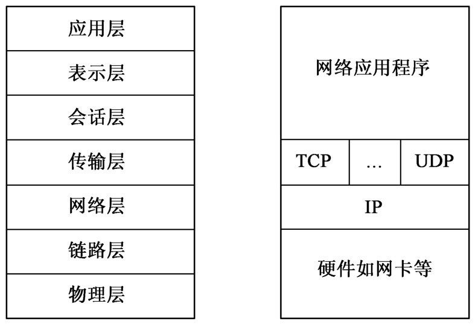
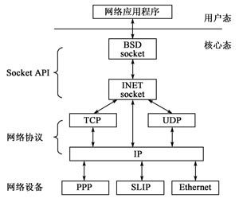
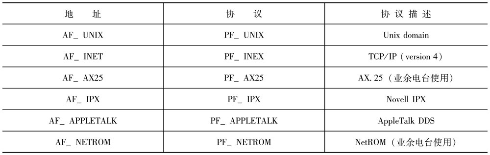
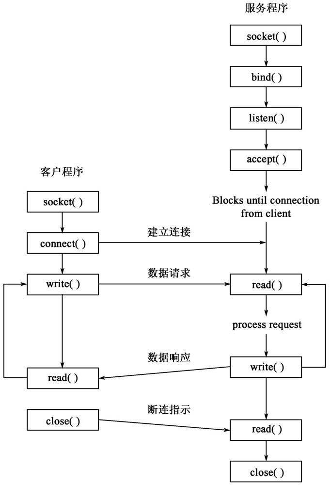
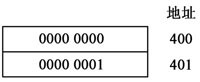

# socket编程

随着计算机网络化的日益发展，网络类应用程序变得越来越重要。Linux提供的`Berkeley socket API`，已经成为`标准的网络编程的接口`。下面介绍通过`Berkeley socket`进行基本的`TCP/IP`编程和`简单的基于socket的进程通信`。


## 协议支持

`Berkeley socket API`为网络编程提供了一个通用的接口，它不但可以用于`TCP/IP`协议的编程，也可以用于如`IPX`之类的其他协议的编程。虽然它再一定程度上增加了编程的复杂度，但和`遇到一个新协议时，创建或学习新的编程接口`这种方法比，这种方式要容易得多。Linux已经通过`socket API`支持`TCP/IP`、`AppleTalk`、`IPX`等协议。

下面介绍Linux中怎样使用`socket`来进行两种协议的编程。Linux支持的最重要的协议是`TCP/IP`协议，它也是网络中最基本的协议。目前使用最多的是它的`第4版`，它的最新一版是`第6版`。本章仅涉及`TCP/IPv4协议`的编程，同时本书还将讲述`Unix域sockets的编程`，它是一种仅用于一台`计算机内部的进程之间通信`的一种机制。

通常`协议都是成组出现的`，`一组在一起互相配合完成通信任务的协议集合`称为一个`协议族`。目前，`TCP/IP协议`是使用最广泛的一个协议族，网络编程主要是基于其中传输层的协议`TCP`及`UDP`。`TCP`为上层应用提供面向连接的数据包传送，而`UDP`则提供无连接的数据包传送。下面首先介绍一些基本的网络知识。


### 网络基础知识

世界上分布在各地的计算机，它们使用不同的操作系统，相互之间有很大差别。它们之间的数据通信任务只有在`一系列标准协议`的基础上才能进行。这里所谓`协议（Protocol）`，也就是两台互相通信的计算机之间对于`通信流程`以及`通信过程中所用到的数据表示形式`所达成的一个`共识`。

为了促进互联网的研究和发展，简化通信程序的开发，20世纪70年代后期`国际标准化组织（ISO）`制定了一个参考模型，称为`开放系统互联模型（即OSI）`，它基于功能分层的思想，将`网络通信程序`分成了`七层`，每一层`利用其相邻下层提供的服务`来`为自己的上层提供更高级的服务`。其分层结构如下图所示。


在大多数的应用中，上面分层结构中的物理层和链路层都由硬件来实现（如局域网卡），而实际使用的网络层的协议如`IP协议`、传输层的协议如`TCP协议`是作为网卡驱动程序的一部分提供给用户的。而`OSI模型`中的传输层上面的三层都对应于网络应用程序如一些网络服务程序等。`TCP/IP协议族`和`ISO模型`间的对应关系图如下图所示。



在这里，`TCP/IP协议族`中的`IP协议`通过下层网卡硬件上的链路层提供的服务为上层提供一个无连接的数据包传输服务，而其上层的`TCP协议`通过`IP协议`为上层应用提供`面向连接`的`数据流`传输服务，而`UDP协议`提供的还是`无连接`的`数据包`服务。

这里的所谓连接和无连接是这样一种概念，无连接的包传输正如邮政业务中的信件，它的主要特征就是无保证，包之间的顺序不一定保持。比如你给朋友寄了三封信，这些信件可能在中途会丢失，也有可能你最后寄的一封信他最先收到。而面向连接的服务则为上层提供有保证的、保序的传输服务。比如鉴于你和朋友之间的信件发生经常丢失的问题，那么你们之间可以商量一个你们的"传输层的协议"：

- 你个朋友寄去一封信，要求他收到后回信；
- 如果你在某一商定的时间后还未收到他的回信，那么就认为信件丢失，再给他重发信件；
- 如果你重发n次还未收到他的回信，那么你就认为你们之间由于某种原因无法通信，不再尝试给他寄信。

`TCP/IP协议`中的`传输层协议TCP`正是通过类似于上面的`重发和超时机制`为上层应用`提供有保证的包递送`，而`包的顺序的控制`则是通过`给每个IP包加上序号`实现的。这就是面向连接的概念。


### Linux系统网络模块的结构

Linux系统中的网络子系统的分层结构如下图所示。



在传输层协议`TCP`和`UDP`的基础上，提供了面向`TCP/IP`协议族的`INET Socket`，在`INET Socket`的基础上，提供了`BSD socket`（即前面所讲的`Berkeley socket`）。所有核心态的程序都是Linux内核程序的一部分。用户态的网络应用程序通过`BSD socket库`进行网络通信。


### 关于网络地址

正如电话网中每一个电话有自己的电话号码一样，`网络中每个节点`都有一个或多个`网络地址`来在整个网络中标识自己。`每种协议网络地址的定义都不一样`。`sockets API`中使用一个统一的结构`struct socketaddr`来传递网络地址，但其内容随协议族的不同而不同。

`struct sockaddr`定义如下：

```c

#include <sys/socket.h>

struct sockaddr {
    unsigned short sa_family;
    char sa_data[MAXSOCKADDRDATA];
}

```

前两个字节指定该地址属于哪个地址族。Linux应用程序常用的地址族如下表所示。



在这里，提到了协议族和地址族的概念。`Socket API`的设计者的本意是一个`协议族`中`可以有不同的地址表示方式`，称为`地址族`。但在实际的使用中，它们两个完全相同。所以在这儿，对一些`socket API`中用到的`协议族常量`和`地址族常量`不加区分（因为它们在系统头文件的声明中是同样的）。


## socket编程的基本流程和要用到的函数

和大多数其他的Linux资源一样，`socket`也是通过文件的形式实现的。系统调用`socket()`来创建`socket`，并返回一个`文件描述符`。在调用系统调用`socket()`并对`socket`进行初始化后，这个文件描述符就能像任何其他的文件描述符一样，可以通过`read()`和`write()`来对它进行读写。最后需调用`close()`来释放与之相关的系统资源。

下图给出了建立`socket`连接最常用的系统调用，以及它们的调用顺序。



可以看出，`socket`程序本质上是`客户-服务器模式`的，即一个运行的服务程序在一端等待客户程序来建立连接。所以`客户端的socket程序`和`服务器端的程序`在工作流程上是不一样的。

首先，`服务程序`通过`bind`和`listen`系统调用在某一端口等待客户程序的连接请求。而客户端则先创建一个`socket`，而通过`connect`系统调用把想`要连接的地址`和`端口`告诉系统，然后试图和服务程序建立连接。一旦`服务程序`（它一直在等待客户端的连接请求）接收到连接请求，两个`socket`之间就建立起连接。这之后，`socket`就可以用于`双向通信`了。


### 服务器端程序的基本操作


#### 创建socket

系统调用`socket()`创建一个`新的、未经初始化的`socket，并返回一个`文件描述符`。一个`socket`在创建之初就`与特定的协议族相联系`，但`还没有建立任何连接`。所以还不能对它进行读写操作。无论在客户端还是服务器端，都需要调用`socket()`来创建一个`socket`。

`socket()`系统调用形式如下：

```c

#include <sys/socket.h>

int socket(int domain, int type, int protocol);

```

类似`open()`、`socket()`创建成功时，会返回一个`大于等于0的值`和一个`文件描述符`，否则，返回值小于0。

`socket()`中的`三个参数`分别对`使用的协议`进行描述。

第一个参数`domain`指定了应当使用的协议族，通常是之前表格中说明的协议常量值。

第二个参数`type`的值为`SOCK_STREAM`或`SOCK_DGRAM`。`SOCK_STREAM`表明协议族中的协议类型为`流协议`，而`SOCK_DGRAM`则指同一协议族中的`报文协议`。

第三个参数`protocol`指定在前两个参数限制下使用的`具体协议`。通常，它的值为`0`，即由程序内核使用指定协议族和协议类型的缺省值。例如，`PF_INET`协议族中，`TCP`是缺省的`流协议`，`UDP`是缺省的`报文协议`。


#### 将一个地址绑定到一个socket上去

`bind`系统调用将一个`socket地址`分配一个`socket`，这个过程称之为`绑定`。只有在服务程序中才有必要调用该系统调用。`bind`系统调用的格式如下：

```c

#include <sys/socket.h>

int bind(int sock, struct socketaddr* my_addr, int addrlen);

```

第一个参数是被绑定的`socket`，`socketaddr结构`给出`socket地址`，`addrlen`说明该地址结构的长度。


#### 等待连接

服务程序在通过`bind()`函数把`socket`绑定到一个地址和端口上之后，需要调用`listen`调用在这个特定的地址和端口上监听到来的客户程序的连接请求，并通过`accept()`调用接收到来的连接请求，从而与客户程序建立连接。

因为可能由众多的客户程序同时要和一个服务程序建立连接，而服务程序在某一时刻只能接收一个客户端的连接请求，所以系统为每一个监听的服务程序维护一个连接请求的等待队列，这样，连接请求将被按照先来先接收的方式被处理。

一般来说，在没有客户端进程试图建立连接时，服务程序调用`accept()`后被阻塞，进入`睡眠状态`，直到由客户程序的连接请求到来才被系统唤醒，接着执行。但如果被`listen`的`socket`已经通过`fcntl()`标记为非阻塞的，则当无客户端进程的连接请求时，`accept()`将会返回一个错误信息。

以下是`listen()`和`accept()`的用法。

```c

#include <sys/socket.h>

int listen(int sock, int backlog);
int accept(int sock, struct socketaddr* addr, int* addrlen);

```

这两个函数都以`socket`的`文件描述符`作为第一个参数。`listen()`的另一个参数`backlog`，给出了`等待队列中的最大的未被处理的连接请求的个数`，当等待队列已满时，到来的连接请求会被立刻拒绝。`backlog`一般被置为`5`，当然，你可以将它置为任一`正值`。`listen`调用成功时返回`0`，否则返回一个`非0值`。

`accept()`调用接收到来的客户程序的连接请求，从而在客户和服务程序之间建立`socket连接`。`accept()`返回一个新的`socket文件描述符`，`新文件描述符`继承了`被监听的socket文件描述符的属性`，建立连接之后进行数据传输将使用这个新的文件描述符。

参数`addr`和`addrlen`用于返回被接收的`客户端的socket地址及其长度`，这两个参数是两个地址指针，`accept()`在成功时的返回值就是那个`新的文件描述符`，在`出错时`返回一个`小于0`的数。


#### 数据传输

在客户程序和服务器程序建立`socket连接`后，就可以用该socket进行数据传输。这时的操作和普通的文件操作没什么两样，就是调用`read`和`write`，将打开的`socket文件描述符`作为参数，进行数据读写的过程。


#### 关闭socket

在数据传输完毕后，调用`close`关闭打开的`socket文件描述符`。


### 客户端程序的基本操作

和服务器端一样，客户端能在调用`socket()`创建`socket`之后，立即通过`bind()`将本机地址绑定到`socket`上。然而，通常客户端并不关心本机地址是什么，所以可以跳过这一步，让内核为它分配任意可用的地址和端口。

在数据传输之前，客户端程序调用`connect()`与服务程序建立连接。`connect()`调用格式如下：

```c

#include <sys/socket.h>

int connect(int sock, struct sockaddr* servaddr, int addrlen);

```

其中，参数`sock`就是`socket()`调用所得到的`socket文件描述符`，`servaddr`和`addrlen`分别是要与之建立连接的服务程序的`socket地址`以及`此地址结构的长度`。

对比地，`Go语言`的`syscall`包内提供了如下函数：

```go

func Socket(domain, typ, proto int) (fd int, err error)

func Bind(fd int, sa Sockaddr) (err error)

func Listen(s int, n int) (err error)

func Accept(fd int) (nfd int, sa Socketaddr, err error)

func Connect(fd int, sa Sockaddr) (err error)

type SockAddr interface {
    sockaddr() (ptr unsafe.Pointer, len _Socklen, err error)    // lowercase; only we can define Sockaddrs
}

type SockaddrLinklayer struct {
	Protocol uint16
	Ifindex  int
	Hatype   uint16
	Pkttype  uint8
	Halen    uint8
	Addr     [8]byte
	raw      RawSockaddrLinklayer
}

type SockaddrNetlink struct {
	Family uint16
	Pad    uint16
	Pid    uint32
	Groups uint32
	raw    RawSockaddrNetlink
}

type RawSockaddr struct {
    Family uint16
    Data   [14]int8
}

type RawSockaddrAny struct {
    Addr RawSockaddr
    Pad  [96]int8
}

type RawSockaddrLinklayer struct {
    Family   uint16
    Protocol uint16
    Ifindex  int32
    Hatype   uint16
    Pkttype  uint8
    Halen    uint8
    Addr     [8]uint8
}

type RawSockaddrNetlink struct {
    Family uint16
    Pad    uint16
    Pid    uint32
    Groups uint32
}

```

`net`包内对网络的接口进行了优秀且实用的封装。具体请看源码文档。


## Unix域socket

`Unix域socket`是`socket编程`中最简单的一个协议族。其实，它本质上`并非`什么协议，而是一种`基于socket接口`的`进程通信机制`。在Unix系统中，进程通信有众多的实现机制，如`信号量`、`共享内存`、`管道操作`、`信号`、`共享文件`以及`基于socket的进程通信`，它们都各有自己的特点和适用范围。使用`Unix域socket`的好处和必要性有以下两点。

（1）它为进程通信提供了统一的编程接口：不管两个进程在`同一台机器`上还是在`不同机器`上运行，只要采用`socket`就可以实现`进程通信`，当然两台不同机器中运行的进程要进行通信，就不能采用`Unix域socket`了，而要用`TCP`或`UDP`或`其他网络socket`。

（2）基于数据传输速度的考虑：有的人也许会问，在所有的Unix系统中都有对`TCP/IP协议`的支持，同一台机器中的两个进程也可以用`TCP socket`进行通信，为什么还用`Unix域socket`？数据包经过`网络协议栈`时都要进行`组包`、`拆包`的处理，这会`影响数据传输速率`，所以引进了`Unix域socket`。

`Unix域`同时提供了`无连接的数据报`和`面向连接的数据流`接口。`数据报接口`很少用，这里暂不讨论。`数据流接口`类似`命名管道`。但`Unix域`与`命名管道`不同。

`命名管道`具有`广播的性质`，当`多个进程`通过`一个命名管道`进行通信时，其中一个进程通过该管道发送的信息都能被其他进程得到。每个命名管道就像一个`公告牌`，某个进程向公告牌发送一个消息后，任何其他具有访问权限的进程都可以从公告牌上获得这个消息。

而`Unix域socket`是`面向连接的`；服务器程序和客户程序之间的`数据传输通道（即连接）`具有`私有的性质`。一个能够同时处理多个客户端连接的服务器程序，对`不同的连接有不同的socket文件描述符`。这个性质使得`Unix域socket`比`命名管道`更适合许多进程通信任务的要求；这也是许多包括`X Window系统`和`一些系统日志程序等标准Linux服务程序`使用它们的主要原因。


### Unix域地址

`Unix域的socket地址`是`文件系统中的带路径的文件名`（如：`/tmp/sock.file`）。当一个`socket`通过`bind()`绑定到该文件名时，如果该文件不存在，则系统将创建一个具有该名的s`ocket类型的文件`（你用`ls`命令列出目录时会看到文件属性类型`srwxr-xr-x`，其中`s`表示是`socket类型`的特殊文件）。如果该文件存在（不管它是一个普通文件还是`socket类型`的文件），`bind()`操作失败，并返回`EADDRINUSE`。`Socket文件`不能用`open()`打开，但文件操作`stat()`仍然可以使用。

一个客户进程要通过`connect()`连接到一个已经存在的`socket`上，该进程必须具有对该`socket文件`的读写权限。

`Unix域socket地址`通过一个`struct sockaddr_un`的结构传送，该结构形式如下：

```c

#include <sys/socket.h>
#include <sys/un.h>

struct sockaddr_un {
    unsigned short sun_family;      // AF_UNIX
    char sun_path[UNIX_PATH_MAX];   // pathname
}

```

`Linux 2.0.x内核`中，`UNIX_PATH_MAX`的值是`108`，但在以后的版本中可能改变。

第一项`sun_family`值必须为`AF_UNIX`，以表明该结构是一个`Unix域地址的地址结构`。`sun_path`为`Unix域地址`，即一个带路径的文件名字符串。

对比地，`Go语言`的`syscall`包内提供了如下结构：

```go

type SockaddrUnix struct {
	Name string
	raw  RawSockaddrUnix
}

type RawSockaddrUnix struct {
    Family uint16
    Path   [108]int8
}

```


### Unix域socket服务程序

在`Unix域的socket`上创建一个服务程序的步骤为：先创建`socket`，用`bind()`将一个地址绑定到`socket`上，然后通过系统调用`listen()`等待客户程序的连接请求，再通过`accept()`与客户程序建立连接。

下面这个简单的服务器程序不断地接收到来地`Unix域socket客户程序`的连接，（其unix域地址为当前目录下的`sample-socket`文件），然后将所有从客户程序接收到的数据显示到标准输出上去。

示例代码1：

```go

package main

import (
	"fmt"
	"os"
	"syscall"
)

func main() {

	sockFd, err := syscall.Socket(syscall.AF_UNIX, syscall.SOCK_STREAM, 0)
	if err != nil {
		panic(err)
	}
	defer syscall.Close(sockFd)

	err = syscall.Unlink("./sample-socket")
 	if err != nil && err != syscall.ENOENT {
		panic(err)
	}

	sockaddr := syscall.SockaddrUnix{
		Name: "./sample-socket",
	}

	err = syscall.Bind(sockFd, &sockaddr)
	if err != nil {
		panic(err)
	}

	err = syscall.Listen(sockFd, 5)
	if err != nil {
		panic(err)
	}

	for {

        clientFd, clientSockAddr, err := syscall.Accept(sockFd)
    	if err != nil {
    		fmt.Fprintf(os.Stderr, "%s\n", err.Error())
            continue
    	}

    	if cSockAddr, ok := clientSockAddr.(*syscall.SockaddrUnix); ok {
    		fmt.Fprintf(os.Stdout, "Get client: %s\n", cSockAddr.Name)
    	} else {
            fmt.Fprintln(os.Stderr, "Get wrong client addr!")
			continue
    	}

    	buf := make([]byte, 32)

    	_, err = syscall.Read(clientFd, buf)
    	if err != nil {
            fmt.Fprintf(os.Stderr, "%s\n", err.Error())
            err = syscall.Close(clientFd)
            if err != nil {
                fmt.Fprintf(os.Stderr, "%s\n", err.Error())
                continue
            }
            continue
    	}

    	_, err = syscall.Write(1, buf)
    	if err != nil {
            fmt.Fprintf(os.Stderr, "%s\n", err.Error())
            continue
    	}

        err = syscall.Close(clientFd)
        if err != nil {
            fmt.Fprintf(os.Stderr, "%s\n", err.Error())
            continue
        }

    }

}

```

上面的小程序示范了如何写一个简单的socket服务器程序。这种服务程序通过一个循环接收到来的客户程序的连接请求，请求是一个接一个地顺序处理的，而某一时刻只能处理一个客户。很显然，这样的程序不能用于实际的应用，一个服务程序应该能够并发处理到来的多个客户程序的连接。

在上面的程序中，如果文件`./sample-socket`已存在，`bind()`就会调用失败。所以在`socket`绑定前先调用函数`unlink()`删除该文件。

因为在函数`bind`和`accept`的声明中，其地址参数为`syscall.SockAddr`接口类型，所以在调用这两个函数时，要注意使用`指针`以及要进行`类型断言`，以防止在编译时出现类型不匹配。

示例代码2：

```go

package main

import (
	"fmt"
	"net"
	"os"
)

func main() {

	unixAddr, err := net.ResolveUnixAddr("unix", "./sample-socket")
	if err != nil {
		panic(err)
	}
	fmt.Fprintf(os.Stdout, "UnixAddr.Network = %s\n", unixAddr.Network())
	fmt.Fprintf(os.Stdout, "UnixAddr.String = %s\n", unixAddr.String())

	err = os.Remove("./sample-socket")
	if err != nil {
		panic(err)
	}

	unixListener, err := net.ListenUnix("unix", unixAddr)
	if err != nil {
		panic(err)
	}

	for {
		unixConn, err := unixListener.AcceptUnix()
		if err != nil {
			fmt.Fprintf(os.Stderr, "%v\n", err)
			continue
		}

		buf := make([]byte, 32)
		_, err = unixConn.Read(buf)
		if err != nil {
			fmt.Fprintf(os.Stderr, "%v\n", err)
			continue
		}
		fmt.Fprintf(os.Stdout, "%s", buf)

		_, err = unixConn.Write([]byte("I have received your message!\n"))
		if err != nil {
			fmt.Fprintf(os.Stderr, "%v\n", err)
			continue
		}

		err = unixConn.Close()
		if err != nil {
			fmt.Fprintf(os.Stderr, "%v\n", err)
			continue
		}
	}

}

```


### 客户程序

通过`Unix域socket`与服务器进程建立连接包括创建一个`socket`和`connect`相应的地址。一旦客户进程和服务器进程建立了`socket连接`，就可以像使用普通文件描述符一样用`socket文件描述符`进行文件读写，从而在客户和服务进程之间进行数据传输。

下面的程序与上例中的服务器程序建立socket连接，并将它从标准输入设备接收到的数据传输给服务器进程，而后者又会在自己的标准输出上将所接收到的信息显示出来。

示例代码1：

```go

package main

import "syscall"

func main() {

	sockFd, err := syscall.Socket(syscall.AF_UNIX, syscall.SOCK_STREAM, 0)
	if err != nil {
		panic(err)
	}
	defer syscall.Close(sockFd)

	sockaddr := syscall.SockaddrUnix{
		Name: "./sample-socket",
	}

	err = syscall.Connect(sockFd, &sockaddr)
	if err != nil {
		panic(err)
	}

	buf := make([]byte, 32)
	_, err = syscall.Read(0, buf)
	if err != nil {
		panic(err)
	}
	_, err =syscall.Write(sockFd, buf)
	if err != nil {
		panic(err)
	}

	err = syscall.Close(sockFd)
	if err != nil {
		panic(err)
	}

}

```

客户端程序与服务器端差不太多。唯一不同的是，是把`bind()`，`listen()`和`accept()`序列改为单一的`connect()`调用。

示例代码2：

```go

package main

import (
	"io"
	"net"
	"os"
)

func main() {

	unixAddr, err := net.ResolveUnixAddr("unix", "./sample-socket")
	if err != nil {
		panic(err)
	}
	unixConn, err := net.DialUnix("unix", nil, unixAddr)
	if err != nil {
		panic(err)
	}
	defer unixConn.Close()

	go func(dst io.Writer) {
		_, err := io.Copy(unixConn, os.Stdin)
		if err != nil {
			panic(err)
		}
	}(unixConn)


	_, err = io.Copy(os.Stdout, unixConn)
	if err != nil {
		panic(err)
	}

}

```


### 运行Unix域socket示例程序

上面给出的服务器和客户程序，是为同时运行而设计的。在一个终端运行服务器程序，另一个终端在相同路径下运行客户端程序。这时，在客户端键入的内容，将会通过socket送到服务器端。在退出客户端程序后，服务器端将会等待其他的连接。还可以使用socket通过重新定向客户端程序的输入来实现文件的传输。


### 用socketpair函数建立未命名Unix域socket

由于`Unix域socket`具有一些管道不具备的优势（例如`全双工`），所以它们常用于进程通信。但如果将它`用于父进程和子进程之间通信`，它的绑定、建立连接等操作又会显得很烦琐，为此，引入了函数`socketpair()`，它直接返回一对已经互相建立连接的`unix域socket描述符`，这样就可以直接通过这两个`socket描述符`进行数据传输，而省去了`bind`、`listen`、`accept`、`connect`等系统调用。函数`socketpair`的形式如下：

```c

#include <sys/socket.h>

int socketpair(int domain, int type, int protocol, int sockfds[2]);

```

`前三个参数`与前面传给`socket()`的参数一样，`最后一个参数`用于输出，它是一个`含两个文件描述符的数组`，在`socketpair()`成功返回时，该数组中将包含两个已经互相建立连接的`socket文件描述符`。在下面通过`Unix域socket`在进程间传递文件描述符的例子中将会用到`socketpair()`。

对比地，`Go语言`的`syscall`包提供了如下函数：

```go

func Socketpair(domain, typ, proto int) (fd [2]int, err error)

```


### 用Unix域socket在进程间传递文件描述符

`Unix域socket`具有一个`特殊的功能`：即通过它可以在进程之间传递文件描述符。而`其他的进程通信机制`都不支持这个功能。它允许一个进程打开一个文件，然后将文件描述符传给另一个`可能毫不相干的`进程。因为`文件访问权限的检验是在文件打开时进行的`，所以`接收文件描述符的进程`会获得`与原进程同样的对该文件的存取权限`，然而，它可能`实际上无权直接访问`该文件。

进程之间文件描述符的传递是通过系统调用`sendmsg()`和`recvmsg()`以消息的形式进行的。这两个函数的声明如下：

```c

#include <sys/socket.h>

int sendmsg(int fd, const struct msghdr* msg, unsigned int flags);
int recvmsg(int fd, struct msghdr* msg, unsigned int flags);

```

其中，参数`fd`是用来发送消息的`socket描述符`；第二个参数是一个指向`描述消息的结构`的指针。参数`flag`一般被置为`0`。

通过socket传递的消息具有如下的结构：

```c

#include <sys/socket.h>
#include <sys/un.h>

struct msghdr {
    void* msg_name;                 // optional address
    unsigned int msg_namelen;       // size of `msg_name`
    struct iovec* msg_iov;          // scatter/gather array
    unsigned int msg_iovlen;        // number of elements in `msg_iov`
    void* msg_control;              // ancillary data
    unsigned int msg_controllen;    // ancillary data buffer len
    int msg_flag;                   // flags on received message
}

```

前两个元素`msg_name`和`msg_namelen`在`数据流socket`中用不到。通过`数据里socket`发送消息的应用程序应该把`msg_name`置为`NULL`，把`msg_namelen`置为`0`。

`msg_iov`和`msg_iovlen`描述了一组发送和接收的缓存区。最后一个元素`msg_flag`现在不用，应置为`0`。

元素`msg_control`和`msg_controllen`给出了`文件描述符的通过（passing）能力`。`msg_control`元素指向一个`控制消息`的`头数组`，`msg_controllen`则指定该数组包含多少字节。每条控制消息都包含一个`struct cmsghdr`，后面是其他的数据。

```c

#include <sys/socket.h>

struct cmsghdr {
    unsigned int cmsg_len;              // length of control message
    int cmsg_level;                     // SOL_SOCKET
    int cmsg_type;                      // SCM_RIGHTS
    int cmsg_data[0];                   // file descriptor goes here
}

```

`控制消息的长度`包括数组头，存贮在`cmsg_len`中。通常`控制消息的类型`被唯一地定义为`SCM_RIGHTS`，用来传送文件描述符，也可以称为`传送存取权限`。相应地，在这种消息类型下，`cmsg_level`和`cmsg_type`必需设为`SOL_SOCKET`和`SCM_RIGHTS`。最后一个元素`cmsg_data`是一个长度为`0`的数组。这是一个`gcc扩展`，允许应用程序将数据拷贝到结构的末尾。

接收文件描述符很简单。为控制消息留下足够的内存空间，新的文件描述符就跟在随后到来的`struct cmsghdr`后面。

用法的示例代码：略。


## TCP/IP网络编程

socket主要用于运行在不同计算机上的应用程序之间互相通信。Linux本身就是网络发展的产物，它提供了完整、健壮的TCP/IP实现，为网络应用程序的开发提供了很好的基础。

`TCP/IP`的现在广泛实用的版本为`第4版（IPv4）`。Internet的迅速发展，暴露了第4版的一些缺点，目前，`TCP/IP第6版（IPv6）`已经发行。它在很大程序上保持了与第四版的兼容。

`IPv6的socket接口`与`IPv4`稍有不同。本书将仅讨论`IPv4下的socket`。读者如果开发`IPv6下的应用程序`，本节后面的示例程序可能不完全适用，尽管它们所涉及的概念是相同的。


### 关于字节序

`TCP/IP`网络中的计算机之间差别很大，甚至`数据表示形式`和`存储顺序`都不一样，如从上到下由`低地址400`到`高地址401`的如下图所示的两个字节。



由于`数据存储顺序`的不一样，即`低地址存高位字节（称为big-endian的存储方式）`还是`高地址存高位字节（称为little-endian的存储方式）`，在有的计算机中它表示十六进制的数`0x0001`，而在有的计算机中它表示十六进制的`0x0100`。而当数据在网络中传输时，又有`高地址的字节先传`还是`低地址字节先传`的问题，所以`TCP/IP协议的设计者们`为在网上如何传输字节流提出了`单一标准`。`TCP/IP`规定实用`big-endian字节顺序`传输协议信息，但这可能和特定主机中的数据表示形式不一致，所以在`socket编程`中有如下`4个函数`用于在`主机字节顺序`和`TCP/IP协议规定的网络字节顺序`之间进行转换：

```c

#include <netinet/in.h>

unsigned int htonl(unsigned int hostlong);
unsigned short htons(unsigned short hostshort);
unsigned int ntohl(unsigned int netlong);
unsigned short ntohs(unsigned short netshort);

```

尽管这些函数声明中都使用了`unsigned`类型的数据，它们照样可以用于`有符号型数据`的`字节序的转换`。

上面函数中的`n`代表`network`，`h`代表`host`，所以，前两个函数`htonl()`和`htons()`分别表示主机顺序中的`long型`和`short型`转换为网络顺序；后两个函数`ntohl()`和`ntohs()`则进行相反的转换。

值得注意的是，函数名中最后一个字母`l`和`s`所代表的`long型`和`short型`的数据，所谓的`short`是指`长为16位的数据类型`，`long`是指`长为32位的数据类型`。对用到`Linux系统`中，`16位`的数据类型为`short型`，`32位`的数据类型为`int型`。


### IPv4地址

一个`IPv4`连接由`本地主机地址`、`本地端口`、`远程主机地址`和`远程端口`这四部分唯一确定。`本地主机地址`和`远程主机地址`均指`IP地址`。`IP地址`用一个`32位（4字节）数字`表示，在整个计算机网络中是`唯一`确定的。通常它们可以写为`aaa.bbb.ccc.ddd`，其中的每一部分都是计算机地址中`每个字节值`的`10进制表示`。地址中`最左边`的数字对应4字节中的`高位`字节。`IP地址`的这种形式被称为十进制点式记法。

在一个像Linux这样的多任务系统中，多个程序是并发地运行着。考虑这样的一个情形，如果一个客户程序想和该系统中某一个特定的应用程序进行通信，那么仅仅指定IP地址是不够的，因为IP地址`仅在`Internet网中唯一地定位这台Linux主机，并`不能`定位到主机中运行的某一应用程序，所以就有了`端口的概念`。所谓端口，实际上是一种编号，即系统给本系统中运行的每一个socket应用程序分配一个唯一的编号（`bind`调用完成这个任务），这样一个客户程序在`connect`系统调用中指明`IP地址`和`端口号`后就可以唯一地确定要连接地`socket服务程序`。

尽管端口地址可以取`0`到`65535`的任意值，但在Linux系统中，从`0`到`1024`为保留的端口值，它们被用于一些常用的服务程序如`Web服务器程序`，`ftp服务程序`、`telnet服务程序`等，并且`只能`由`具有root权限的服务进程`使用，这一点保证了服务器端运行的程序不是一个`非root的普通用户的特洛伊木马程序`。


### Socket编程中的IP地址结构

`IP地址`存贮在`struct sockaddr_in`中，定义如下：

```c

#include <sys/socket.h>
#include <netinet/in.h>

struct sockaddr_in {
    short int sin_family;               // AF_INET
    unsigned short int sin_port;        // port number
    struct in_addr sin_addr;            // IP address
}

```

第一个参数必须为`AF_INET`，表明该结构中存储的是`IP地址`。第二个参数是`以网络字节顺序表示`的`端口值`。第三个参数表示该`TCP`地址的`IP地址`。

`sin_port`和`sin_addr`中的任何一个置为`0`（一般用`memset()`实现），则`表明应用程序不关心具体使用哪个端口或者哪个IP地址`。例如，服务进程通常不关心本地连接的IP地址，如果一台Linux机器有多个网络接口（如插有`3个网卡`），那么它会有多个IP地址，而一个在调用`bind`进行地址绑定时将`sin_addr`置为`0`的服务进程表示它可以接收从任何一个端口进来的客户端的连接。

对比地，`Go语言`的`syscall`包内提供了如下结构：

```go

type SockaddrInt4 struct {
    Port int
    Addr [4]byte
    raw RawSockaddrInt4
}

type SockaddrInet6 struct {
    Port int
    ZoneId uint32
    Addr [16]byte
    raw RawSockaddrInet6
}

type RawSockaddrInet4 struct {
    Family uint16
    Port   uint16
    Addr   [4]byte /* in_addr */
    Zero   [8]uint8
}

type RawSockaddrInet6 struct {
    Family   uint16
    Port     uint16
    Flowinfo uint32
    Addr     [16]byte /* in6_addr */
    Scope_id uint32
}

```


### 十进制点式IP地址与二进制IP地址间的转换

应用程序经常要把IP地址在`十进制点式记法`和`struct in_addr`的`二进制表示`之间进行转换。`inet_ntoa()`以`二进制的IP地址`为参数，返回一个指针，该指针指向一个对应的含有`十进制点式记法的IP地址字符串`。

```c

#include <netinet/in.h>
#include <arpa/inet.h>

char* inet_ntoa(struct in_addr address);

```

产生的字符串存储在内存的一个`静态区域`里，直到下一次调用`inet_ntoa()`时才被破坏。

至于从`十进制点式IP地址`到`二进制IP地址`的转换函数，最初使用函数`inet_addr()`，该函数形式如下：

```c

#include <netinet/in.h>
#include <arpa/inet.h>

unsigned long int inet_addr(const char* ddaddress);

```

它把一个`十进制点式字符串`转换为一个`二进制的IP地址`。但这个函数在`IP地址`为`255.255.255.255`时会有问题，这时它返回`long型`的`-1`（即4个字节全为`1`的数）。这使得程序员不知道是程序出错返回`-1`还是函数正常返回。所以，我们`不鼓励使用`该函数。

后来为了防止这个问题，使用下面的函数`inet_aton`完成从`十进制点式IP地址`到`二进制IP地址`的转换：

```c

#include <netinet/in.h>
#include <arpa/inet.h>

int inet_aton(const char* ddaddress, struct in_addr* address);

```

该函数将第一个参数中的`十进制点式IP地址字符串`转换成一个`二进制表示的IP地址`，并将之放入`address`指向的`struct in_addr`中返回。与多数其他函数不同的是，`inet_aton()`出错时返回`0`，否则返回`非0`。

对比地，`Go语言`的`net`包内提供了`net.IP结构`及其相关操作函数和方法。具体查看源码文档。


### 使用域名

尽管对计算机来说，`32位数字`已经是非常合理的识别方法，但对人来说，它们却难于分辨和记忆，所以后来引入`域名`的概念，即给网络中的计算机起一个有意义的由字母组成的名字，称之为`域名`。为此，`TCP/IP协议族`定义了一个在`主机域名`和`IP地址`之间进行转换工作的系统，它本质上是一个`分布式数据库`，这个数据库称为`域名系统（Domain Name System -- DNS）`。对于`DNS系统`有兴趣的读者可以参阅相应的文档。

DNS提供了很多功能，但在这里，只介绍它转换IP地址和主机名的功能。`IP地址`和`主机名`看似一一映射，其实是`多对多映射`：`每一个IP地址`对应`0个或多个主机名`，`每个主机名`也对应`0个或多个IP地址`。IP地址和主机名间的多对多映射看起来有些奇怪，许多Internet站点在它们的`ftp`和`Web站点`只使用一台计算机。它们用不同的域名如`www.some.org`和`ftp.some.org`来指向同一个IP地址。相反的，Internet中的路由器几乎总有多个网络接口，这些不同的网络接口有着不同的IP地址，但有的路由器只用一个域名来映射所有这些IP地址，当然，这种情况比较少见，一般情况下，一个域名只对应一个IP地址，而一个IP可以对应多个域名。

`socket编程`中`域名`的用法如下的一个结构来包含：

```c

#include <netdb.h>

struct hostent {
    char* h_name;               // canonical hostname
    char** h_aliases;           // aliases （NULL terminated）
    int h_addrtype;             // host address type
    int h_length;               // length of address
    char** h_addr_list;         // list of address （NULL term）
}

```

其中，`h_name`是包含该主机的正式域名的字符串，`h_aliases`是一个由指向字符串的指针所组成的数组，它包含了该主机所有的别名。`h_aliases`指针数组中最后一个元素是一个空指针，标识该数组的结束。

`h_addrtype`给出主机地址的类型。在本章的例子中，`h_addrtype`为`AF_INET`型。支持`IPv6`的应用程序中`h_addrtype`还有其他类型。`h_length`指主机二进制地址的长度。对`AF_INET`型地址来说，它相当于`size-of(struct in_addr)`。`h_addr_list`类似于前面的`h_aliases`，是一个指向主机地址的指针数组，最后一个元素为空指针，表示数组结束。当`h_addrtype`为`AF_INET`型时，数组中的每个指针指向一个`struct in_addr`。

有两个库函数实现IP地址和域名之间进行的转换。一个是`gethostbyname()`，它以主机域名为参数，返回一个`struct hostent`；另一个是`gethostbyaddr()`，它以IP地址为参数，返回具有特定IP地址的计算机的信息。

```c

#include <netdh.h>

struct hostent* gethostbyname(const char* name);
struct hostent* gethostbyaddr(const char* addr, int len, int type);

```

以上两个函数都返回一个指向`hostent`的指针。下次调用其中的任何一个函数，都会将结构重写，所以程序中应该及时将这两个函数所返回的`struct hostent`结构中以后要用到的有用信息保存起来。`gethostbyname`只有一个参数，是一个包含主机名的字符串。`gethostbyaddr`有三个参数，共同描述一个地址。`addr`应当指向`struct in_addr`，`len`是`addr`指向的信息的长度，`type`表示要转换为主机名的地址的类型，在IPv4中为`AF_INET`。

在主机名查找中发生错误时，错误代码会放进`h_errno`中。调用`herror()`函数打印处错误信息和标准`perror()`一样。

对比地，`Go语言`的`net`包内提供了`Resolver`结构及其方法来解析域名及地址：

```go

type Resolver struct {

    PreferGo bool

    StrictErrors bool

    Dial func(ctx context.Context, network, address string) (Conn, error)

}

```


### 域名解析示例

下面是一个使用`inet_aton()`、`inet_ntoa()`、`gethostbyname()`和`gethostbyaddr()`的例子。它以一个`主机名`或一个`十进制点式记法的IP地址`为参数，查找主机并打印出与该主机相关的所有主机名和IP地址。

任何合法的十进制点式记法的地址都可以作为IP地址，主机名则不然。虽然在命名规则中，允许主机名全部为数字，但这容易和IP地址混淆。为此，主机名分配管理规则做了规定，所有的最高层`域`，如`.com`、`.edu`和`.org`，都是字母型的，使主机名明显区别于IP地址。

示例代码：

```go

package main

import (
	"fmt"
	"net"
	"os"
)

func main() {

	if len(os.Args) == 1 {
		fmt.Fprintln(os.Stderr, "ERROR: No valid argument! Please input proper host!")
		os.Exit(1)
	}

	fmt.Fprint(os.Stdout, "Canonical hostname:")
	cname, err := LookupCNAME(os.Args[1])
	if err != nil {
		panic(err)
	}
	fmt.Fprintln(os.Stdout, cname)

}

```


### 查询服务程序的端口号

在Linux系统中，一些标准的服务程序如：`Web服务器`、`ftp服务器`、`telnet服务器`等都有自己标准的、众所周知的端口号，如`Web服务器`一般在`80端口`等待`浏览器`的连接。`IANA（Internet Assigned Numbers Authority）`对于这些众所周知端口号的分配制定了一个标准。当然，您也可以让您的服务程序不使用规定的端口，如您可以让您的Web服务器在`8000端口`等待连接。

Linux系统中有一个文件`/etc/services`，它描述了该Linux系统中运行的服务程序都使用了哪些端口号。在`socket编程`中可以通过函数`getservbyname()`来访问该文件中的信息，该函数返回特定服务器的端口信息。

```c

#include <netdb.h>

struct servent* getservbyname(const char* name, const char* protocol);

```

第一个参数`name`是所要查询端口号的服务名，如`ftp`、`http`等。参数`protocol`则指定该服务所用的协议，在这儿一般是指`udp协议`还是`tcp协议`。

函数`getservbyname()`返回一个指针，指向含有所查询服务的信息的一个结构。下次调用该函数时，信息的内容可能被重写，因此任何要用到的该结构中的信息都应该在调用`getservbyname()`后保存下来。`getservbyname()`返回的结构形式如下：

```c

#include <netdb.h>

struct servent {
    char* s_name;               // service name
    char** s_aliases;           // service aliases
    int s_port;                 // port number
    char* s_proto;              // protocol to use
}

```

每一个服务可能有多个与之相关的名字，但一般只有一个对应的端口号。这儿，`s_name`列出了该服务的规范名称，`s_port`是该服务所使用的端口号（以网络字节顺序表示），`s_proto`是该服务所使用的协议（例如：`tcp协议`）。`s_aliases`是该服务别名的指针数组，以空指针结束。

如果函数操作失败，会返回空指针，并设置`h_errno`值。

对比地，`Go语言`的`net`包内提供的`Resolver`结构提供了如下方法：

```go

func (r *Resolver) LookupSRV(ctx context.Context, service, proto, name string) (cname string, addrs []*SRV, err error)

// `SRV`代表一个DNS SRV记录。
type SRV struct {
    Target string
    Port uint16
    Priority uint16
    Priority uint16
    Weight uint16
}

```

以及包函数`LookupSRV`：

```go
/*
    `LookupSRV`尝试解析给定服务，协议和域名的SRV查询。`proto`是`tcp`或`udp`。返回的记录按优先级排序，并在同一优先级内按权重随机分配。

    `LookupSRV`构造DNS名称以遵循`RFC 2782`进行查找。即，它查找`_service._proto.name`。为了容纳以非标准名称发布SRV记录的服务，如果`service`和`proto`均为空字符串，则`LookupSRV`直接查找名称。
*/
func LookupSRV(service, proto, name string) (cname string, addrs []*SRV, err error)

```

另外，优秀博文一篇--[go语言net包用法](https://blog.csdn.net/chenbaoke/article/details/42782571)


### TCP服务程序示例

TCP/IP服务程序在一个端口通过`listen`等待客户程序的连接，这一点和前面讲的`unix域socket`中的一样，唯一的不同就是其中的协议不一样。下面是简单的TCP/IP服务程序。

示例代码1：

```go

package main

import (
	"fmt"
	"os"
	"syscall"
)

func main() {

	sockFd, err := syscall.Socket(syscall.AF_INET, syscall.SOCK_STREAM, 0)
	if err != nil {
		panic(err)
	}
	defer syscall.Close(sockFd)

	err = syscall.SetsockoptInt(sockFd, syscall.SOL_SOCKET, syscall.SO_REUSEADDR, 1)
	if err != nil {
		panic(err)
	}

	sockAddr := syscall.SockaddrInet4{
		Port: 12345,
		Addr: [4]byte{0, 0, 0, 0},
	}

	err = syscall.Bind(sockFd, &sockAddr)
	if err != nil {
		panic(err)
	}

	err = syscall.Listen(sockFd, 5)
	if err != nil {
		panic(err)
	}

	for {
		clientFd, clientSockAddr, err := syscall.Accept(sockFd)
		if err != nil {
			fmt.Fprintf(os.Stderr, "%s\n", err.Error())
			continue
		}

		if cSockAddr, ok := clientSockAddr.(*syscall.SockaddrInet4); ok {
			fmt.Fprintf(os.Stdout, "Get client: %v:%d\n", cSockAddr.Addr, cSockAddr.Port)
		} else {
			fmt.Fprintln(os.Stderr, "Get wrong client addr!")
			continue
		}

		buf := make([]byte, 32)
		_, err = syscall.Read(clientFd, buf)
		if err != nil {
			fmt.Fprintf(os.Stderr, "%s\n", err.Error())
        	err = syscall.Close(clientFd)
       		if err != nil {
            	fmt.Fprintf(os.Stderr, "%s\n", err.Error())
        		continue
    		}
    		continue
		}

		_, err = syscall.Write(1, buf)
		if err != nil {
    		fmt.Fprintf(os.Stderr, "%s\n", err.Error())
    		continue
		}

		_, err = syscall.Write(clientFd, []byte("I got your message!\n"))
		if err != nil {
			panic(err)
		}

    	err = syscall.Close(clientFd)
    	if err != nil {
    		fmt.Fprintf(os.Stderr, "%s\n", err.Error())
    		continue
		}

	}

}

```

示例代码2：

```go

package main

import (
	"fmt"
	"net"
	"os"
)

func main() {

	address := net.TCPAddr{
		IP: net.IPv4(0, 0, 0, 0),
		Port: 12345,
	}
	tcpListener, err := net.ListenTCP("tcp", &address)
	if err != nil {
		panic(err)
	}

	for {

		tcpConn, err := tcpListener.AcceptTCP()
		if err != nil {
			fmt.Fprintf(os.Stderr, "%s\n", err.Error())
			continue
		}

		buf := make([]byte, 32)
		_, err = tcpConn.Read(buf)
		if err != nil {
			fmt.Fprintf(os.Stderr, "%s\n", err.Error())
			err = tcpConn.Close()
			if err != nil {
				fmt.Fprintf(os.Stderr, "%s\n", err.Error())
				continue
			}
			continue
		}
		fmt.Fprintf(os.Stdout, "%s", buf)

		_, err = tcpConn.Write([]byte("I got your message!\n"))
		if err != nil {
			fmt.Fprintf(os.Stderr, "%s\n", err.Error())
			err = tcpConn.Close()
			if err != nil {
				fmt.Fprintf(os.Stderr, "%s\n", err.Error())
				continue
			}
			continue
		}

		err = tcpConn.Close()
		if err != nil {
			fmt.Fprintf(os.Stderr, "%s\n", err.Error())
			continue
		}

	}

}

```


### TCP客户程序示例

TCP客户端与Unix域客户端类似。通常，一个socket在创建后立即通过`connect()`与服务器建立连接。唯一不同的是怎样设置被传送给`connect()`的地址。多数TCP客户程序通过`gethostbuname()`而不是文件名，来寻找要连接的主机名，然后将它们找到的地址拷贝到一个`struct sockaddr_in`中，把`struct sockaddr_in`传给`connect()`。

下面是一个与上节提到的服务器进行通话的TCP客户程序。它以一个正在运行的服务器的主机名或IP地址为参数，与前面的Unix域socket客户例程实现相同的功能。

示例代码1：

```go

package main

import "syscall"

func main() {

	sockFd, err := syscall.Socket(syscall.AF_INET, syscall.SOCK_STREAM, 0)
	if err != nil {
		panic(err)
	}
	defer syscall.Close(sockFd)

	sockaddr := syscall.SockaddrInet4{
		Port: 12345,
		Addr: [4]byte{0, 0, 0, 0},
	}

	err = syscall.Connect(sockFd, &sockaddr)
	if err != nil {
		panic(err)
	}

	buf := make([]byte, 32)
	_, err = syscall.Read(0, buf)
	if err != nil {
		panic(err)
	}

	_, err = syscall.Write(sockFd, buf)
	if err != nil {
		panic(err)
	}

	_, err = syscall.Read(sockFd, buf)
	if err != nil {
		panic(err)
	}

	_, err = syscall.Write(1, buf)
	if err != nil {
		panic(err)
	}

	err = syscall.Close(sockFd)
	if err != nil {
		panic(err)
	}

}

```

示例代码2：

```go

package main

import (
	"fmt"
	"io"
	"net"
	"os"
)

func main() {

	address := net.TCPAddr{
		IP: net.IPv4(0, 0, 0, 0),
		Port: 12345,
	}

	tcpConn, err := net.DialTCP("tcp", nil, &address)
	if err != nil {
		panic(err)
	}
    defer tcpConn.Close()

	go func(tcpConn *net.TCPConn) {

		_, err := io.Copy(os.Stdin, tcpConn)		
		if err != nil {
			fmt.Fprintf(os.Stderr, "%s\n", err.Error())
			return
		}

	}(tcpConn)

	_, err = io.Copy(tcpConn, os.Stdout)
	if err != nil {
		panic(err)
	}

}

```


## socket出错常量

只有`socket`发生错误时才会产生`errno`。下面是指定的`socket错误`以及`错误的简短描述`。

- `ENOTSOCK`：试图在不指向socket的文件描述符上运行socket下的函数。
- `EDESTADDRREQ`：试图通过socket发送数据却没有提供`域地址`。这种情况只在使用`数据报文socket`时才会发生。
- `EPROTOTYPE`：为socket指定的协议类型不合适。
- `ENOPROTOOPT`：试图设置非法协议选项。
- `EPROTONOSUPPORT`：不支持的协议请求。
- `ESOCKTNOSUPPORT`：试图创建不支持的socket类型。
- `EPFNOSUPPORT`：指定了不支持的协议族。
- `EAFNOSUPPORT`：指定了不支持的地址族。
- `EADDRINUSE`：不能为请求分配正在使用的地址。
- `EADDRNOTAVAIL`：无法获得请求的地址。
- `ENETDOWN`：网络连接已经断开。
- `ENETUNREACH`：指定的网络无法连接。
- `ENETRESET`：网络重启引起连接断掉。
- `ECONNABORTED`：连接被程序中断。
- `ECONNRESET`：远端重启连接。这通常表明远端计算机重启。
- `ENOBUFS`：没有足够的缓冲区来处理请求。
- `EISCONN`：socket连接已经建立。
- `ENOTCONN`：函数运行前必需首先建立连接。
- `ETIMEDOUT`：连接超时。
- `ECONNREFUSED`：远端拒绝连接请求。
- `EHOSTDOWN`：远端主机不在网络中。
- `EHOSTUNREAD`：无法连接远端主机。
