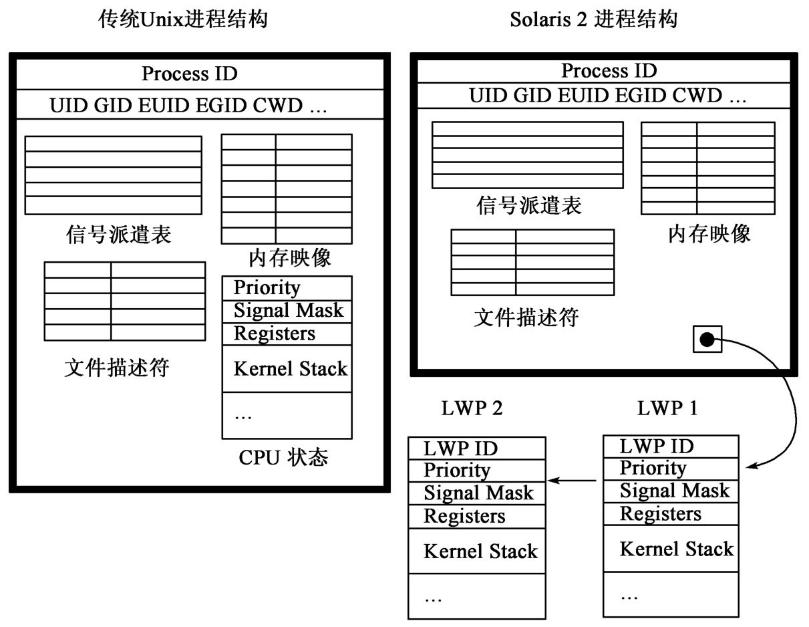

# 多线程编程

## 概念

### 线程

#### 线程的概念

`线程`的一个简单的定义是：在`进程`的内部执行的`指令序列`。

这个定义是非常简单了。但是`线程的内涵`将在后面的叙述中逐步体现出来。

要解释线程必需从进程说起。一个`进程`是一个`复合的实体`，可以分为`两个部分`--`线程的集合`和`资源集合`。`线程`是一个`动态的对象`，它表示`进程`中的一个`控制点`，并且执行一系列的指令。`资源`包括`地址空间`、`打开的文件`、`用户凭证和配额`等等。这些资源为进程中所有线程所共享，存放在进程的有关数据结构中。此外每一个线程有自己的私有对象，比如`程序计数器`、`堆栈`和`寄存器上下文`。`传统的Unix进程`有一个单独的`控制线程`。在`多线程系统`中对这个概念进行了扩展，允许在一个进程中有`多于一个`的`控制线程`。

线程是一个非常抽象的概念，涉及传统的程序执行过程中的所有其他概念。

线程的应用是很广泛的。例如，在浏览器上就常常用到线程，在用户浏览某个网页的同时，实现该网页上的动画、播放音乐等等；在操作系统中也常常用一个线程来进行I/O操作以不影响主进程的执行。

#### 并发和并行

也许很多读者都已经了解了`并行`的概念。如果用户有一台计算机，用户在从某个Internet站点上用Netscape下在图片的同时，另外开了一个窗口在挖地雷，那么就可以说这台计算机上存在着两个`并行的程序`或者说两个`并行的进程`。在一台计算机中，`系统`可以通过开`多个进程`来达到`并行的目的`；而即使在同一个进程内，也可以通过开多个线程来达到并行的目的。每个线程都是独立执行该进程代码的不同的控制流。

这里简单介绍一下两个概念：`并行`和`并发`。`并发`是指若干个任务在某个时间段中都得到了执行，但`具体到每个时间片`，系统中都`只有一个任务在执行`--CPU在轮流执行各个任务或者说各个任务在分享CPU的时间片--`从宏观上看`，它似乎达到了`并行`的目的。而前面叙述中的`并行`只是一个模糊的说法。精确地说，`并行`就是指系统中有`多个CPU`，各个任务在同时被执行，即使在各个时间片上也是这样。

#### 内核线程与用户层线程

目前，有`三种`不同的`线程标准`，它们之间因操作系统的不同而异，各自在`Unix/Linux`、`Windows`、`OS/2`下有自己的`线程库`，分别称为`POSIX线程`、`Win32线程`和`OS/2线程`。后两种线程都不是通用的，仅能分别用于`Windows NT`、`Windows 9X`系列操作系统和`OS/2`操作系统中，而`POSIX线程`则是一种通用的标准（`IEEE 1003.1c`，`aka Pthreads`）和`VMS`一起都称为几乎所有Unix/Linux都具备的计算平台。

而根据实现方式的不同，线程则可以分为`内核线程`和`用户层线程`。它们完全可能提供一模一样的编程接口，但是这些接口函数却分别在`内核空间`和`用户空间`下实现。`Win32线程`和`OS/2线程`都属于`内核线程`，而`POSIX线程`则属于`用户层线程`。下面分别对这两种线程做详细介绍。

#### 内核线程

`内核线程`是由`操作系统提供`的`内核调用`实现的，需要操作系统提供`内核级别的支持`。

一个`内核线程的创建和撤销`是由`内核的内部需求`决定的，用来负责`执行一个指定的函数`。它共享`内核正文字段`和`全局数据`，`具有它自己的内核堆栈`。它`能够被单独地调度`并能使用`标准的内核同步机制`，如`sleep()`和`wakeup()`等。

`内核线程`对于执行`异步I/O操作`非常有用。内核可以简单地创`建一个新的线程`来处理这种请求，`而不是`提供一种特殊的机制，这些请求`被这些线程同步处理`，而`对于内核的其他部分出现异步`。内核线程也用来处理中断。

相对于进程来说，内核线程的创建和使用开销并不是很大。它们使用的唯一资源就是`内核堆栈`和在它们`不运行时`用来`保存寄存器上下文`的`一块内存区域`（同时也需要一些数据结构来保存状态和同步的信息）。`内核线程间的上下文切换`是很快的，因为不需要再次执行`内存映射`。

`内核线程`并`不是`一个专属于线程的概念。在`传统的Unix内核`中，系统进程如`页面管理守护进程（pagedaemon）`在功能上等同于`内核线程`。守护进程如`nfds`（Network File System Daemon网络文件系统服务器进程）`在用户层启动`，但是一旦启动，就完全在内核中运行。当它们进入到`内核态`后，`用户态上下文`就不需要了。它们也等同于`内核线程`。因为在`传统的系统`中`缺少`一种`单独的抽象概念`来代表`内核线程`，`多线程内核`允许`这些守护进程`作为`内核线程`来简单实现。在下面的叙述中读者将会看到，`轻量级进程LWP`就是通过`内核线程`来实现的。

#### 用户层线程

`内核线程的实现`离不开操作系统提供的内核支持（如`线程创建`、`同步`等）。但是`用户层线程`则不同，它是由`用户层的编码实现`的`自我完备`的`线程库`，所有的代码、数据结构都在`用户空间`里，`无需内核知道它们的存在`。用像`Mach的C-threads`和`POSIX的Pthreads`等线程库程序包都可以成功地实现。这些库提供所有的`创建`、`同步`、`调度`和`管理线程`的`函数`，而`不用`内核的特殊帮助。线程间的交互不包含内核的参与，因此速度非常快。

`用户层线程`有几个明显的优点，它以一个非常自然的方式来对向`Windows`那样的应用进行编程，`用户层线程`也通过把`异步操作`的复杂性隐藏在线程库中来提供`同步编程规范`。这就足以说明`用户线程`是十分有用的，甚至在`那种缺少任何支持线程的内核`的系统中，一个系统可以提供几个线程库，每一个都适用一个不同类的应用。

`用户层线程`的`最大优点`就是性能，`用户层线程`是`轻量级的`，`只有`当它们附着在`轻量级线程`上时才消耗内核资源，它们这种性能的获得是由于`功能的实现`是在`用户层`上，而不是使用`系统调用`，这样就避免了陷入`处理`和`跨越保护边界`时`移动参数和数据的开销`。一个非常有用的概念是`关键线程大小`，它指的是一个线程用作一个单独实体时必需做的工作量，这个大小取决于创建和使用一个线程的开销。对于`用户层线程`，它的重要部分的大小一般在`几百条指令左右`，`通过编译器的辅助`可以减少到`少于100条`。用户层线程需要非常少的时间去`创建`，`撤销`和`同步`。

另一方面，`用户层线程`也存在一些`局限性`，这主要是由于`内核`和`线程库`之间`信息的完全分离`造成的。因为`内核`不知道`用户层线程`的情况，这样它就`不能`使用它的`保护机制`来保护`用户层线程`不被`其他的线程`破坏。每一个进程拥有自己的`地址空间`，`内核`保护它们防止`其他授权的进程`的访问。`用户层线程`就`不享受这种保护`，它们在`公共地址空间`中操作。从线`程互相操作的要求`出发，`线程库`必需提供`同步的方法`。

由于`没有`内核显式地支持，`用户层线程`可能改善其`并发性`，但是`不能`增加其`并行性`，甚至在一个`多处理器的系统`中，一个`轻量级进程`（通过`内核线程`实现的）也是`不能`被`并行`执行的。

最后，本书只介绍`POSIX线程`--如前所述，它是`轻量级线程`。

### 进程、LWP和线程

#### 进程

`线程`和`进程`这两个概念是紧密联系着的，它们之间也有很多相同之处（例如`多线程`可以`并行`，`多进程`也可以`并行`；`进程`执行代码段中的代码，`线程`也是一样）；但另一方面，`线程`和`进程`的区别非常大，二者绝对不能划等号。

对于`Unix进程`的概念，一个经常被引用的答案是`进程是程序运行的一个实例`，但这个定义显然流于表面。研究一下进程的各种特征可得出，`进程`是一个运行`程序`并为其提供`执行环境`的`实体`。它包括一个`地址空间`和一个`控制点`。`进程`是`基本调度实体``任何时刻``只有一个`进程`在CPU上运行`。同时，进程`竞争并占用`各种`系统资源`，如`设备`和`内存`。它还`向系统请求服务`，由`内核`来`为其完成`。

每个`进程`都有`一个严格定义的上下文`，包括描述这个进程的所有信息。`上下文`由以下几个部分组成。

（1）`用户地址空间`。用户地址空间一般划分为几个部分--`程序正文（可执行代码）`、`数据`、`用户堆栈`、`共享内存区`等。

（2）`控制信息`。内核使用`两个数据结构`维护进程的控制信息--`u区`和`proc结构`。每个进程也有它自己的`内核堆栈`和`地址转换表`。

（3）`凭证`。`进程的凭证`包括与其相关的`用户ID`和`组ID`。

（4）`环境变量`。一些形如`variable=value`的字符串组，是从其父进程继承过来的。大多数Unix将其存放在`用户栈的栈底`。标准输入输出库提供对这些变量的增加、删除、更改以及将从变量中取值的函数。当调用一个新程序时，调用者用`exec`取得原始环境或提供一组新的变量。

（5）`硬件上下文`。硬件上下文包括`通用寄存器中的值`以及`一组特殊的系统寄存器`。`系统寄存器`包括：
- `程序计数器（PC）`，记录`将要执行的下一指令地址`。
- `堆栈指针（SP）`，包括`栈顶元素的地址`。
- `处理器状态字（PSW）`，包括几个表明`系统状态信息`的状态位，如当前和以前的`执行模`，当前和以前的`中断优先级`，`溢出位`和`进位位`。
- `内存管理寄存器`，对应进程的地址转换表。
- `浮点单元（FPU）寄存器`。

`程序寄存器`包括`当前正在运行进程的硬件上下文`。当发生上下文切换时，`寄存器中的值`都保存到`当前进程u区（称为进程控制块，PCB）`的特定部分。`内核`选择一个新进程运行时，将从`PCB`中`装载硬件上下文`。

#### 用户空间和系统空间

由于在`80286以上的CPU`中都`在指令级加上了用户权限的字段`以适应`多进程、多用户操作系统`的需求，相应地操作系统也就将CPU的操作分为了两种状态：`用户态`和`核心态`。一般情况下，`应用程序`总是运行在`用户态`下，这时`应用程序`可以自由地访问本进程所占用地各处空间（如`数据段`、`CPU寄存器`），`执行逻辑`和`算术操作`等等；但是，如果`应用程序`想要访问这以外的数据，例如它要`与别的进程共享的共享内存区`、`硬盘`和`网络上的数据`，那么就必需申请权限，因为这样的操作是核心态的，用户态下`不能`执行。在申请成功之后，CPU的控制权将从`应用程序`转交给`操作系统`，CPU就将从`用户态`切换到`核心态`，执行指定的操作（如读取硬盘等等）。等到操作结束，操作系统再从核心态切换回用户态，将CPU控制权交还给应用程序。而这样的核心态操作是不能随意让应用程序执行的，因此操作系统一般都会提供若干有限的操作--如打开、读取和关闭文件或设备、申请和读写共享内存区等等，以系统调用的形式，通过若干固定的函数接口让应用程序调用。这样一来，应用程序就只能执行某几个特定的核心操作，从而保证了系统的安全性。例如，在Linux中，`open`、`shmget`、`setgpid`等都是系统调用。应用程序不能直接地执行读取硬盘扇区、向网卡缓冲区和别地进程的空间中读写数据等核心态操作（除非有`root`权限），而必需通过这样的系统调用来实现由若干核心态操作组成的特定几个功能。

`系统调用`相对来说开销很大的操作，因为每个系统调用都需要`在两个模式间切换`，一个是在调用执行时，从用户态到核心态（这就叫`核心陷入`），另一个是在调用完成时返回到用户态（不妨称这种操作为`核心陷出`）。而`执行跨越内存保护边界的操作`需要花费多个CPU周期，如果这种操作频繁出现，将严重影响系统性能，因此应尽量使应用程序多在用户态下运行，少进行`核心陷入`，这就要求尽量少执行系统调用。

最后顺便指出，不仅系统调用需要很大的开销，在`用户空间`和`系统空间`之间进行数据拷贝（比方说，在一个用户层的应用程序要从网卡上读取数据时，数据就必需首先从网卡上被读到系统空间，再从系统空间被拷贝到用户空间），由于跨越了用户空间和系统空间的边界，也是开销非常大的操作。

#### 进程与线程的区别

`进程与线程的区别`主要表现在`数据结构`（线程的数据结构要比进程简单很多），`创建和切换`（线程的创建和切换开销远比进程的小）、`用户空间共享`（多个进程之间的地址不能互相访问，而同一个进程的多个线程可以）等几个方面。

##### 数据结构

每个进程的控制信息都保存两个数据结构中--`u区（用户区）`和`proc结构（也称为进程结构）`，在许多实现中，内核中有一个固定大小的`proc结构数组`，称为`proc表`。这个数组的大小严格地限制了任一时刻最多地进程数。较新地版本如`SVR4`允许动态分配`proc结构`，但是有一个大小固定的指向它们的指针数组。由于`proc结构`在系统空间中，尽管有时进程不在运行，这些结构在内核中也都是可见的。但是如前所述，一个进程不能访问系统空间，因此哪怕它要访问自己的`proc结构`，也必须通过系统调用（如得到本进程的进程ID就必需执行`getpid`系统调用，因为进程ID是存放在`proc结构`而不是`u区`中），付出`核心陷入`的代价。

`u区`或称`用户区`，是进程地址空间的一部分。即仅在进程运行时它才被映射且可见，许多实现中，`u区`总是被映射到每个进程虚拟空间的相同固定位置，内核只需简单地通过`变量u`进行访问（这一点可以在Linux地核心源代码中得到验证）。`上下文切换`地一个任务就是要重新建立这个映射，使内核中对`u`地引用指向新的`u区`的物理位置。

偶尔内核也要访问其他进程的`u区`。这是可能的，但只能间接地使用一组操作系统提供的核心调用来完成。这些在访问语义上的不同决定了什么信息应该存放在`proc结构`中，什么应该存放在`u区`中。`u区`中只包括那些在进程运行时才需要的数据。而`proc结构`中的信息可能在进程不运行时也需要。

`u区`中的主要域包括：

（1）进程控制块--保存进程不运行时硬件上下文。

（2）指向这个进程`proc结构`的指针。

（3）真实和有效UID和GID。

（4）当前系统调用的参数，返回值或错误状态。

（5）信号处理程序及相关信息。

（6）由程序的可执行文件头中获得的信息，如正文、数据、堆栈大小和其他内存管理信息。

（7）打开文件描述符表。现在的Unix系统如`SVR4`，可以按需要动态地扩展这张表。

（8）指向`当前目录的v节点`和`控制终端的指针`。`v节点`代表文件系统对象。

（9）CPU使用统计，概况统计信息，磁盘限量和资源限制信息。

（10）许多实现中，每个`进程的内核堆栈`是`u区`的一部分。

`proc结构`中的主要域如下：

（1）标识：每个进程有一个唯一的进程ID（PID）并属于一个特定的进程组。

（2）当前进程中`u区`的内核地址映射表位置。

（3）当前进程状态。

（4）在调度队列、阻塞队列或睡眠队列中的向前指针和向后指针。

（5）阻塞进程的睡眠通道。

（6）调度优先级和相关信息。

（7）信号处理信息：各种信号，包括忽略信号、阻塞信号、以发送信号及已处理信号的掩码。

（8）内存管理信息。

（9）将这个结构链接到活动进程，空闲进程或僵尸进程队列的指针。

（10）各种标识。

（11）将结构链接到基于PID的哈希队列（hash queue）中的指针。

（12）层次信息，描述进程与其他进程间的关系。

`proc结构`是进程与线程众多不同之处一个非常重要的方面--如前所述，进程拥有`proc结构`，存放在系统空间中；而线程则没有相应的存放于系统空间中的线程相关的数据结构。

下图是Unix进程结构示意图。

与线程相比，进程是一个重负载、内核级的实体，而线程则是一个轻负载、用户层的实体。

如上所述，同一个进程的多个线程之间共享着进程的地址空间、文件描述符等数据结构，但各个线程也有自己私有的数据结构，这个数据结构在进程内部是唯一的而且仅仅在进程内部是可见的，包括：

- 线程号（Thread ID）。
- 寄存器状态（包括程序计数器和堆栈指针）。
- 堆栈。
- 信号屏蔽字（Signal mask）。
- 优先级（Priority）。
- 线程私有的存储段（Thread-private storage）。

线程的数据结构如下图所示。

可见，线程的`thread结构`中只有`CPU寄存器状态`、`堆栈`、`堆栈指针`和`程序计数器`（后二者其实也是CPU寄存器）、`线程ID`、`优先级`、`信号屏蔽字`等数据，而`进程结构`的其他部分（如`用户ID`、`当前工作目录`、`虚拟内存映射表`等等）则`为该进程的所有线程所共享`。但是读者可不能小看了这些区别，它决定了线程的数据结构将大部分被存放在`用户空间`！这样，同一进程的线程之间将`可以`互相访问对方的数据段，线程数据结构的获取也`不需要`通过`核心陷入`了。

##### 创建

`fork`系统调用创建的进程几乎就是`父进程的精确复制`。`唯一的不同`是用来区分二者的部分（例如，二者的`proc结构`显然是不同的）。从`fork`返回后，`父子进程`执行`同样的程序`，有`同样的数据和堆栈区`，并从紧跟`fork`后的指令继续执行。整个创建过程主要的工作就是给新进程分配`u区`和`proc结构`，并填写这些结构。

线程的创建也类似，分配数据结构并填写它；等到新线程在操作系统中`注册`，可以抢占CPU之后，整个创建工作结束。但由于线程的创建是在创建了进程之后，大部分数据结构已经存在；而且线程的数据结构相对来说要简单得多，因此有了进程之后，这个进程要创建新线程，操作就简单得多了。

##### 调度

`CPU`是一个由所有进程`共享的资源`。`内核`中`在进程间分配CPU时间`的那部分称为`调度器（scheduler）`。`传统Unix调度器`使用`抢占式轮转调度`。`相同优先级`的进程`以轮转方式调度`，每个进程运行一个`固定的时间片（通常是100毫秒）`。若有一个更高优先级的进程准备就绪，无论当前进程是否用完其时间片，它都会被那个高优先级进程抢占（`除非`当前进程正在`内核态`运行）。

`传统Unix系统`中，`进程优先级`是`由两个因素决定`--`nice值`，影响进程的优先级（`只有超级用户`可以增加其他进程的优先级）。`usage因子`是对进程近期使用CPU的度量。它允许内核动态地改变进程优先级。`当进程不在运行时，内核定期增加它的优先级。当进程正在占用CPU时间时，内核减少其优先级`。由于就绪进程的优先级最终会升级到足够高而被调度，这种策略会防止`饿死现象`（指某些进程由于优先级比较低，一直无法得到CPU时间片，总是处于等待状态，不能执行）。

在内核中运行的进程由于阻塞于资源或事件而放弃CPU。当它再次变为就绪后，它被赋予内核优先级。`内核优先级`高于任何`用户优先级`。`传统Unix内核`中，调度优先级的值范围是`0~127`的整数，`值越小，优先级越高`（由于Unix系统绝大部分用C语言写成，它遵循的`习惯是从0开始计数`）。例如，`4.3BSD中内核`优先级`0～49`，用户优先级`50~127`。用户优先级随CPU使用的不同而变化，而内核优先级是固定的。

如前所述，在一个典型的、传统的多任务操作系统中，一个进程包括数据、代码、CPU寄存器状态，以及一些系统状态（打开的文件、当前工作目录，等等，保存在`proc结构`中）。当进行进程切换的时候，操作系统内核将`保存``进程结构`中的`CPU寄存器状态`，改变某些`虚拟内存指针`，`装载``另一个进程结构`中的`CPU寄存器状态`，然后执行后一个进程的代码。

而在两个线程进行切换时，`CPU寄存器状态`同样会被保存下来；但是`内存映像`和`当前进程指针`不会重新装载。也就是说，`程序代码`是不变的，`地址空间`也不变，只不过有很多`虚拟的CPU`在`并发地执行`代码的不同部分。

##### 用户空间共享

`进程的用户空间`是`不共享`的。在创建新进程时，由于复制了父进程的`所有进程空间（包括数据段）`，所以父、子进程各`自都拥有`一个`数据段`。在父、子进程中，`相同的指针`将指向`不同的数据段`中`不同的物理地址`。`不同的进程之间要交换数据`，`必需`通过`IPC系统调用`。

而在`线程`中，由于`同一个进程的各个线程``共享数据段和地址空间`，所以`相同的指针`就可以`指向相同的物理地址`！那么，A线程对某个地址单元做了修改之后，B线程就可以读取新的值，而`无需`任何`IPC调用`。

不仅如此。一个进程中的`所有线程共享该进程的状态`。它们不仅驻留在`完全相同的内存空间`里，而且`调用相同的函数`，`拥有相同的数据`。当一个线程改变了进程的变量时，所有其他的线程下次调用的都是经过改变了的变量；如果一个线程打开一个文件来读取数据，所有其他的线程也都可以从该文件中读取数据；一个线程甚至有可能去修改另一个`线程的堆栈`！

`最后还要说明一下的是`，虽然线程之间的地址空间是共享的，但程序员最好不要肆意地利用这一点--例如去修改另一个`线程的堆栈`。这样有可能给应用程序的安全性带来很大的隐患。

#### 轻量级进程（LWP）与线程

##### 轻量级进程（LWP）的概念

一个`轻量级进程（LWP）`可以被认为是一个可用来执行代码的`虚拟CPU`。如果一台计算机拥有`多个CPU`而且操作系统支持的话，`一个进程的多个LWP`可以`并行`（而`不是并发`）地被执行。从这一点上说它与`线程`很像，但其实它们之间有很大差别。关于这一点将在稍后介绍。

在LWP概念中，`最需要注意的是：`内核进行调度的基本单位既不是`进程`，也不是`线程`，而是`LWP`。`每个LWP`收集`自己的`内核状态：`用户时间`、`系统时间`、`页失效`等；`LWP能够执行独立的系统调用，引发自己的页失效`。

`轻量级进程`被`独立调度`并且`共享地址空间和进程中的其他资源`。它们可以对I/O或其他资源进行系统调用，同时也能在I/O操作或资源访问的时候被阻塞。在一个`多处理器的系统中`，一个进程能真正享受`并行`所带来的好处，是因为每一个`轻量级进程`都能被分配到一个`不同的处理器`上运行。再者由于等待I/O操作完成或资源被阻塞的`只是`单个的`轻量级进程`而不是整个`进程`，在`单处理器环境`中其优势也很明显。

除了`内核堆栈`和`寄存器`，`轻量级进程`也需要维护一些`用户状态`。这主要包括`用户寄存器上下文`，当轻量级进程被抢占时这些内容必需被保存。尽管`每一个轻量级进程都和一个内核线程相联系`，但是一些`内核线程`是专门处理`系统任务`而不支持`轻量级进程`。

总之，尽管`内核`提供了创建`同步`和`管理`轻量级进程的机制，但是需要开发人员能够合理地使用这些机制。许多`应用程序`通过`用户层线程`的方法能很好地完成。

注意：`术语"轻量级进程"`是从`SVR4/MP`和`Solaris 2.X`的命名系统中借用的，有时它会引起混淆，因为`SunOS 4.X`中的`术语"轻量级进程"`是指`用户层的线程`。但是，在本章中，`"轻量级进程"`是指`内核支持的用户层线程`。在一些系统中还使用了`术语"虚拟处理机"`，它`本质上`是和`轻量级进程`相同的。

`LWP的某些属性`类似于`进程`，而`另外一些属性`类似于`线程`，因此可以把`LWP`理解成介于`进程`和`线程`之间的一种概念。`事实上`，它是`内核`用来`实现内核层的并发、并行`，`实现用户层线程接口`的手段，`用户层线程`就是通过`与LWP相关的系统调用`来实现的，`LWP`建立了`从用户层到内核层的桥梁`。下图体现了`进程`、`LWP`和`线程`之间的关系。

##### LWP与线程的不同之处

`LWP`和`线程`有许多相似之处（例如一个`进程`内可以派生多个`LWP`，也可以派生多个`线程`；它们都可以被认为是`虚拟的CPU`，都可以`互相共享地址空间`），它们之间存在着千丝万缕的联系。但是`线程`和`LWP`之间也是存在很大区别的，绝不能将二者等同起来。

内核可以`识别`、`调度`和`管理`轻量级进程。一个`用户层的线程库`被在`轻量级进程上的用户线程`所复用，并且提供`线程的调度`、`上下文切换`和`同步`等方法，而`不涉及内核`。实际上，`线程库`就充当它所控制的线程的`微内核`。

`LWP`本身就是进程`proc结构`的一部分，它的数据结构存放在`系统空间`中，而`线程的数据结构`存放在`用户空间`中。但由于它起到了联接`系统空间中的进程`和`用户空间中的线程`的作用，因此在下图中把它话到了系统空间与用户空间的边界上。

`内核`仍然负责`进程的切换`，因为`只有`内核具有`修改内存管理寄存器`的权力。`用户线程`不是真正的可以调度的实体，`内核没有保留它们的一点信息`，`内核`只是简单地调度它们底层下面的`进程`或`轻量级进程`。如果`进程`只有一个`轻量级进程`（或者如果`用户线程`是在一个`单线程的系统`中实现的），那么由该LWP创建的所有线程都要被阻塞。

`LWP`是一个在`内核线程`基础上的`高层抽象`，因此`内核在支持轻量级线程之前必需支持内核线程`。

`用户代码`是可以完全被抢占的，所有的`轻量级进程`在一个`进程`中共享一个`公共的地址空间`。如果任何数据可以被多个轻量级`并发地`访问，这种访问`必须`被同步以保证数据的一致性。因此内核需要提供一些方法来`锁定共享变量`，如果一个`轻量级进程`想`访问一个被锁住的数据时它将被阻塞`。这可以通过加锁的方法，如`互斥锁（mutex）`、`信号量`和`条件变量`来实现。

`线程的数据结构`全都存放在`用户空间`里，`访问时不需要执行系统调用`；这也是线程与LWP的区别之一。

在每一个模式切换时，轻量级进程都要跨越一个`保护边界`。内核必须把`系统调用的参数`从`用户空间``拷贝`到`内核空间`，并且`校验它们`来防止`恶意进程`的破坏。同样地，在从系统调用返回到`用户态`时，内核一定要把数据`拷贝`回到`用户空间`。因此，`LWP`的`调度需要的系统开销与进程类似`，比`调度线程的开销`就大多了。

每个`进程`可能有`一个或多个`轻量级进程，每一个轻量级进程都由一个`单独的内核线程`来支持。

`每一个轻量级进程都要花费相当多的内核资源`，包括`内核堆栈的物理内存`。因此一个系统`不能`支持`大量的`轻量级进程。进一步地讲，因为系统有一个单独的轻量级进程的实现，它必需要通用，能支持大多数合理的应用。它因此也必须承受太多的负担--其中有的对许多应用来说是不适合的。最后`轻量级进程必须由内核来调度`。对于那些必须经常把控制从一个线程转移到另一个线程的应用，如果它们使用轻量级进程，那么就不是很容易实现。轻量级进程也带来一些`公平问题`--一个用户能够通过创建大量的轻量级进程而垄断处理器的使用。

最后必需提醒读者的是，虽然`LWP`和`线程`有类似之处，都可以共享地址空间，但是在编写应用程序的时候，程序员`应该尽量避免直接使用`LWP：一来如果程序编写错误就容易引起致命的系统错误，二来会严重影响应用程序的可移植性--因为虽然线程库有一个POSIX标准可以遵循，LWP却没有，不同系统上LWP的实现是不同的。

### 线程的优势

相对于进程，线程具有以下几方面优势：性能和通信。

性能是线程最大的优势。

现在来打个比方：比如说一个银行（相当于传`统进程`）。这个银行有一个职员（相当于`线程`），由许多"办公用品"，如桌子和椅子，吊顶和出纳台（相当于`进程表和变量`）。银行提供许多服务，如查帐、贷款、存款等（相当于`函数`）。如果只有一个职员从事所有的工作，那么这个职员必需熟悉所有的业务并且能够胜任，但是也许在不同的任务之间转换需要一些时间。如果有两个或者两个以上的职员，他们将共享相同的"办公用品"，但是他们可以专门从事不同的工作。如果他们同时工作而且效率不太差的话，许多顾客将能得到快速的服务。

要增加一个城市的银行数目比较麻烦（相当于`创建新进程`），但是雇佣一个新职员（相当于`创建新线程`）则非常简单。银行中发生的所有事情，包括职员之间的相互关系，都将非常简单（在`线程之间使用用户空间控制`），然而对其他银行事务的考虑将会增加（`进程间的核心空间控制`）。

数据是最能说明问题的。下表中的性能数据是从`SPARC station2(Sun 4/75)`上采集的。`测量精度为微妙`。它显示了使用`线程包`做`缓存`的`缺省堆栈`来创建线程的时间。时间的测量仅仅包括实际的生成时间。不包括切换到线程的时间。

数据表明，线程是更加经济的。创建一个新进程大概是创建一个线程的30倍，同步开销是3倍。

另外，由于线程之间可以共享数据段，因此它们之间完全可以通过指针或者全局变量来通信，而不必通过`IPC系统调用`。不过读者必需明确一点，所有线程能做的，`IPC系统调用`都能做。只不过`IPC系统调用`的开销是很大的，而且编程比较麻烦；而线程编程就可以降低开销、减少编程量。因此，线程在通信上的优势其实也应该归功于性能。

最后，即使对一个从来没有接触过线程的程序员来说，线程编程也并不可怕。当程序员编写一个多线程程序的时候，编程的99%与以前是完全一样的--程序员可以把精力花费在让程序做实质的工作上，其他的1%花费在创建线程，协调不同的线程的工作，处理线程专门的数据和信息屏蔽上。也许代码中只有0.1%是线程函数的调用。

当每一个线程是相当独立的，并且不经常与其他线程交互时，多线程的程序是十分有利的。即使线程之间需要经常交互，它的性能也比多进程的程序更加优越。

对比地，`Go语言`也提供了用户级的调度单元--`goroutine`（有栈协程）。参考资料：

- [论坛资源1](https://www.zhihu.com/question/20862617)
- [博文资源1](https://morsmachine.dk/go-scheduler)

其他可阅读源码文档。
